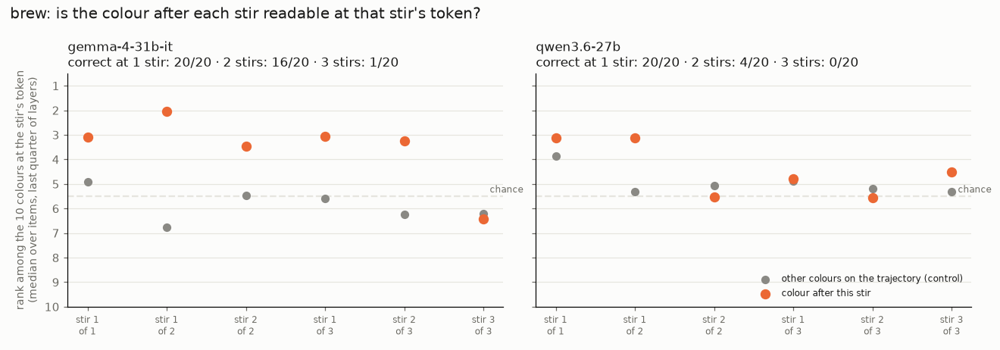

# jlens-visualizer

Per-layer J-lens (Jacobian lens) readouts of hidden reasoning steps: multi-hop facts ("the number of
legs on the animal that spins webs is" → hidden `spider` → `8`) and serial tasks from Neel Nanda's
[nocot-bench](https://github.com/neelnanda-io/nocot-bench) (NCRI).

## Headline: brew states live at the stir tokens

In brew (a colour lookup table applied once per stirred ingredient), the colour the potion has after
stir k is readable at stir k's ingredient token, where no colour word is written. The number of
states readable there matches how many stirs each model can do without chain of thought:
Gemma-4-31B-it carries states 1 and 2 but not 3 (it solves 16/20 two-stir items, 1/20 three-stir);
Qwen3.6-27B carries state 1 only (4/20 two-stir). At the final token the answer is then read off,
which is why it reaches rank 1 at the same layer (~41 of 60 in Gemma) for one-stir and two-stir
items. Medians over 20 items per depth, all items regardless of correctness;
`scripts/plot_stir_states.py`.

## Reports

Layer x token heatmaps (rank of each hidden step and the answer at every layer and prompt token).
brew and chain-9 rank among the possible answers (10 colours, 9 digits); multi-hop ranks in the
whole vocabulary.

| task                                | Gemma-4-31B-it (solarkyle lens)                          | Qwen3.6-27B (Neuronpedia lens)                        |
| ----------------------------------- | -------------------------------------------------------- | ----------------------------------------------------- |
| brew, correct at 1 / 2 / 3 stirs    | [20 / 16 / 1](graphs/gemma-4-31b-it/brew/README.md)      | [20 / 4 / 0](graphs/qwen3.6-27b/brew/README.md)       |
| chain-9, correct at 1 / 2 / 3 steps | [19 / 7 / 2](graphs/gemma-4-31b-it/chain9/README.md)     | [15 / 6 / 1](graphs/qwen3.6-27b/chain9/README.md)     |
| multi-hop facts, correct of 93      | [45](graphs/gemma-4-31b-it/lens-eval-multihop/README.md) | [60](graphs/qwen3.6-27b/lens-eval-multihop/README.md) |

Final-token-only line graphs (older): [Qwen3.6-27B](graphs/qwen3.6-27b/README.md),
[Qwen2.5-7B-Instruct](graphs/qwen2.5-7b-instruct/README.md).

## Other findings

- **Gemma-4-31B-it is the smallest open model that does two-stir brew.** Same 60 items via
  OpenRouter, no CoT, correct at 2 stirs: Gemma-4-31B-it 15/20, Qwen3.8-27B 7, Qwen3.6-27B 5,
  Qwen3.5-122B 4, DeepSeek-V4-Pro 4, Gemma-4-26B-A4B 3, Hermes-3-405B 3, DeepSeek-V4-Flash 2
  (`data/no_cot_brew.json`). Closed frontier models are far ahead on NCRI's brew bank (Astra 1.00,
  Fable 5.1 0.83 vs Gemma 0.38).
- **When Qwen3.6-27B fails brew it does one lookup.** On 2-stir items, 10 of 16 wrong answers are
  the last stir applied to the start colour (chance ~2/16).
- **The bridge entity shows up early at the tokens that define it.** On `spider-legs` (Qwen3.6-27B),
  "spider" is rank ~1-10 at `spins` / `webs` from about layer 5 to 25, but at the final token only
  from about layer 38. Caveat: `webs` is lexically tied to "spider", so this may be association.
- **Full-vocab rank cannot tell digits apart**: wherever a number is due every digit ranks high.
  Hence rank among the 9 digits for chain-9.
