# chain9: J-lens by layer and token, gemma-4-31B-it

Lens: `solarkyle/jspace-lenses/gemma-4-31b-it/lens.pt`. Rank here is rank among the 9 possible answers (1, 2, 3, 4, 5, 6, 7, 8, 9), 1 = the lens prefers it to all the others. Each item's graph shows, on top, the rank
of every tracked word at the token before the answer by layer (thin = raw, thick = EWMA with a
2-layer halflife). Below it, one heatmap per word: rank at every layer (y) and prompt token
(x), darker = higher rank. Dashed boxes outline the prompt line each step reads, in the colour of the
step it produces. A word lighting up on its own token in early layers is the token echoing itself, not
computation. Correct items first.

| depth | correct |
| --- | --- |
| 1 | 19/20 |
| 2 | 7/20 |
| 3 | 2/20 |

## Summary: median rank over correct items

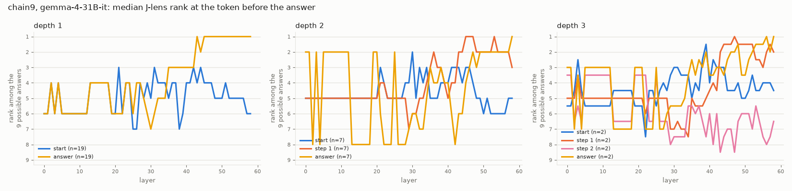

## Answered correctly (28)

---

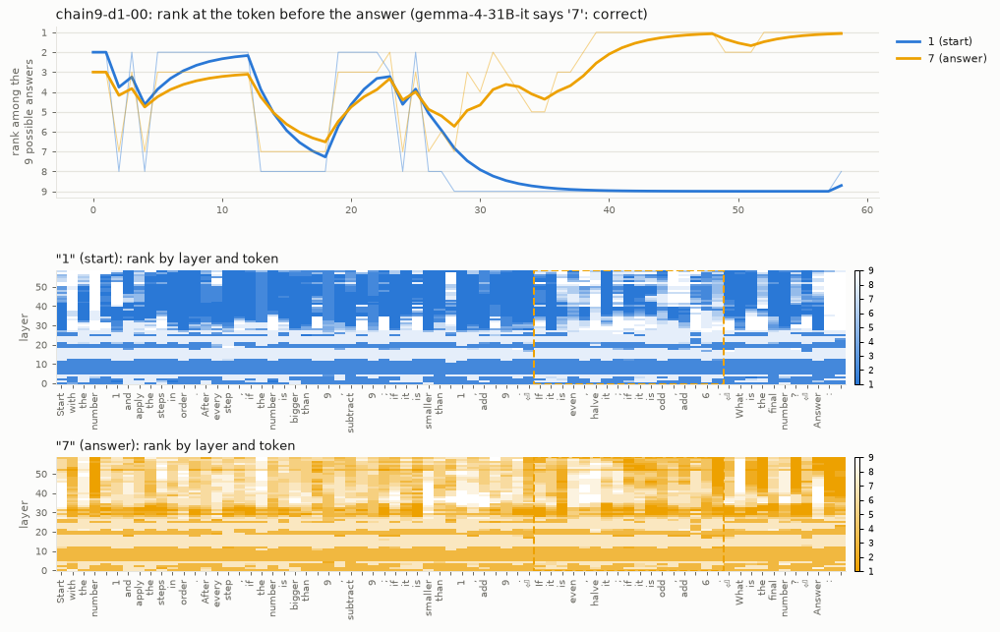

Start with the number 1 and apply the steps in order. After every step, if the number is bigger than 9, subtract 9; if it is smaller than 1, add 9.  
If it is even, halve it; if it is odd, add 6.  
What is the final number?

**Answer:** **7** · **Hidden trajectory:** 1 → 7

**gemma-4-31B-it:** ✅ top 5: `7`, `1`, `3`, `2`, `4`
---

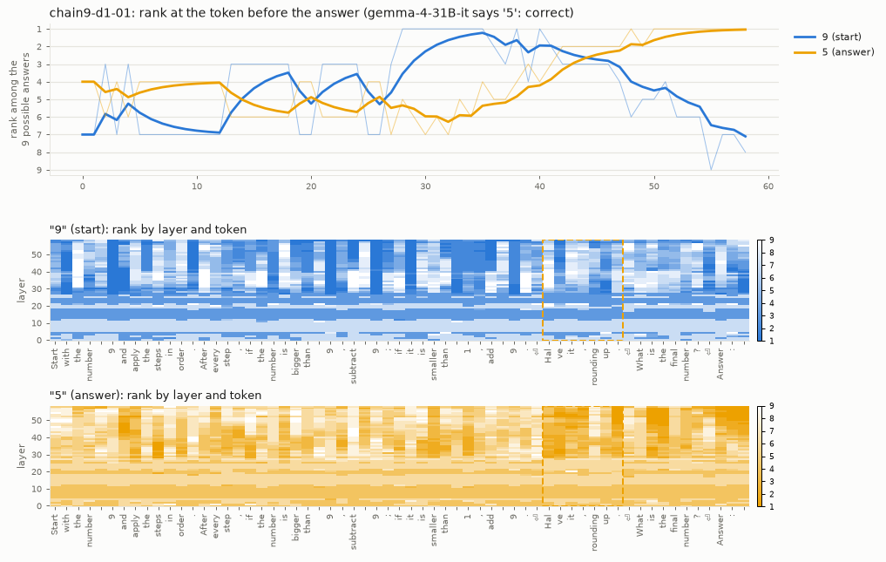

Start with the number 9 and apply the steps in order. After every step, if the number is bigger than 9, subtract 9; if it is smaller than 1, add 9.  
Halve it, rounding up.  
What is the final number?

**Answer:** **5** · **Hidden trajectory:** 9 → 5

**gemma-4-31B-it:** ✅ top 5: `5`, `1`, `4`, `2`, `3`
---

Start with the number 7 and apply the steps in order. After every step, if the number is bigger than 9, subtract 9; if it is smaller than 1, add 9.  
If it is bigger than 5, subtract 3; otherwise double it.  
What is the final number?

**Answer:** **4** · **Hidden trajectory:** 7 → 4

**gemma-4-31B-it:** ✅ top 5: `4`, `1`, `8`, `5`, `6`
---

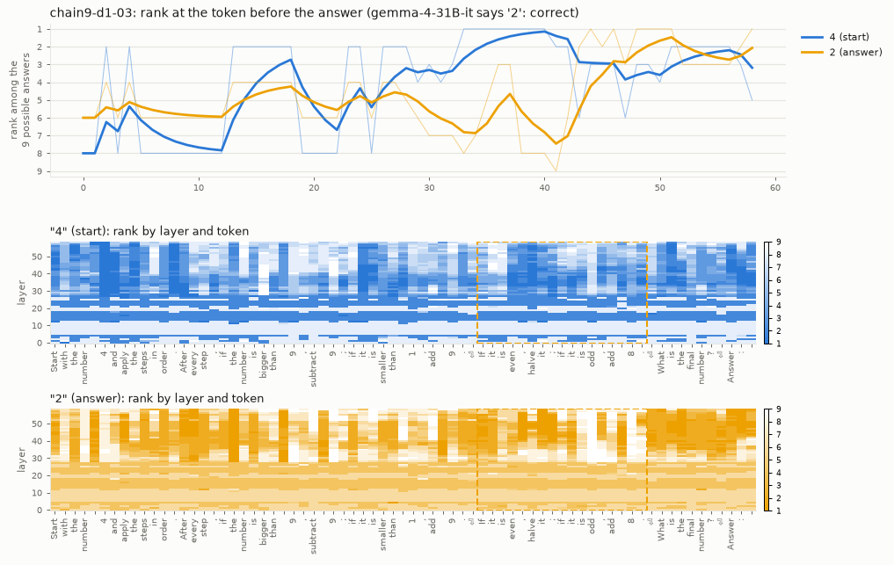

Start with the number 4 and apply the steps in order. After every step, if the number is bigger than 9, subtract 9; if it is smaller than 1, add 9.  
If it is even, halve it; if it is odd, add 8.  
What is the final number?

**Answer:** **2** · **Hidden trajectory:** 4 → 2

**gemma-4-31B-it:** ✅ top 5: `2`, `1`, `3`, `6`, `7`
---

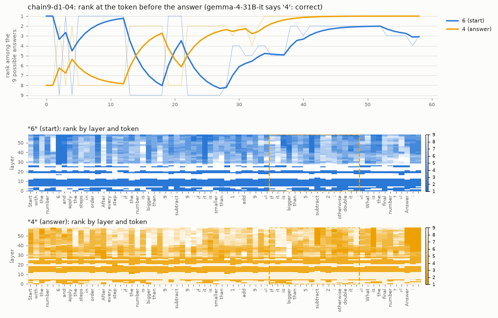

Start with the number 6 and apply the steps in order. After every step, if the number is bigger than 9, subtract 9; if it is smaller than 1, add 9.  
If it is bigger than 5, subtract 2; otherwise double it.  
What is the final number?

**Answer:** **4** · **Hidden trajectory:** 6 → 4

**gemma-4-31B-it:** ✅ top 5: `4`, `1`, `8`, `6`, `5`
---

Start with the number 7 and apply the steps in order. After every step, if the number is bigger than 9, subtract 9; if it is smaller than 1, add 9.  
If it is bigger than 5, subtract 2; otherwise double it.  
What is the final number?

**Answer:** **5** · **Hidden trajectory:** 7 → 5

**gemma-4-31B-it:** ✅ top 5: `5`, `4`, `1`, `8`, `2`
---

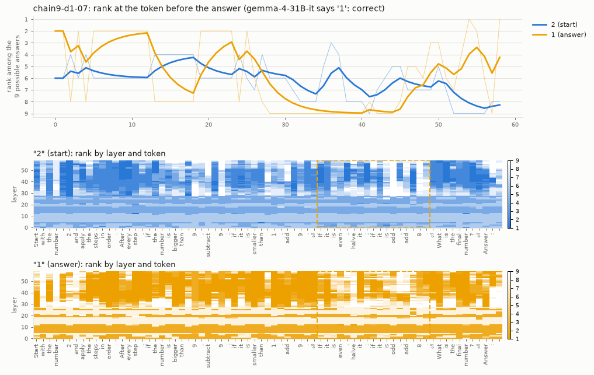

Start with the number 2 and apply the steps in order. After every step, if the number is bigger than 9, subtract 9; if it is smaller than 1, add 9.  
If it is even, halve it; if it is odd, add 8.  
What is the final number?

**Answer:** **1** · **Hidden trajectory:** 2 → 1

**gemma-4-31B-it:** ✅ top 5: `1`, `2`, `4`, `8`, `6`
---

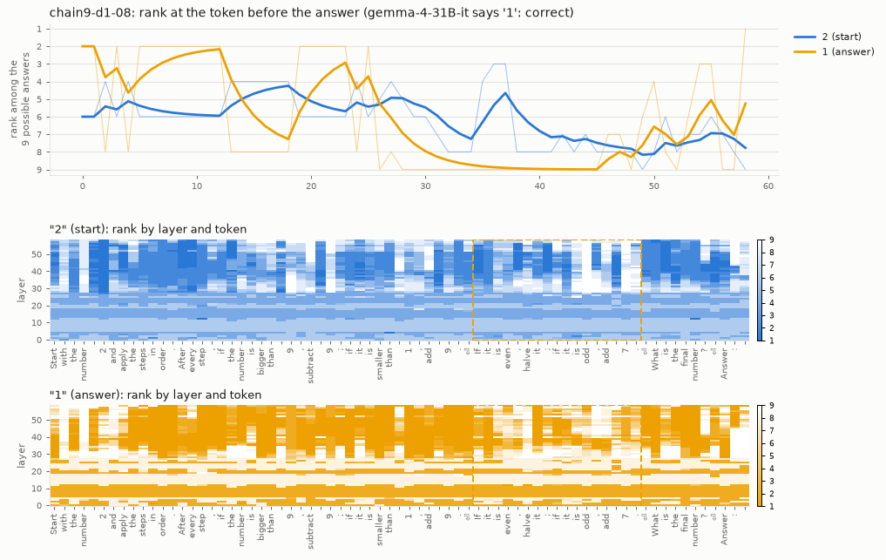

Start with the number 2 and apply the steps in order. After every step, if the number is bigger than 9, subtract 9; if it is smaller than 1, add 9.  
If it is even, halve it; if it is odd, add 7.  
What is the final number?

**Answer:** **1** · **Hidden trajectory:** 2 → 1

**gemma-4-31B-it:** ✅ top 5: `1`, `8`, `4`, `7`, `2`
---

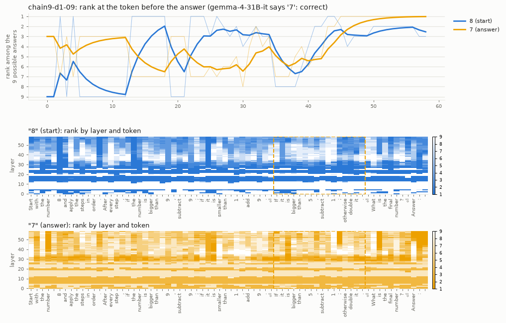

Start with the number 8 and apply the steps in order. After every step, if the number is bigger than 9, subtract 9; if it is smaller than 1, add 9.  
If it is bigger than 5, subtract 1; otherwise double it.  
What is the final number?

**Answer:** **7** · **Hidden trajectory:** 8 → 7

**gemma-4-31B-it:** ✅ top 5: `7`, `1`, `4`, `2`, `6`
---

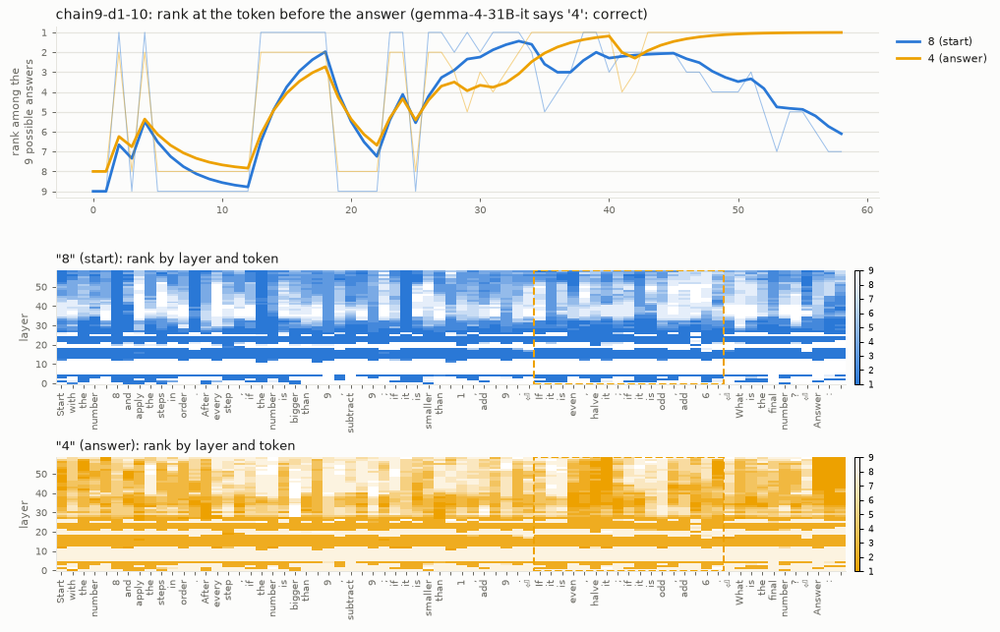

Start with the number 8 and apply the steps in order. After every step, if the number is bigger than 9, subtract 9; if it is smaller than 1, add 9.  
If it is even, halve it; if it is odd, add 6.  
What is the final number?

**Answer:** **4** · **Hidden trajectory:** 8 → 4

**gemma-4-31B-it:** ✅ top 5: `4`, `1`, `2`, `5`, `7`
---

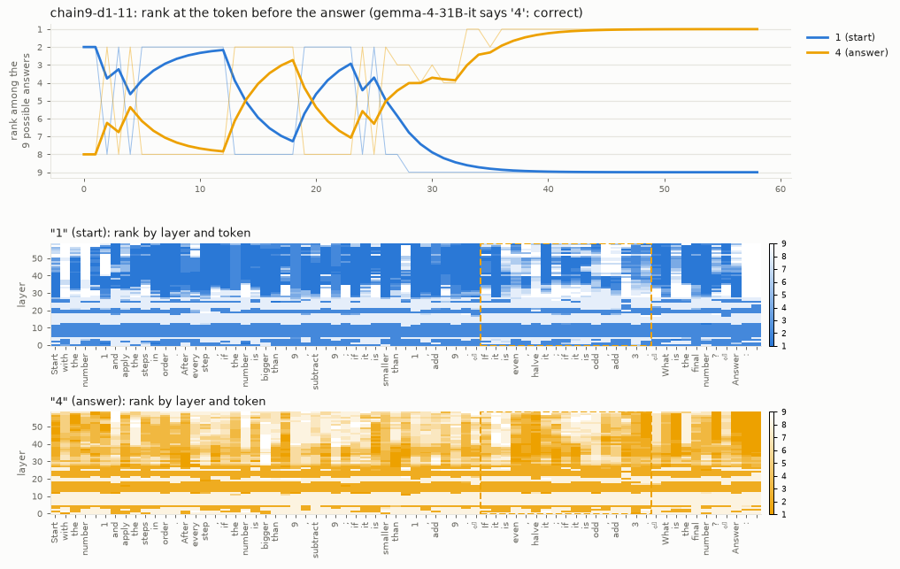

Start with the number 1 and apply the steps in order. After every step, if the number is bigger than 9, subtract 9; if it is smaller than 1, add 9.  
If it is even, halve it; if it is odd, add 3.  
What is the final number?

**Answer:** **4** · **Hidden trajectory:** 1 → 4

**gemma-4-31B-it:** ✅ top 5: `4`, `2`, `1`, `3`, `0`
---

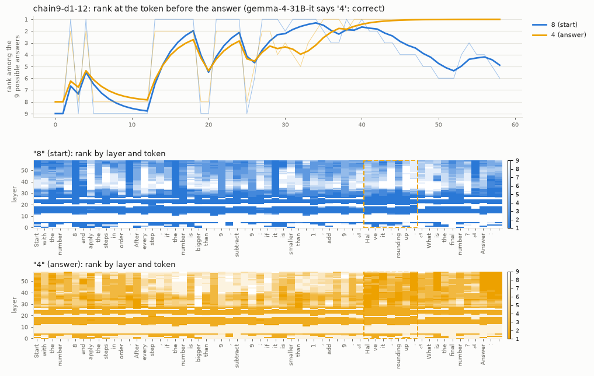

Start with the number 8 and apply the steps in order. After every step, if the number is bigger than 9, subtract 9; if it is smaller than 1, add 9.  
Halve it, rounding up.  
What is the final number?

**Answer:** **4** · **Hidden trajectory:** 8 → 4

**gemma-4-31B-it:** ✅ top 5: `4`, `5`, `3`, `2`, `1`
---

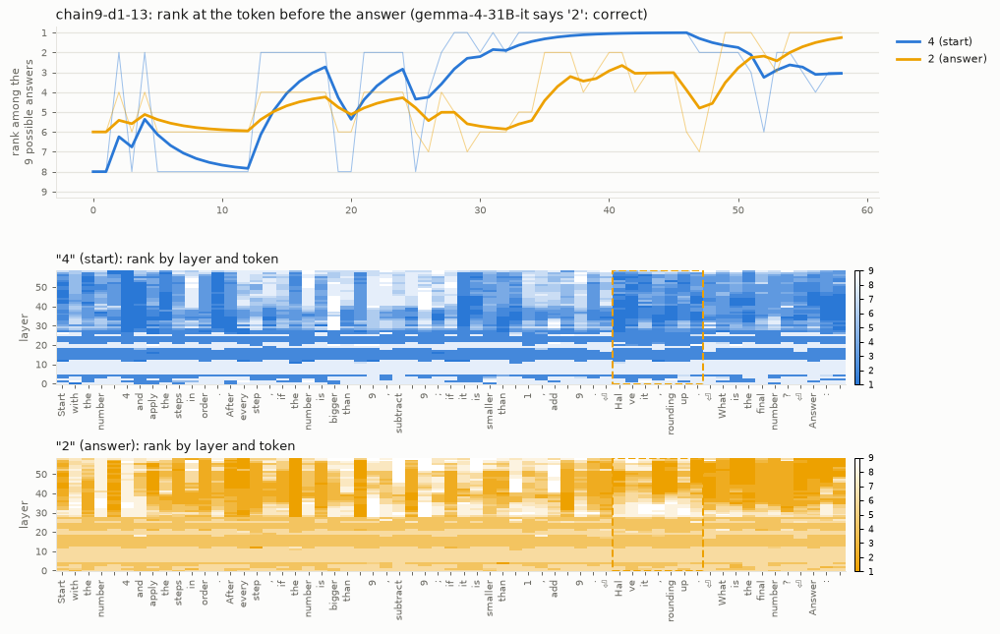

Start with the number 4 and apply the steps in order. After every step, if the number is bigger than 9, subtract 9; if it is smaller than 1, add 9.  
Halve it, rounding up.  
What is the final number?

**Answer:** **2** · **Hidden trajectory:** 4 → 2

**gemma-4-31B-it:** ✅ top 5: `2`, `3`, `4`, ``, `1`
---

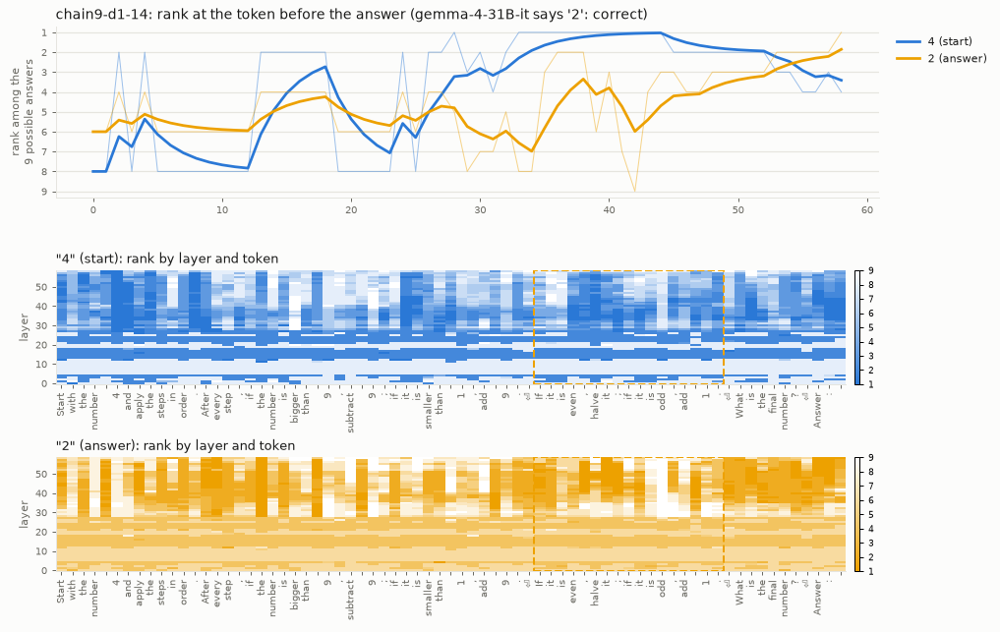

Start with the number 4 and apply the steps in order. After every step, if the number is bigger than 9, subtract 9; if it is smaller than 1, add 9.  
If it is even, halve it; if it is odd, add 1.  
What is the final number?

**Answer:** **2** · **Hidden trajectory:** 4 → 2

**gemma-4-31B-it:** ✅ top 5: `2`, `3`, `5`, `1`, `4`
---

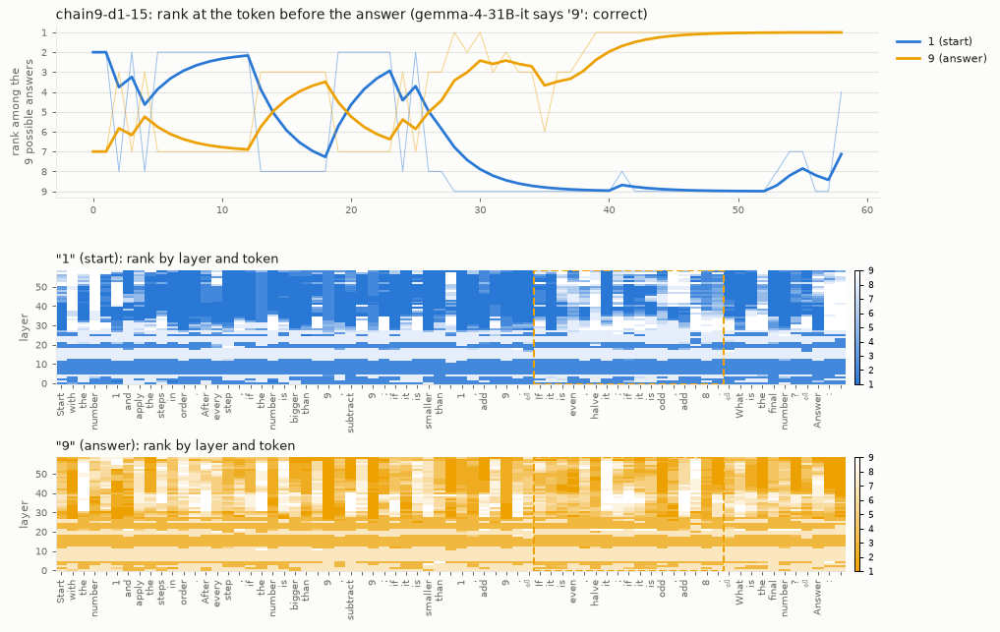

Start with the number 1 and apply the steps in order. After every step, if the number is bigger than 9, subtract 9; if it is smaller than 1, add 9.  
If it is even, halve it; if it is odd, add 8.  
What is the final number?

**Answer:** **9** · **Hidden trajectory:** 1 → 9

**gemma-4-31B-it:** ✅ top 5: `9`, `1`, `0`, `4`, `2`
---

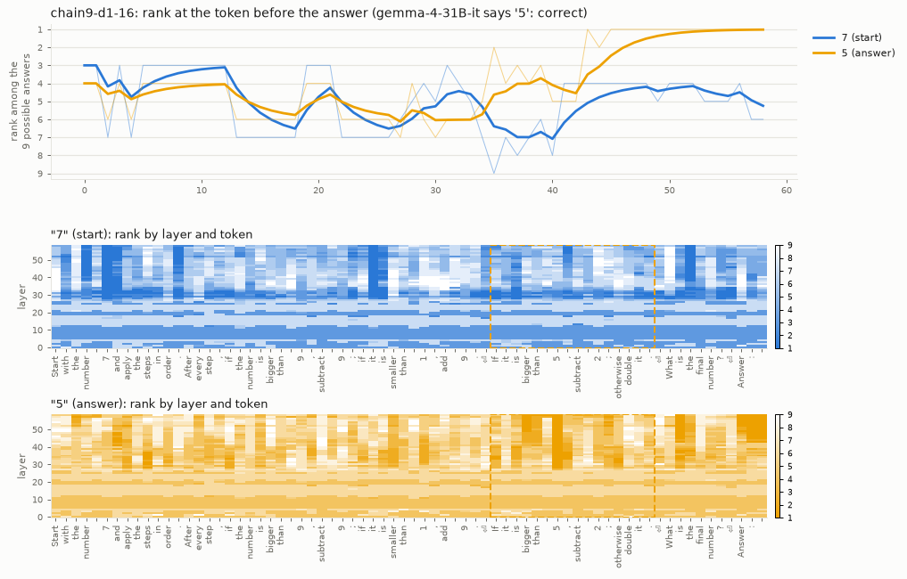

Start with the number 7 and apply the steps in order. After every step, if the number is bigger than 9, subtract 9; if it is smaller than 1, add 9.  
If it is bigger than 5, subtract 2; otherwise double it.  
What is the final number?

**Answer:** **5** · **Hidden trajectory:** 7 → 5

**gemma-4-31B-it:** ✅ top 5: `5`, `4`, `1`, `8`, `2`
---

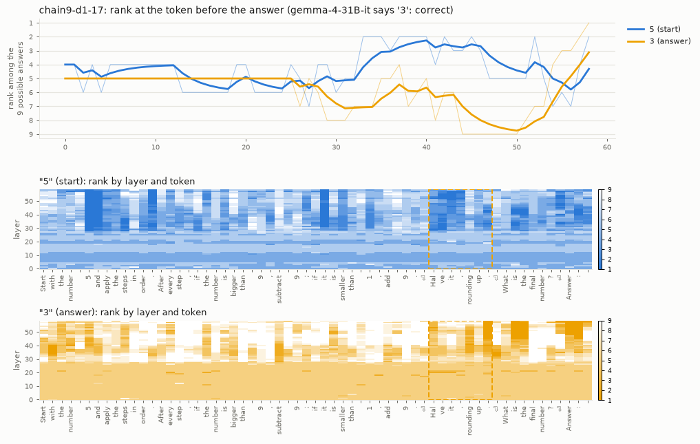

Start with the number 5 and apply the steps in order. After every step, if the number is bigger than 9, subtract 9; if it is smaller than 1, add 9.  
Halve it, rounding up.  
What is the final number?

**Answer:** **3** · **Hidden trajectory:** 5 → 3

**gemma-4-31B-it:** ✅ top 5: `3`, `2`, `4`, `1`, `0`
---

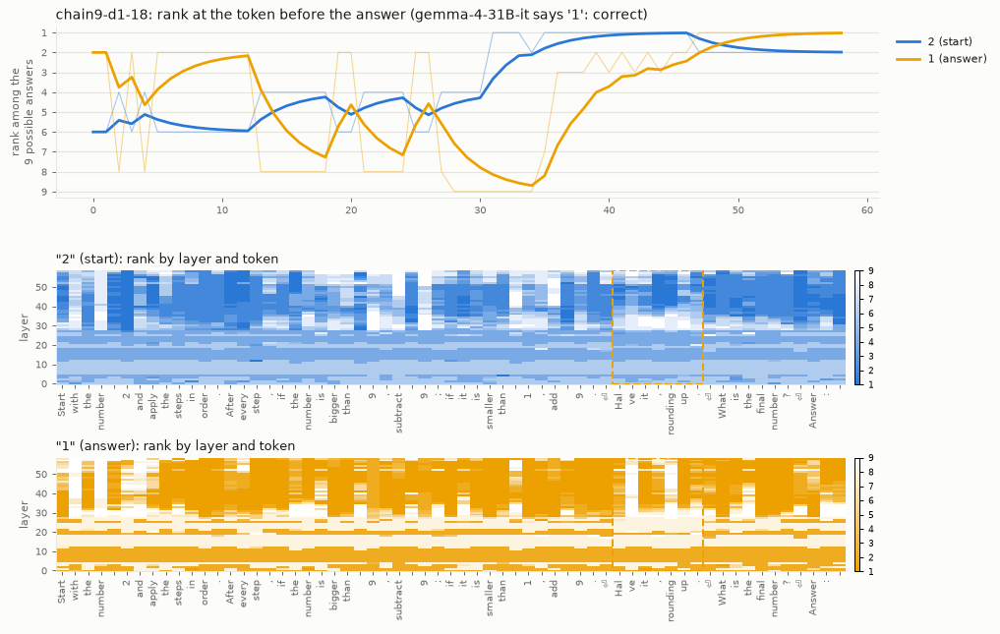

Start with the number 2 and apply the steps in order. After every step, if the number is bigger than 9, subtract 9; if it is smaller than 1, add 9.  
Halve it, rounding up.  
What is the final number?

**Answer:** **1** · **Hidden trajectory:** 2 → 1

**gemma-4-31B-it:** ✅ top 5: `1`, `2`, `4`, `3`, `8`
---

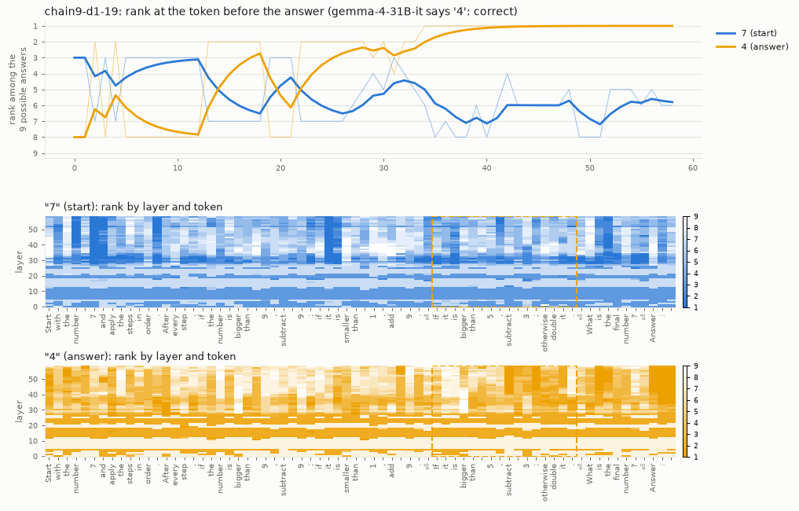

Start with the number 7 and apply the steps in order. After every step, if the number is bigger than 9, subtract 9; if it is smaller than 1, add 9.  
If it is bigger than 5, subtract 3; otherwise double it.  
What is the final number?

**Answer:** **4** · **Hidden trajectory:** 7 → 4

**gemma-4-31B-it:** ✅ top 5: `4`, `1`, `8`, `5`, `6`
---

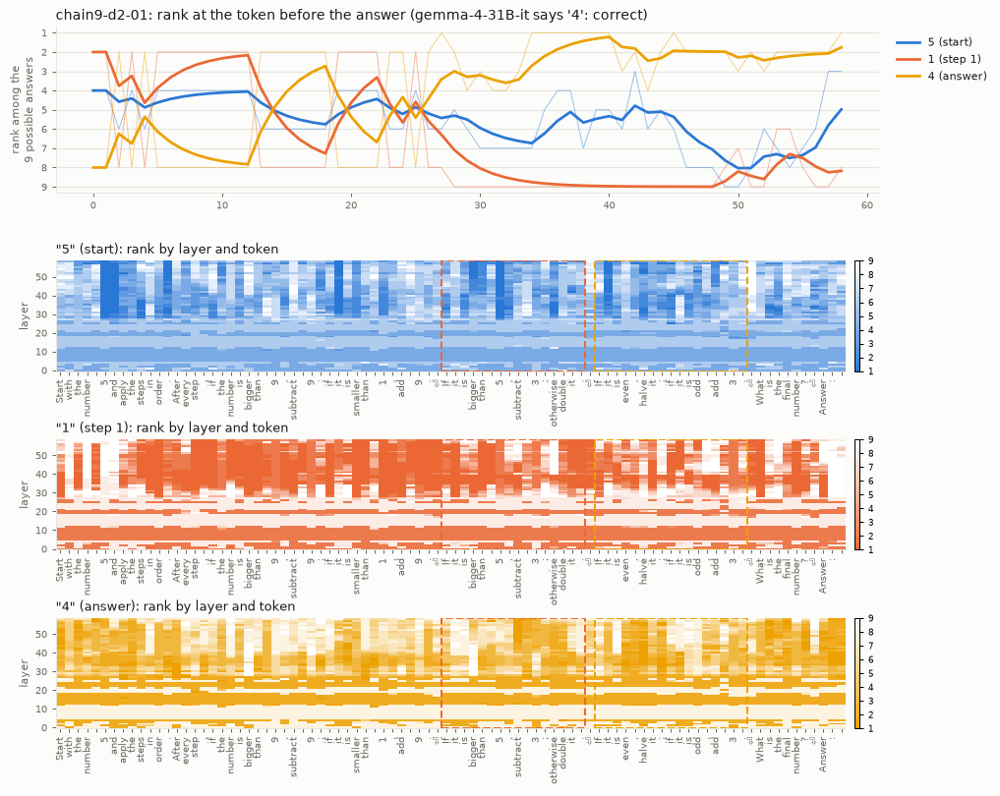

Start with the number 5 and apply the steps in order. After every step, if the number is bigger than 9, subtract 9; if it is smaller than 1, add 9.  
If it is bigger than 5, subtract 3; otherwise double it.  
If it is even, halve it; if it is odd, add 3.  
What is the final number?

**Answer:** **4** · **Hidden trajectory:** 5 → 1 → 4

**gemma-4-31B-it:** ✅ top 5: `4`, `8`, `1`, `2`, `5`
---

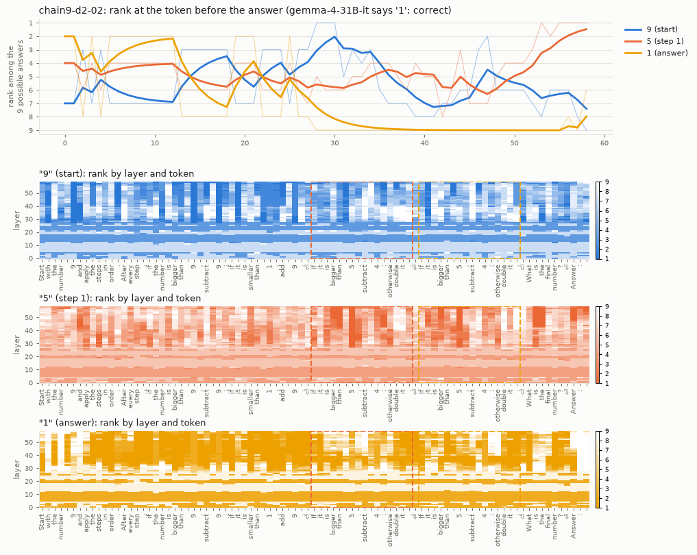

Start with the number 9 and apply the steps in order. After every step, if the number is bigger than 9, subtract 9; if it is smaller than 1, add 9.  
If it is bigger than 5, subtract 4; otherwise double it.  
If it is bigger than 5, subtract 4; otherwise double it.  
What is the final number?

**Answer:** **1** · **Hidden trajectory:** 9 → 5 → 1

**gemma-4-31B-it:** ✅ top 5: `1`, `5`, `4`, `2`, `8`
---

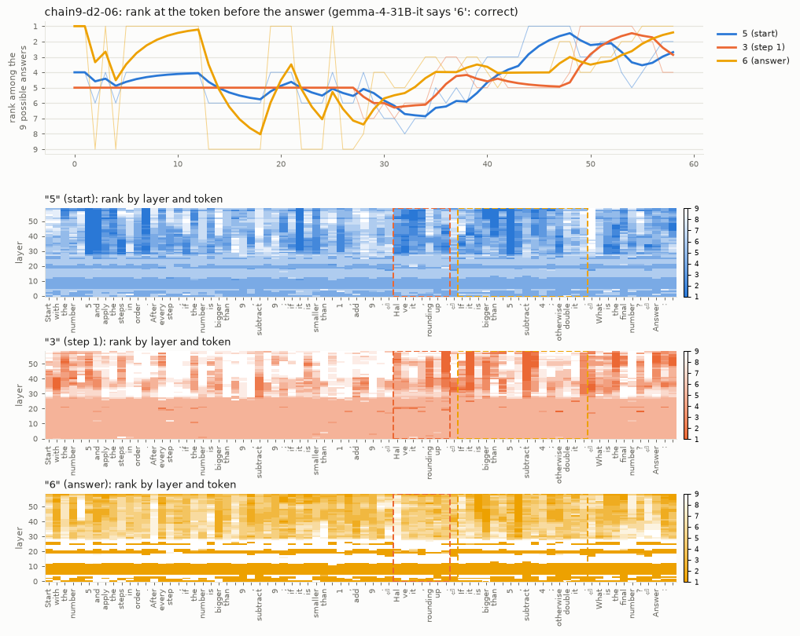

Start with the number 5 and apply the steps in order. After every step, if the number is bigger than 9, subtract 9; if it is smaller than 1, add 9.  
Halve it, rounding up.  
If it is bigger than 5, subtract 4; otherwise double it.  
What is the final number?

**Answer:** **6** · **Hidden trajectory:** 5 → 3 → 6

**gemma-4-31B-it:** ✅ top 5: `6`, `4`, `5`, `3`, `1`
---

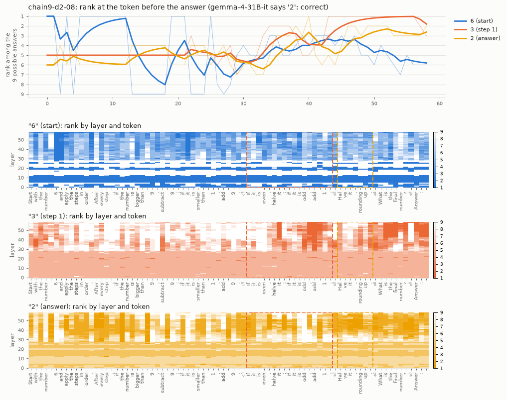

Start with the number 6 and apply the steps in order. After every step, if the number is bigger than 9, subtract 9; if it is smaller than 1, add 9.  
If it is even, halve it; if it is odd, add 1.  
Halve it, rounding up.  
What is the final number?

**Answer:** **2** · **Hidden trajectory:** 6 → 3 → 2

**gemma-4-31B-it:** ✅ top 5: `2`, `4`, `3`, `1`, `5`
---

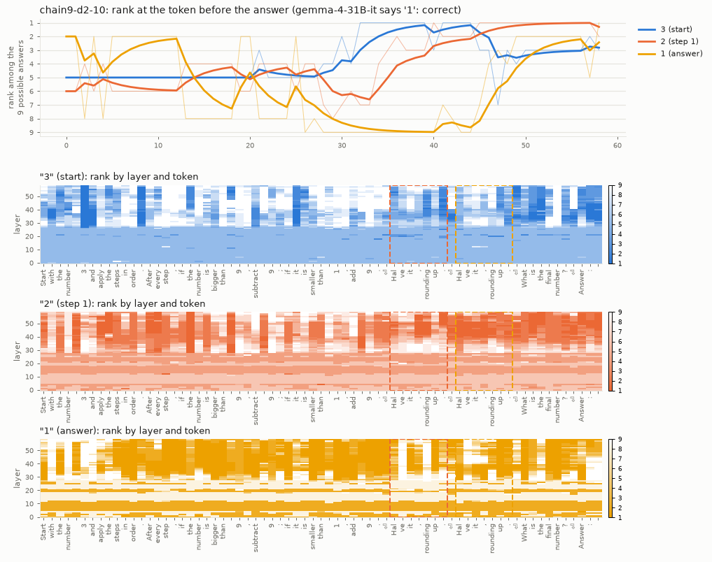

Start with the number 3 and apply the steps in order. After every step, if the number is bigger than 9, subtract 9; if it is smaller than 1, add 9.  
Halve it, rounding up.  
Halve it, rounding up.  
What is the final number?

**Answer:** **1** · **Hidden trajectory:** 3 → 2 → 1

**gemma-4-31B-it:** ✅ top 5: `1`, `2`, `3`, `4`, `5`
---

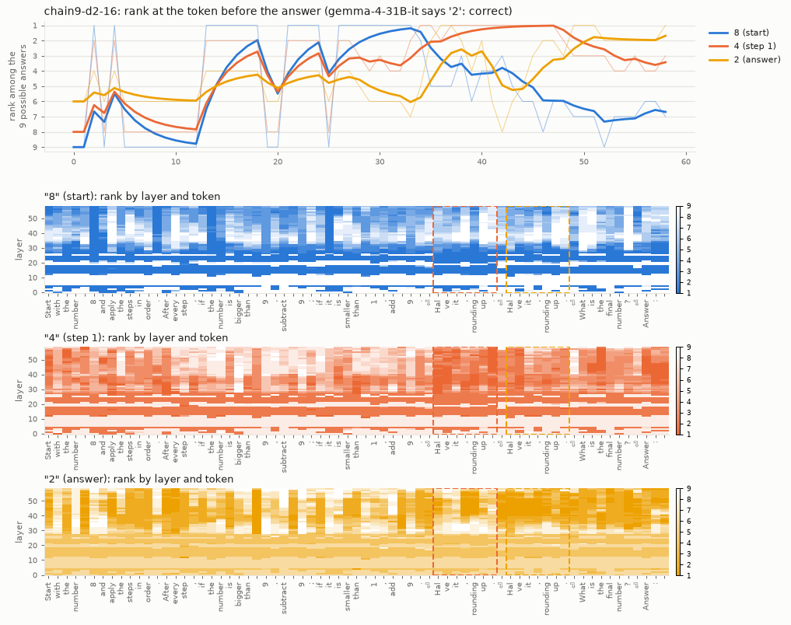

Start with the number 8 and apply the steps in order. After every step, if the number is bigger than 9, subtract 9; if it is smaller than 1, add 9.  
Halve it, rounding up.  
Halve it, rounding up.  
What is the final number?

**Answer:** **2** · **Hidden trajectory:** 8 → 4 → 2

**gemma-4-31B-it:** ✅ top 5: `2`, `3`, `1`, `4`, `5`
---

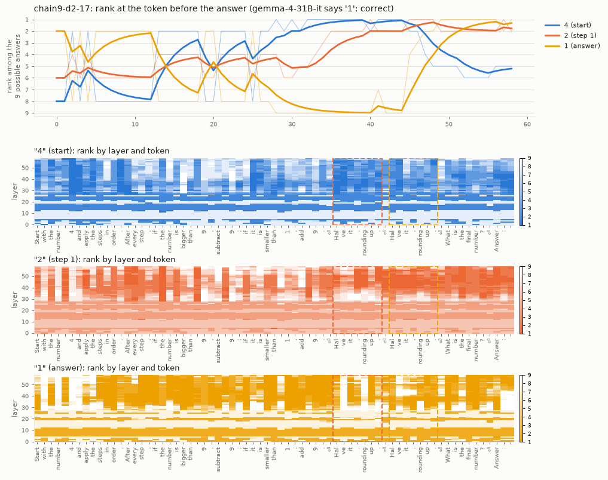

Start with the number 4 and apply the steps in order. After every step, if the number is bigger than 9, subtract 9; if it is smaller than 1, add 9.  
Halve it, rounding up.  
Halve it, rounding up.  
What is the final number?

**Answer:** **1** · **Hidden trajectory:** 4 → 2 → 1

**gemma-4-31B-it:** ✅ top 5: `1`, `2`, `3`, `4`, `5`
---

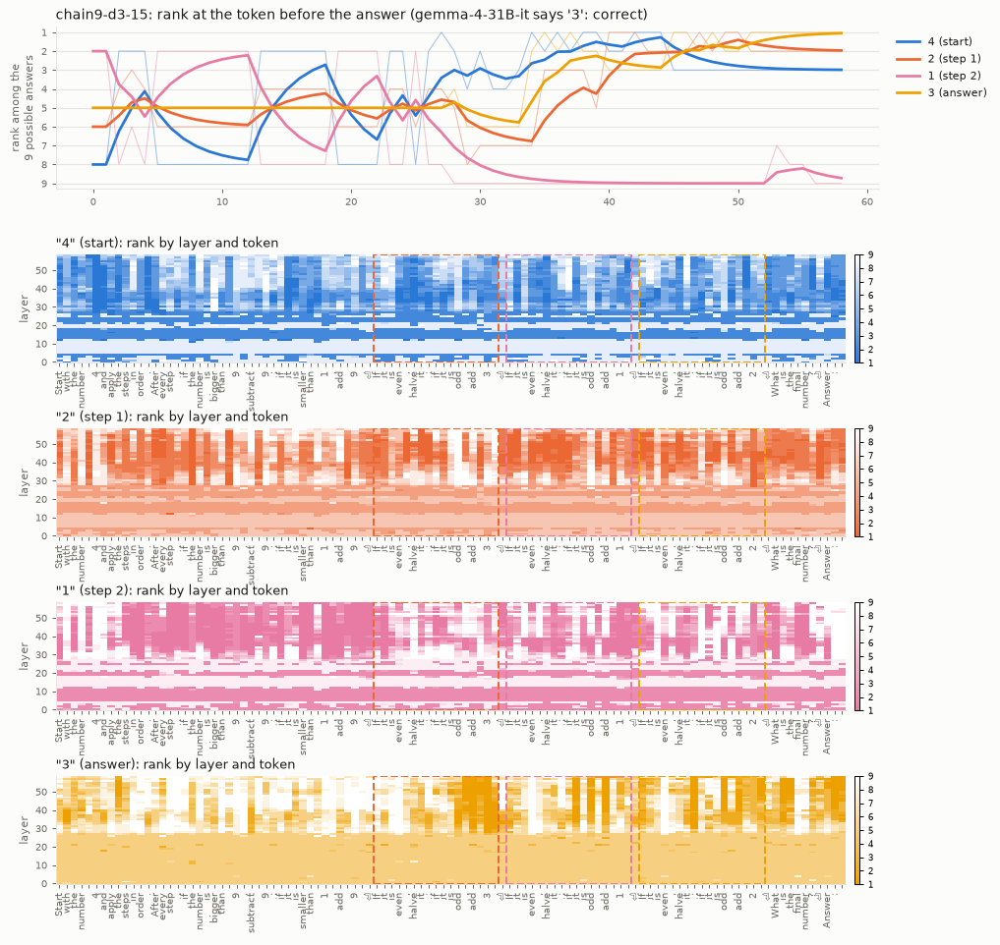

Start with the number 4 and apply the steps in order. After every step, if the number is bigger than 9, subtract 9; if it is smaller than 1, add 9.  
If it is even, halve it; if it is odd, add 3.  
If it is even, halve it; if it is odd, add 1.  
If it is even, halve it; if it is odd, add 2.  
What is the final number?

**Answer:** **3** · **Hidden trajectory:** 4 → 2 → 1 → 3

**gemma-4-31B-it:** ✅ top 5: `3`, `2`, `4`, `1`, `5`
---

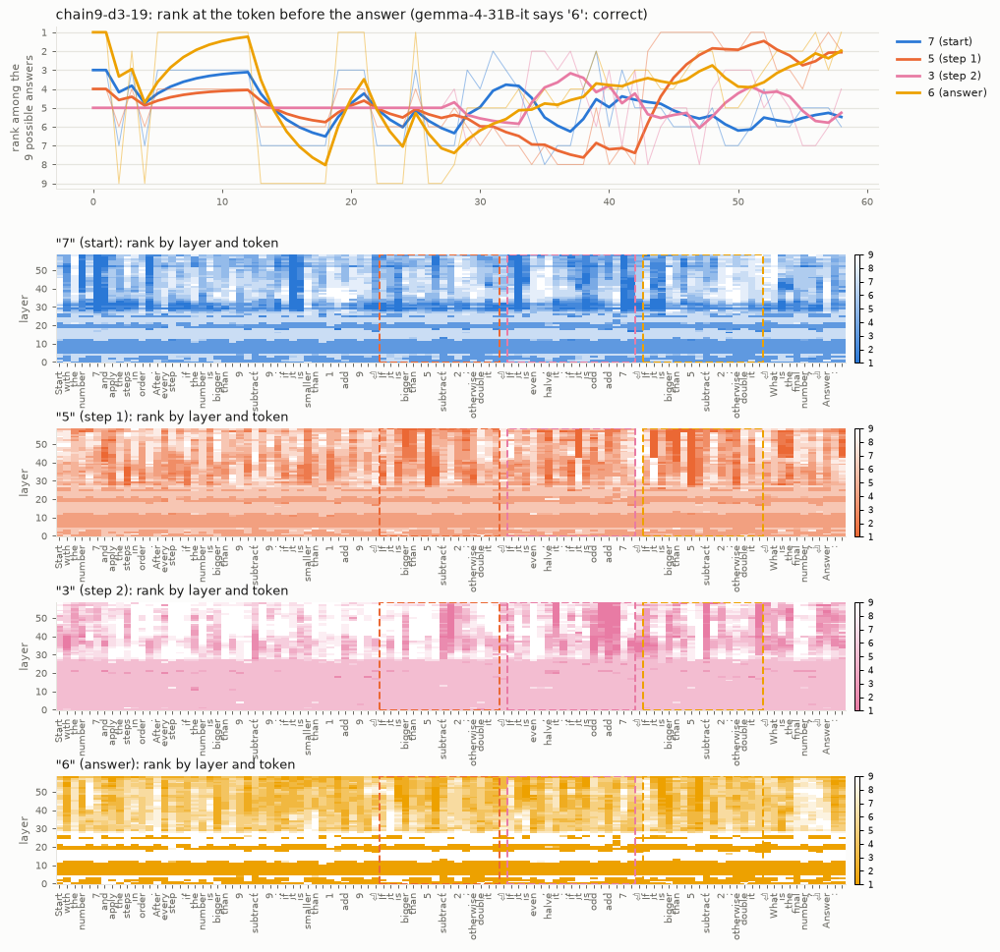

Start with the number 7 and apply the steps in order. After every step, if the number is bigger than 9, subtract 9; if it is smaller than 1, add 9.  
If it is bigger than 5, subtract 2; otherwise double it.  
If it is even, halve it; if it is odd, add 7.  
If it is bigger than 5, subtract 2; otherwise double it.  
What is the final number?

**Answer:** **6** · **Hidden trajectory:** 7 → 5 → 3 → 6

**gemma-4-31B-it:** ✅ top 5: `6`, `4`, `5`, `8`, `3`

## Answered wrong (32)

---

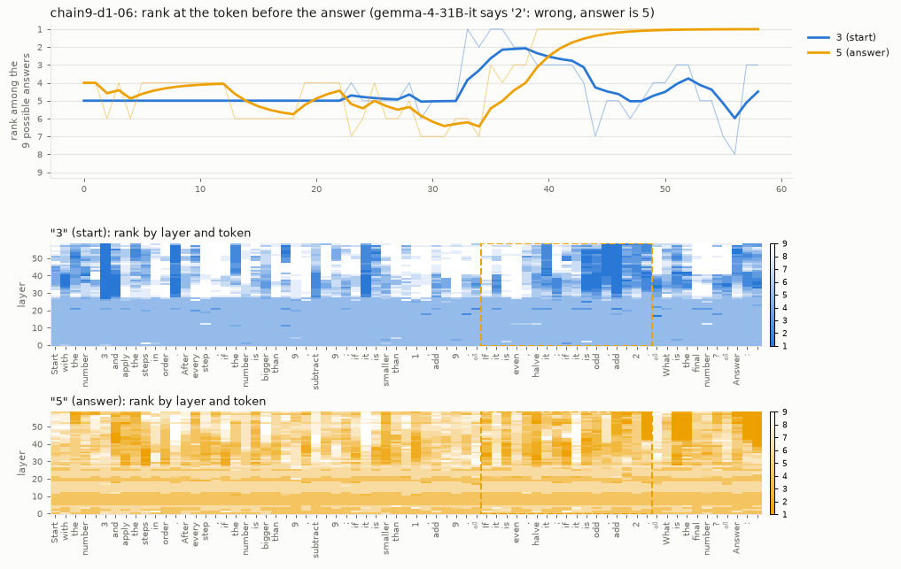

Start with the number 3 and apply the steps in order. After every step, if the number is bigger than 9, subtract 9; if it is smaller than 1, add 9.  
If it is even, halve it; if it is odd, add 2.  
What is the final number?

**Answer:** **5** · **Hidden trajectory:** 3 → 5

**gemma-4-31B-it:** ❌ top 5: `2`, `5`, `1`, `3`, `4`
---

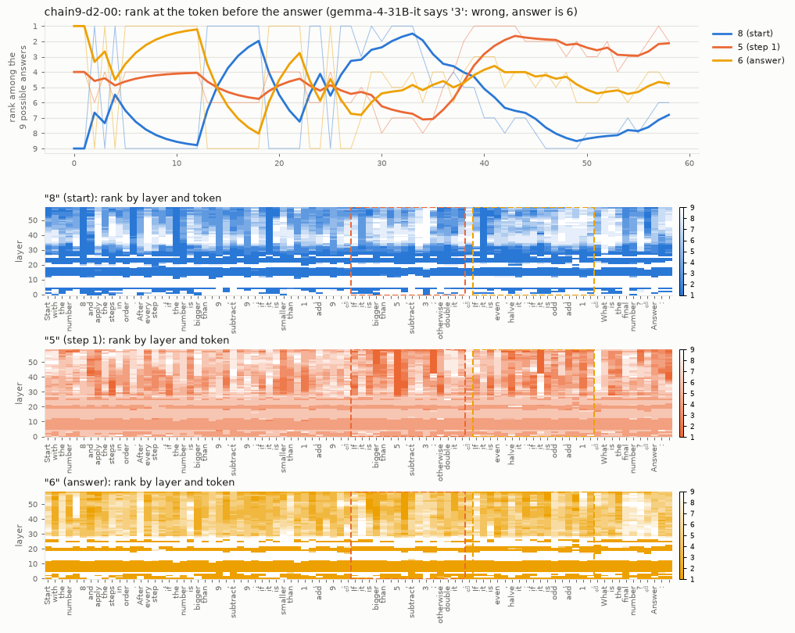

Start with the number 8 and apply the steps in order. After every step, if the number is bigger than 9, subtract 9; if it is smaller than 1, add 9.  
If it is bigger than 5, subtract 3; otherwise double it.  
If it is even, halve it; if it is odd, add 1.  
What is the final number?

**Answer:** **6** · **Hidden trajectory:** 8 → 5 → 6

**gemma-4-31B-it:** ❌ top 5: `3`, `2`, `5`, `4`, `6`
---

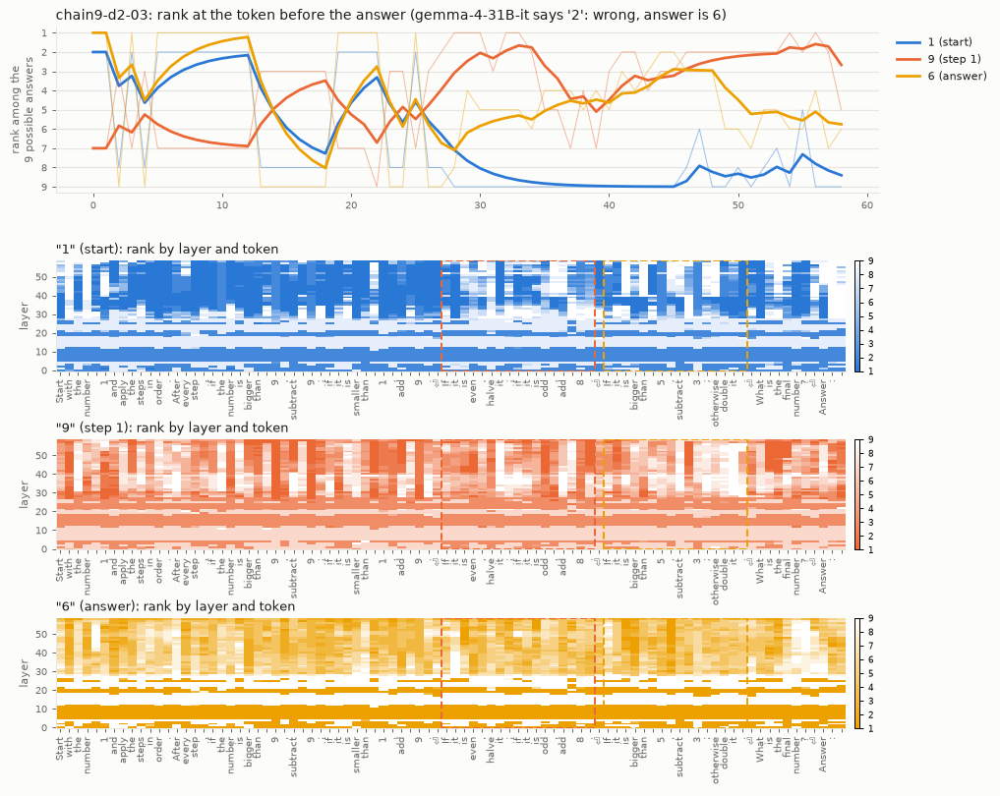

Start with the number 1 and apply the steps in order. After every step, if the number is bigger than 9, subtract 9; if it is smaller than 1, add 9.  
If it is even, halve it; if it is odd, add 8.  
If it is bigger than 5, subtract 3; otherwise double it.  
What is the final number?

**Answer:** **6** · **Hidden trajectory:** 1 → 9 → 6

**gemma-4-31B-it:** ❌ top 5: `2`, `3`, `1`, `5`, `4`
---

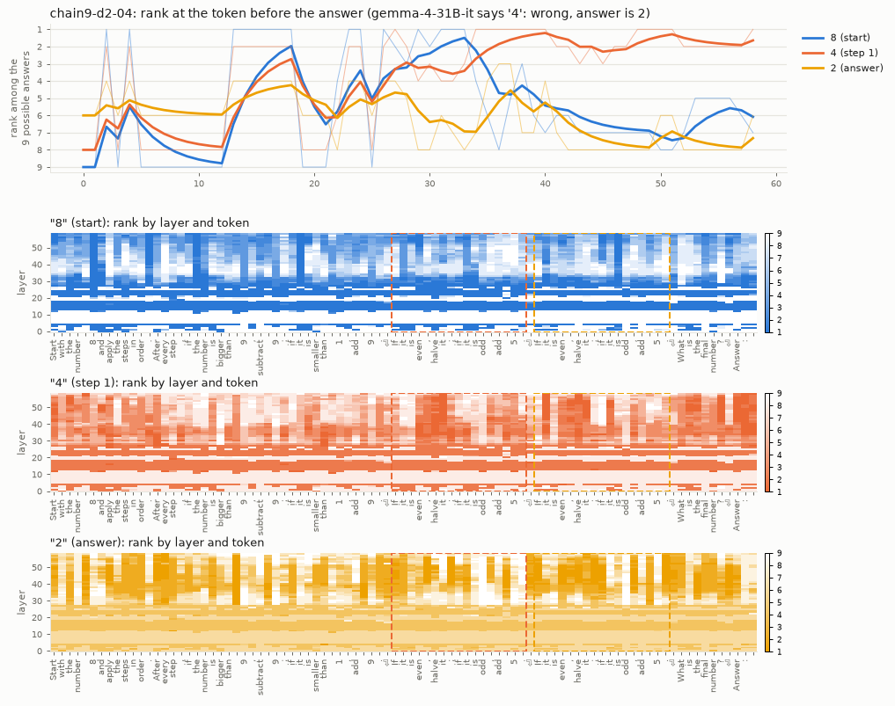

Start with the number 8 and apply the steps in order. After every step, if the number is bigger than 9, subtract 9; if it is smaller than 1, add 9.  
If it is even, halve it; if it is odd, add 5.  
If it is even, halve it; if it is odd, add 5.  
What is the final number?

**Answer:** **2** · **Hidden trajectory:** 8 → 4 → 2

**gemma-4-31B-it:** ❌ top 5: `4`, `6`, `5`, `3`, `1`
---

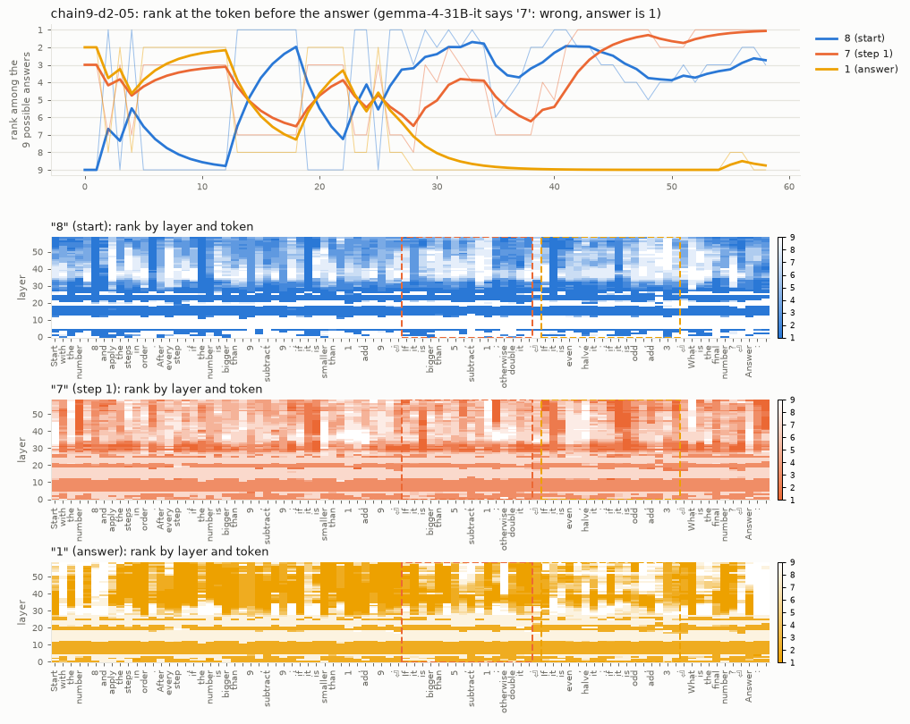

Start with the number 8 and apply the steps in order. After every step, if the number is bigger than 9, subtract 9; if it is smaller than 1, add 9.  
If it is bigger than 5, subtract 1; otherwise double it.  
If it is even, halve it; if it is odd, add 3.  
What is the final number?

**Answer:** **1** · **Hidden trajectory:** 8 → 7 → 1

**gemma-4-31B-it:** ❌ top 5: `7`, `4`, `3`, `8`, `6`
---

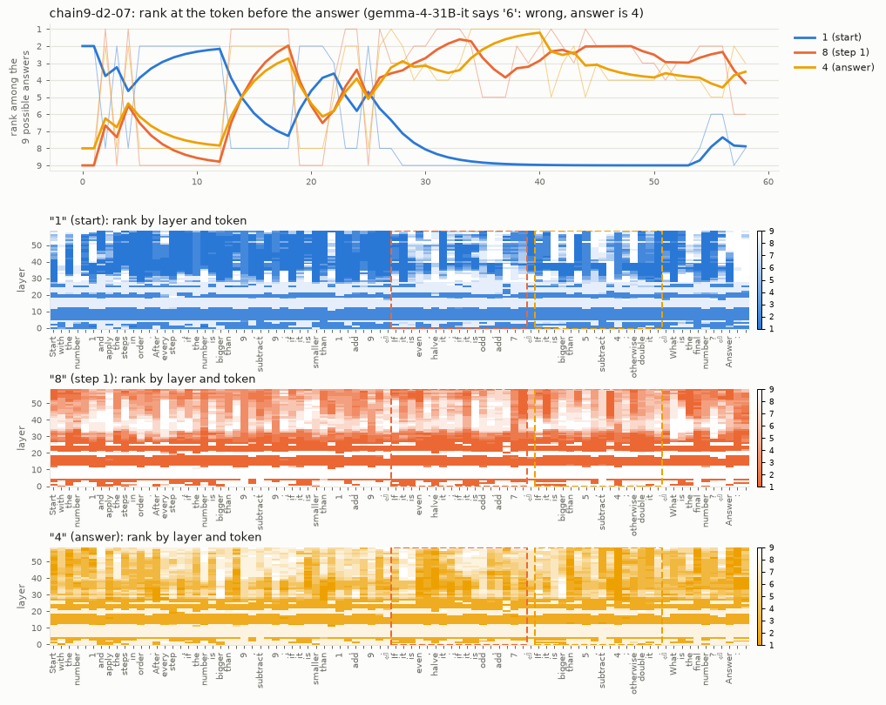

Start with the number 1 and apply the steps in order. After every step, if the number is bigger than 9, subtract 9; if it is smaller than 1, add 9.  
If it is even, halve it; if it is odd, add 7.  
If it is bigger than 5, subtract 4; otherwise double it.  
What is the final number?

**Answer:** **4** · **Hidden trajectory:** 1 → 8 → 4

**gemma-4-31B-it:** ❌ top 5: `6`, `2`, `4`, `1`, `3`
---

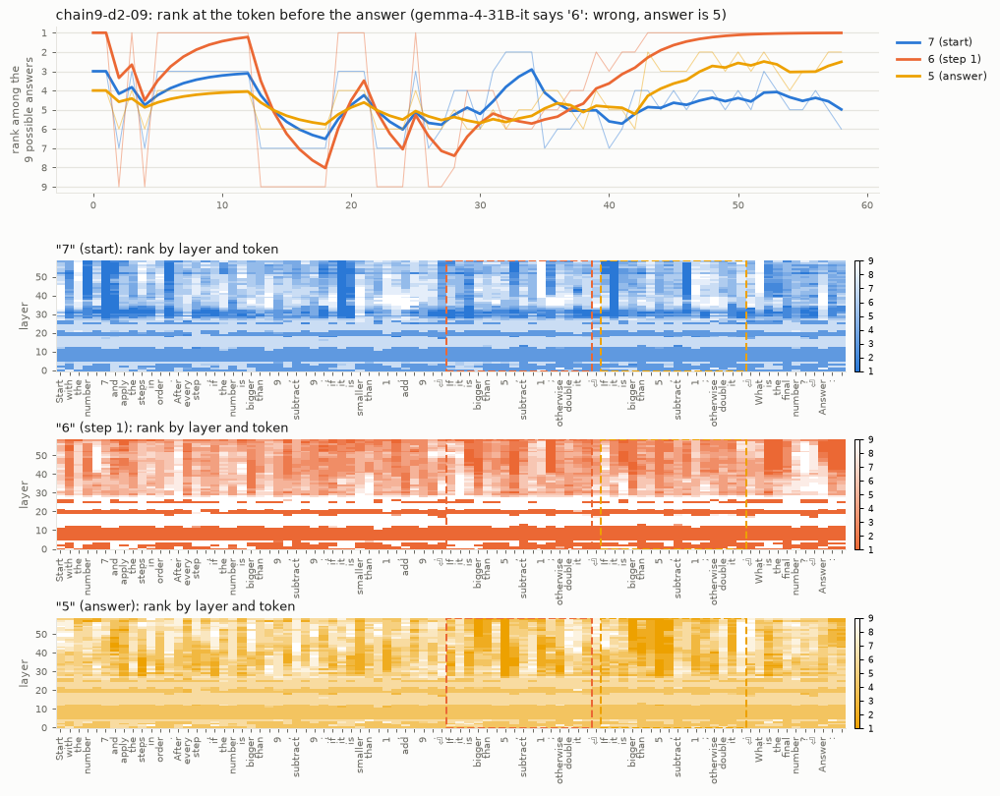

Start with the number 7 and apply the steps in order. After every step, if the number is bigger than 9, subtract 9; if it is smaller than 1, add 9.  
If it is bigger than 5, subtract 1; otherwise double it.  
If it is bigger than 5, subtract 1; otherwise double it.  
What is the final number?

**Answer:** **5** · **Hidden trajectory:** 7 → 6 → 5

**gemma-4-31B-it:** ❌ top 5: `6`, `1`, `8`, `5`, `4`
---

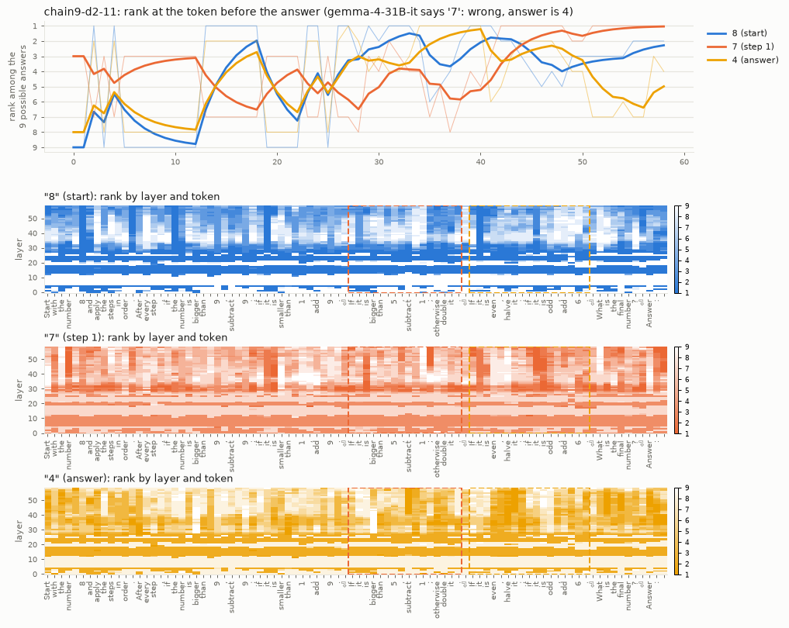

Start with the number 8 and apply the steps in order. After every step, if the number is bigger than 9, subtract 9; if it is smaller than 1, add 9.  
If it is bigger than 5, subtract 1; otherwise double it.  
If it is even, halve it; if it is odd, add 6.  
What is the final number?

**Answer:** **4** · **Hidden trajectory:** 8 → 7 → 4

**gemma-4-31B-it:** ❌ top 5: `7`, `3`, `4`, `8`, `1`
---

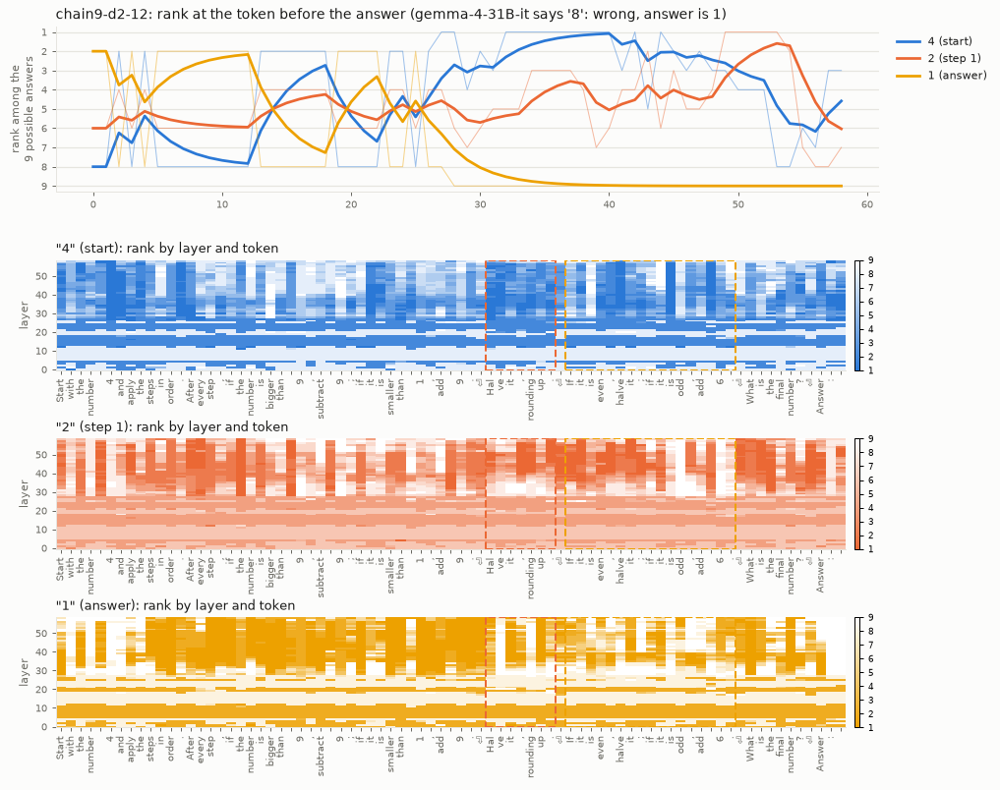

Start with the number 4 and apply the steps in order. After every step, if the number is bigger than 9, subtract 9; if it is smaller than 1, add 9.  
Halve it, rounding up.  
If it is even, halve it; if it is odd, add 6.  
What is the final number?

**Answer:** **1** · **Hidden trajectory:** 4 → 2 → 1

**gemma-4-31B-it:** ❌ top 5: `8`, `4`, `3`, `5`, `2`
---

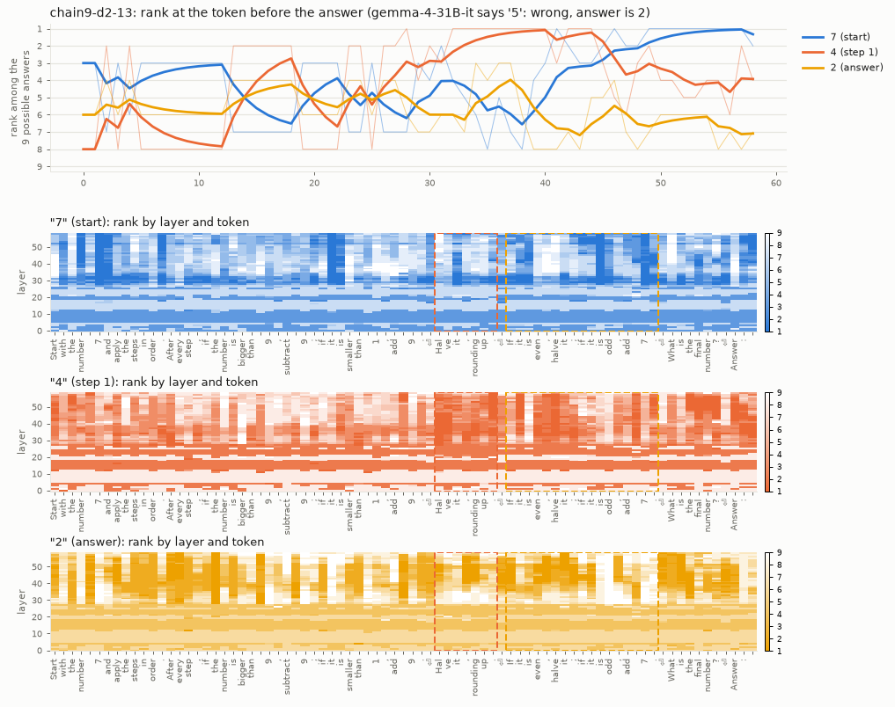

Start with the number 7 and apply the steps in order. After every step, if the number is bigger than 9, subtract 9; if it is smaller than 1, add 9.  
Halve it, rounding up.  
If it is even, halve it; if it is odd, add 7.  
What is the final number?

**Answer:** **2** · **Hidden trajectory:** 7 → 4 → 2

**gemma-4-31B-it:** ❌ top 5: `5`, `6`, `7`, `1`, `2`
---

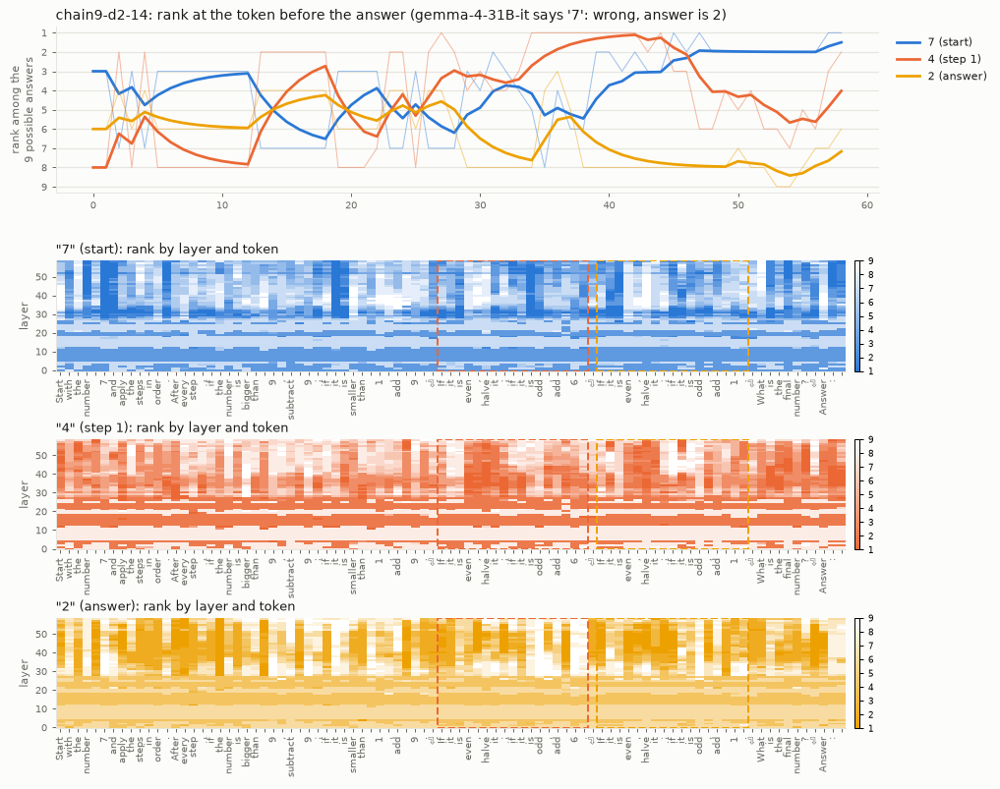

Start with the number 7 and apply the steps in order. After every step, if the number is bigger than 9, subtract 9; if it is smaller than 1, add 9.  
If it is even, halve it; if it is odd, add 6.  
If it is even, halve it; if it is odd, add 1.  
What is the final number?

**Answer:** **2** · **Hidden trajectory:** 7 → 4 → 2

**gemma-4-31B-it:** ❌ top 5: `7`, `4`, `3`, `6`, `2`
---

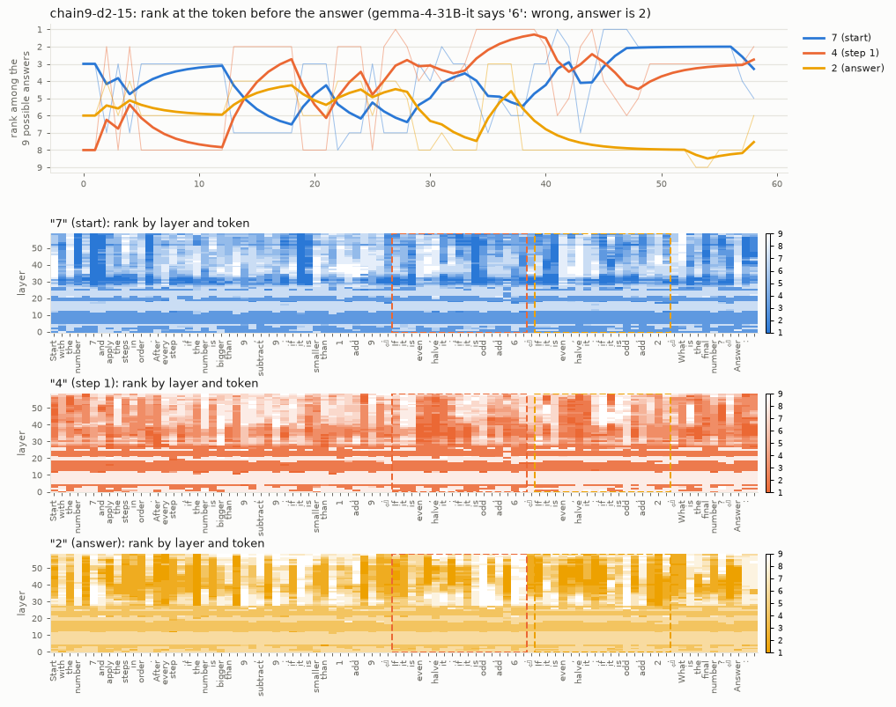

Start with the number 7 and apply the steps in order. After every step, if the number is bigger than 9, subtract 9; if it is smaller than 1, add 9.  
If it is even, halve it; if it is odd, add 6.  
If it is even, halve it; if it is odd, add 2.  
What is the final number?

**Answer:** **2** · **Hidden trajectory:** 7 → 4 → 2

**gemma-4-31B-it:** ❌ top 5: `6`, `4`, `3`, `5`, `7`
---

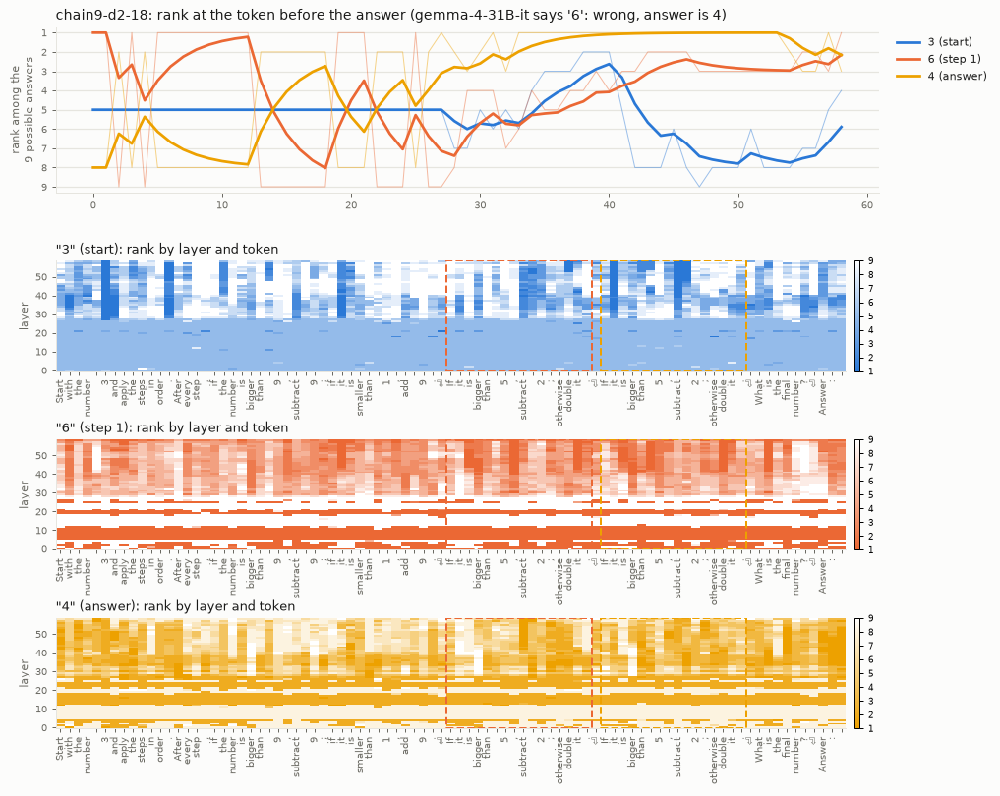

Start with the number 3 and apply the steps in order. After every step, if the number is bigger than 9, subtract 9; if it is smaller than 1, add 9.  
If it is bigger than 5, subtract 2; otherwise double it.  
If it is bigger than 5, subtract 2; otherwise double it.  
What is the final number?

**Answer:** **4** · **Hidden trajectory:** 3 → 6 → 4

**gemma-4-31B-it:** ❌ top 5: `6`, `8`, `4`, `2`, `1`
---

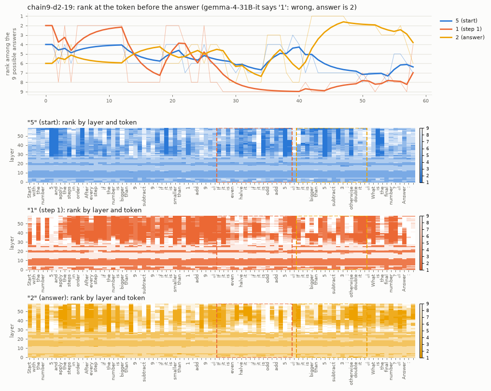

Start with the number 5 and apply the steps in order. After every step, if the number is bigger than 9, subtract 9; if it is smaller than 1, add 9.  
If it is even, halve it; if it is odd, add 5.  
If it is bigger than 5, subtract 3; otherwise double it.  
What is the final number?

**Answer:** **2** · **Hidden trajectory:** 5 → 1 → 2

**gemma-4-31B-it:** ❌ top 5: `1`, `8`, `4`, `6`, `2`
---

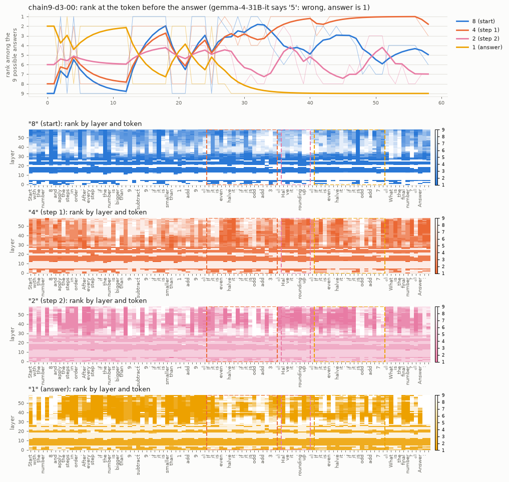

Start with the number 8 and apply the steps in order. After every step, if the number is bigger than 9, subtract 9; if it is smaller than 1, add 9.  
If it is even, halve it; if it is odd, add 3.  
Halve it, rounding up.  
If it is even, halve it; if it is odd, add 7.  
What is the final number?

**Answer:** **1** · **Hidden trajectory:** 8 → 4 → 2 → 1

**gemma-4-31B-it:** ❌ top 5: `5`, `6`, `4`, `7`, `8`
---

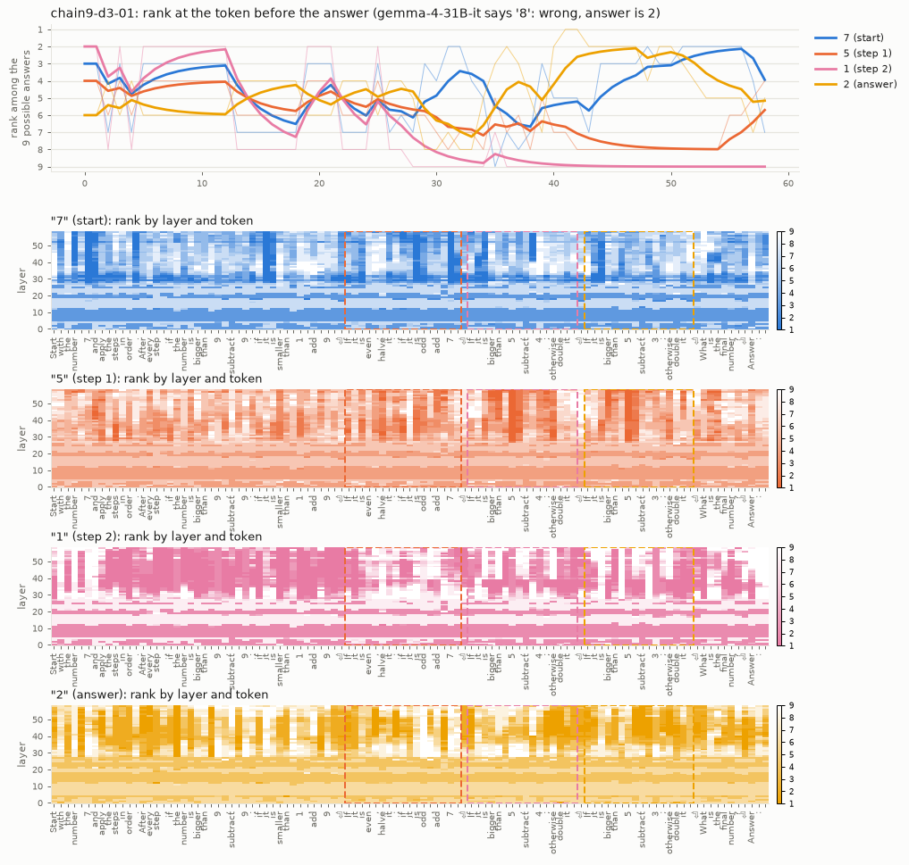

Start with the number 7 and apply the steps in order. After every step, if the number is bigger than 9, subtract 9; if it is smaller than 1, add 9.  
If it is even, halve it; if it is odd, add 7.  
If it is bigger than 5, subtract 4; otherwise double it.  
If it is bigger than 5, subtract 3; otherwise double it.  
What is the final number?

**Answer:** **2** · **Hidden trajectory:** 7 → 5 → 1 → 2

**gemma-4-31B-it:** ❌ top 5: `8`, `6`, `4`, `2`, `1`
---

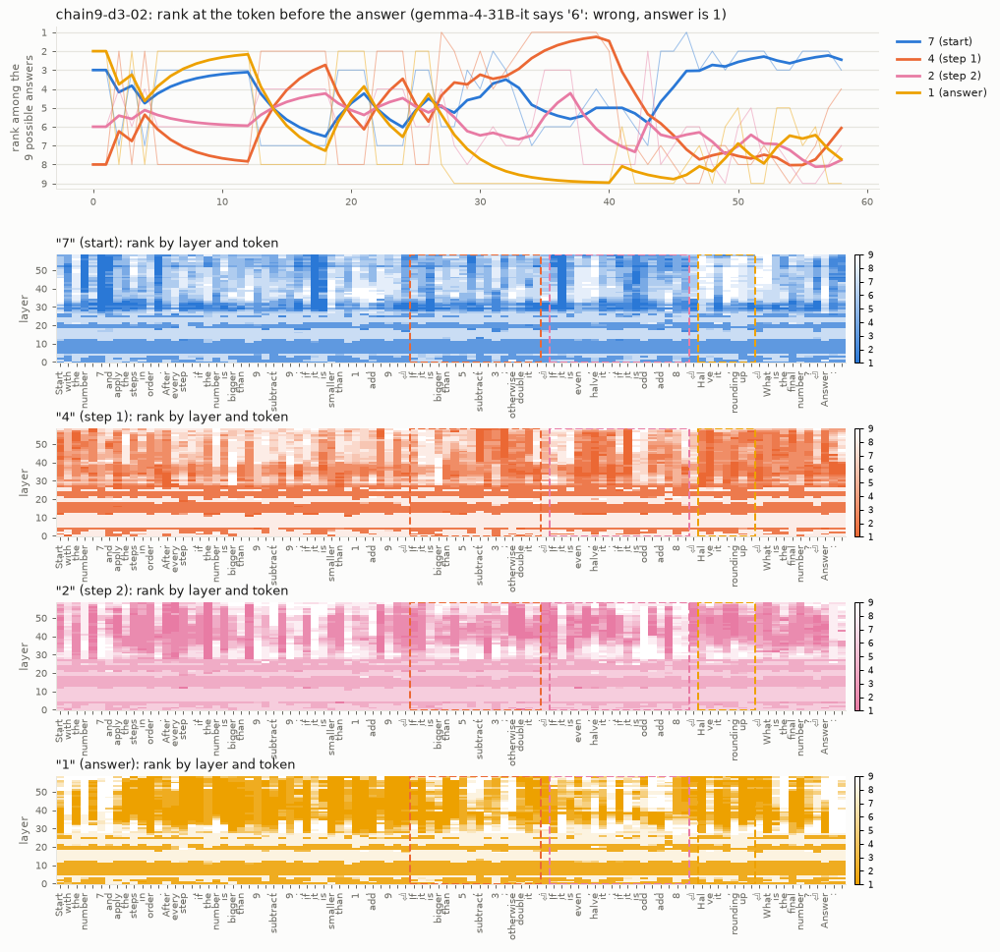

Start with the number 7 and apply the steps in order. After every step, if the number is bigger than 9, subtract 9; if it is smaller than 1, add 9.  
If it is bigger than 5, subtract 3; otherwise double it.  
If it is even, halve it; if it is odd, add 8.  
Halve it, rounding up.  
What is the final number?

**Answer:** **1** · **Hidden trajectory:** 7 → 4 → 2 → 1

**gemma-4-31B-it:** ❌ top 5: `6`, `5`, `7`, `4`, `8`
---

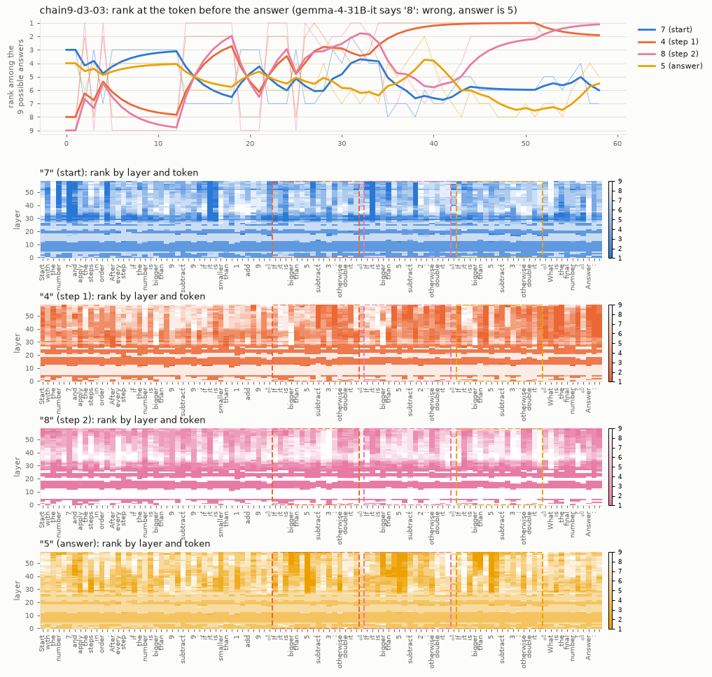

Start with the number 7 and apply the steps in order. After every step, if the number is bigger than 9, subtract 9; if it is smaller than 1, add 9.  
If it is bigger than 5, subtract 3; otherwise double it.  
If it is bigger than 5, subtract 2; otherwise double it.  
If it is bigger than 5, subtract 3; otherwise double it.  
What is the final number?

**Answer:** **5** · **Hidden trajectory:** 7 → 4 → 8 → 5

**gemma-4-31B-it:** ❌ top 5: `8`, `4`, `6`, `2`, `1`
---

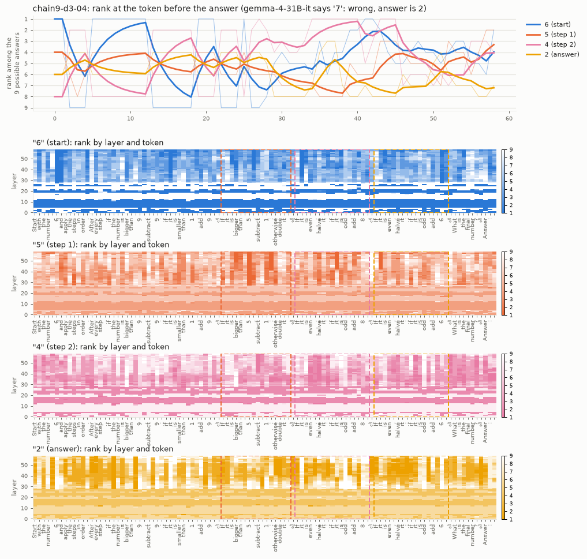

Start with the number 6 and apply the steps in order. After every step, if the number is bigger than 9, subtract 9; if it is smaller than 1, add 9.  
If it is bigger than 5, subtract 1; otherwise double it.  
If it is even, halve it; if it is odd, add 8.  
If it is even, halve it; if it is odd, add 6.  
What is the final number?

**Answer:** **2** · **Hidden trajectory:** 6 → 5 → 4 → 2

**gemma-4-31B-it:** ❌ top 5: `7`, `6`, `8`, `5`, `4`
---

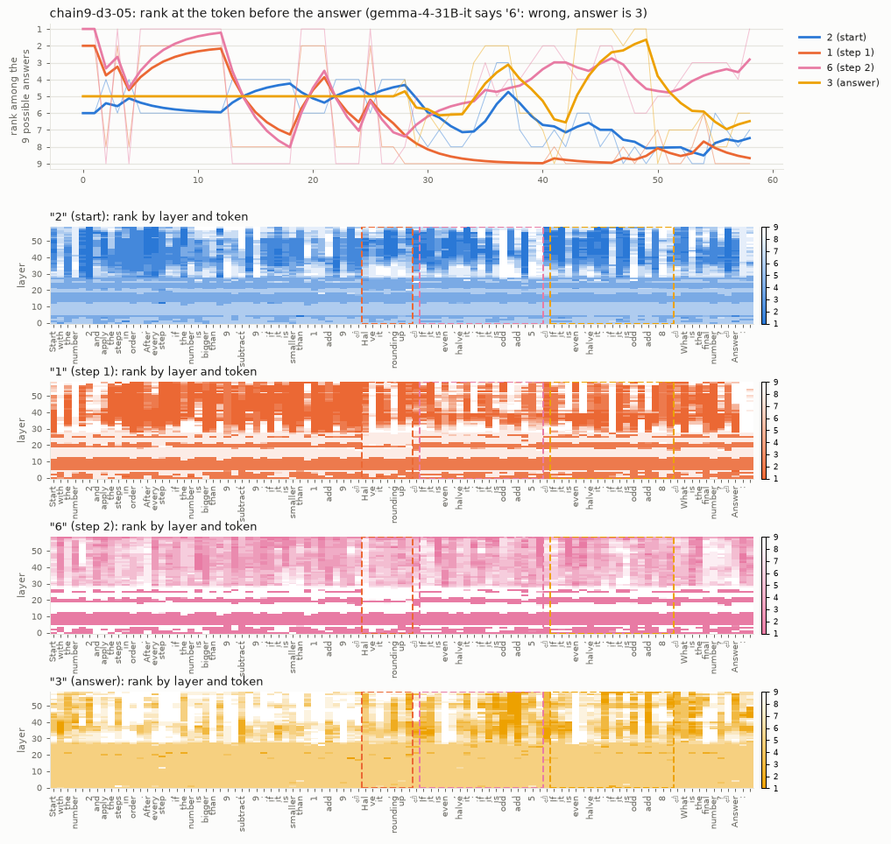

Start with the number 2 and apply the steps in order. After every step, if the number is bigger than 9, subtract 9; if it is smaller than 1, add 9.  
Halve it, rounding up.  
If it is even, halve it; if it is odd, add 5.  
If it is even, halve it; if it is odd, add 8.  
What is the final number?

**Answer:** **3** · **Hidden trajectory:** 2 → 1 → 6 → 3

**gemma-4-31B-it:** ❌ top 5: `6`, `7`, `4`, `5`, `8`
---

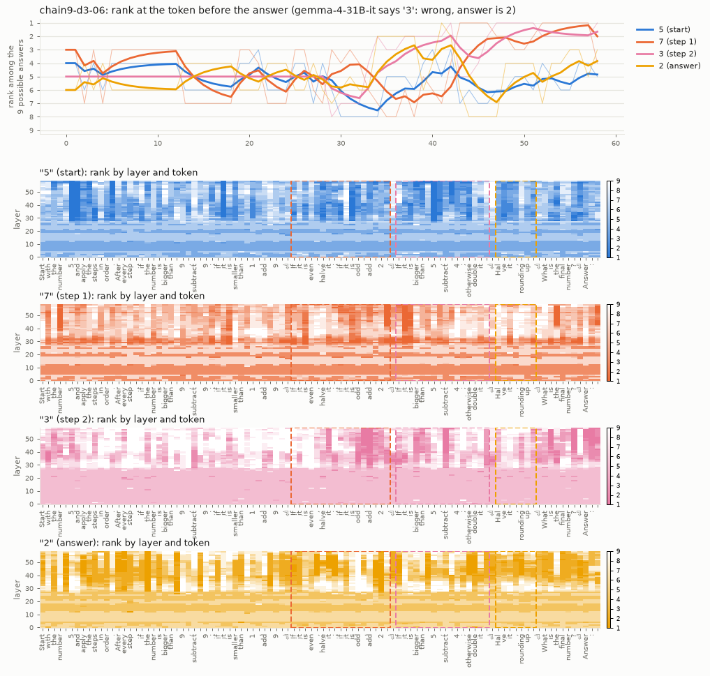

Start with the number 5 and apply the steps in order. After every step, if the number is bigger than 9, subtract 9; if it is smaller than 1, add 9.  
If it is even, halve it; if it is odd, add 2.  
If it is bigger than 5, subtract 4; otherwise double it.  
Halve it, rounding up.  
What is the final number?

**Answer:** **2** · **Hidden trajectory:** 5 → 7 → 3 → 2

**gemma-4-31B-it:** ❌ top 5: `3`, `2`, `4`, `1`, `7`
---

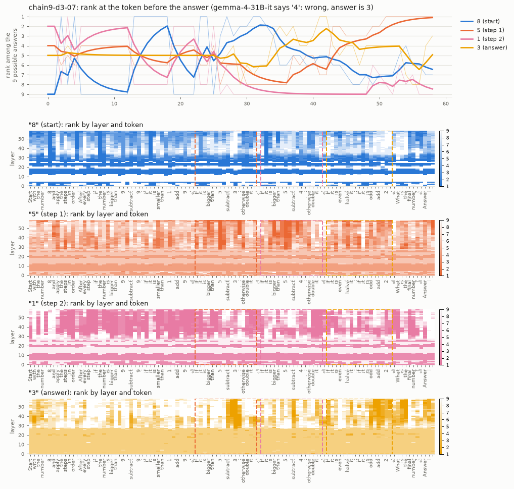

Start with the number 8 and apply the steps in order. After every step, if the number is bigger than 9, subtract 9; if it is smaller than 1, add 9.  
If it is bigger than 5, subtract 3; otherwise double it.  
If it is bigger than 5, subtract 4; otherwise double it.  
If it is even, halve it; if it is odd, add 2.  
What is the final number?

**Answer:** **3** · **Hidden trajectory:** 8 → 5 → 1 → 3

**gemma-4-31B-it:** ❌ top 5: `4`, `5`, `3`, `2`, `1`
---

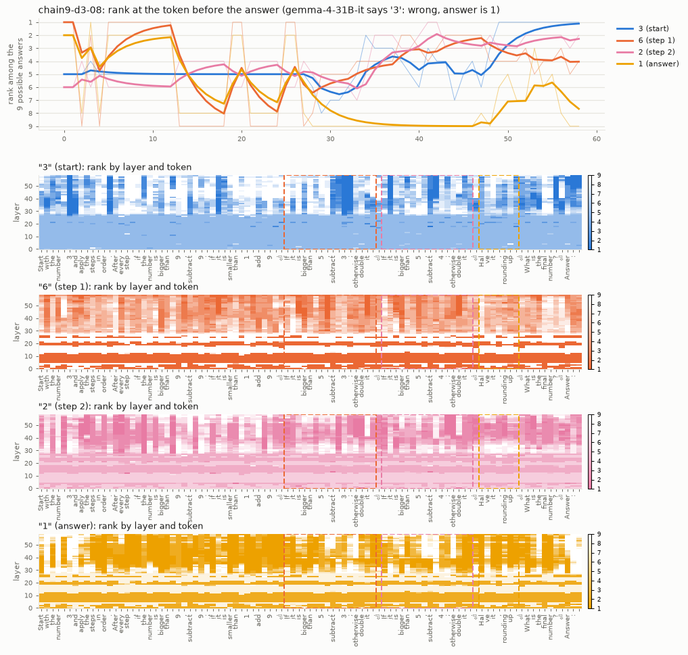

Start with the number 3 and apply the steps in order. After every step, if the number is bigger than 9, subtract 9; if it is smaller than 1, add 9.  
If it is bigger than 5, subtract 3; otherwise double it.  
If it is bigger than 5, subtract 4; otherwise double it.  
Halve it, rounding up.  
What is the final number?

**Answer:** **1** · **Hidden trajectory:** 3 → 6 → 2 → 1

**gemma-4-31B-it:** ❌ top 5: `3`, `2`, `4`, `1`, `6`
---

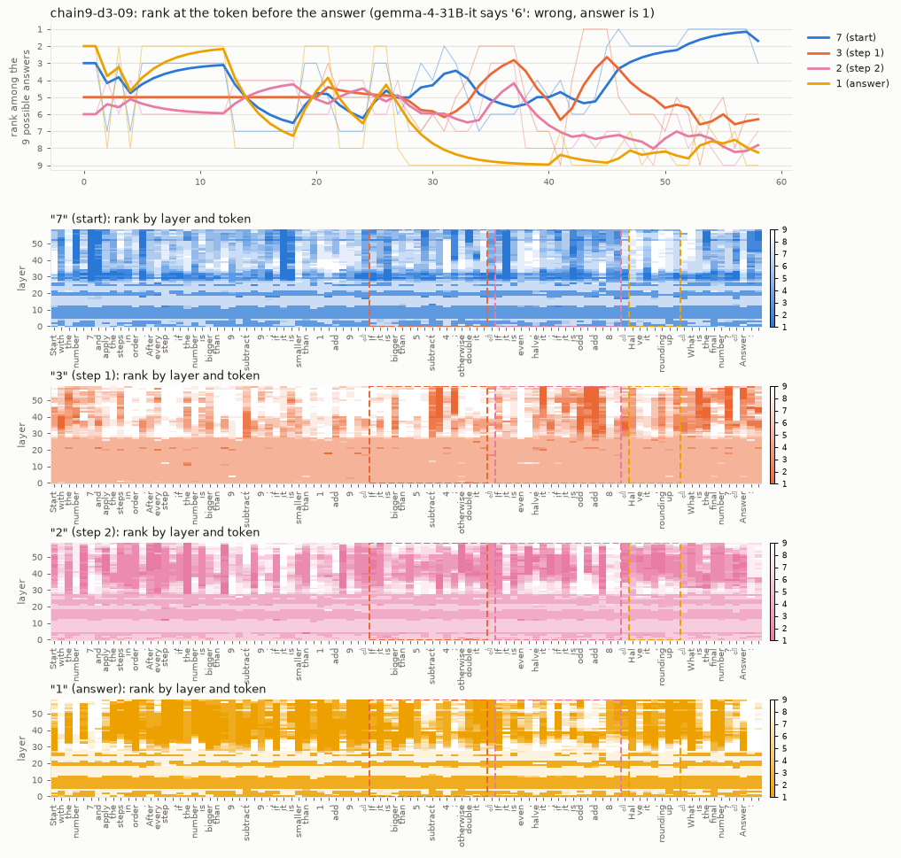

Start with the number 7 and apply the steps in order. After every step, if the number is bigger than 9, subtract 9; if it is smaller than 1, add 9.  
If it is bigger than 5, subtract 4; otherwise double it.  
If it is even, halve it; if it is odd, add 8.  
Halve it, rounding up.  
What is the final number?

**Answer:** **1** · **Hidden trajectory:** 7 → 3 → 2 → 1

**gemma-4-31B-it:** ❌ top 5: `6`, `5`, `7`, `8`, `4`
---

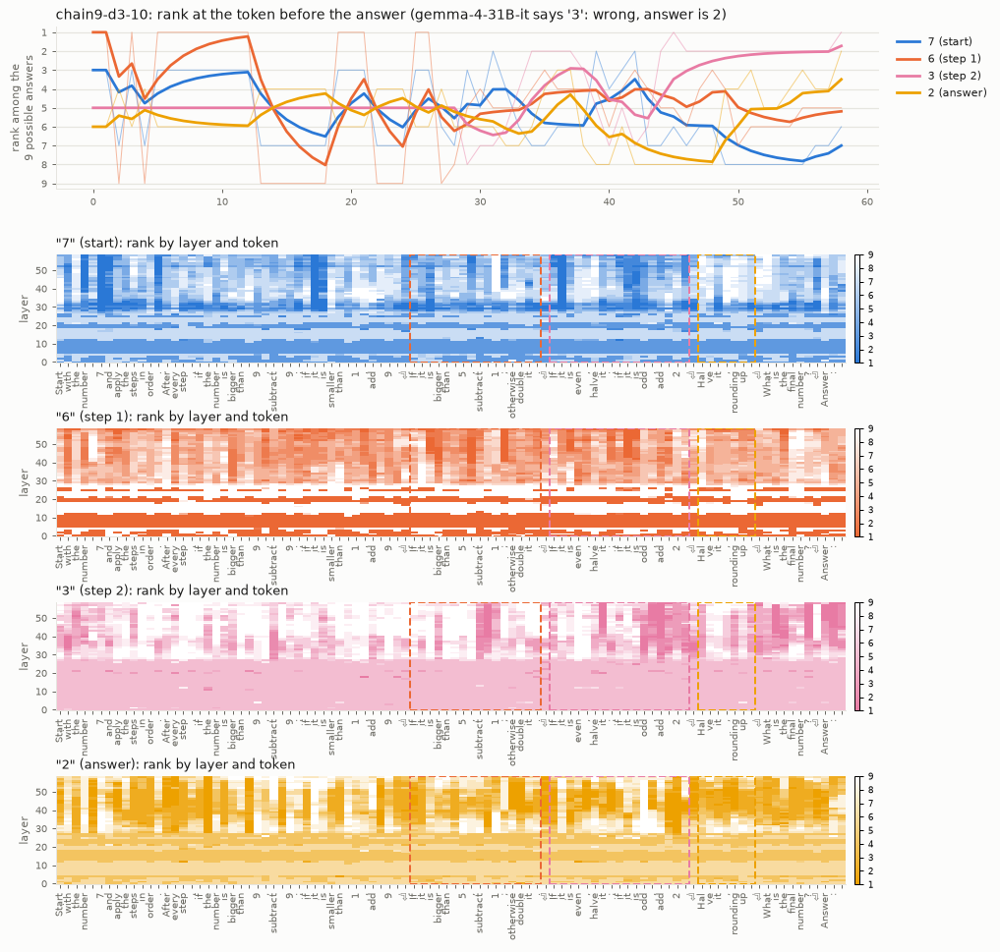

Start with the number 7 and apply the steps in order. After every step, if the number is bigger than 9, subtract 9; if it is smaller than 1, add 9.  
If it is bigger than 5, subtract 1; otherwise double it.  
If it is even, halve it; if it is odd, add 2.  
Halve it, rounding up.  
What is the final number?

**Answer:** **2** · **Hidden trajectory:** 7 → 6 → 3 → 2

**gemma-4-31B-it:** ❌ top 5: `3`, `2`, `4`, `1`, `5`
---

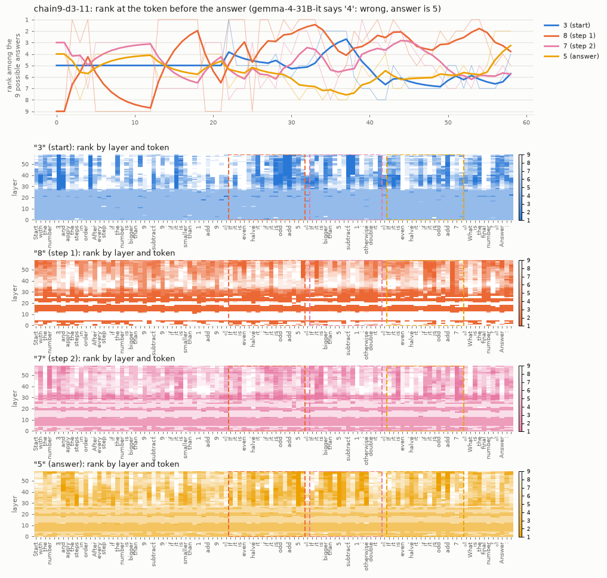

Start with the number 3 and apply the steps in order. After every step, if the number is bigger than 9, subtract 9; if it is smaller than 1, add 9.  
If it is even, halve it; if it is odd, add 5.  
If it is bigger than 5, subtract 1; otherwise double it.  
If it is even, halve it; if it is odd, add 7.  
What is the final number?

**Answer:** **5** · **Hidden trajectory:** 3 → 8 → 7 → 5

**gemma-4-31B-it:** ❌ top 5: `4`, `5`, `6`, `3`, `8`
---

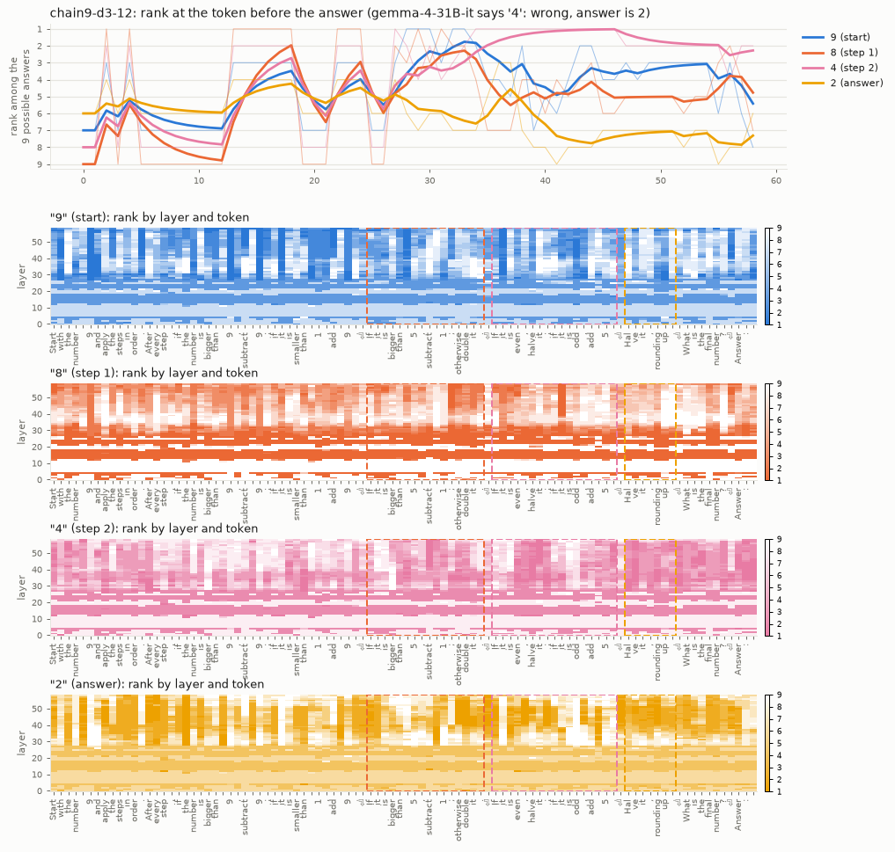

Start with the number 9 and apply the steps in order. After every step, if the number is bigger than 9, subtract 9; if it is smaller than 1, add 9.  
If it is bigger than 5, subtract 1; otherwise double it.  
If it is even, halve it; if it is odd, add 5.  
Halve it, rounding up.  
What is the final number?

**Answer:** **2** · **Hidden trajectory:** 9 → 8 → 4 → 2

**gemma-4-31B-it:** ❌ top 5: `4`, `3`, `5`, `7`, `6`
---

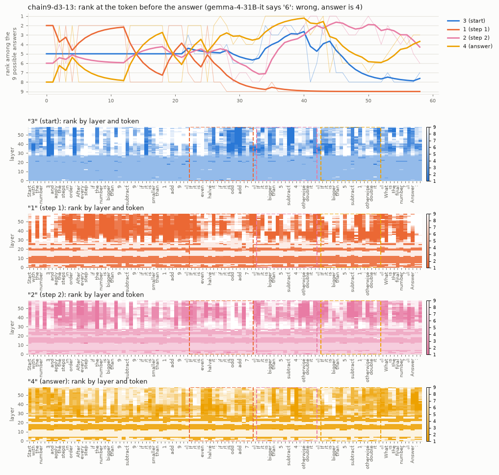

Start with the number 3 and apply the steps in order. After every step, if the number is bigger than 9, subtract 9; if it is smaller than 1, add 9.  
If it is even, halve it; if it is odd, add 7.  
If it is bigger than 5, subtract 4; otherwise double it.  
If it is bigger than 5, subtract 1; otherwise double it.  
What is the final number?

**Answer:** **4** · **Hidden trajectory:** 3 → 1 → 2 → 4

**gemma-4-31B-it:** ❌ top 5: `6`, `8`, `4`, `2`, `1`
---

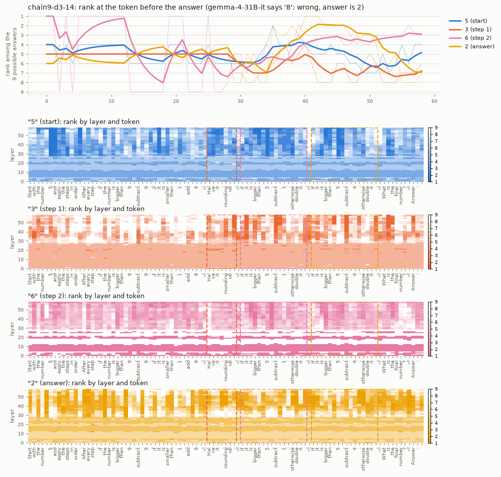

Start with the number 5 and apply the steps in order. After every step, if the number is bigger than 9, subtract 9; if it is smaller than 1, add 9.  
Halve it, rounding up.  
If it is bigger than 5, subtract 1; otherwise double it.  
If it is bigger than 5, subtract 4; otherwise double it.  
What is the final number?

**Answer:** **2** · **Hidden trajectory:** 5 → 3 → 6 → 2

**gemma-4-31B-it:** ❌ top 5: `8`, `4`, `6`, `1`, `5`
---

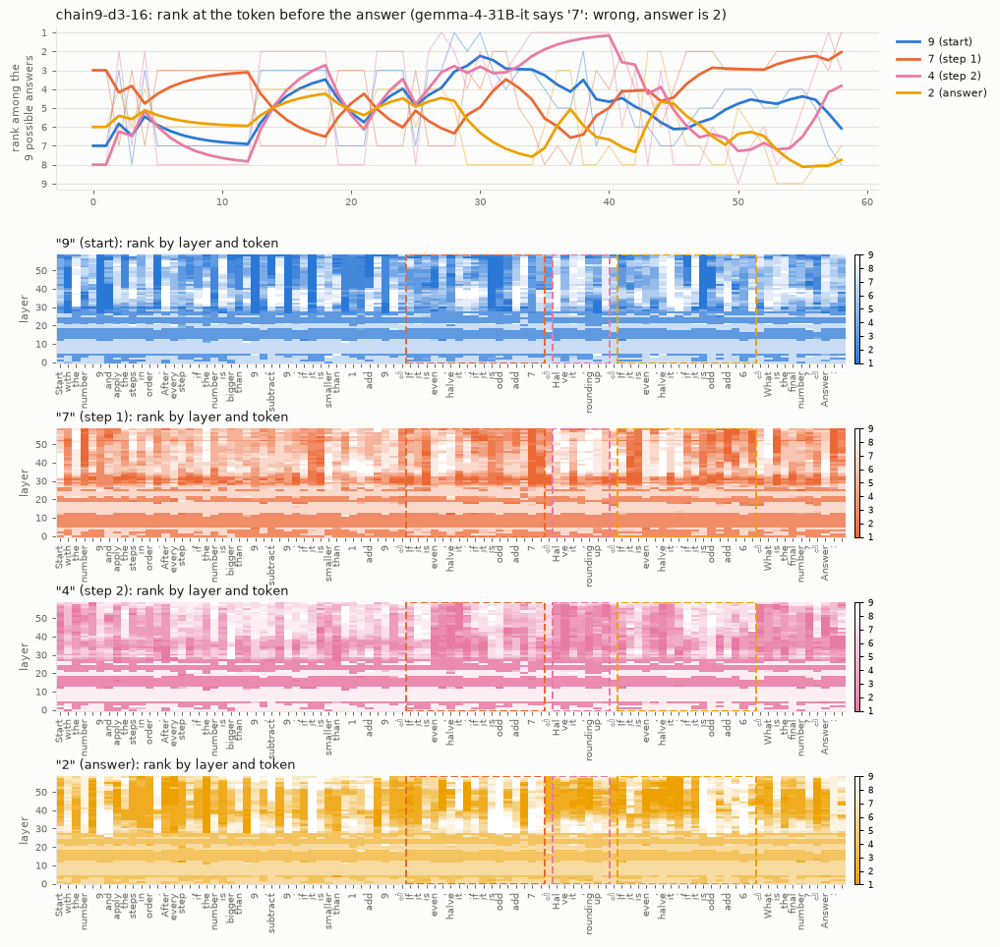

Start with the number 9 and apply the steps in order. After every step, if the number is bigger than 9, subtract 9; if it is smaller than 1, add 9.  
If it is even, halve it; if it is odd, add 7.  
Halve it, rounding up.  
If it is even, halve it; if it is odd, add 6.  
What is the final number?

**Answer:** **2** · **Hidden trajectory:** 9 → 7 → 4 → 2

**gemma-4-31B-it:** ❌ top 5: `7`, `5`, `4`, `6`, `8`
---

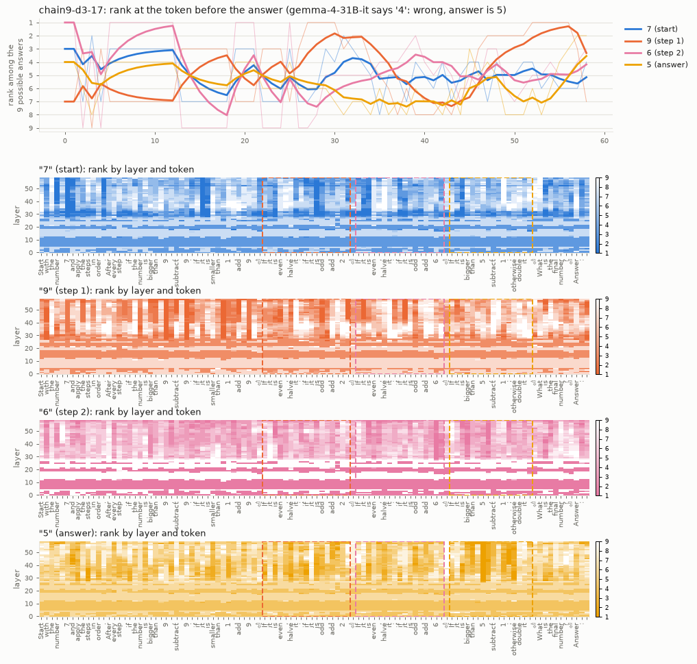

Start with the number 7 and apply the steps in order. After every step, if the number is bigger than 9, subtract 9; if it is smaller than 1, add 9.  
If it is even, halve it; if it is odd, add 2.  
If it is even, halve it; if it is odd, add 6.  
If it is bigger than 5, subtract 1; otherwise double it.  
What is the final number?

**Answer:** **5** · **Hidden trajectory:** 7 → 9 → 6 → 5

**gemma-4-31B-it:** ❌ top 5: `4`, `5`, `6`, `8`, `7`
---

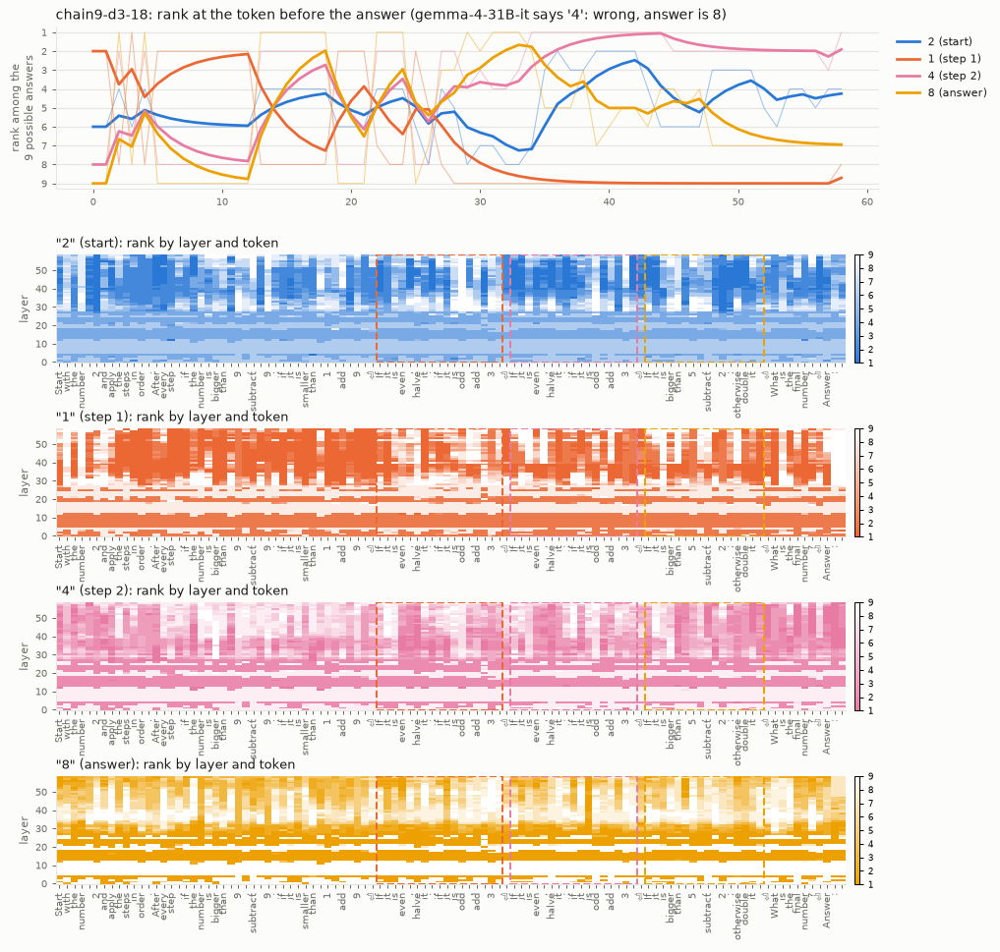

Start with the number 2 and apply the steps in order. After every step, if the number is bigger than 9, subtract 9; if it is smaller than 1, add 9.  
If it is even, halve it; if it is odd, add 3.  
If it is even, halve it; if it is odd, add 3.  
If it is bigger than 5, subtract 2; otherwise double it.  
What is the final number?

**Answer:** **8** · **Hidden trajectory:** 2 → 1 → 4 → 8

**gemma-4-31B-it:** ❌ top 5: `4`, `3`, `2`, `5`, `1`
