# lens-eval-multihop: J-lens by layer and token, gemma-4-31B-it

Lens: `solarkyle/jspace-lenses/gemma-4-31b-it/lens.pt`. Rank here is rank in the whole vocabulary (log scale), 1 = the lens's top token. Each item's graph shows, on top, the rank
of every tracked word at the token before the answer by layer (thin = raw, thick = EWMA with a
2-layer halflife). Below it, one heatmap per word: rank at every layer (y) and prompt token
(x), darker = higher rank. Dashed boxes outline the prompt line each step reads, in the colour of the
step it produces. A word lighting up on its own token in early layers is the token echoing itself, not
computation. Correct items first.

| depth | correct |
| --- | --- |
| all | 45/93 |

## Summary: median rank over correct items

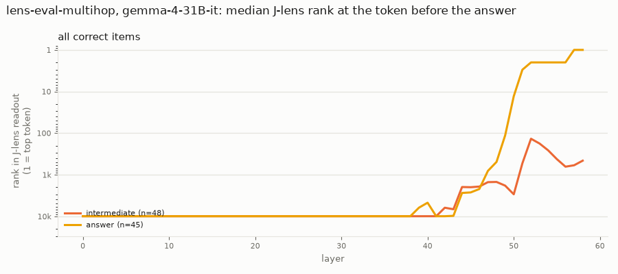

## Answered correctly (45)

---

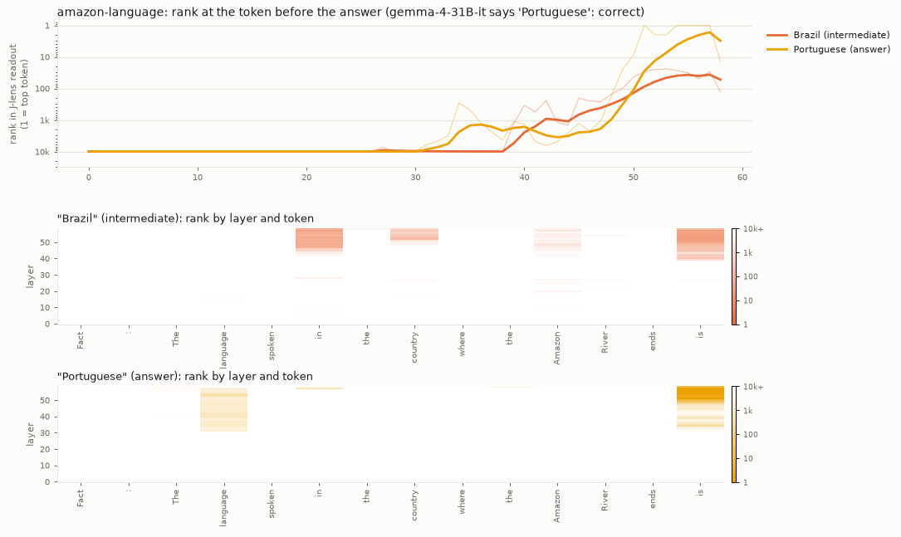

Fact: The language spoken in the country where the Amazon River ends is

**Answer:** **Portuguese** · **Hidden trajectory:** Brazil → Portuguese

**gemma-4-31B-it:** ✅ top 5: `Portuguese`, `either`, `**`, `called`, `Portug`
---

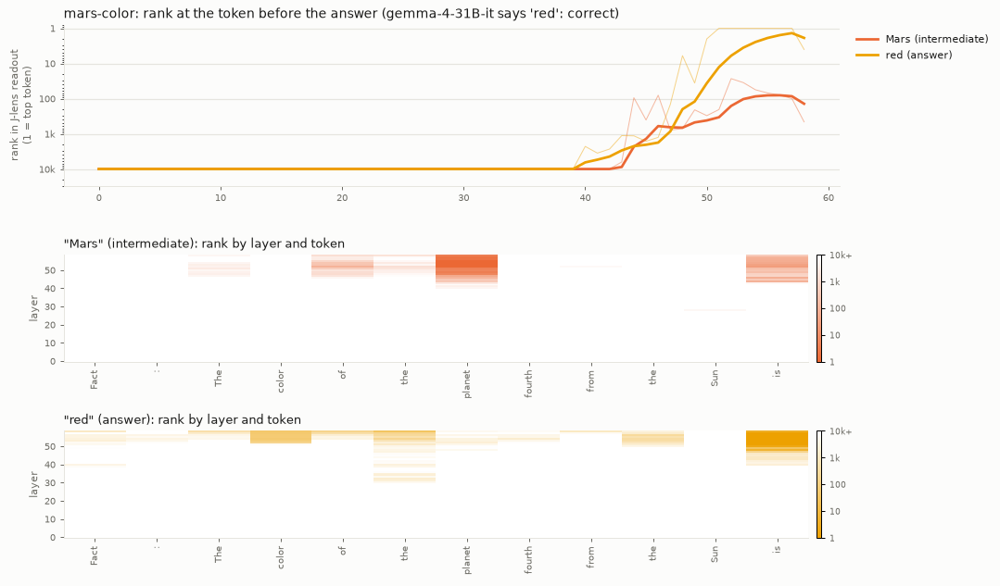

Fact: The color of the planet fourth from the Sun is

**Answer:** **red** · **Hidden trajectory:** Mars → red

**gemma-4-31B-it:** ✅ top 5: `red`, `reddish`, `similar`, `the`, `called`
---

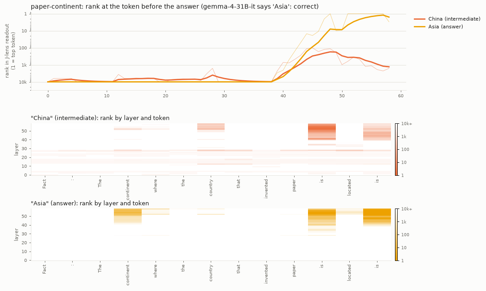

Fact: The continent where the country that invented paper is located is

**Answer:** **Asia** · **Hidden trajectory:** China → Asia

**gemma-4-31B-it:** ✅ top 5: `Asia`, `the`, `located`, `also`, `**`
---

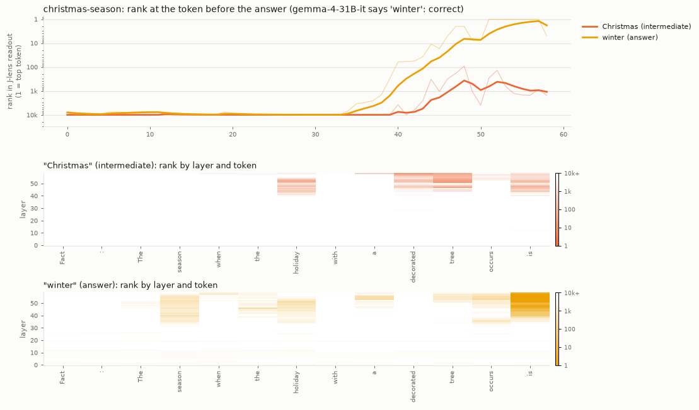

Fact: The season when the holiday with a decorated tree occurs is

**Answer:** **winter** · **Hidden trajectory:** Christmas → winter

**gemma-4-31B-it:** ✅ top 5: `winter`, `**`, `Winter`, `the`, `*`
---

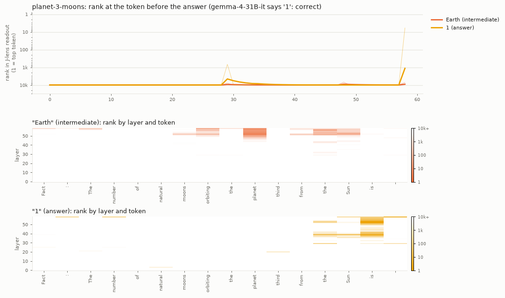

Fact: The number of natural moons orbiting the planet third from the Sun is

**Answer:** **1** · **Hidden trajectory:** Earth → 1

**gemma-4-31B-it:** ✅ top 5: `1`, `5`, `<b>`, `2`, `0`
---

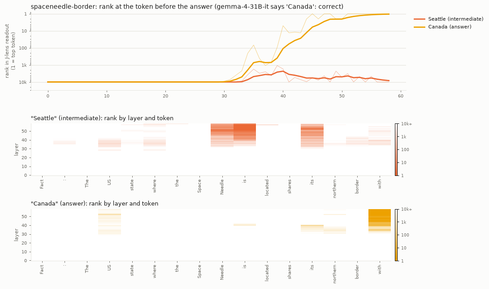

Fact: The US state where the Space Needle is located shares its northern border with

**Answer:** **Canada** · **Hidden trajectory:** Seattle → Canada

**gemma-4-31B-it:** ✅ top 5: `Canada`, `British`, `**`, `the`, `neighboring`
---

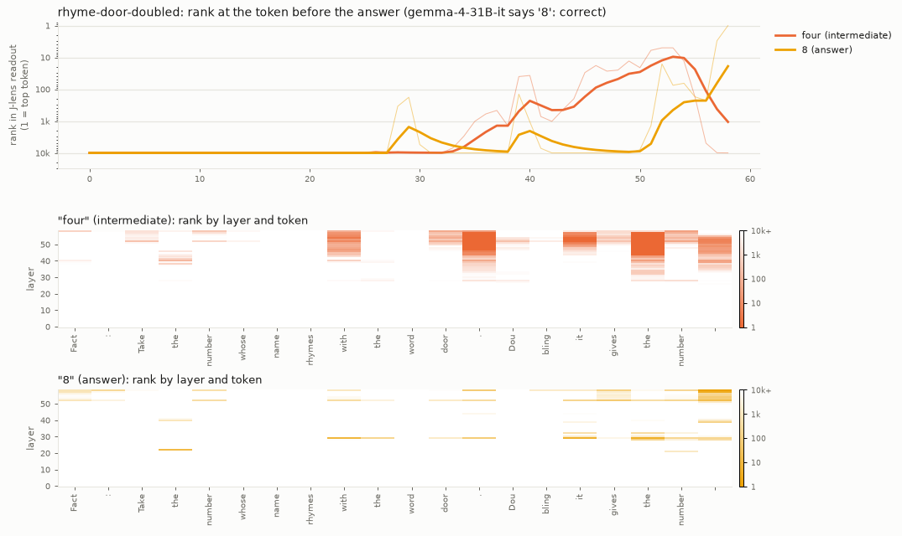

Fact: Take the number whose name rhymes with the word door. Doubling it gives the number

**Answer:** **8** · **Hidden trajectory:** four → 8

**gemma-4-31B-it:** ✅ top 5: `8`, `1`, `4`, `2`, `6`
---

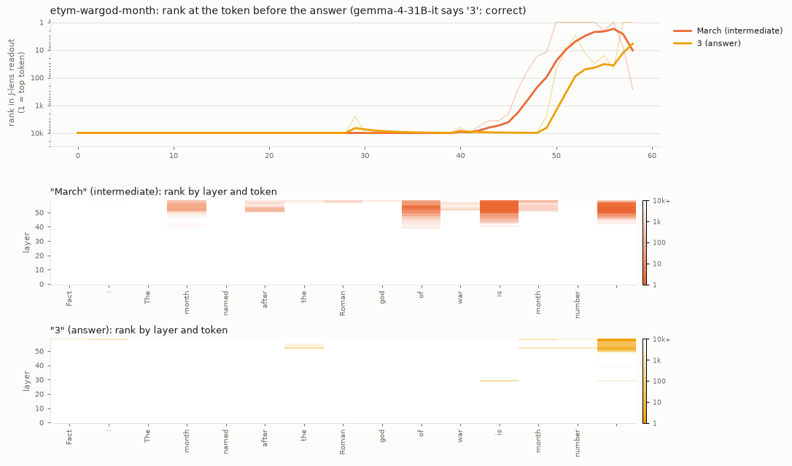

Fact: The month named after the Roman god of war is month number

**Answer:** **3** · **Hidden trajectory:** March → 3

**gemma-4-31B-it:** ✅ top 5: `3`, `4`, `2`, `6`, `0`
---

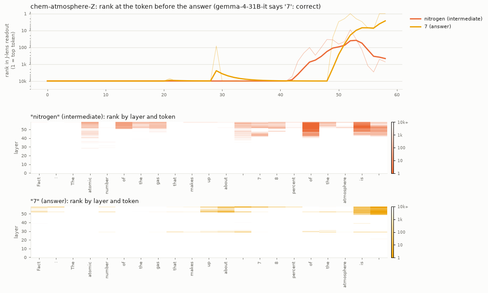

Fact: The atomic number of the gas that makes up about 78 percent of the atmosphere is

**Answer:** **7** · **Hidden trajectory:** nitrogen → 7

**gemma-4-31B-it:** ✅ top 5: `7`, `2`, `6`, `8`, `0`
---

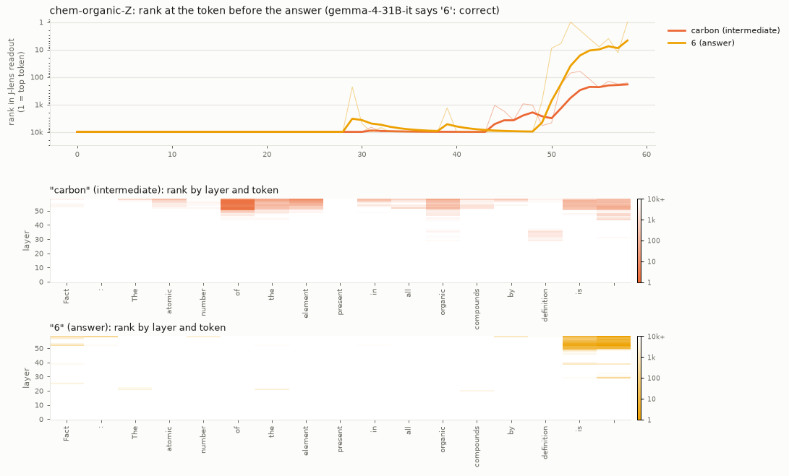

Fact: The atomic number of the element present in all organic compounds by definition is

**Answer:** **6** · **Hidden trajectory:** carbon → 6

**gemma-4-31B-it:** ✅ top 5: `6`, `0`, `3`, `1`, `2`
---

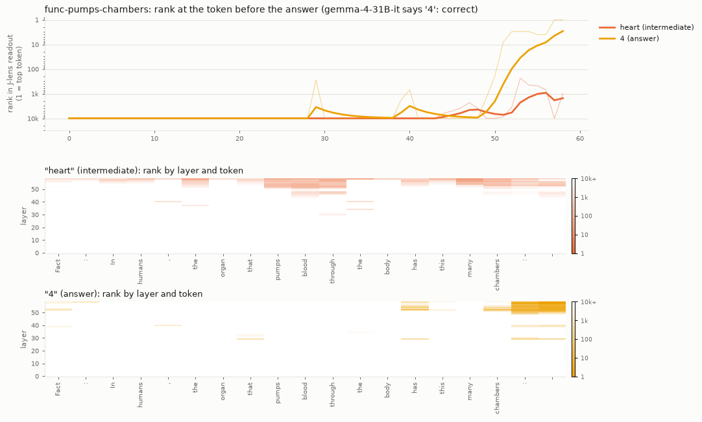

Fact: In humans, the organ that pumps blood through the body has this many chambers:

**Answer:** **4** · **Hidden trajectory:** heart → 4

**gemma-4-31B-it:** ✅ top 5: `4`, ``, ``, `2`, `0`
---

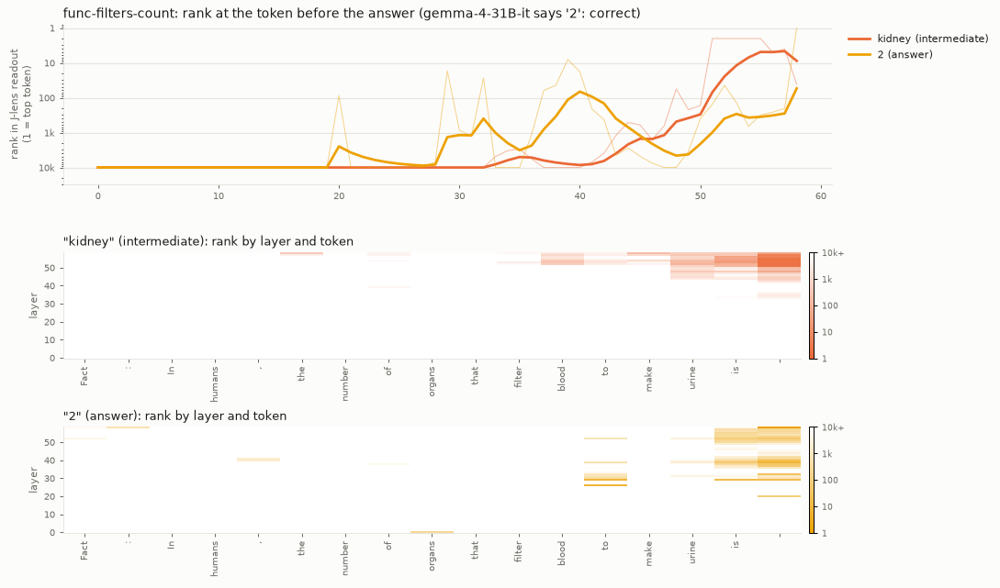

Fact: In humans, the number of organs that filter blood to make urine is

**Answer:** **2** · **Hidden trajectory:** kidney → 2

**gemma-4-31B-it:** ✅ top 5: `2`, `0`, `1`, `3`, ``
---

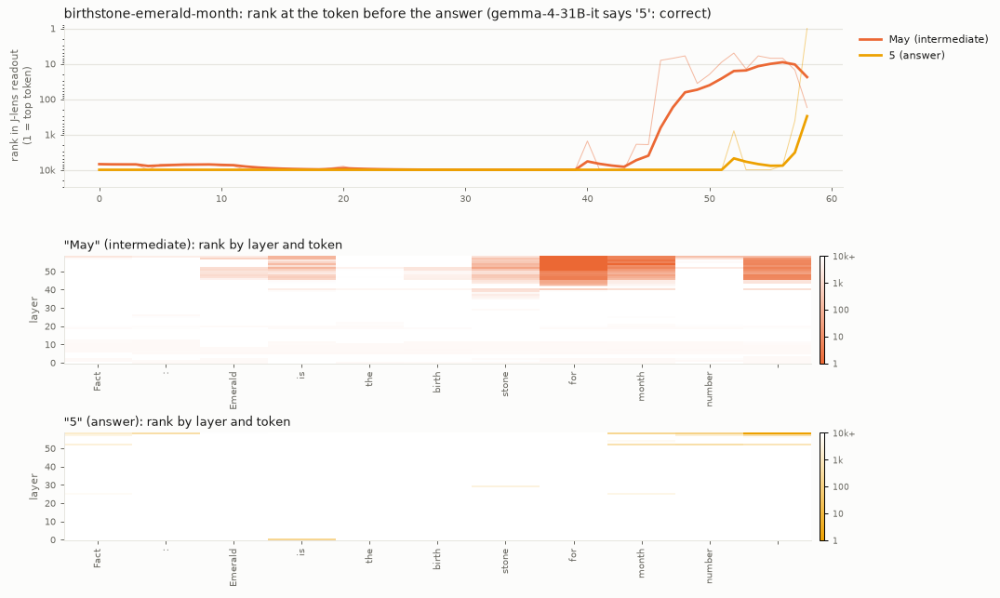

Fact: Emerald is the birthstone for month number

**Answer:** **5** · **Hidden trajectory:** May → 5

**gemma-4-31B-it:** ✅ top 5: `5`, `1`, `2`, `3`, `4`
---

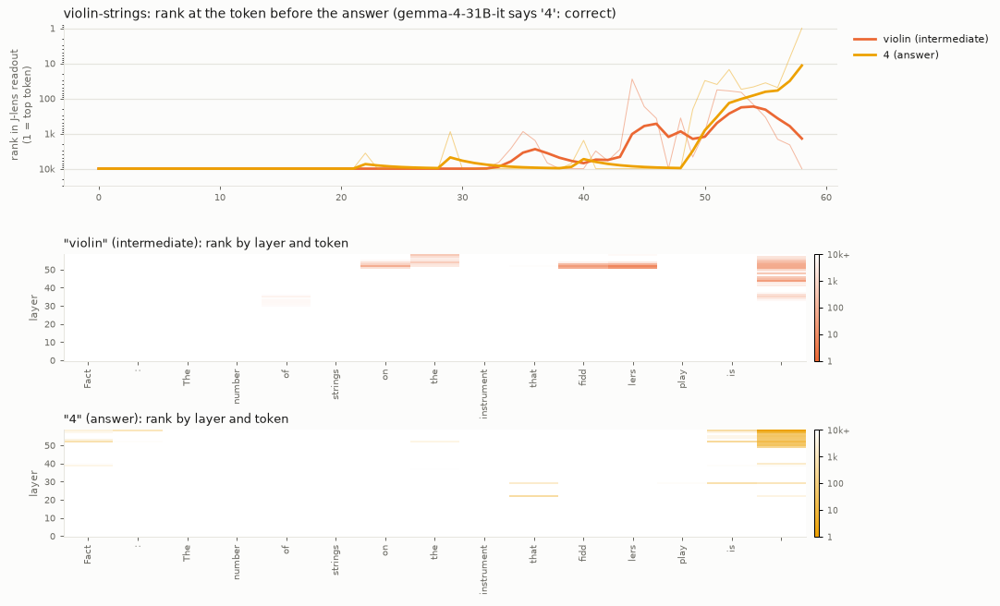

Fact: The number of strings on the instrument that fiddlers play is

**Answer:** **4** · **Hidden trajectory:** violin → 4

**gemma-4-31B-it:** ✅ top 5: `4`, `2`, `6`, `�`, `5`
---

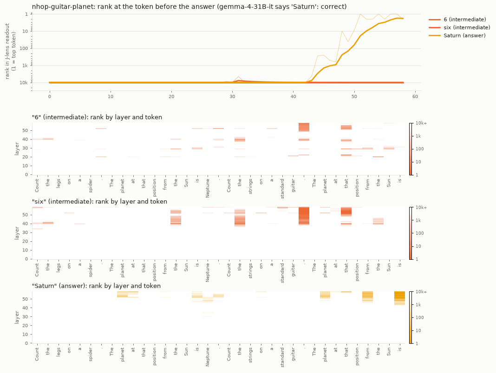

Count the legs on a spider. The planet at that position from the Sun is Neptune. Count the strings on a standard guitar. The planet at that position from the Sun is

**Answer:** **Saturn** · **Hidden trajectory:** 6 → six → Saturn

**gemma-4-31B-it:** ✅ top 5: `Saturn`, `own`, `Uranus`, `Neptune`, `Pluto`
---

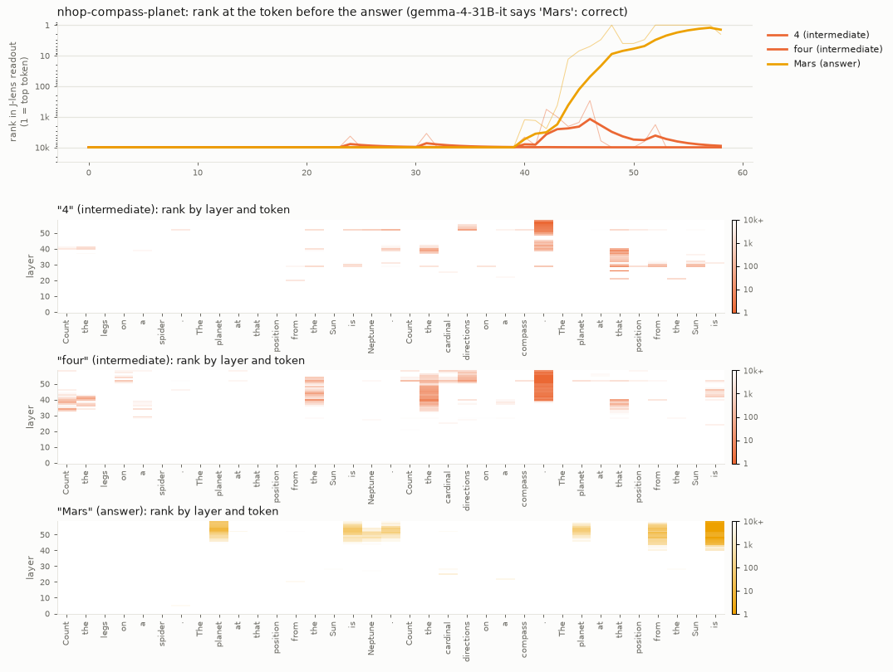

Count the legs on a spider. The planet at that position from the Sun is Neptune. Count the cardinal directions on a compass. The planet at that position from the Sun is

**Answer:** **Mars** · **Hidden trajectory:** 4 → four → Mars

**gemma-4-31B-it:** ✅ top 5: `Mars`, `own`, `Uranus`, `Venus`, `Neptune`
---

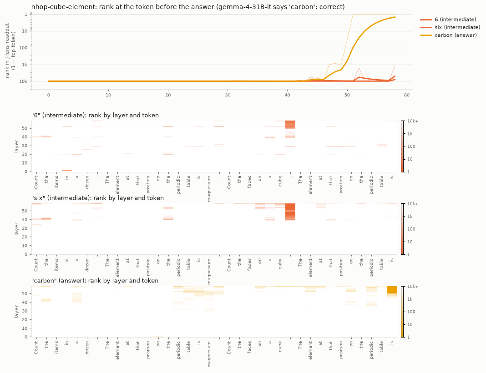

Count the items in a dozen. The element at that position on the periodic table is magnesium. Count the faces on a cube. The element at that position on the periodic table is

**Answer:** **carbon** · **Hidden trajectory:** 6 → six → carbon

**gemma-4-31B-it:** ✅ top 5: `carbon`, `own`, `carbono`, `carbone`, `الكربون`
---

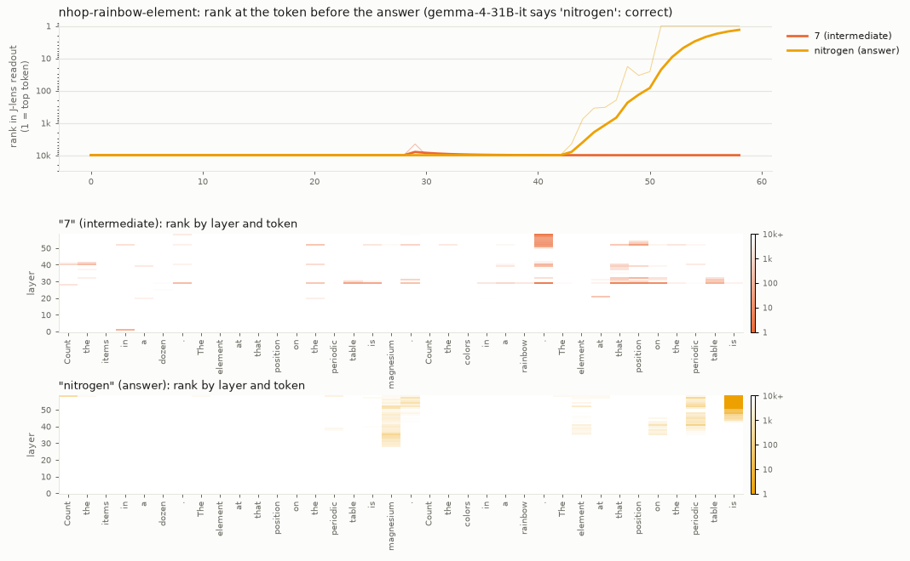

Count the items in a dozen. The element at that position on the periodic table is magnesium. Count the colors in a rainbow. The element at that position on the periodic table is

**Answer:** **nitrogen** · **Hidden trajectory:** 7 → nitrogen

**gemma-4-31B-it:** ✅ top 5: `nitrogen`, `Nitrogen`, `nitrog`, `own`, `nitro`
---

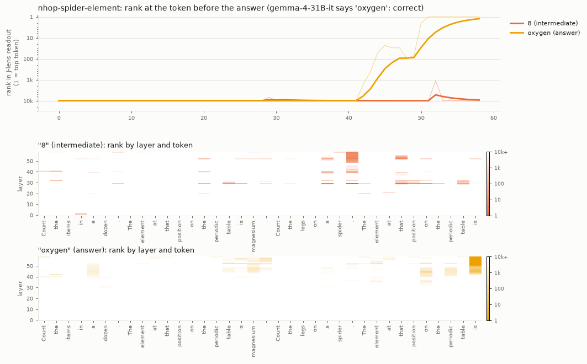

Count the items in a dozen. The element at that position on the periodic table is magnesium. Count the legs on a spider. The element at that position on the periodic table is

**Answer:** **oxygen** · **Hidden trajectory:** 8 → oxygen

**gemma-4-31B-it:** ✅ top 5: `oxygen`, `own`, `’`, `oxígeno`, `and`
---

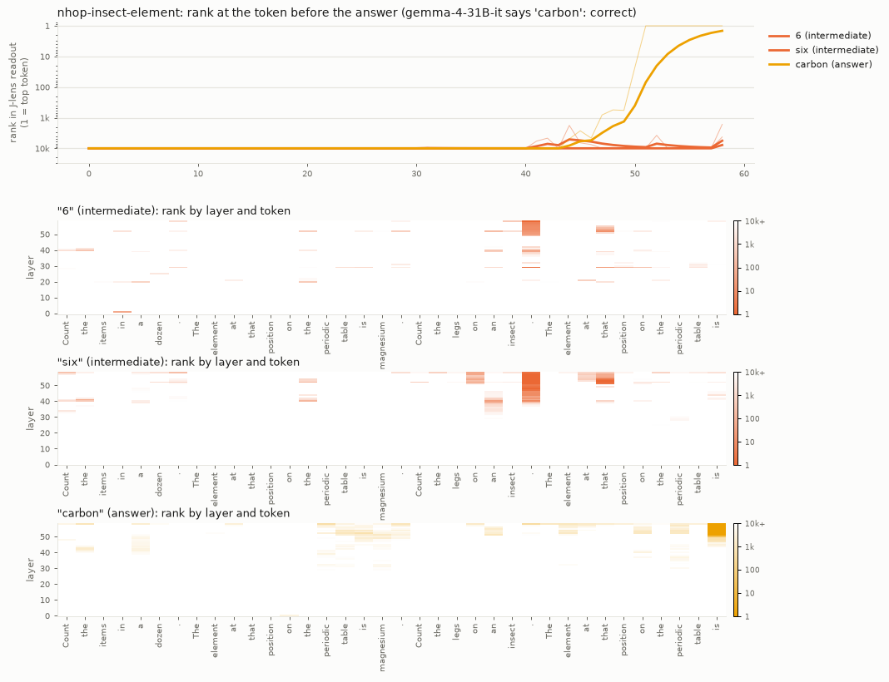

Count the items in a dozen. The element at that position on the periodic table is magnesium. Count the legs on an insect. The element at that position on the periodic table is

**Answer:** **carbon** · **Hidden trajectory:** 6 → six → carbon

**gemma-4-31B-it:** ✅ top 5: `carbon`, `own`, `carbono`, `carbone`, `karbon`
---

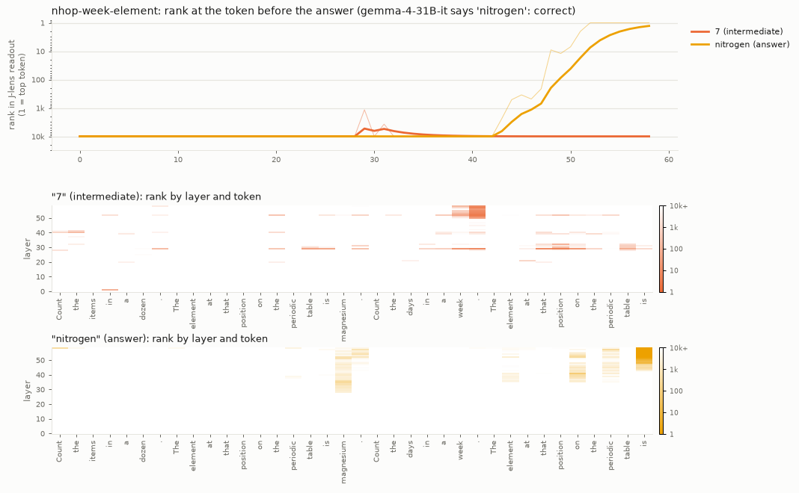

Count the items in a dozen. The element at that position on the periodic table is magnesium. Count the days in a week. The element at that position on the periodic table is

**Answer:** **nitrogen** · **Hidden trajectory:** 7 → nitrogen

**gemma-4-31B-it:** ✅ top 5: `nitrogen`, `nitrog`, `Nitrogen`, `own`, `nitro`
---

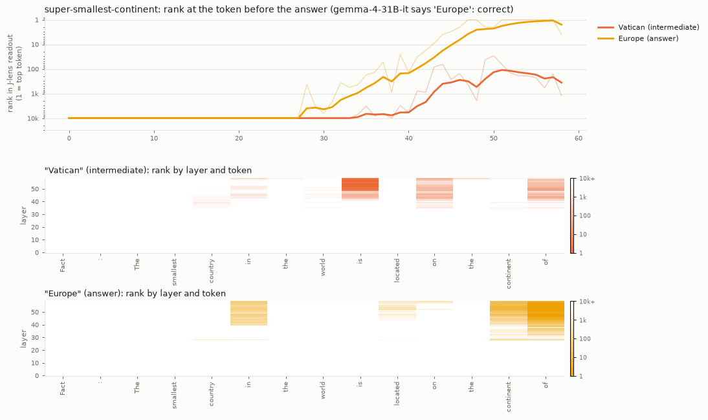

Fact: The smallest country in the world is located on the continent of

**Answer:** **Europe** · **Hidden trajectory:** Vatican → Europe

**gemma-4-31B-it:** ✅ top 5: `Europe`, `Asia`, `Africa`, `**`, `Antarctica`
---

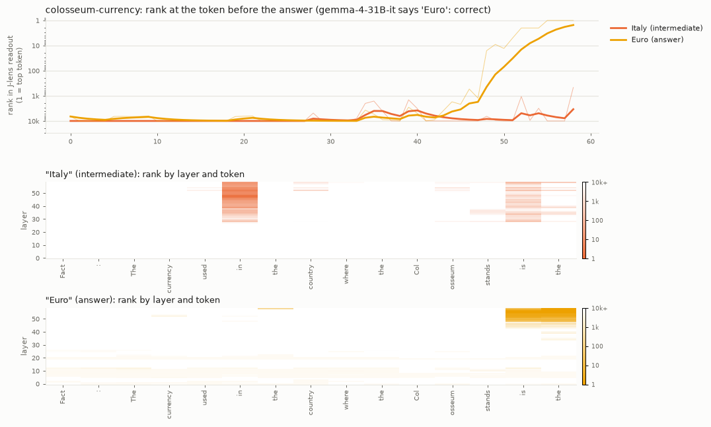

Fact: The currency used in the country where the Colosseum stands is the

**Answer:** **Euro** · **Hidden trajectory:** Italy → Euro

**gemma-4-31B-it:** ✅ top 5: `Euro`, `**`, `euro`, `own`, `same`
---

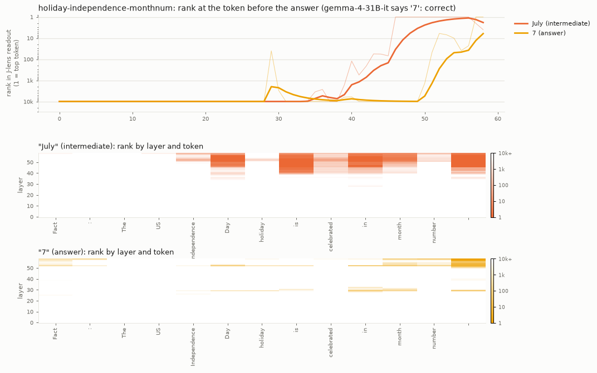

Fact: The US Independence Day holiday is celebrated in month number

**Answer:** **7** · **Hidden trajectory:** July → 7

**gemma-4-31B-it:** ✅ top 5: `7`, `0`, `6`, `4`, `2`
---

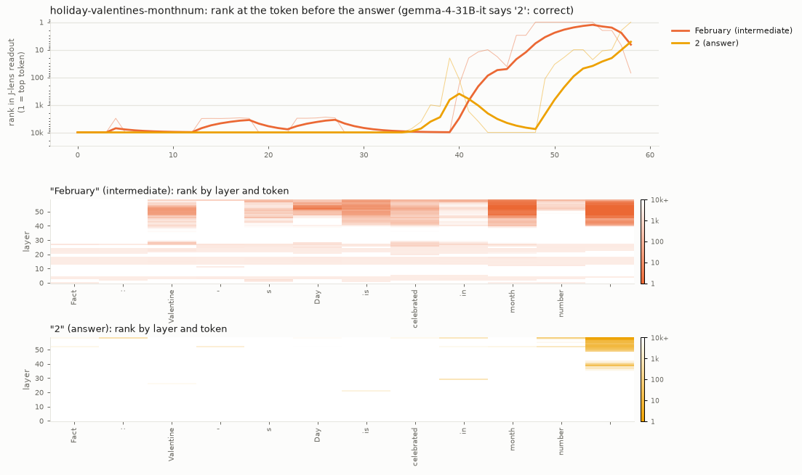

Fact: Valentine's Day is celebrated in month number

**Answer:** **2** · **Hidden trajectory:** February → 2

**gemma-4-31B-it:** ✅ top 5: `2`, `0`, `3`, `1`, `4`
---

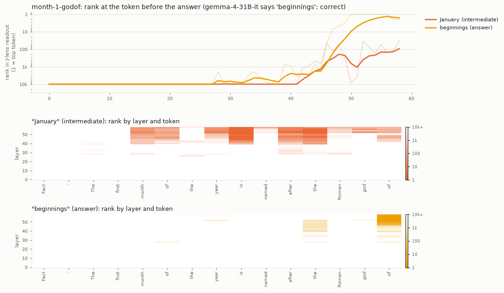

Fact: The first month of the year is named after the Roman god of

**Answer:** **beginnings** · **Hidden trajectory:** January → beginnings

**gemma-4-31B-it:** ✅ top 5: `beginnings`, `own`, `new`, `doorways`, `doors`
---

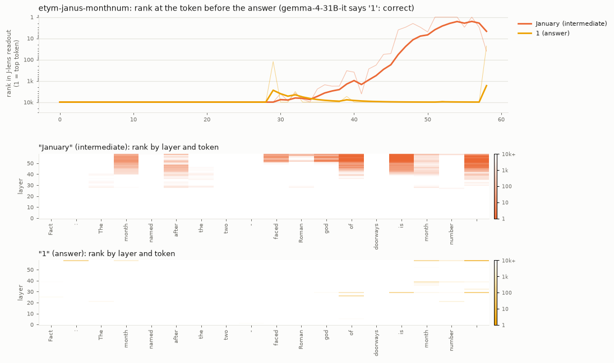

Fact: The month named after the two-faced Roman god of doorways is month number

**Answer:** **1** · **Hidden trajectory:** January → 1

**gemma-4-31B-it:** ✅ top 5: `1`, `2`, `6`, `3`, `4`
---

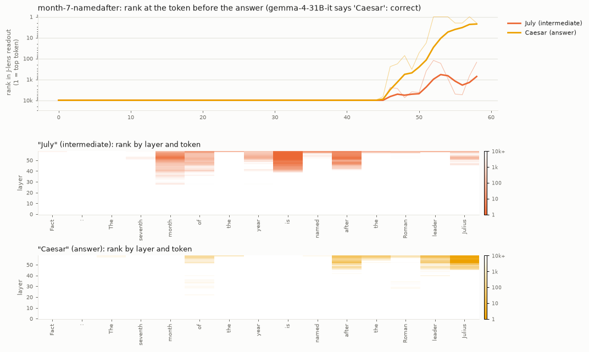

Fact: The seventh month of the year is named after the Roman leader Julius

**Answer:** **Caesar** · **Hidden trajectory:** July → Caesar

**gemma-4-31B-it:** ✅ top 5: `Caesar`, `own`, `Caesars`, `caesar`, `’`
---

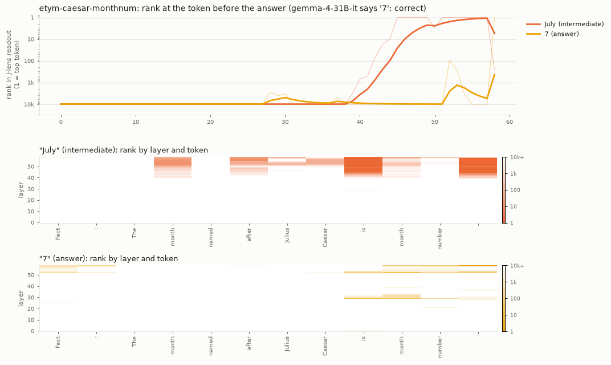

Fact: The month named after Julius Caesar is month number

**Answer:** **7** · **Hidden trajectory:** July → 7

**gemma-4-31B-it:** ✅ top 5: `7`, `2`, `4`, `3`, `6`
---

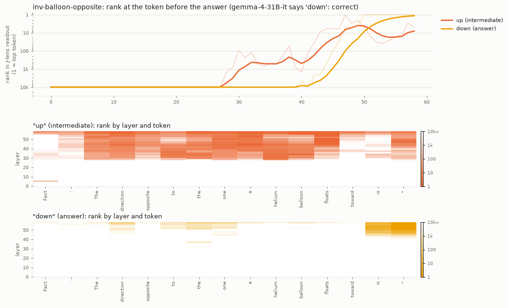

Fact: The direction opposite to the one a helium balloon floats toward is "

**Answer:** **down** · **Hidden trajectory:** up → down

**gemma-4-31B-it:** ✅ top 5: `down`, `Down`, `up`, `DOWN`, `bottom`
---

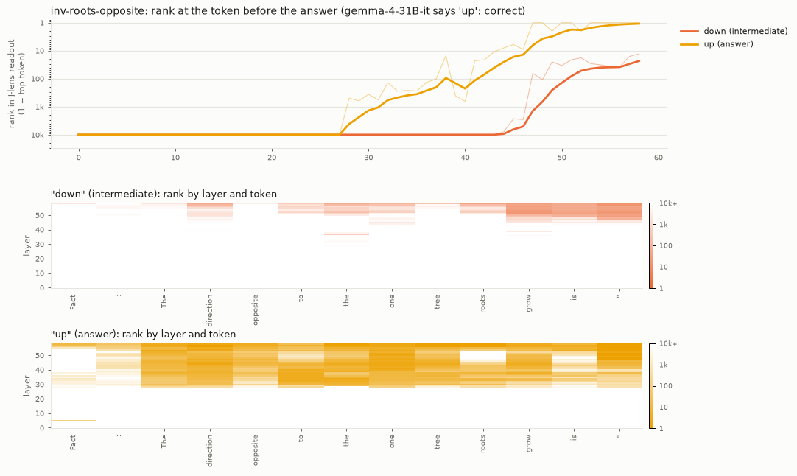

Fact: The direction opposite to the one tree roots grow is "

**Answer:** **up** · **Hidden trajectory:** down → up

**gemma-4-31B-it:** ✅ top 5: `up`, `Up`, `down`, `UP`, `above`
---

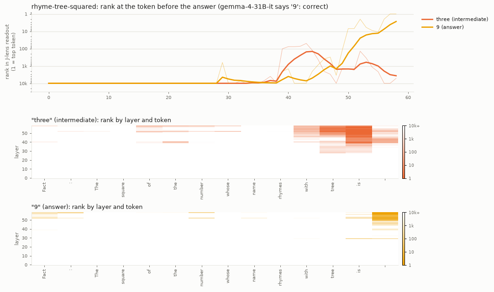

Fact: The square of the number whose name rhymes with tree is

**Answer:** **9** · **Hidden trajectory:** three → 9

**gemma-4-31B-it:** ✅ top 5: `9`, `3`, `2`, `4`, `0`
---

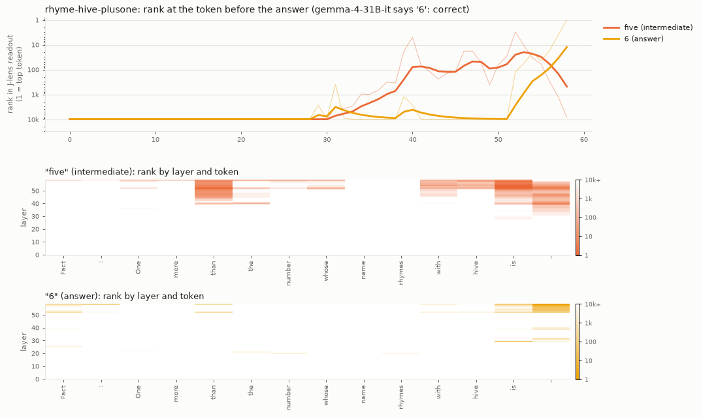

Fact: One more than the number whose name rhymes with hive is

**Answer:** **6** · **Hidden trajectory:** five → 6

**gemma-4-31B-it:** ✅ top 5: `6`, ``, `5`, `<u>`, `4`
---

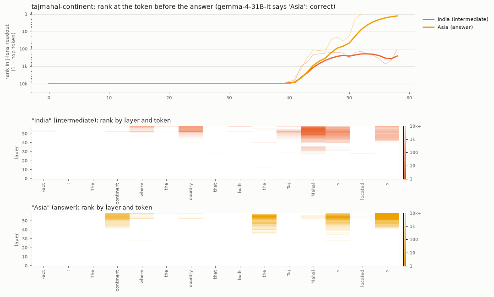

Fact: The continent where the country that built the Taj Mahal is located is

**Answer:** **Asia** · **Hidden trajectory:** India → Asia

**gemma-4-31B-it:** ✅ top 5: `Asia`, `located`, `the`, `**`, `...`
---

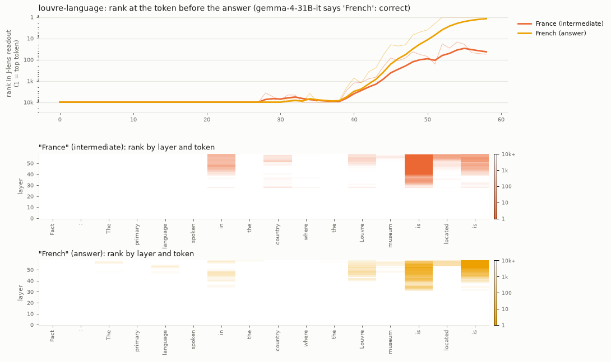

Fact: The primary language spoken in the country where the Louvre museum is located is

**Answer:** **French** · **Hidden trajectory:** France → French

**gemma-4-31B-it:** ✅ top 5: `French`, `**`, `own`, `the`, `official`
---

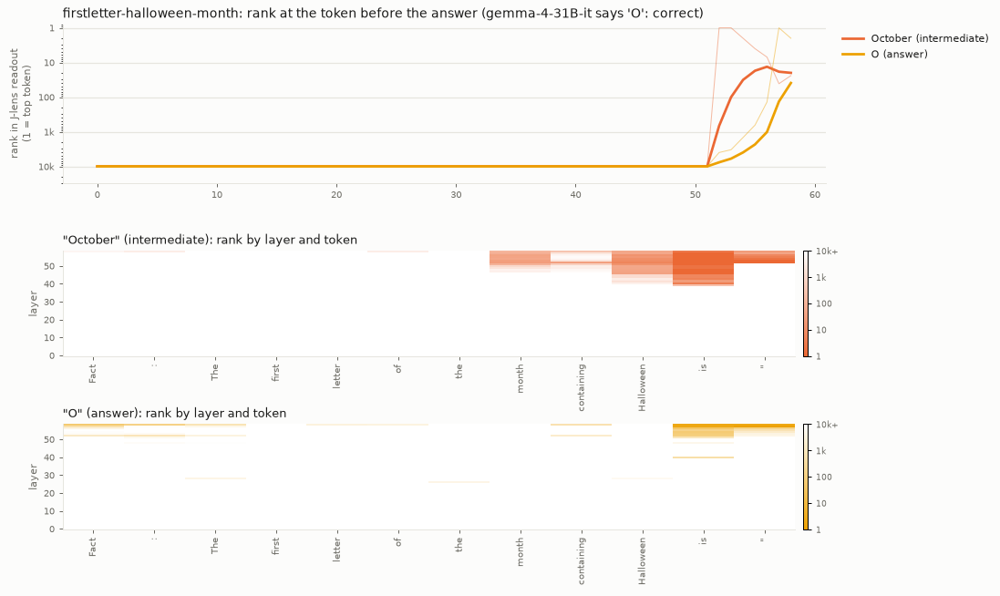

Fact: The first letter of the month containing Halloween is "

**Answer:** **O** · **Hidden trajectory:** October → O

**gemma-4-31B-it:** ✅ top 5: `O`, `o`, `S`, `C`, `T`
---

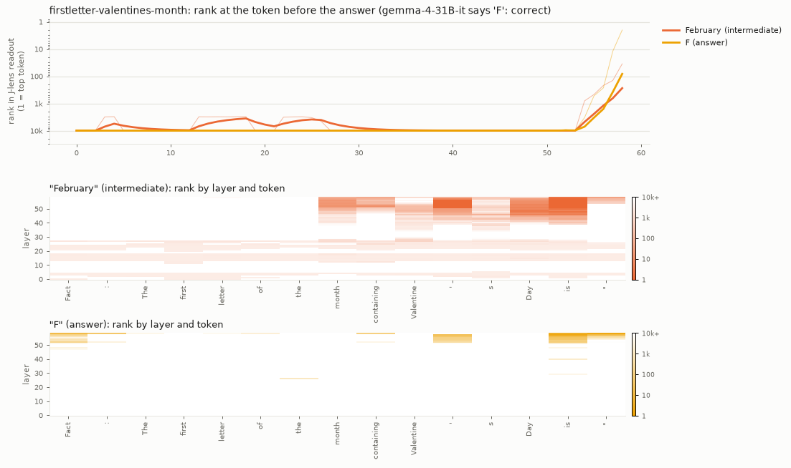

Fact: The first letter of the month containing Valentine's Day is "

**Answer:** **F** · **Hidden trajectory:** February → F

**gemma-4-31B-it:** ✅ top 5: `F`, `V`, `f`, `//`, `F`
---

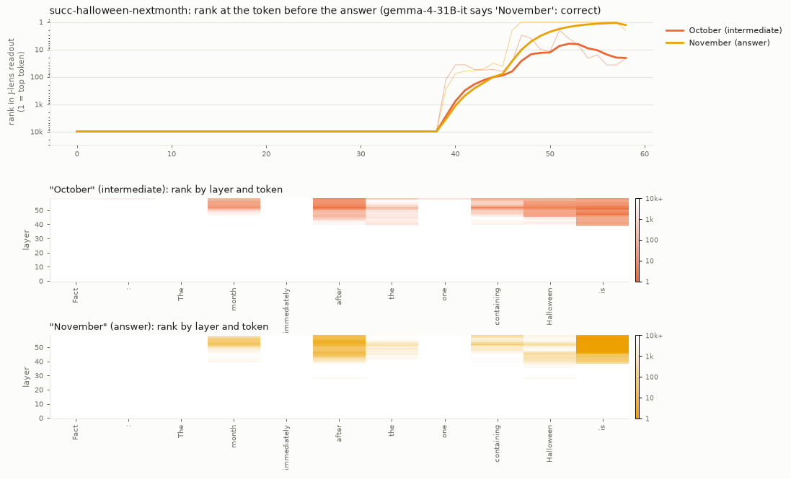

Fact: The month immediately after the one containing Halloween is

**Answer:** **November** · **Hidden trajectory:** October → November

**gemma-4-31B-it:** ✅ top 5: `November`, `**`, `the`, `...`, `October`
---

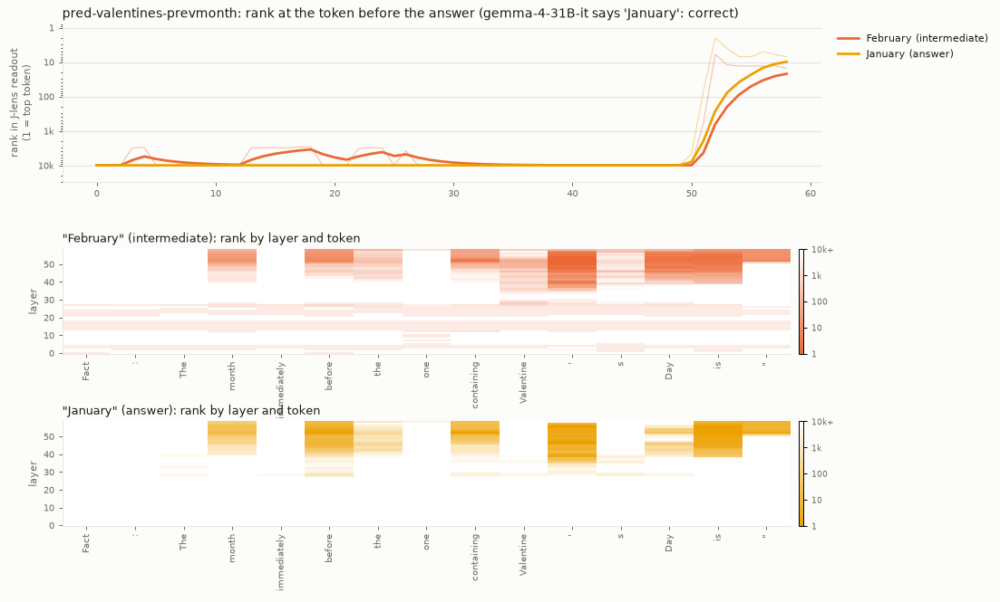

Fact: The month immediately before the one containing Valentine's Day is "

**Answer:** **January** · **Hidden trajectory:** February → January

**gemma-4-31B-it:** ✅ top 5: `January`, `February`, `JAN`, `la`, `**.`
---

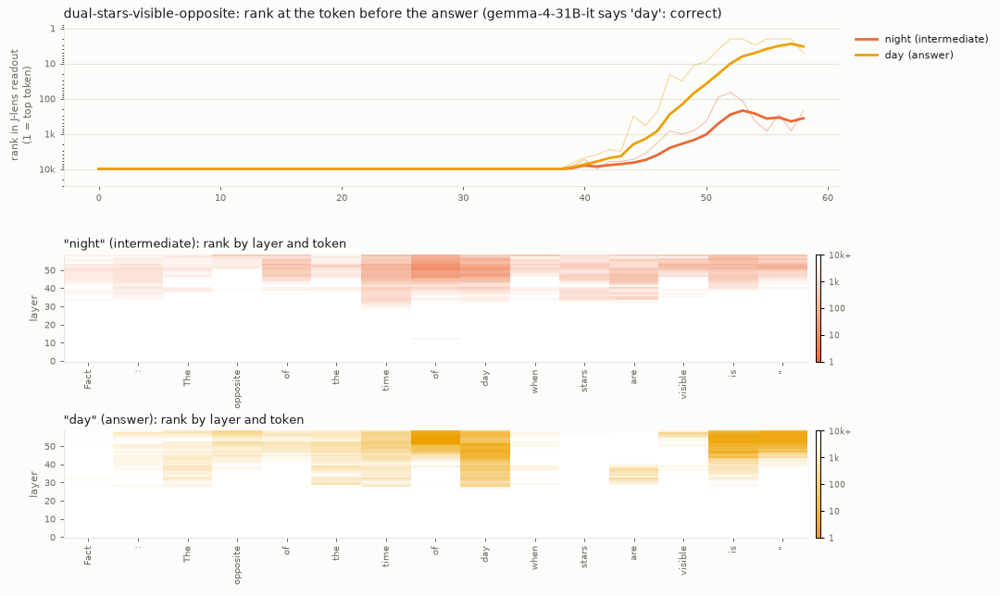

Fact: The opposite of the time of day when stars are visible is "

**Answer:** **day** · **Hidden trajectory:** night → day

**gemma-4-31B-it:** ✅ top 5: `day`, `Day`, `the`, `daytime`, `dawn`
---

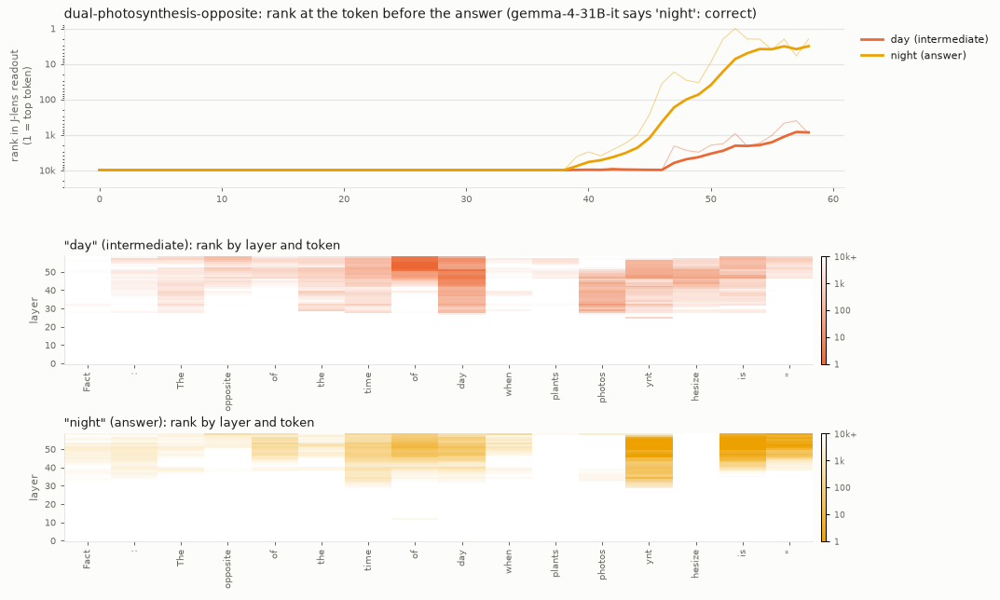

Fact: The opposite of the time of day when plants photosynthesize is "

**Answer:** **night** · **Hidden trajectory:** day → night

**gemma-4-31B-it:** ✅ top 5: `night`, `Night`, `the`, `at`, `midnight`
---

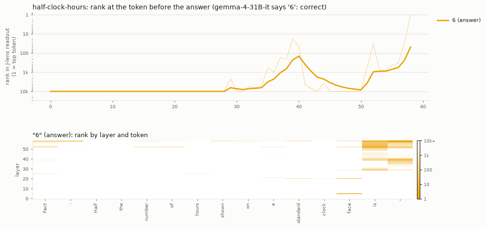

Fact: Half the number of hours shown on a standard clock face is

**Answer:** **6** · **Hidden trajectory:** 12 → 6

**gemma-4-31B-it:** ✅ top 5: `6`, `1`, `3`, `7`, `2`
---

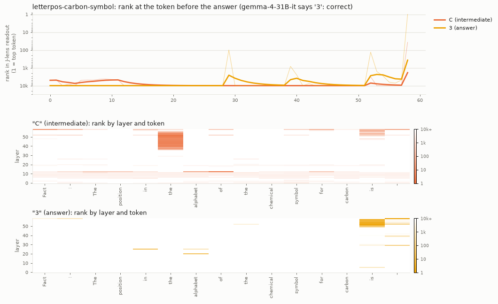

Fact: The position in the alphabet of the chemical symbol for carbon is

**Answer:** **3** · **Hidden trajectory:** C → 3

**gemma-4-31B-it:** ✅ top 5: `3`, `1`, `2`, `5`, `4`
---

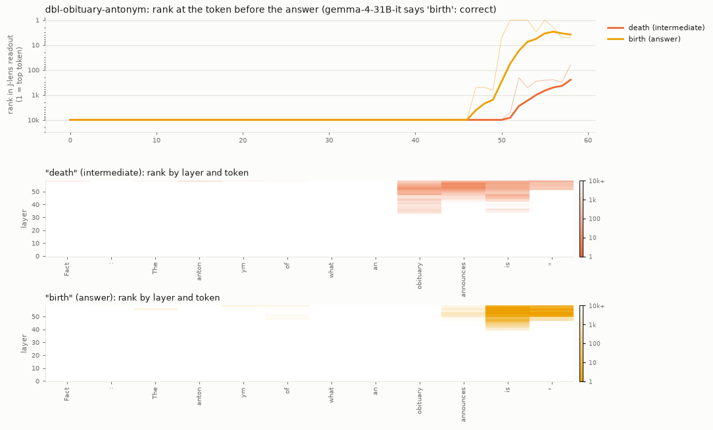

Fact: The antonym of what an obituary announces is "

**Answer:** **birth** · **Hidden trajectory:** death → birth

**gemma-4-31B-it:** ✅ top 5: `birth`, `life`, `living`, `Birth`, `coming`
---

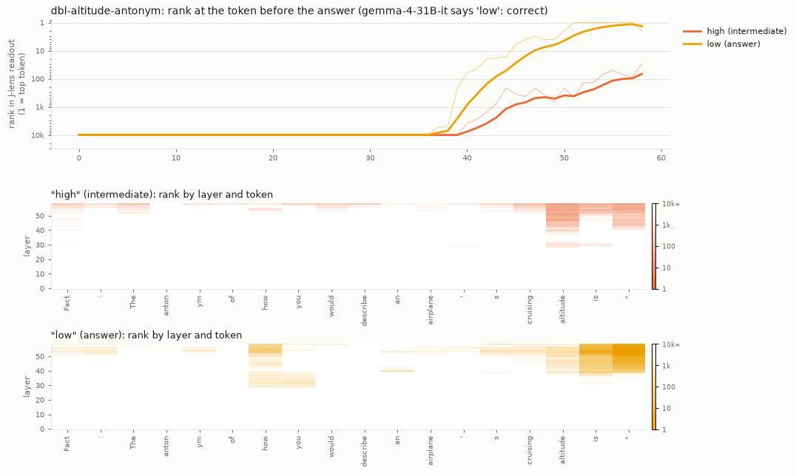

Fact: The antonym of how you would describe an airplane's cruising altitude is "

**Answer:** **low** · **Hidden trajectory:** high → low

**gemma-4-31B-it:** ✅ top 5: `low`, `Low`, `down`, `lo`, `high`

## Answered wrong (48)

---

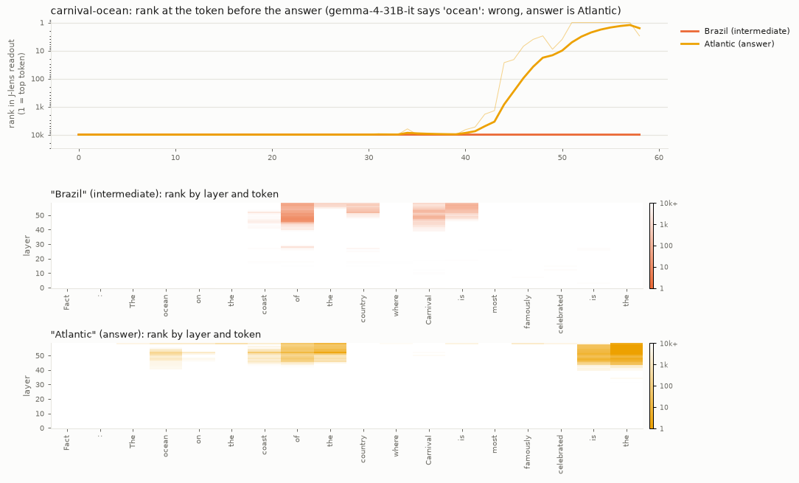

Fact: The ocean on the coast of the country where Carnival is most famously celebrated is the

**Answer:** **Atlantic** · **Hidden trajectory:** Brazil → Atlantic

**gemma-4-31B-it:** ❌ top 5: `ocean`, `Atlantic`, `atlantic`, `Atlantic`, `world`
---

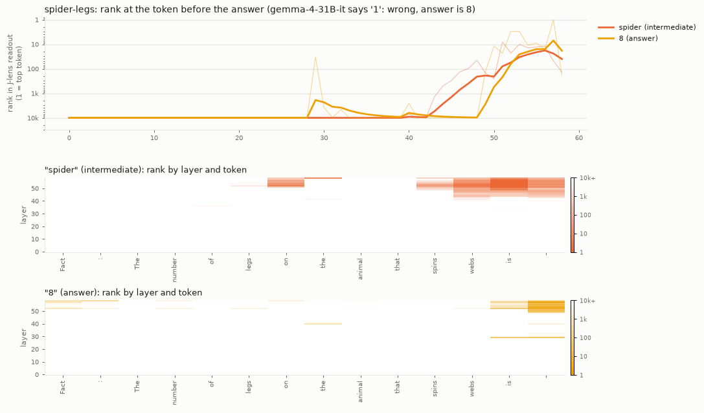

Fact: The number of legs on the animal that spins webs is

**Answer:** **8** · **Hidden trajectory:** spider → 8

**gemma-4-31B-it:** ❌ top 5: `1`, `0`, `8`, `2`, `�`
---

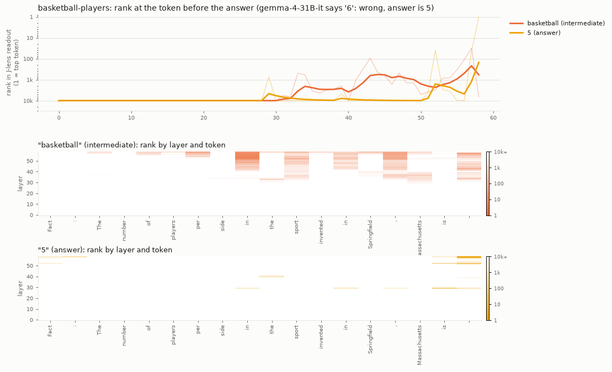

Fact: The number of players per side in the sport invented in Springfield, Massachusetts is

**Answer:** **5** · **Hidden trajectory:** basketball → 5

**gemma-4-31B-it:** ❌ top 5: `6`, `9`, `1`, `5`, `2`
---

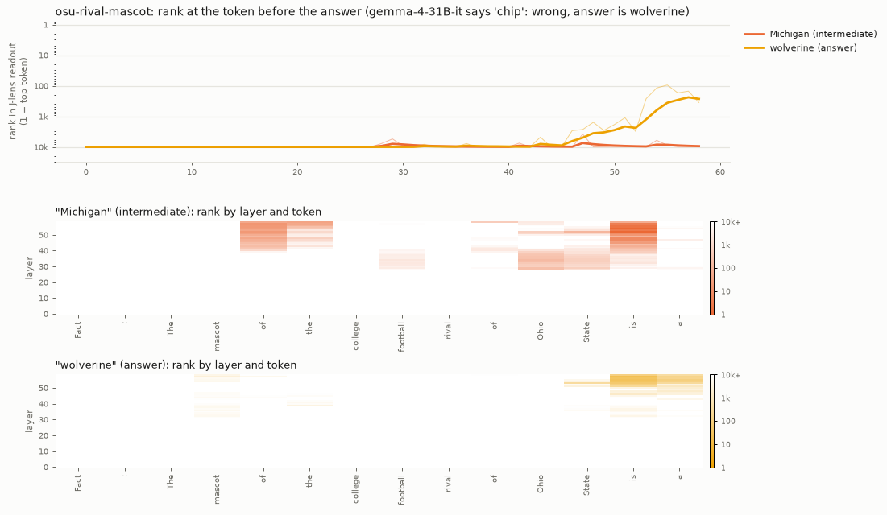

Fact: The mascot of the college football rival of Ohio State is a

**Answer:** **wolverine** · **Hidden trajectory:** Michigan → wolverine

**gemma-4-31B-it:** ❌ top 5: `chip`, `buck`, `bunny`, `bear`, `chipped`
---

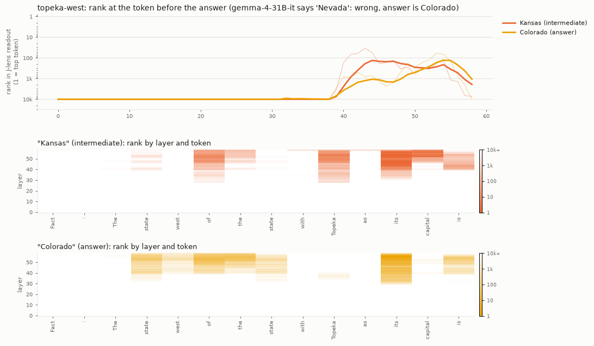

Fact: The state west of the state with Topeka as its capital is

**Answer:** **Colorado** · **Hidden trajectory:** Kansas → Colorado

**gemma-4-31B-it:** ❌ top 5: `Nevada`, `**`, `Arizona`, `either`, `actually`
---

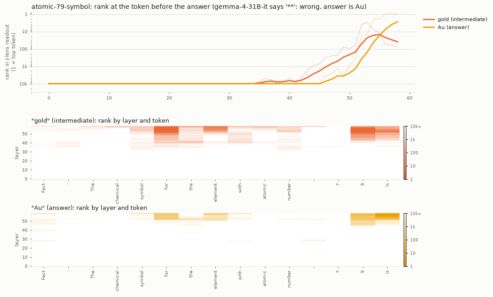

Fact: The chemical symbol for the element with atomic number 79 is

**Answer:** **Au** · **Hidden trajectory:** gold → Au

**gemma-4-31B-it:** ❌ top 5: `**`, `Au`, `"`, `'`, `$\`
---

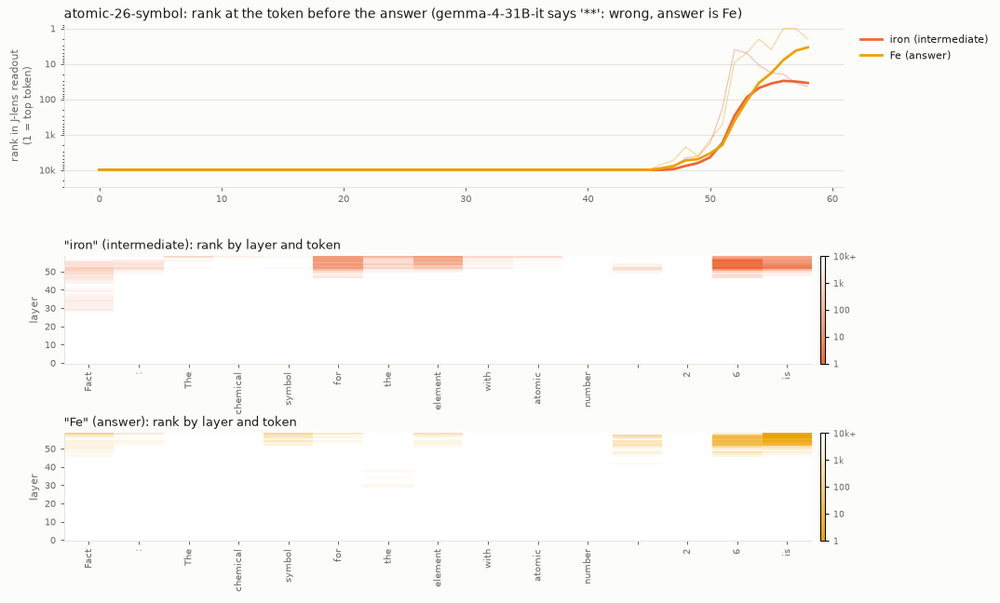

Fact: The chemical symbol for the element with atomic number 26 is

**Answer:** **Fe** · **Hidden trajectory:** iron → Fe

**gemma-4-31B-it:** ❌ top 5: `**`, `Fe`, `"`, `$\`, `'`
---

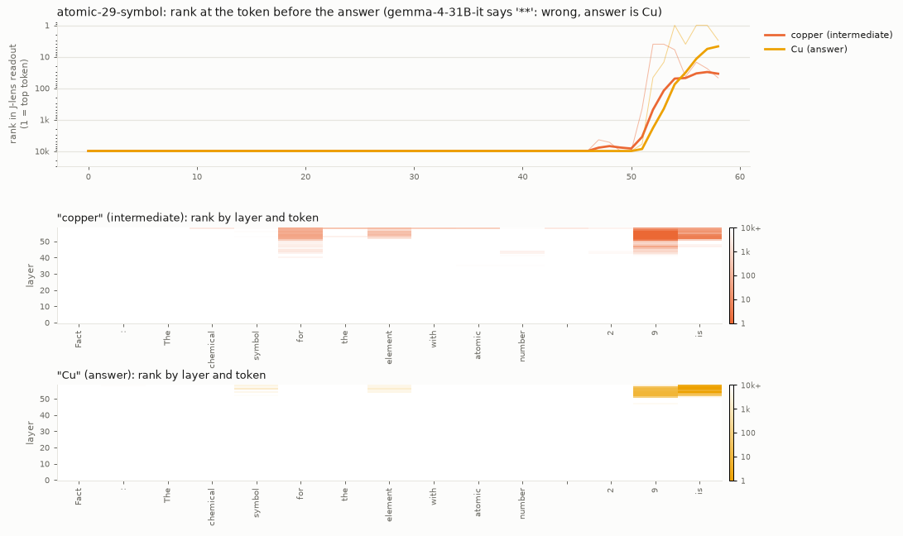

Fact: The chemical symbol for the element with atomic number 29 is

**Answer:** **Cu** · **Hidden trajectory:** copper → Cu

**gemma-4-31B-it:** ❌ top 5: `**`, `Cu`, `"`, `$\`, `"**`
---

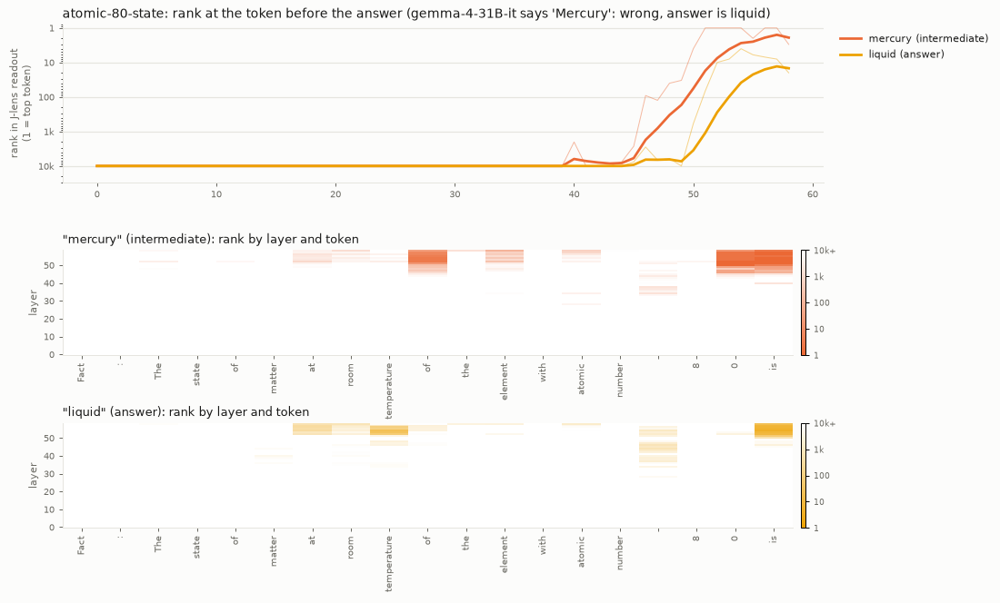

Fact: The state of matter at room temperature of the element with atomic number 80 is

**Answer:** **liquid** · **Hidden trajectory:** mercury → liquid

**gemma-4-31B-it:** ❌ top 5: `Mercury`, `mercury`, `own`, `Hg`, `**`
---

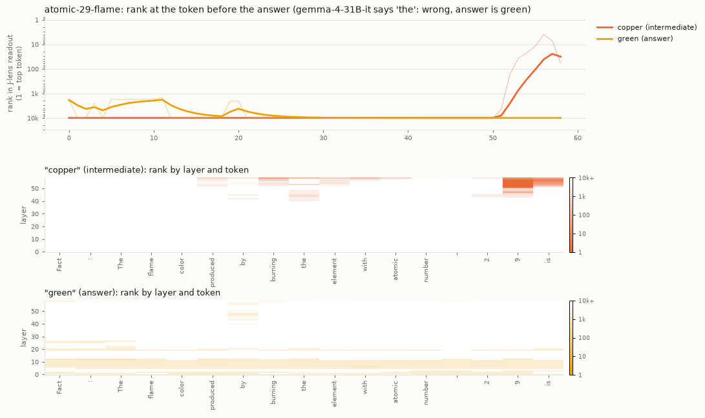

Fact: The flame color produced by burning the element with atomic number 29 is

**Answer:** **green** · **Hidden trajectory:** copper → green

**gemma-4-31B-it:** ❌ top 5: `the`, `’`, `set`, `associated`, `element`
---

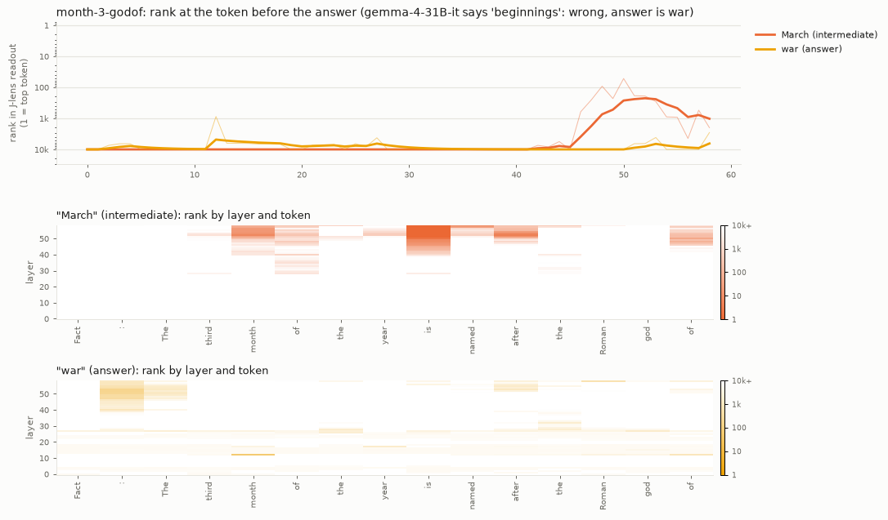

Fact: The third month of the year is named after the Roman god of

**Answer:** **war** · **Hidden trajectory:** March → war

**gemma-4-31B-it:** ❌ top 5: `beginnings`, `own`, `beginning`, `new`, `the`
---

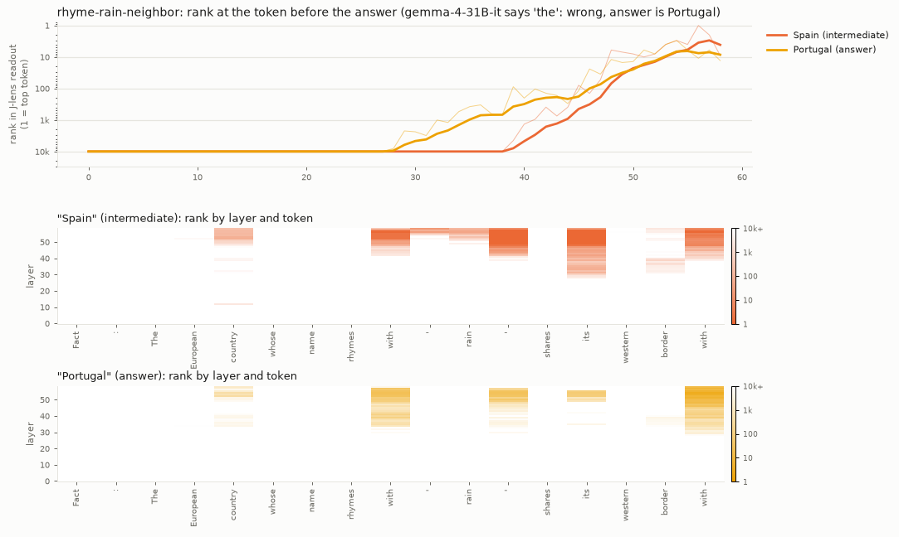

Fact: The European country whose name rhymes with 'rain' shares its western border with

**Answer:** **Portugal** · **Hidden trajectory:** Spain → Portugal

**gemma-4-31B-it:** ❌ top 5: `the`, `France`, `Spain`, `its`, `only`
---

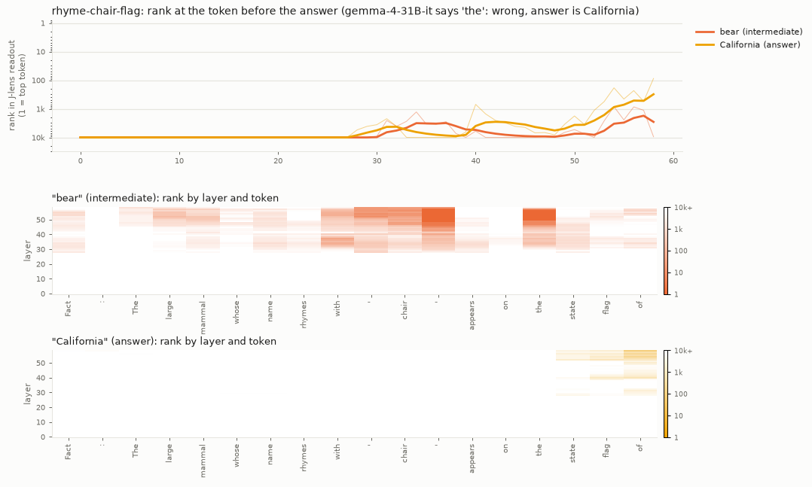

Fact: The large mammal whose name rhymes with 'chair' appears on the state flag of

**Answer:** **California** · **Hidden trajectory:** bear → California

**gemma-4-31B-it:** ❌ top 5: `the`, `own`, `Wyoming`, `Louisiana`, `Georgia`
---

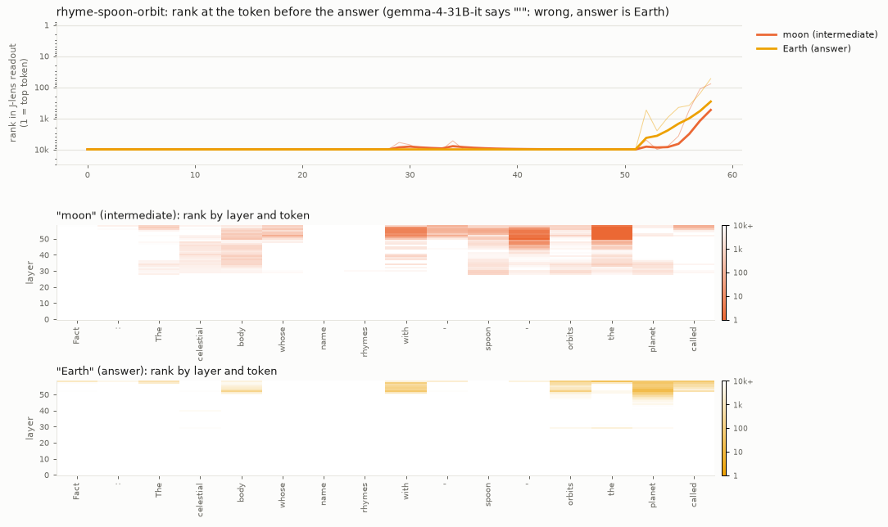

Fact: The celestial body whose name rhymes with 'spoon' orbits the planet called

**Answer:** **Earth** · **Hidden trajectory:** moon → Earth

**gemma-4-31B-it:** ❌ top 5: `'`, `the`, `Jupiter`, `called`, `own`
---

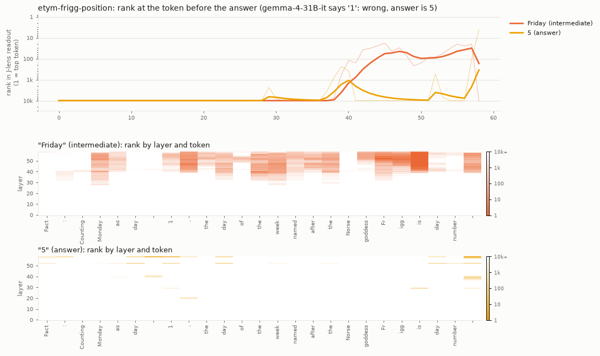

Fact: Counting Monday as day 1, the day of the week named after the Norse goddess Frigg is day number

**Answer:** **5** · **Hidden trajectory:** Friday → 5

**gemma-4-31B-it:** ❌ top 5: `1`, `3`, `6`, `4`, `2`
---

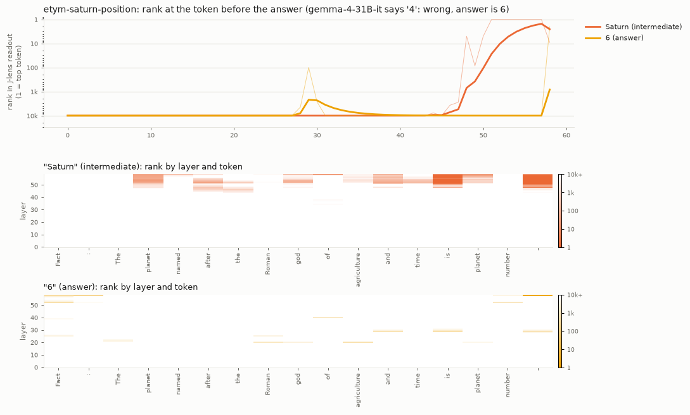

Fact: The planet named after the Roman god of agriculture and time is planet number

**Answer:** **6** · **Hidden trajectory:** Saturn → 6

**gemma-4-31B-it:** ❌ top 5: `4`, `7`, `1`, `6`, `2`
---

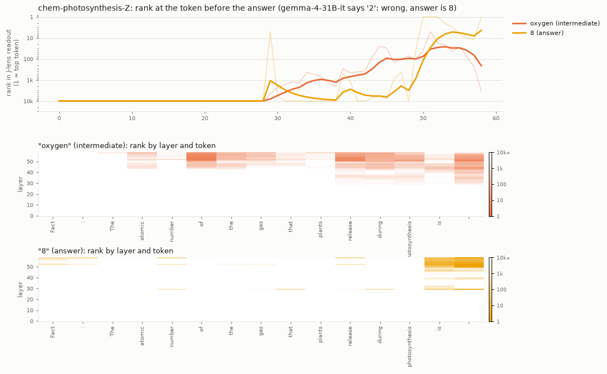

Fact: The atomic number of the gas that plants release during photosynthesis is

**Answer:** **8** · **Hidden trajectory:** oxygen → 8

**gemma-4-31B-it:** ❌ top 5: `2`, `8`, `7`, `1`, `6`
---

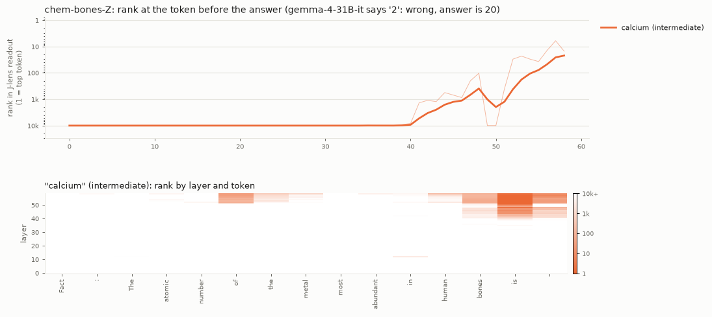

Fact: The atomic number of the metal most abundant in human bones is

**Answer:** **20** · **Hidden trajectory:** calcium → 20

**gemma-4-31B-it:** ❌ top 5: `2`, `4`, `3`, `1`, `5`
---

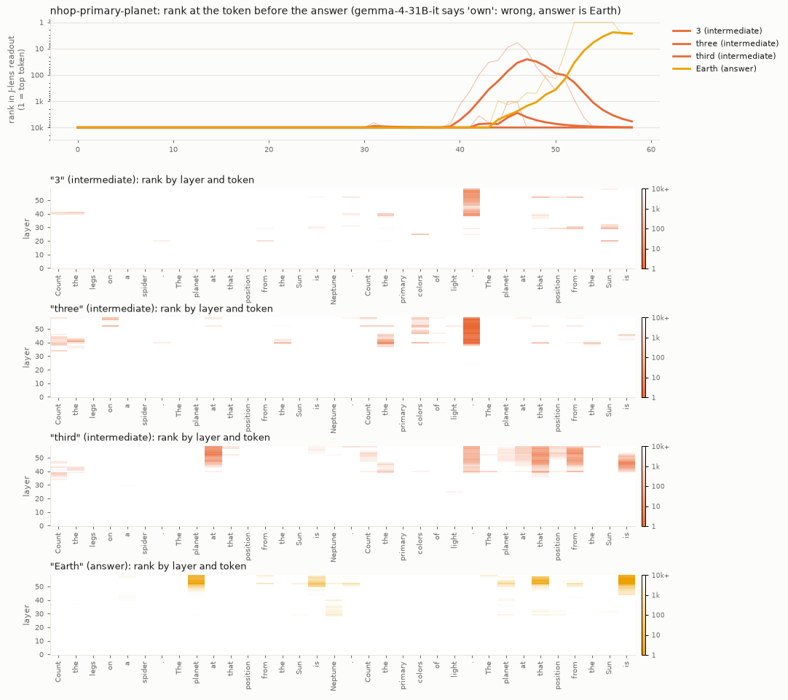

Count the legs on a spider. The planet at that position from the Sun is Neptune. Count the primary colors of light. The planet at that position from the Sun is

**Answer:** **Earth** · **Hidden trajectory:** 3 → three → third → Earth

**gemma-4-31B-it:** ❌ top 5: `own`, `Earth`, `Neptune`, `Saturn`, `Mars`
---

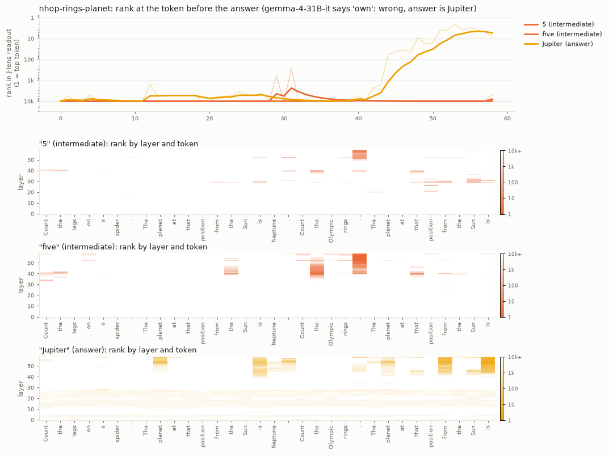

Count the legs on a spider. The planet at that position from the Sun is Neptune. Count the Olympic rings. The planet at that position from the Sun is

**Answer:** **Jupiter** · **Hidden trajectory:** 5 → five → Jupiter

**gemma-4-31B-it:** ❌ top 5: `own`, `Saturn`, `Jupiter`, `Neptune`, `Uranus`
---

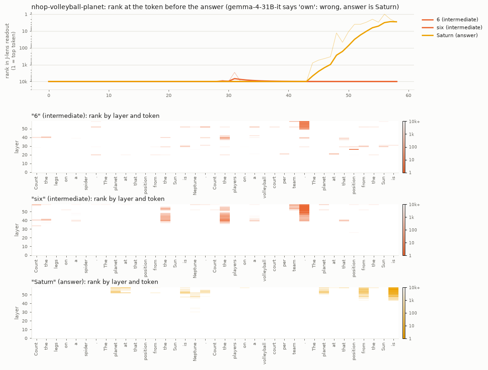

Count the legs on a spider. The planet at that position from the Sun is Neptune. Count the players on a volleyball court per team. The planet at that position from the Sun is

**Answer:** **Saturn** · **Hidden trajectory:** 6 → six → Saturn

**gemma-4-31B-it:** ❌ top 5: `own`, `Saturn`, `Uranus`, `Pluto`, `Jupiter`
---

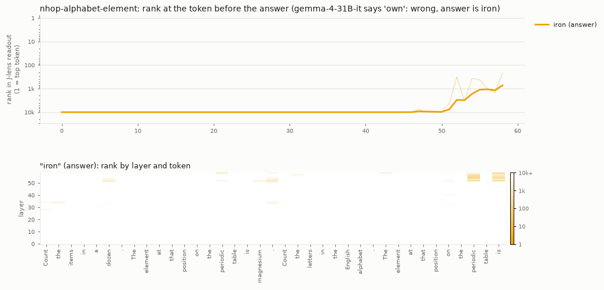

Count the items in a dozen. The element at that position on the periodic table is magnesium. Count the letters in the English alphabet. The element at that position on the periodic table is

**Answer:** **iron** · **Hidden trajectory:** 26 → iron

**gemma-4-31B-it:** ❌ top 5: `own`, `the`, `magnesium`, `neon`, `nickel`
---

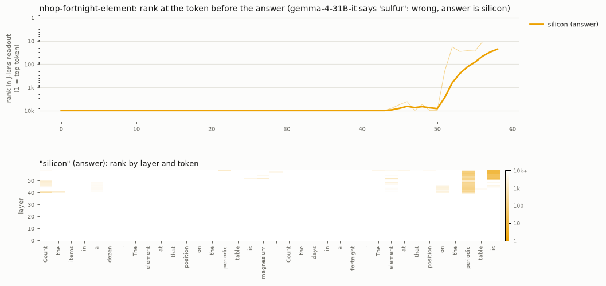

Count the items in a dozen. The element at that position on the periodic table is magnesium. Count the days in a fortnight. The element at that position on the periodic table is

**Answer:** **silicon** · **Hidden trajectory:** 14 → silicon

**gemma-4-31B-it:** ❌ top 5: `sulfur`, `selenium`, `phosphorus`, `silicon`, `sulphur`
---

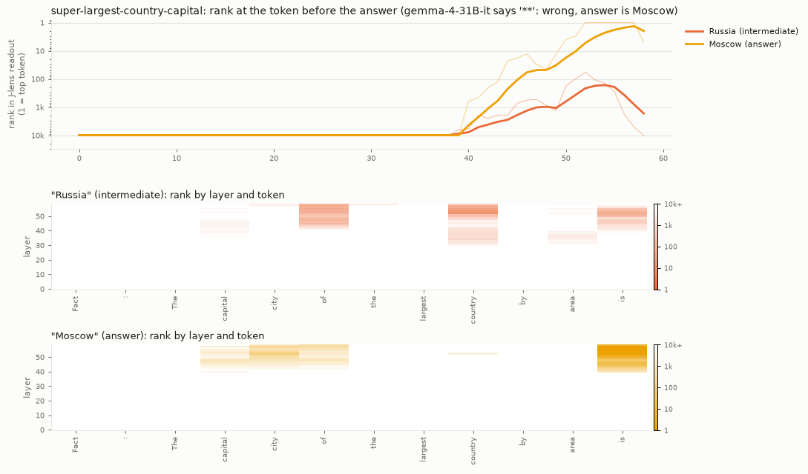

Fact: The capital city of the largest country by area is

**Answer:** **Moscow** · **Hidden trajectory:** Russia → Moscow

**gemma-4-31B-it:** ❌ top 5: `**`, `Moscow`, `the`, `{`, `located`
---

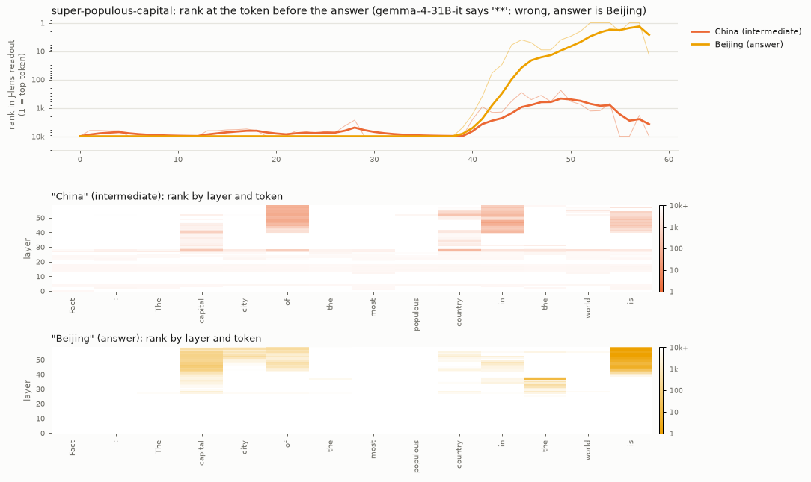

Fact: The capital city of the most populous country in the world is

**Answer:** **Beijing** · **Hidden trajectory:** China → Beijing

**gemma-4-31B-it:** ❌ top 5: `**`, `Beijing`, `the`, `located`, `something`
---

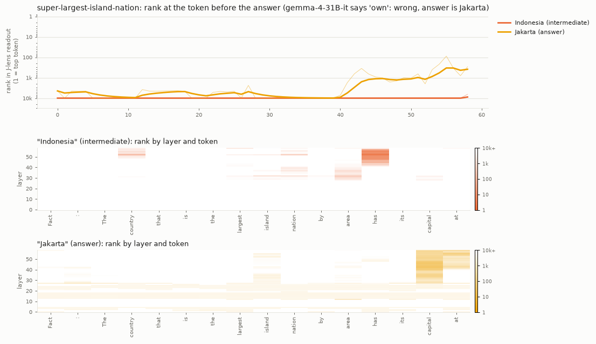

Fact: The country that is the largest island nation by area has its capital at

**Answer:** **Jakarta** · **Hidden trajectory:** Indonesia → Jakarta

**gemma-4-31B-it:** ❌ top 5: `own`, ``, `coordinates`, `longitude`, `**`
---

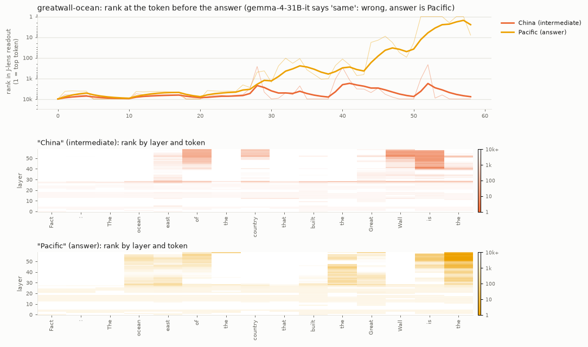

Fact: The ocean east of the country that built the Great Wall is the

**Answer:** **Pacific** · **Hidden trajectory:** China → Pacific

**gemma-4-31B-it:** ❌ top 5: `same`, `Pacific`, `East`, `Philippines`, `ocean`
---

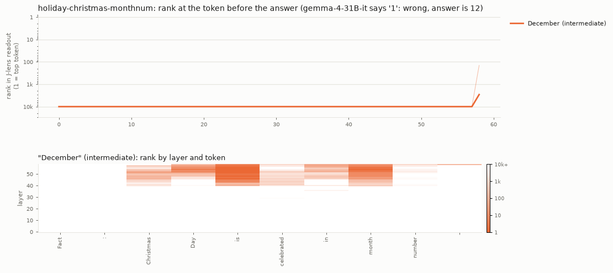

Fact: Christmas Day is celebrated in month number

**Answer:** **12** · **Hidden trajectory:** December → 12

**gemma-4-31B-it:** ❌ top 5: `1`, `2`, `6`, `7`, `5`
---

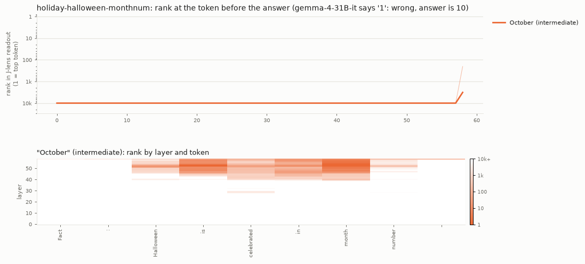

Fact: Halloween is celebrated in month number

**Answer:** **10** · **Hidden trajectory:** October → 10

**gemma-4-31B-it:** ❌ top 5: `1`, `7`, `8`, `2`, `6`
---

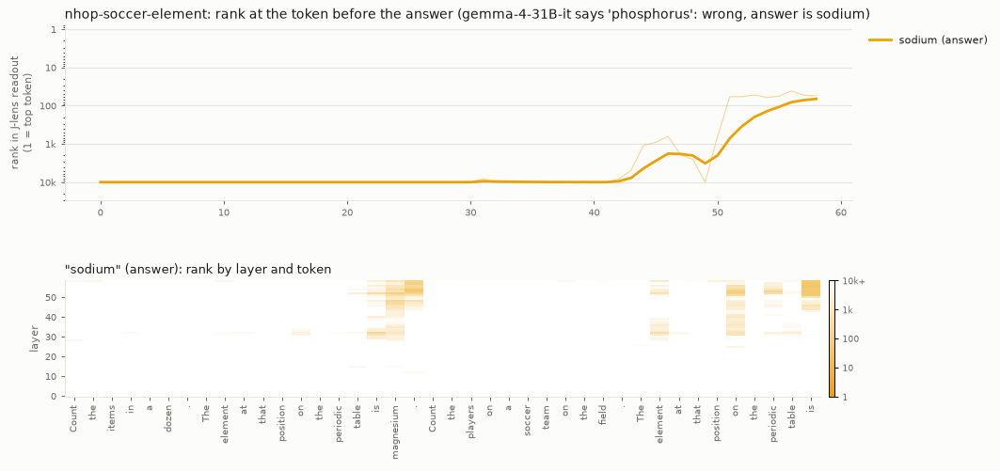

Count the items in a dozen. The element at that position on the periodic table is magnesium. Count the players on a soccer team on the field. The element at that position on the periodic table is

**Answer:** **sodium** · **Hidden trajectory:** 11 → sodium

**gemma-4-31B-it:** ❌ top 5: `phosphorus`, `phosphorous`, `aluminum`, `Phosphorus`, `phosphor`
---

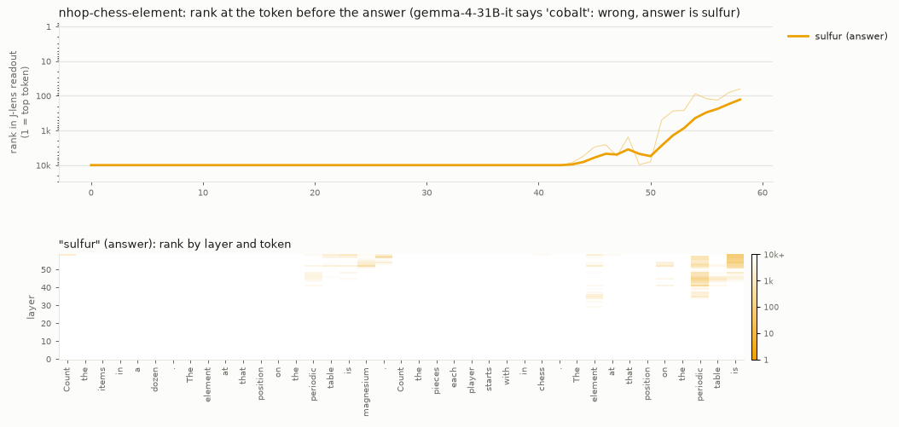

Count the items in a dozen. The element at that position on the periodic table is magnesium. Count the pieces each player starts with in chess. The element at that position on the periodic table is

**Answer:** **sulfur** · **Hidden trajectory:** 16 → sulfur

**gemma-4-31B-it:** ❌ top 5: `cobalt`, `gad`, `selenium`, `potassium`, `strontium`
---

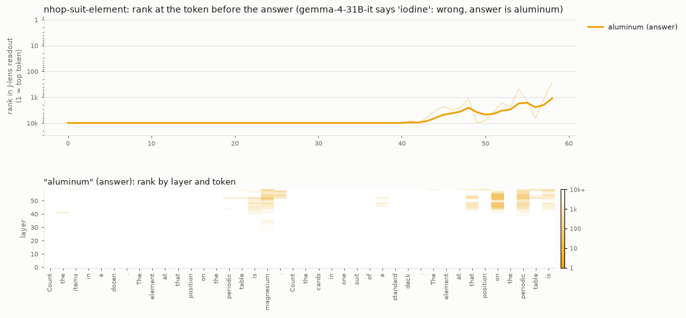

Count the items in a dozen. The element at that position on the periodic table is magnesium. Count the cards in one suit of a standard deck. The element at that position on the periodic table is

**Answer:** **aluminum** · **Hidden trajectory:** 13 → aluminum

**gemma-4-31B-it:** ❌ top 5: `iodine`, `palladium`, `the`, `’`, `tell`
---

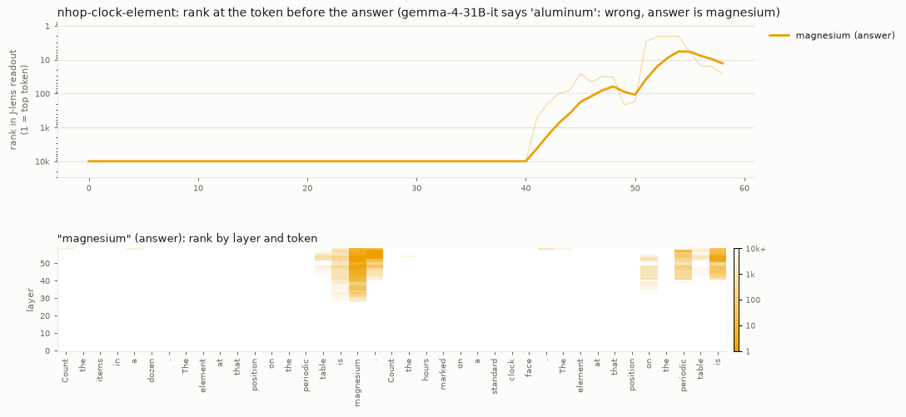

Count the items in a dozen. The element at that position on the periodic table is magnesium. Count the hours marked on a standard clock face. The element at that position on the periodic table is

**Answer:** **magnesium** · **Hidden trajectory:** 12 → magnesium

**gemma-4-31B-it:** ❌ top 5: `aluminum`, `aluminium`, `own`, `aluminio`, `alumnus`
---

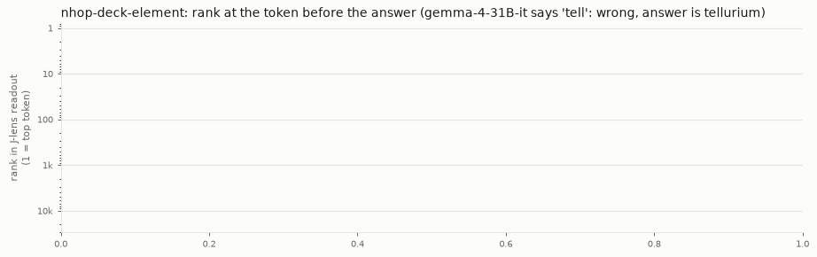

Count the items in a dozen. The element at that position on the periodic table is magnesium. Count the cards in a standard deck without jokers. The element at that position on the periodic table is

**Answer:** **tellurium** · **Hidden trajectory:** 52 → tellurium

**gemma-4-31B-it:** ❌ top 5: `tell`, `not`, `selenium`, `iodine`, `{`
---

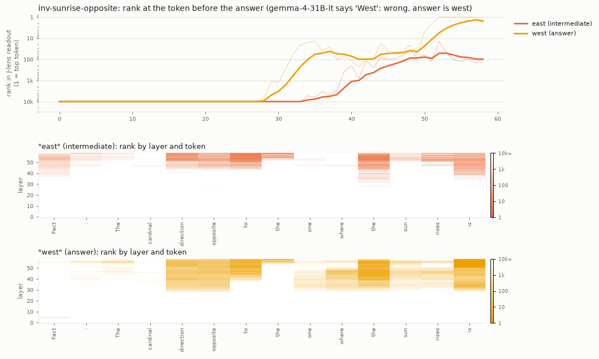

Fact: The cardinal direction opposite to the one where the sun rises is

**Answer:** **west** · **Hidden trajectory:** east → west

**gemma-4-31B-it:** ❌ top 5: `West`, `west`, `the`, `own`, `**`
---

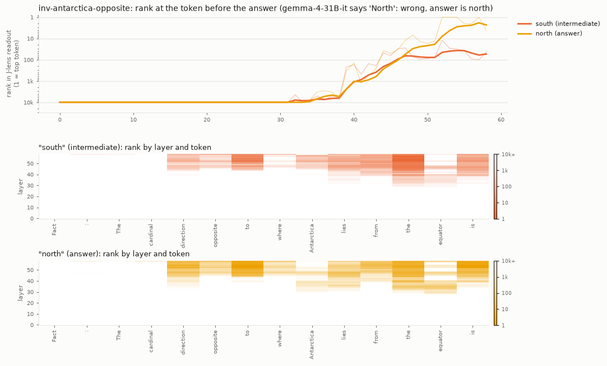

Fact: The cardinal direction opposite to where Antarctica lies from the equator is

**Answer:** **north** · **Hidden trajectory:** south → north

**gemma-4-31B-it:** ❌ top 5: `North`, `north`, `**`, `own`, `...`
---

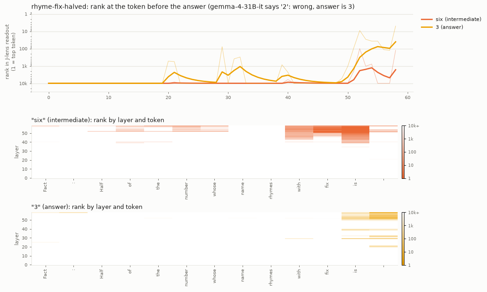

Fact: Half of the number whose name rhymes with fix is

**Answer:** **3** · **Hidden trajectory:** six → 3

**gemma-4-31B-it:** ❌ top 5: `2`, `1`, `3`, `4`, `5`
---

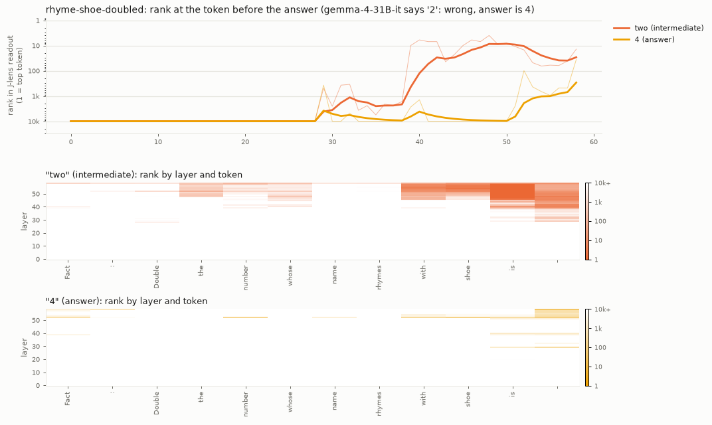

Fact: Double the number whose name rhymes with shoe is

**Answer:** **4** · **Hidden trajectory:** two → 4

**gemma-4-31B-it:** ❌ top 5: `2`, `4`, `1`, `3`, `6`
---

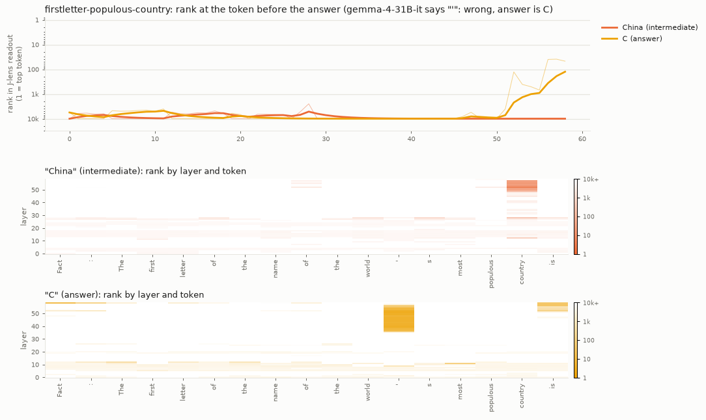

Fact: The first letter of the name of the world's most populous country is

**Answer:** **C** · **Hidden trajectory:** China → C

**gemma-4-31B-it:** ❌ top 5: `'`, `"`, `the`, `'`, `**`
---

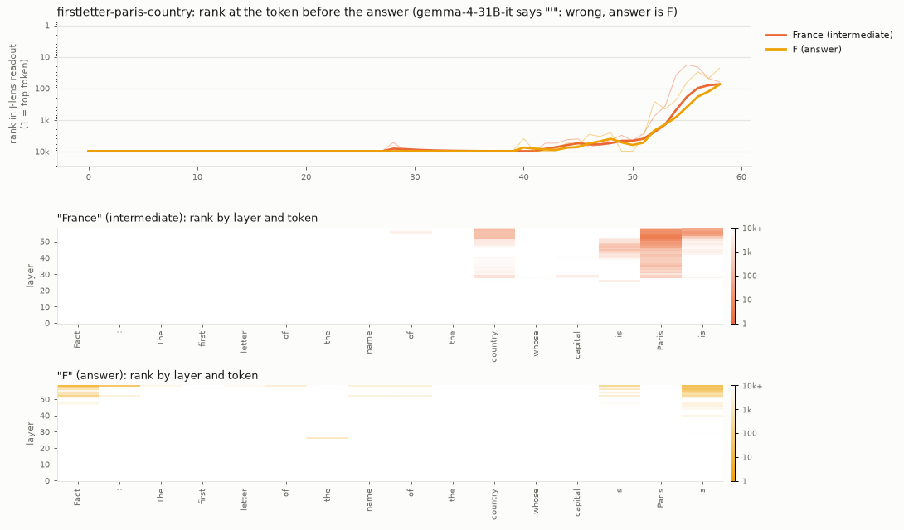

Fact: The first letter of the name of the country whose capital is Paris is

**Answer:** **F** · **Hidden trajectory:** France → F

**gemma-4-31B-it:** ❌ top 5: `'`, `"`, `P`, `the`, `**`
---

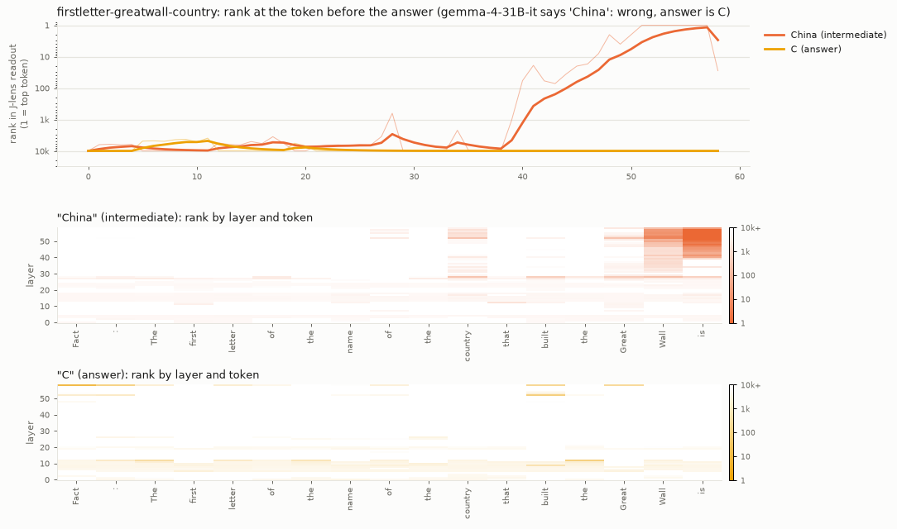

Fact: The first letter of the name of the country that built the Great Wall is

**Answer:** **C** · **Hidden trajectory:** China → C

**gemma-4-31B-it:** ❌ top 5: `China`, `not`, `**`, `located`, `why`
---

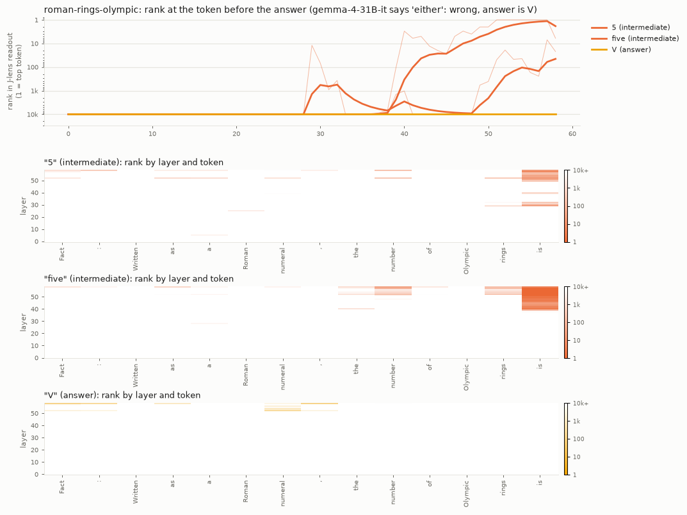

Fact: Written as a Roman numeral, the number of Olympic rings is

**Answer:** **V** · **Hidden trajectory:** 5 → five → V

**gemma-4-31B-it:** ❌ top 5: `either`, `five`, `not`, ``, `**`
---

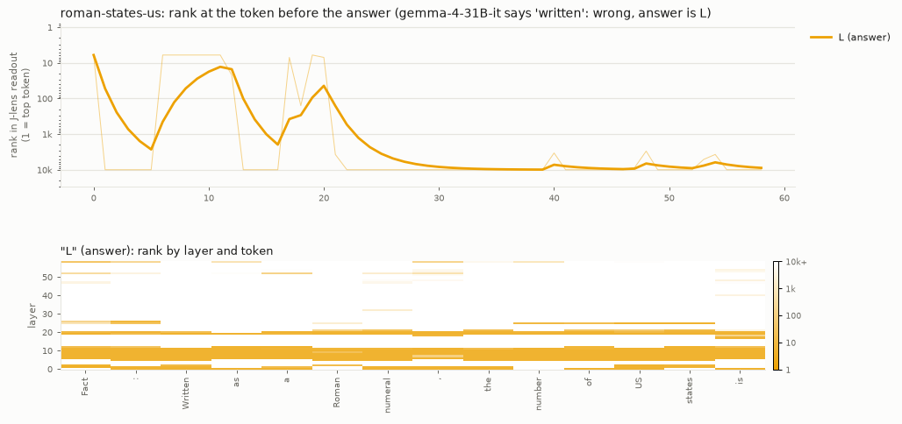

Fact: Written as a Roman numeral, the number of US states is

**Answer:** **L** · **Hidden trajectory:** 50 → L

**gemma-4-31B-it:** ❌ top 5: `written`, ``, `adage`, `stored`, `used`
---

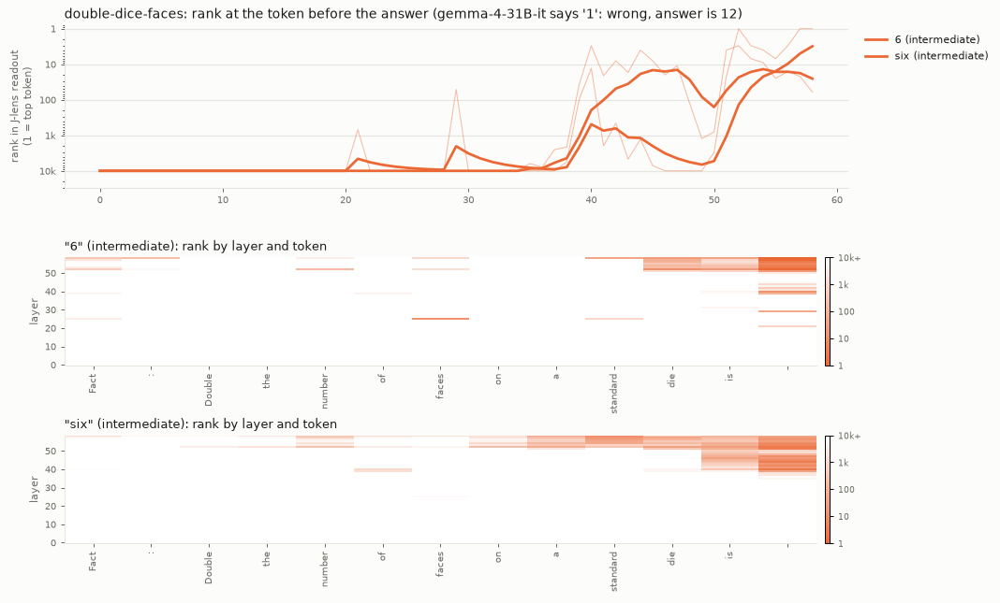

Fact: Double the number of faces on a standard die is

**Answer:** **12** · **Hidden trajectory:** 6 → six → 12

**gemma-4-31B-it:** ❌ top 5: `1`, `6`, `2`, `5`, `3`
---

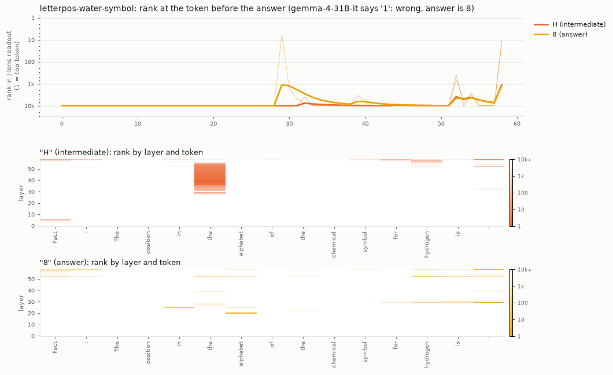

Fact: The position in the alphabet of the chemical symbol for hydrogen is

**Answer:** **8** · **Hidden trajectory:** H → 8

**gemma-4-31B-it:** ❌ top 5: `1`, `2`, `5`, `6`, `3`
---

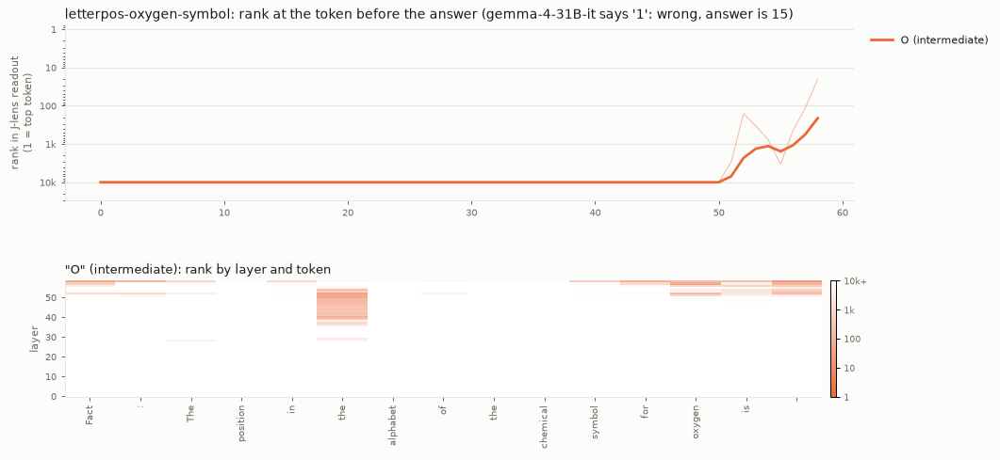

Fact: The position in the alphabet of the chemical symbol for oxygen is

**Answer:** **15** · **Hidden trajectory:** O → 15

**gemma-4-31B-it:** ❌ top 5: `1`, `2`, `8`, `5`, `3`
---

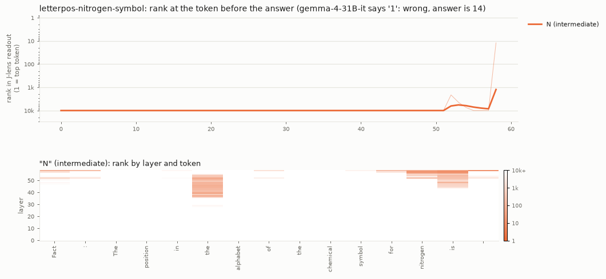

Fact: The position in the alphabet of the chemical symbol for nitrogen is

**Answer:** **14** · **Hidden trajectory:** N → 14

**gemma-4-31B-it:** ❌ top 5: `1`, `7`, `2`, `5`, `3`
---

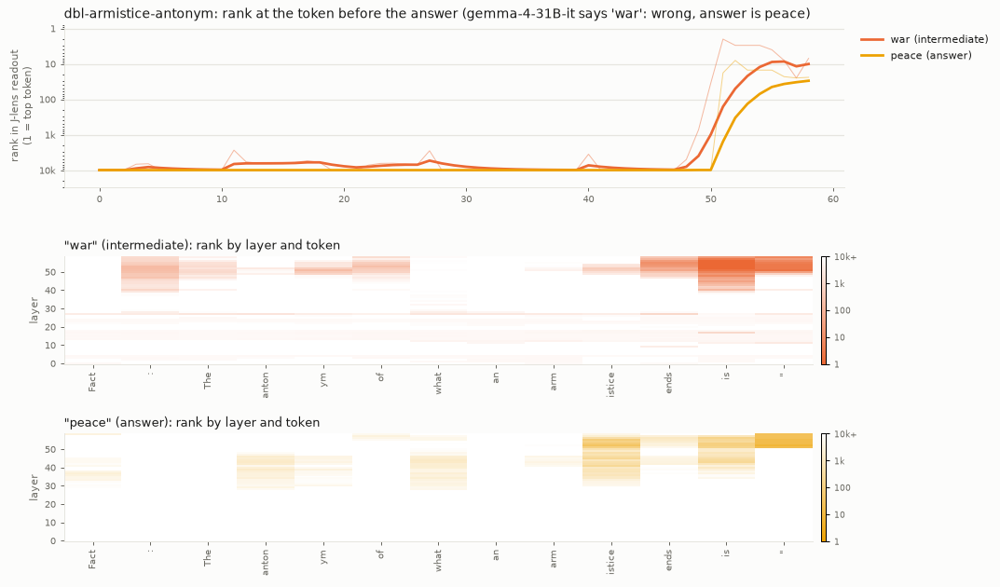

Fact: The antonym of what an armistice ends is "

**Answer:** **peace** · **Hidden trajectory:** war → peace

**gemma-4-31B-it:** ❌ top 5: `war`, `conflict`, `War`, `peace`, `Conflict`
