# J-lens readouts on multi-hop questions: Qwen2.5-7B-Instruct

Each graph shows, per layer, the J-lens logit of the answer, the hidden intermediate (never written in the prompt), and the two
prompt words the lens surfaces most, all read at the token just before the answer. Questions Qwen2.5-7B-Instruct answers correctly
come first (35), then the ones it gets wrong (58).

## Correct %

| model | correct | % |
| --- | --- | --- |
| Qwen2.5-7B-Instruct, raw prompt, local forward pass (the graphs) | 35/93 | 38% |
| qwen-2.5-7b-instruct, no-CoT via OpenRouter (chat + next-word instruction) | 44/93 | 47% |
| qwen3.6-27b, no-CoT via OpenRouter (chat + next-word instruction) | 70/93 | 75% |
| qwen3-32b, no-CoT via OpenRouter (chat + next-word instruction) | 39/93 | 42% |
| gemma-4-26b-a4b-it, no-CoT via OpenRouter (chat + next-word instruction) | 67/93 | 72% |
| gemma-4-31b-it, no-CoT via OpenRouter (chat + next-word instruction) | 75/93 | 81% |
| mistral-small-24b-instruct-2501, no-CoT via OpenRouter (chat + next-word instruction) | 52/93 | 56% |
| llama-3.3-70b-instruct, no-CoT via OpenRouter (chat + next-word instruction) | 53/93 | 57% |

## Answered correctly

---

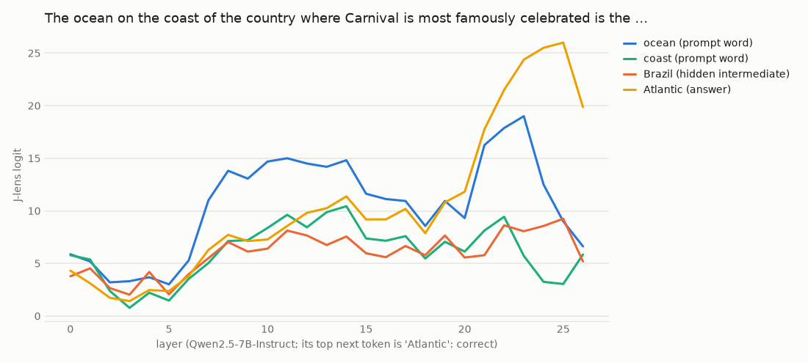

### Fact: The ocean on the coast of the country where Carnival is most famously celebrated is the **Atlantic**

**Hidden reasoning:** Brazil → Atlantic

**Qwen2.5-7B-Instruct (this graph):** ✅ predicts `Atlantic`; top 5: `Atlantic`, `Caribbean`, `atl`, `Gulf`, `Atl`

No-CoT answers via OpenRouter

- ✅ qwen-2.5-7b-instruct: `Atlantic`
- ✅ qwen3.6-27b: `Atlantic`
- ❌ qwen3-32b: ``
- ✅ gemma-4-26b-a4b-it: `Atlantic`
- ✅ gemma-4-31b-it: `Atlantic`
- ✅ mistral-small-24b-instruct-2501: `Atlantic`
- ✅ llama-3.3-70b-instruct: `Atlantic`

---

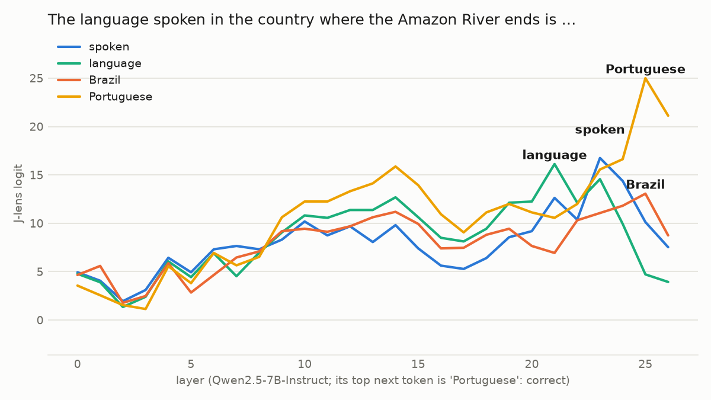

### Fact: The language spoken in the country where the Amazon River ends is **Portuguese**

**Hidden reasoning:** Brazil → Portuguese

**Qwen2.5-7B-Instruct (this graph):** ✅ predicts `Portuguese`; top 5: `Portuguese`, `Spanish`, `a`, `primarily`, `an`

No-CoT answers via OpenRouter

- ✅ qwen-2.5-7b-instruct: `Portuguese`
- ✅ qwen3.6-27b: `Portuguese`
- ❌ qwen3-32b: ``
- ✅ gemma-4-26b-a4b-it: `Portuguese`
- ✅ gemma-4-31b-it: `Portuguese`
- ✅ mistral-small-24b-instruct-2501: `Portuguese`
- ✅ llama-3.3-70b-instruct: `Portuguese`

---

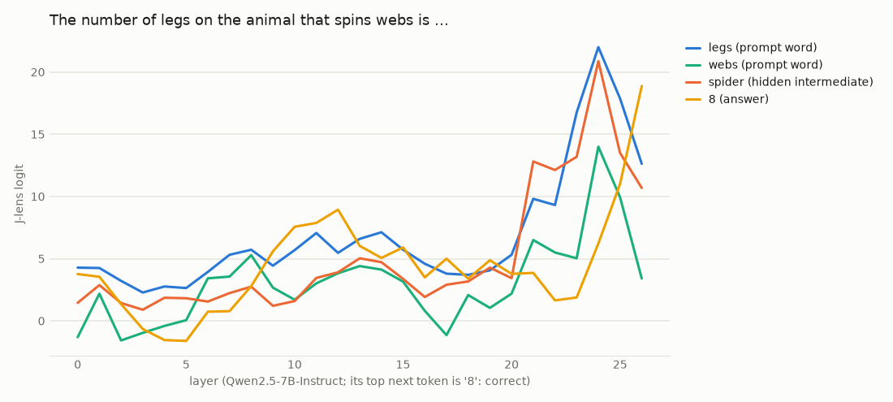

### Fact: The number of legs on the animal that spins webs is **8**

**Hidden reasoning:** spider → 8

**Qwen2.5-7B-Instruct (this graph):** ✅ predicts `8`; top 5: `8`, `0`, `4`, `6`, `2`

No-CoT answers via OpenRouter

- ✅ qwen-2.5-7b-instruct: `8`
- ✅ qwen3.6-27b: `8`
- ✅ qwen3-32b: `8`
- ✅ gemma-4-26b-a4b-it: `8`
- ✅ gemma-4-31b-it: `8`
- ✅ mistral-small-24b-instruct-2501: `8`
- ❌ llama-3.3-70b-instruct: `eight`

---

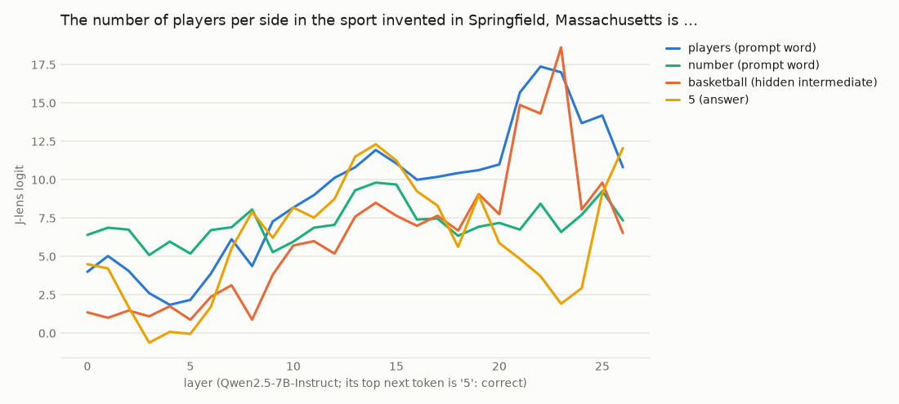

### Fact: The number of players per side in the sport invented in Springfield, Massachusetts is **5**

**Hidden reasoning:** basketball → 5

**Qwen2.5-7B-Instruct (this graph):** ✅ predicts `5`; top 5: `5`, `9`, `1`, `2`, `6`

No-CoT answers via OpenRouter

- ❌ qwen-2.5-7b-instruct: `9`
- ✅ qwen3.6-27b: `5`
- ❌ qwen3-32b: ``
- ✅ gemma-4-26b-a4b-it: `5`
- ✅ gemma-4-31b-it: `5`
- ❌ mistral-small-24b-instruct-2501: `6`
- ❌ llama-3.3-70b-instruct: `nine`

---

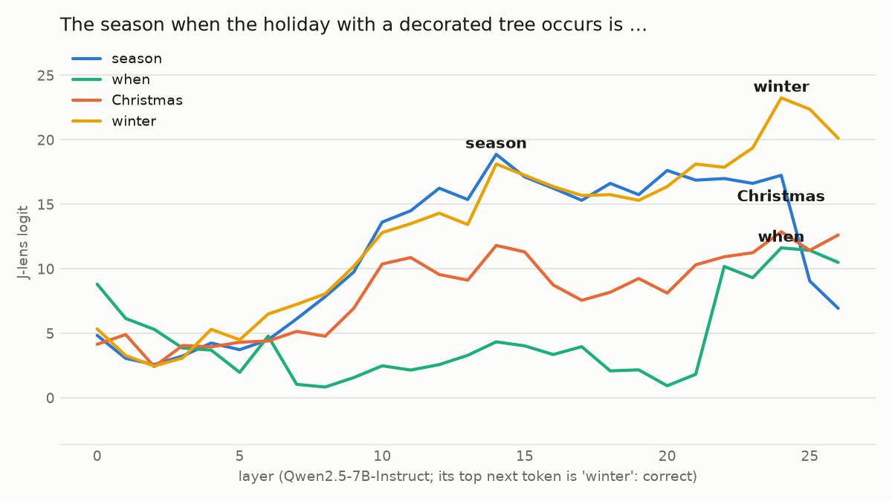

### Fact: The season when the holiday with a decorated tree occurs is **winter**

**Hidden reasoning:** Christmas → winter

**Qwen2.5-7B-Instruct (this graph):** ✅ predicts `winter`; top 5: `winter`, `the`, `in`, `called`, `when`

No-CoT answers via OpenRouter

- ❌ qwen-2.5-7b-instruct: `December`
- ✅ qwen3.6-27b: `winter`
- ✅ qwen3-32b: `winter.`
- ✅ gemma-4-26b-a4b-it: `winter`
- ✅ gemma-4-31b-it: `winter`
- ✅ mistral-small-24b-instruct-2501: `Winter`
- ✅ llama-3.3-70b-instruct: `winter`

---

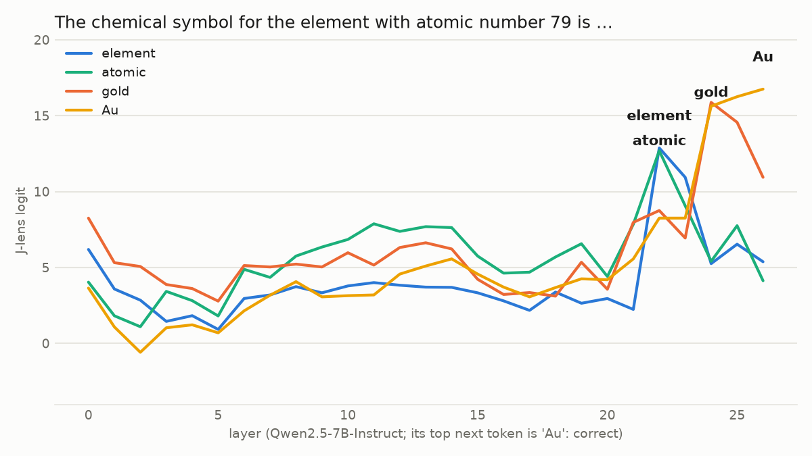

### Fact: The chemical symbol for the element with atomic number 79 is **Au**

**Hidden reasoning:** gold → Au

**Qwen2.5-7B-Instruct (this graph):** ✅ predicts `Au`; top 5: `Au`, `Pt`, `"`, `gold`, `'`

No-CoT answers via OpenRouter

- ✅ qwen-2.5-7b-instruct: `Au`
- ✅ qwen3.6-27b: `Au`
- ✅ qwen3-32b: `Au`
- ✅ gemma-4-26b-a4b-it: `Au`
- ✅ gemma-4-31b-it: `Au`
- ✅ mistral-small-24b-instruct-2501: `Au`
- ✅ llama-3.3-70b-instruct: `Au`

---

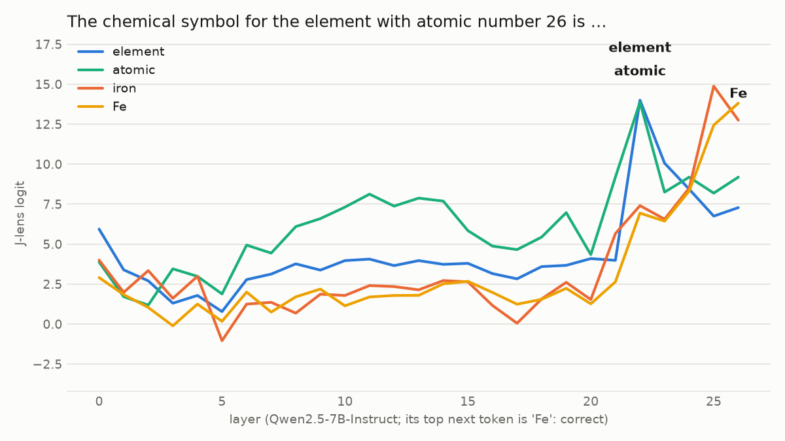

### Fact: The chemical symbol for the element with atomic number 26 is **Fe**

**Hidden reasoning:** iron → Fe

**Qwen2.5-7B-Instruct (this graph):** ✅ predicts `Fe`; top 5: `Fe`, `"`, `FE`, `fe`, `iron`

No-CoT answers via OpenRouter

- ✅ qwen-2.5-7b-instruct: `Fe`
- ✅ qwen3.6-27b: `Fe`
- ✅ qwen3-32b: `Fe`
- ✅ gemma-4-26b-a4b-it: `Fe`
- ✅ gemma-4-31b-it: `Fe`
- ✅ mistral-small-24b-instruct-2501: `Fe`
- ✅ llama-3.3-70b-instruct: `Fe`

---

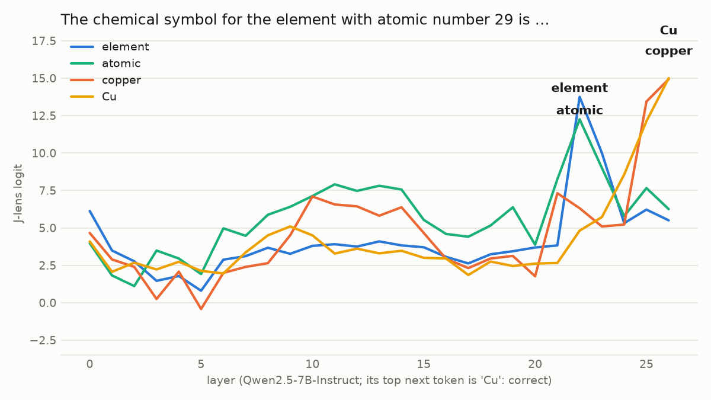

### Fact: The chemical symbol for the element with atomic number 29 is **Cu**

**Hidden reasoning:** copper → Cu

**Qwen2.5-7B-Instruct (this graph):** ✅ predicts `Cu`; top 5: `Cu`, `copper`, `"`, `cu`, `found`

No-CoT answers via OpenRouter

- ✅ qwen-2.5-7b-instruct: `Cu`
- ✅ qwen3.6-27b: `Cu`
- ✅ qwen3-32b: `Cu`
- ✅ gemma-4-26b-a4b-it: `Cu`
- ✅ gemma-4-31b-it: `Cu`
- ✅ mistral-small-24b-instruct-2501: `Cu`
- ❌ llama-3.3-70b-instruct: `Copper`

---

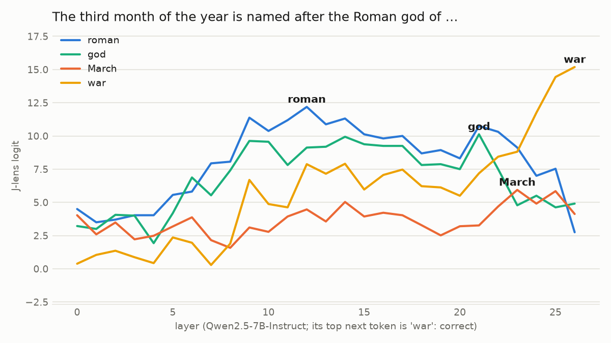

### Fact: The third month of the year is named after the Roman god of **war**

**Hidden reasoning:** March → war

**Qwen2.5-7B-Instruct (this graph):** ✅ predicts `war`; top 5: `war`, `War`, `agriculture`, `the`, `战争`

No-CoT answers via OpenRouter

- ✅ qwen-2.5-7b-instruct: `War`
- ✅ qwen3.6-27b: `war`
- ✅ qwen3-32b: `war.`
- ✅ gemma-4-26b-a4b-it: `war`
- ❌ gemma-4-31b-it: `beginnings`
- ❌ mistral-small-24b-instruct-2501: `March`
- ✅ llama-3.3-70b-instruct: `war`

---

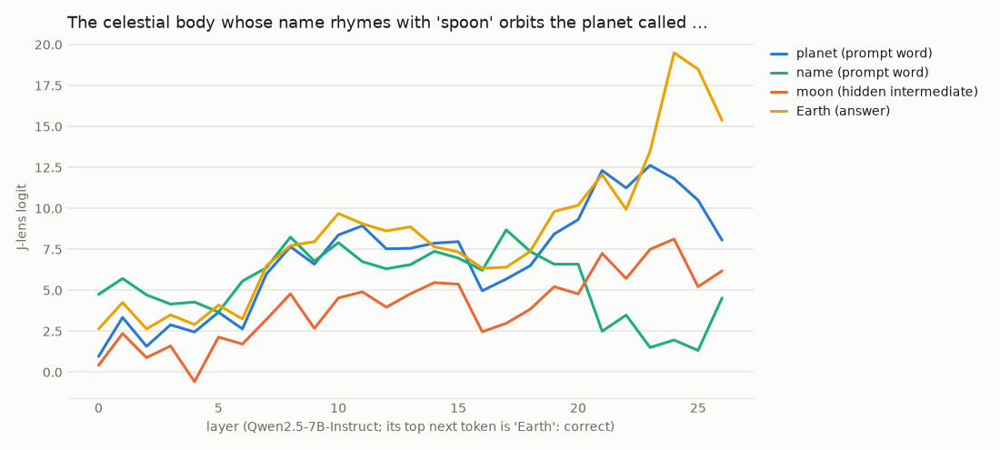

### Fact: The celestial body whose name rhymes with 'spoon' orbits the planet called **Earth**

**Hidden reasoning:** moon → Earth

**Qwen2.5-7B-Instruct (this graph):** ✅ predicts `Earth`; top 5: `Earth`, `'`, `Jupiter`, `Mars`, `earth`

No-CoT answers via OpenRouter

- ✅ qwen-2.5-7b-instruct: `Earth`
- ✅ qwen3.6-27b: `Earth`
- ❌ qwen3-32b: ``
- ❌ gemma-4-26b-a4b-it: `Moon`
- ❌ gemma-4-31b-it: `Saturn`
- ❌ mistral-small-24b-instruct-2501: `Mars`
- ❌ llama-3.3-70b-instruct: `June`

---

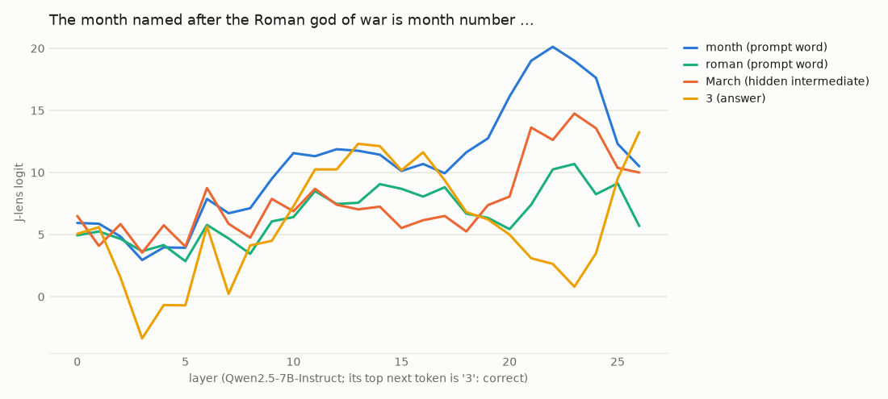

### Fact: The month named after the Roman god of war is month number **3**

**Hidden reasoning:** March → 3

**Qwen2.5-7B-Instruct (this graph):** ✅ predicts `3`; top 5: `3`, `2`, `4`, `5`, `1`

No-CoT answers via OpenRouter

- ❌ qwen-2.5-7b-instruct: `Martius`
- ✅ qwen3.6-27b: `3`
- ✅ qwen3-32b: `3`
- ✅ gemma-4-26b-a4b-it: `3`
- ✅ gemma-4-31b-it: `3`
- ❌ mistral-small-24b-instruct-2501: `7`
- ✅ llama-3.3-70b-instruct: `3`

---

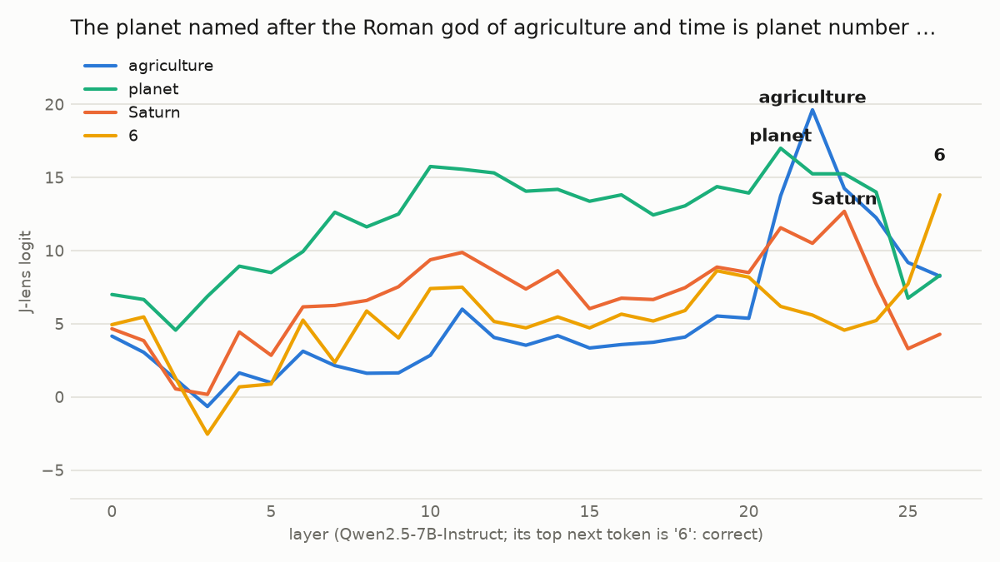

### Fact: The planet named after the Roman god of agriculture and time is planet number **6**

**Hidden reasoning:** Saturn → 6

**Qwen2.5-7B-Instruct (this graph):** ✅ predicts `6`; top 5: `6`, `5`, `3`, `2`, `1`

No-CoT answers via OpenRouter

- ❌ qwen-2.5-7b-instruct: `2`
- ❌ qwen3.6-27b: `4`
- ❌ qwen3-32b: ``
- ❌ gemma-4-26b-a4b-it: `four`
- ❌ gemma-4-31b-it: `4`
- ❌ mistral-small-24b-instruct-2501: `4`
- ✅ llama-3.3-70b-instruct: `6`

---

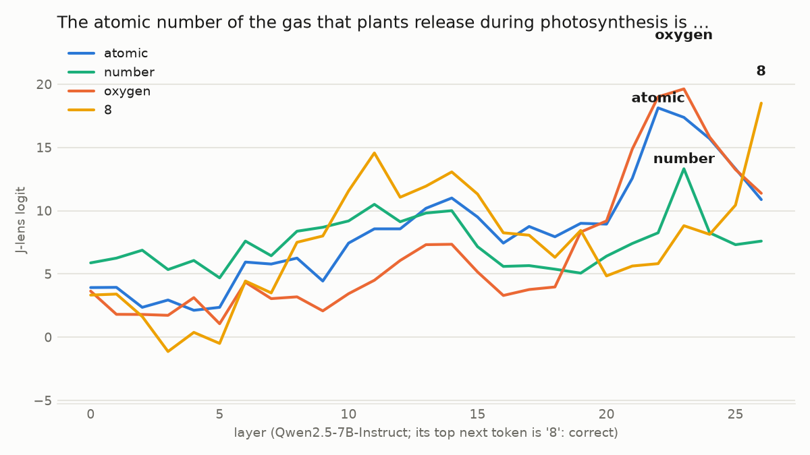

### Fact: The atomic number of the gas that plants release during photosynthesis is **8**

**Hidden reasoning:** oxygen → 8

**Qwen2.5-7B-Instruct (this graph):** ✅ predicts `8`; top 5: `8`, `6`, `7`, `1`, `9`

No-CoT answers via OpenRouter

- ✅ qwen-2.5-7b-instruct: `8`
- ✅ qwen3.6-27b: `8`
- ✅ qwen3-32b: `8`
- ✅ gemma-4-26b-a4b-it: `8`
- ✅ gemma-4-31b-it: `8`
- ❌ mistral-small-24b-instruct-2501: `6`
- ✅ llama-3.3-70b-instruct: `8`

---

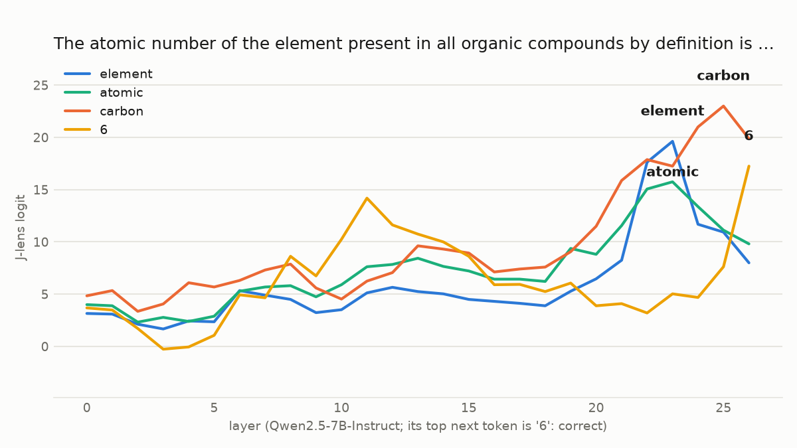

### Fact: The atomic number of the element present in all organic compounds by definition is **6**

**Hidden reasoning:** carbon → 6

**Qwen2.5-7B-Instruct (this graph):** ✅ predicts `6`; top 5: `6`, `1`, ``, `5`, `Carbon`

No-CoT answers via OpenRouter

- ✅ qwen-2.5-7b-instruct: `6`
- ✅ qwen3.6-27b: `6`
- ✅ qwen3-32b: `6`
- ✅ gemma-4-26b-a4b-it: `6`
- ✅ gemma-4-31b-it: `6`
- ✅ mistral-small-24b-instruct-2501: `6`
- ✅ llama-3.3-70b-instruct: `6`

---

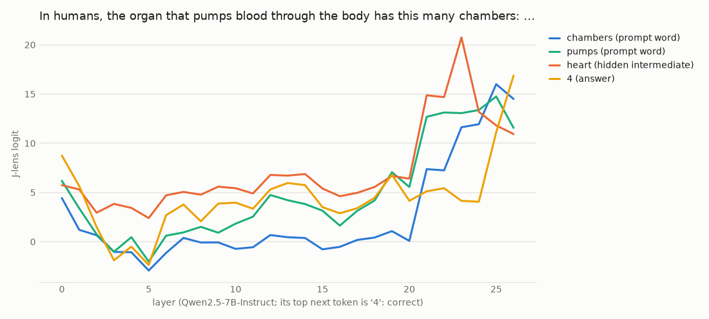

### Fact: In humans, the organ that pumps blood through the body has this many chambers: **4**

**Hidden reasoning:** heart → 4

**Qwen2.5-7B-Instruct (this graph):** ✅ predicts `4`; top 5: `4`, `2`, ``, `four`, `1`

No-CoT answers via OpenRouter

- ✅ qwen-2.5-7b-instruct: `4`
- ✅ qwen3.6-27b: `4`
- ✅ qwen3-32b: `4`
- ✅ gemma-4-26b-a4b-it: `4`
- ✅ gemma-4-31b-it: `4`
- ❌ mistral-small-24b-instruct-2501: `Four`
- ❌ llama-3.3-70b-instruct: `Four`

---

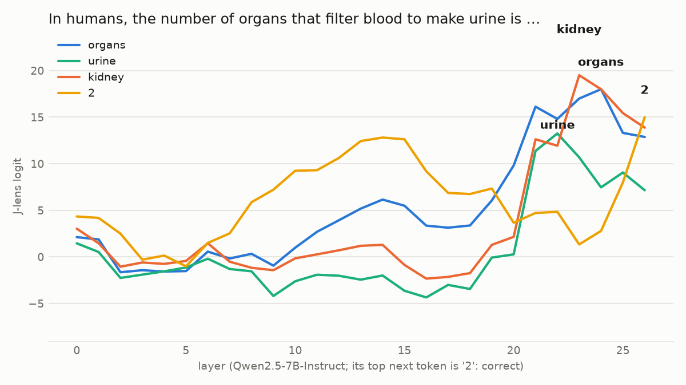

### Fact: In humans, the number of organs that filter blood to make urine is **2**

**Hidden reasoning:** kidney → 2

**Qwen2.5-7B-Instruct (this graph):** ✅ predicts `2`; top 5: `2`, `1`, `3`, `4`, `one`

No-CoT answers via OpenRouter

- ✅ qwen-2.5-7b-instruct: `2`
- ✅ qwen3.6-27b: `2`
- ✅ qwen3-32b: `2`
- ❌ gemma-4-26b-a4b-it: `two`
- ✅ gemma-4-31b-it: `2`
- ✅ mistral-small-24b-instruct-2501: `2`
- ❌ llama-3.3-70b-instruct: `two`

---

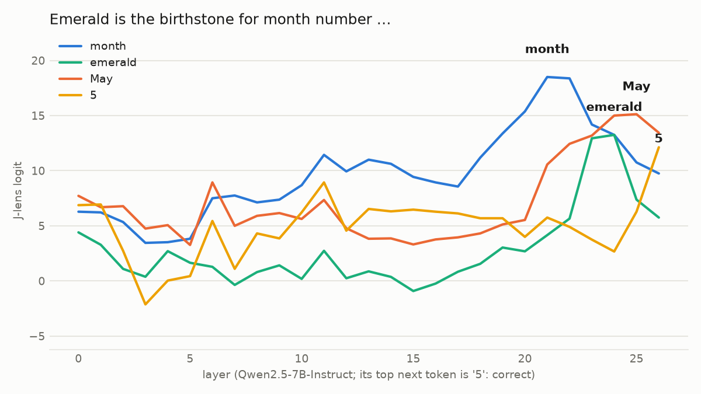

### Fact: Emerald is the birthstone for month number **5**

**Hidden reasoning:** May → 5

**Qwen2.5-7B-Instruct (this graph):** ✅ predicts `5`; top 5: `5`, `0`, `1`, `2`, `3`

No-CoT answers via OpenRouter

- ✅ qwen-2.5-7b-instruct: `5`
- ✅ qwen3.6-27b: `5`
- ✅ qwen3-32b: `5.`
- ✅ gemma-4-26b-a4b-it: `5`
- ✅ gemma-4-31b-it: `5`
- ✅ mistral-small-24b-instruct-2501: `5`
- ❌ llama-3.3-70b-instruct: `May`

---

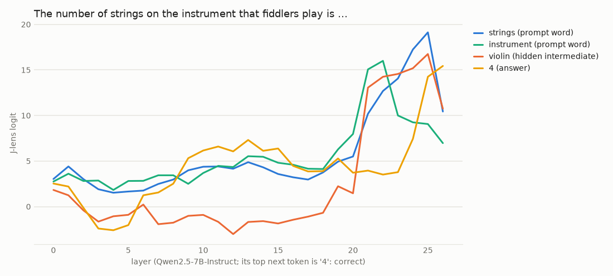

### Fact: The number of strings on the instrument that fiddlers play is **4**

**Hidden reasoning:** violin → 4

**Qwen2.5-7B-Instruct (this graph):** ✅ predicts `4`; top 5: `4`, `1`, `2`, `5`, `3`

No-CoT answers via OpenRouter

- ✅ qwen-2.5-7b-instruct: `4`
- ✅ qwen3.6-27b: `4`
- ❌ qwen3-32b: ``
- ❌ gemma-4-26b-a4b-it: `four`
- ✅ gemma-4-31b-it: `4`
- ❌ mistral-small-24b-instruct-2501: `Four`
- ❌ llama-3.3-70b-instruct: `four`

---

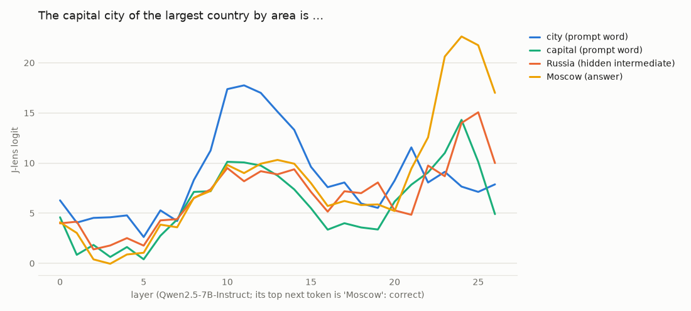

### Fact: The capital city of the largest country by area is **Moscow**

**Hidden reasoning:** Russia → Moscow

**Qwen2.5-7B-Instruct (this graph):** ✅ predicts `Moscow`; top 5: `Moscow`, `not`, `located`, `the`, `a`

No-CoT answers via OpenRouter

- ✅ qwen-2.5-7b-instruct: `Moscow`
- ✅ qwen3.6-27b: `Moscow`
- ✅ qwen3-32b: `Moscow.`
- ✅ gemma-4-26b-a4b-it: `Moscow`
- ✅ gemma-4-31b-it: `Moscow`
- ✅ mistral-small-24b-instruct-2501: `Moscow`
- ✅ llama-3.3-70b-instruct: `Moscow`

---

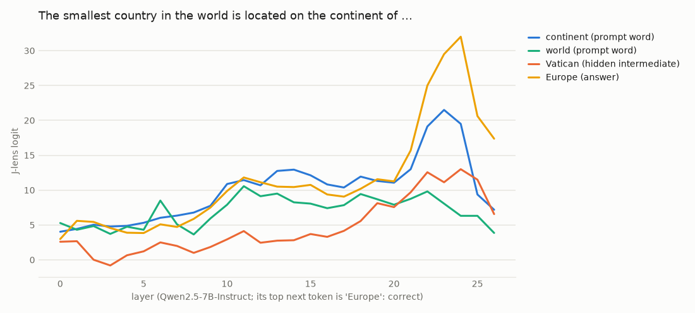

### Fact: The smallest country in the world is located on the continent of **Europe**

**Hidden reasoning:** Vatican → Europe

**Qwen2.5-7B-Instruct (this graph):** ✅ predicts `Europe`; top 5: `Europe`, `Asia`, ``, `which`, `__`

No-CoT answers via OpenRouter

- ✅ qwen-2.5-7b-instruct: `Europe`
- ✅ qwen3.6-27b: `Europe`
- ✅ qwen3-32b: `Europe.`
- ✅ gemma-4-26b-a4b-it: `Europe`
- ✅ gemma-4-31b-it: `Europe`
- ✅ mistral-small-24b-instruct-2501: `Europe`
- ✅ llama-3.3-70b-instruct: `Europe`

---

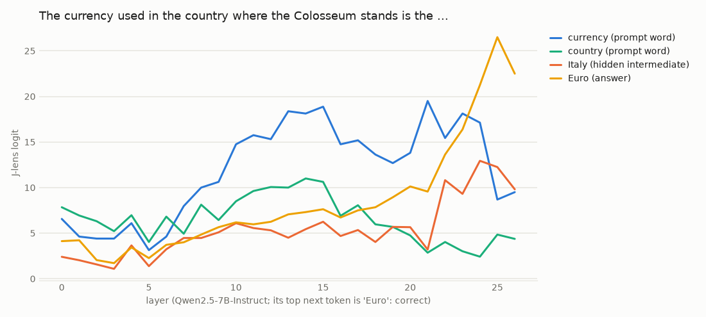

### Fact: The currency used in the country where the Colosseum stands is the **Euro**

**Hidden reasoning:** Italy → Euro

**Qwen2.5-7B-Instruct (this graph):** ✅ predicts `Euro`; top 5: `Euro`, `euro`, `Italian`, `欧元`, `European`

No-CoT answers via OpenRouter

- ✅ qwen-2.5-7b-instruct: `Euro`
- ✅ qwen3.6-27b: `Euro`
- ✅ qwen3-32b: `euro.`
- ✅ gemma-4-26b-a4b-it: `euro`
- ✅ gemma-4-31b-it: `Euro`
- ✅ mistral-small-24b-instruct-2501: `Euro`
- ✅ llama-3.3-70b-instruct: `Euro`

---

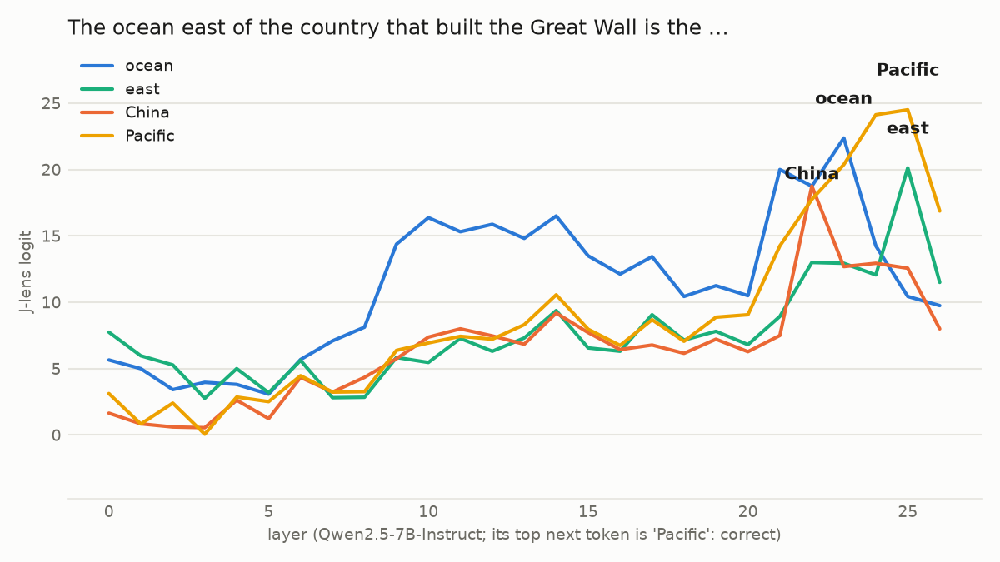

### Fact: The ocean east of the country that built the Great Wall is the **Pacific**

**Hidden reasoning:** China → Pacific

**Qwen2.5-7B-Instruct (this graph):** ✅ predicts `Pacific`; top 5: `Pacific`, `Boh`, `pac`, `Bo`, `same`

No-CoT answers via OpenRouter

- ❌ qwen-2.5-7b-instruct: `East China Sea`
- ✅ qwen3.6-27b: `Pacific`
- ❌ qwen3-32b: ``
- ✅ gemma-4-26b-a4b-it: `Pacific`
- ✅ gemma-4-31b-it: `Pacific`
- ✅ mistral-small-24b-instruct-2501: `Pacific`
- ✅ llama-3.3-70b-instruct: `Pacific`

---

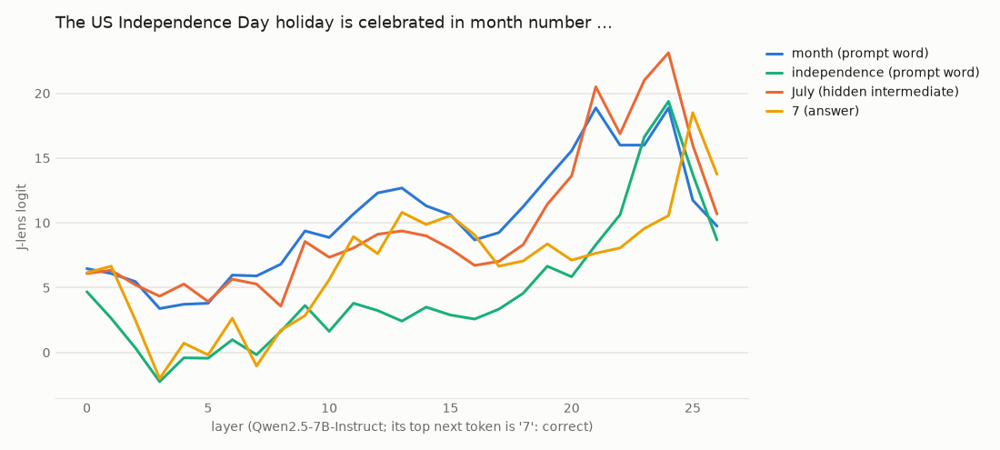

### Fact: The US Independence Day holiday is celebrated in month number **7**

**Hidden reasoning:** July → 7

**Qwen2.5-7B-Instruct (this graph):** ✅ predicts `7`; top 5: `7`, `0`, `6`, `1`, `4`

No-CoT answers via OpenRouter

- ✅ qwen-2.5-7b-instruct: `7`
- ✅ qwen3.6-27b: `7`
- ✅ qwen3-32b: `7`
- ✅ gemma-4-26b-a4b-it: `7`
- ✅ gemma-4-31b-it: `7`
- ✅ mistral-small-24b-instruct-2501: `7`
- ✅ llama-3.3-70b-instruct: `7`

---

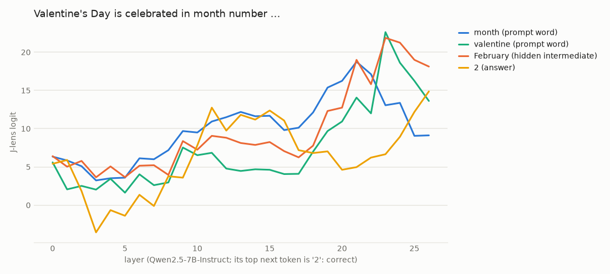

### Fact: Valentine's Day is celebrated in month number **2**

**Hidden reasoning:** February → 2

**Qwen2.5-7B-Instruct (this graph):** ✅ predicts `2`; top 5: `2`, `1`, `6`, `5`, `4`

No-CoT answers via OpenRouter

- ❌ qwen-2.5-7b-instruct: `14`
- ✅ qwen3.6-27b: `2`
- ✅ qwen3-32b: `2`
- ✅ gemma-4-26b-a4b-it: `2`
- ✅ gemma-4-31b-it: `2`
- ✅ mistral-small-24b-instruct-2501: `2`
- ✅ llama-3.3-70b-instruct: `2`

---

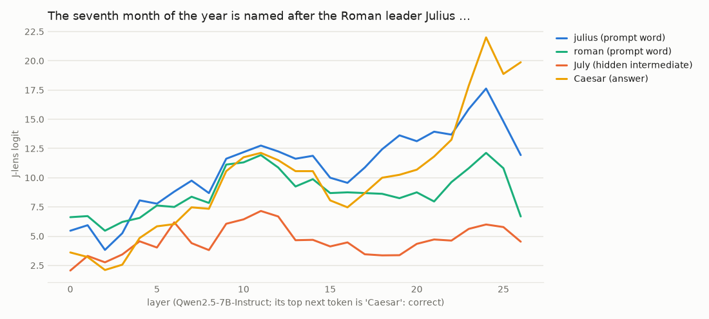

### Fact: The seventh month of the year is named after the Roman leader Julius **Caesar**

**Hidden reasoning:** July → Caesar

**Qwen2.5-7B-Instruct (this graph):** ✅ predicts `Caesar`; top 5: `Caesar`, `Ca`, `Ce`, `.`, `C`

No-CoT answers via OpenRouter

- ✅ qwen-2.5-7b-instruct: `Caesar`
- ✅ qwen3.6-27b: `Caesar`
- ✅ qwen3-32b: `Caesar`
- ✅ gemma-4-26b-a4b-it: `Caesar`
- ✅ gemma-4-31b-it: `Caesar`
- ✅ mistral-small-24b-instruct-2501: `Caesar`
- ✅ llama-3.3-70b-instruct: `Caesar`

---

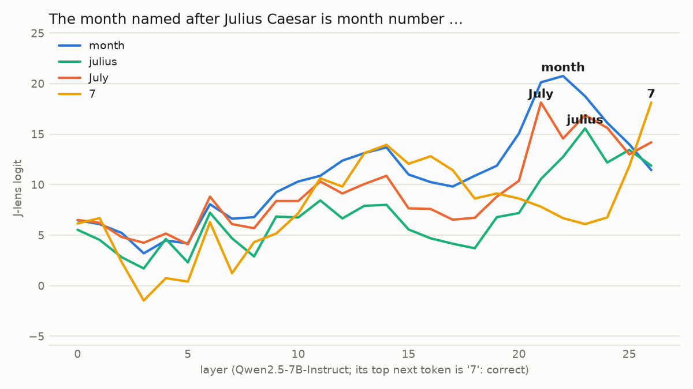

### Fact: The month named after Julius Caesar is month number **7**

**Hidden reasoning:** July → 7

**Qwen2.5-7B-Instruct (this graph):** ✅ predicts `7`; top 5: `7`, `0`, `4`, `1`, `5`

No-CoT answers via OpenRouter

- ❌ qwen-2.5-7b-instruct: `5`
- ✅ qwen3.6-27b: `7`
- ❌ qwen3-32b: ``
- ✅ gemma-4-26b-a4b-it: `7`
- ✅ gemma-4-31b-it: `7`
- ✅ mistral-small-24b-instruct-2501: `7`
- ✅ llama-3.3-70b-instruct: `7`

---

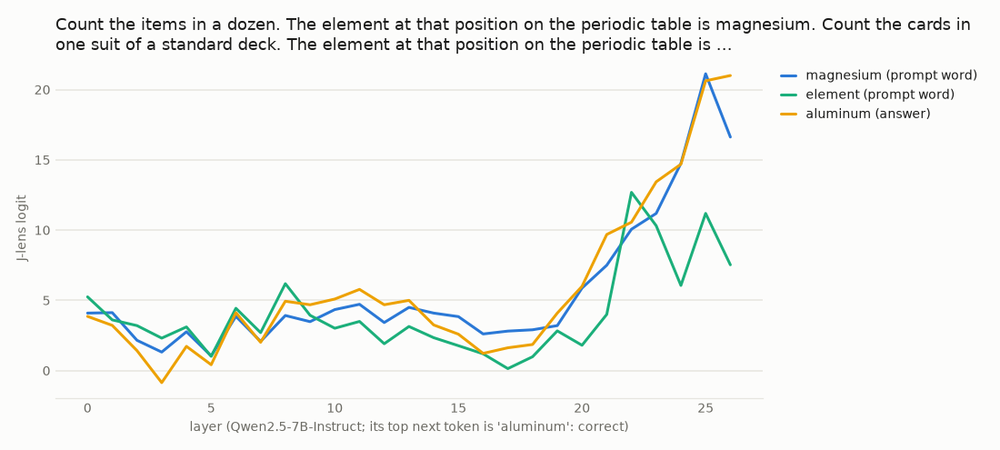

### Count the items in a dozen. The element at that position on the periodic table is magnesium. Count the cards in one suit of a standard deck. The element at that position on the periodic table is **aluminum**

**Hidden reasoning:** 13 → aluminum

**Qwen2.5-7B-Instruct (this graph):** ✅ predicts `aluminum`; top 5: `aluminum`, `neon`, `iron`, `sodium`, `aluminium`

No-CoT answers via OpenRouter

- ❌ qwen-2.5-7b-instruct: `13`
- ❌ qwen3.6-27b: `nitrogen`
- ❌ qwen3-32b: ``
- ❌ gemma-4-26b-a4b-it: `oxygen`
- ❌ gemma-4-31b-it: `Europium`
- ❌ mistral-small-24b-instruct-2501: `13`
- ❌ llama-3.3-70b-instruct: `13`

---

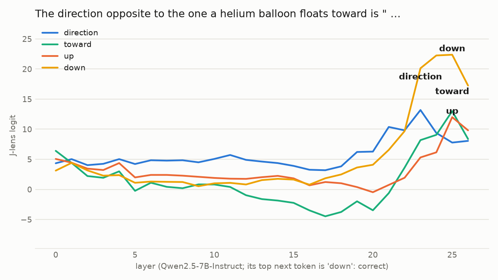

### Fact: The direction opposite to the one a helium balloon floats toward is " **down**

**Hidden reasoning:** up → down

**Qwen2.5-7B-Instruct (this graph):** ✅ predicts `down`; top 5: `down`, `Down`, `up`, `ground`, `DOWN`

No-CoT answers via OpenRouter

- ✅ qwen-2.5-7b-instruct: `down`
- ✅ qwen3.6-27b: `down`
- ❌ qwen3-32b: ``
- ✅ gemma-4-26b-a4b-it: `down`
- ✅ gemma-4-31b-it: `down"`
- ✅ mistral-small-24b-instruct-2501: `down`
- ✅ llama-3.3-70b-instruct: `down`

---

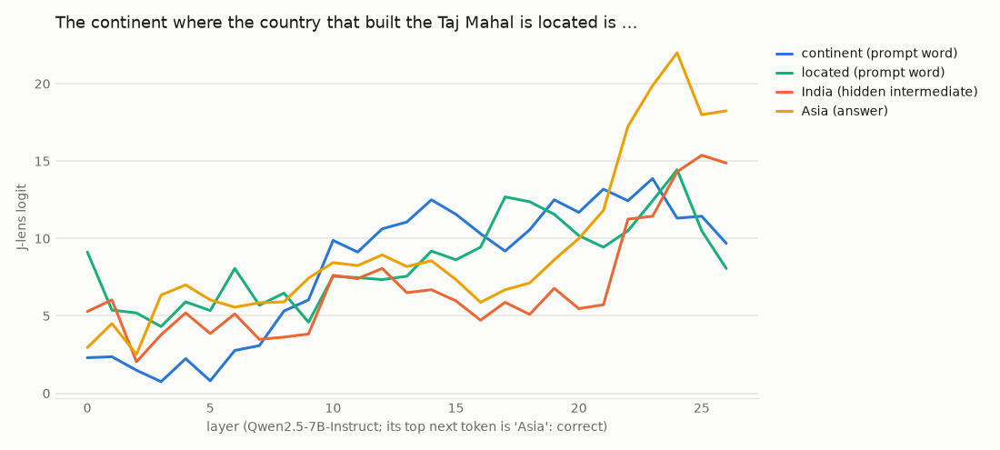

### Fact: The continent where the country that built the Taj Mahal is located is **Asia**

**Hidden reasoning:** India → Asia

**Qwen2.5-7B-Instruct (this graph):** ✅ predicts `Asia`; top 5: `Asia`, `India`, `South`, `the`, `also`

No-CoT answers via OpenRouter

- ✅ qwen-2.5-7b-instruct: `Asia`
- ✅ qwen3.6-27b: `Asia`
- ❌ qwen3-32b: ``
- ✅ gemma-4-26b-a4b-it: `Asia`
- ✅ gemma-4-31b-it: `Asia`
- ✅ mistral-small-24b-instruct-2501: `Asia`
- ✅ llama-3.3-70b-instruct: `Asia`

---

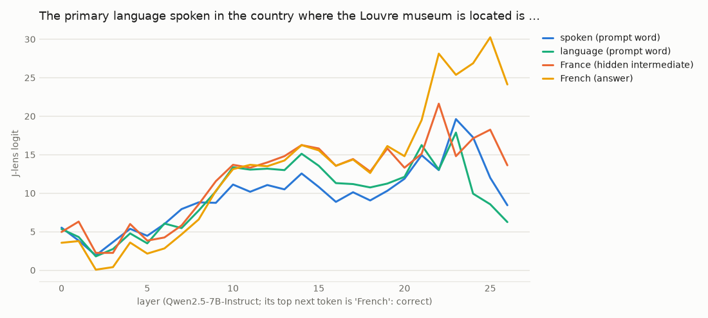

### Fact: The primary language spoken in the country where the Louvre museum is located is **French**

**Hidden reasoning:** France → French

**Qwen2.5-7B-Instruct (this graph):** ✅ predicts `French`; top 5: `French`, `a`, `not`, `french`, `the`

No-CoT answers via OpenRouter

- ✅ qwen-2.5-7b-instruct: `French`
- ✅ qwen3.6-27b: `French`
- ✅ qwen3-32b: `French.`
- ✅ gemma-4-26b-a4b-it: `French`
- ✅ gemma-4-31b-it: `French`
- ✅ mistral-small-24b-instruct-2501: `French`
- ✅ llama-3.3-70b-instruct: `French`

---

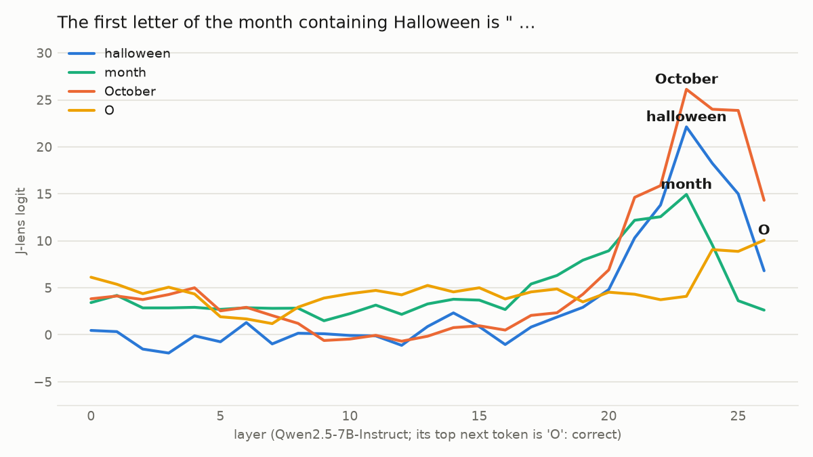

### Fact: The first letter of the month containing Halloween is " **O**

**Hidden reasoning:** October → O

**Qwen2.5-7B-Instruct (this graph):** ✅ predicts `O`; top 5: `O`, `o`, `N`, `M`, `October`

No-CoT answers via OpenRouter

- ✅ qwen-2.5-7b-instruct: `O`
- ✅ qwen3.6-27b: `O`
- ✅ qwen3-32b: `O"`
- ✅ gemma-4-26b-a4b-it: `O`
- ✅ gemma-4-31b-it: `O`
- ✅ mistral-small-24b-instruct-2501: `October`
- ✅ llama-3.3-70b-instruct: `O`

---

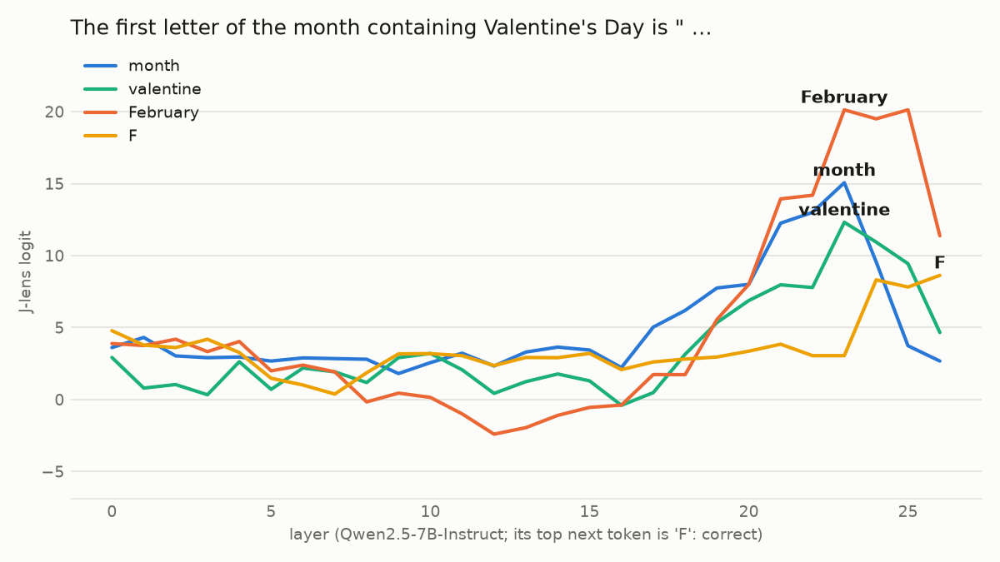

### Fact: The first letter of the month containing Valentine's Day is " **F**

**Hidden reasoning:** February → F

**Qwen2.5-7B-Instruct (this graph):** ✅ predicts `F`; top 5: `F`, `J`, `M`, `f`, `m`

No-CoT answers via OpenRouter

- ✅ qwen-2.5-7b-instruct: `F`
- ✅ qwen3.6-27b: `F`
- ✅ qwen3-32b: `F`
- ✅ gemma-4-26b-a4b-it: `F`
- ✅ gemma-4-31b-it: `F`
- ✅ mistral-small-24b-instruct-2501: `February`
- ✅ llama-3.3-70b-instruct: `F`

---

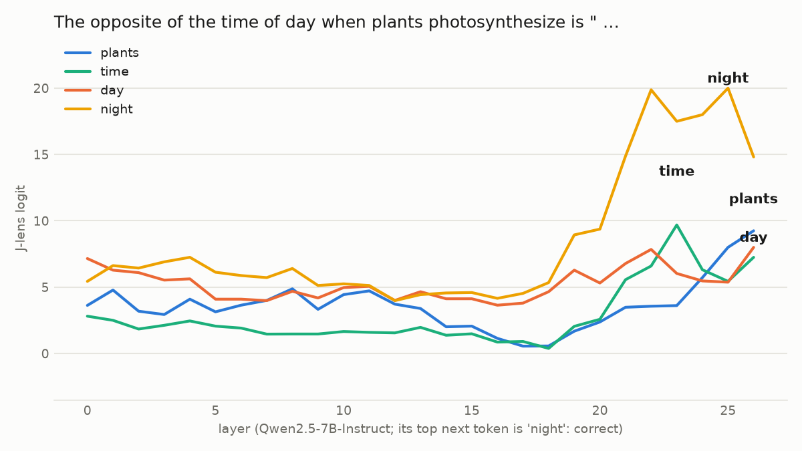

### Fact: The opposite of the time of day when plants photosynthesize is " **night**

**Hidden reasoning:** day → night

**Qwen2.5-7B-Instruct (this graph):** ✅ predicts `night`; top 5: `night`, `mid`, `d`, `dark`, `Night`

No-CoT answers via OpenRouter

- ✅ qwen-2.5-7b-instruct: `night`
- ✅ qwen3.6-27b: `night`
- ✅ qwen3-32b: `night.`
- ✅ gemma-4-26b-a4b-it: `night`
- ✅ gemma-4-31b-it: `night"`
- ✅ mistral-small-24b-instruct-2501: `night`
- ✅ llama-3.3-70b-instruct: `night`

---

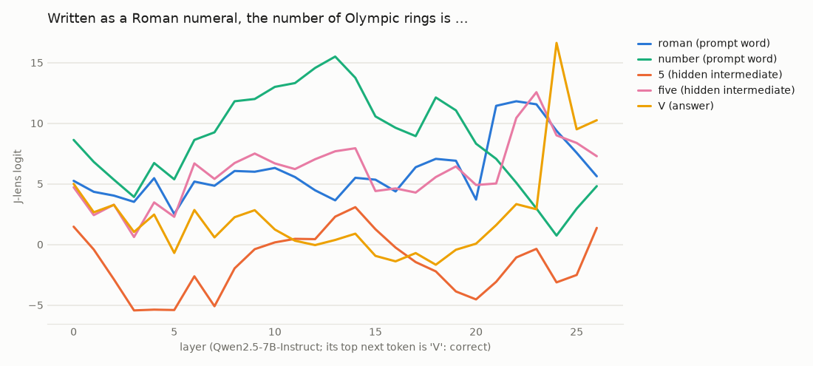

### Fact: Written as a Roman numeral, the number of Olympic rings is **V**

**Hidden reasoning:** 5 → five → V

**Qwen2.5-7B-Instruct (this graph):** ✅ predicts `V`; top 5: `V`, `MMM`, `VII`, `VIII`, `XV`

No-CoT answers via OpenRouter

- ✅ qwen-2.5-7b-instruct: `V`
- ✅ qwen3.6-27b: `V`
- ✅ qwen3-32b: `V.`
- ✅ gemma-4-26b-a4b-it: `V`
- ✅ gemma-4-31b-it: `V`
- ✅ mistral-small-24b-instruct-2501: `V`
- ❌ llama-3.3-70b-instruct: `Five`

---

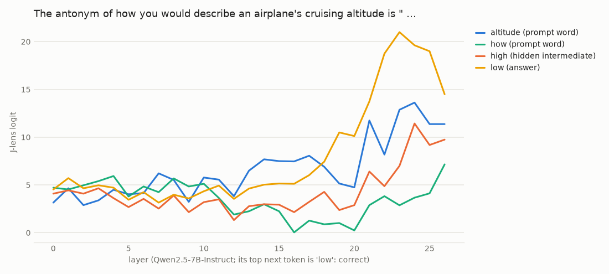

### Fact: The antonym of how you would describe an airplane's cruising altitude is " **low**

**Hidden reasoning:** high → low

**Qwen2.5-7B-Instruct (this graph):** ✅ predicts `low`; top 5: `low`, `ground`, `close`, `very`, `too`

No-CoT answers via OpenRouter

- ✅ qwen-2.5-7b-instruct: `low`
- ✅ qwen3.6-27b: `low`
- ❌ qwen3-32b: ``
- ✅ gemma-4-26b-a4b-it: `low`
- ✅ gemma-4-31b-it: `low`
- ✅ mistral-small-24b-instruct-2501: `low`
- ✅ llama-3.3-70b-instruct: `low`

## Answered wrong

---

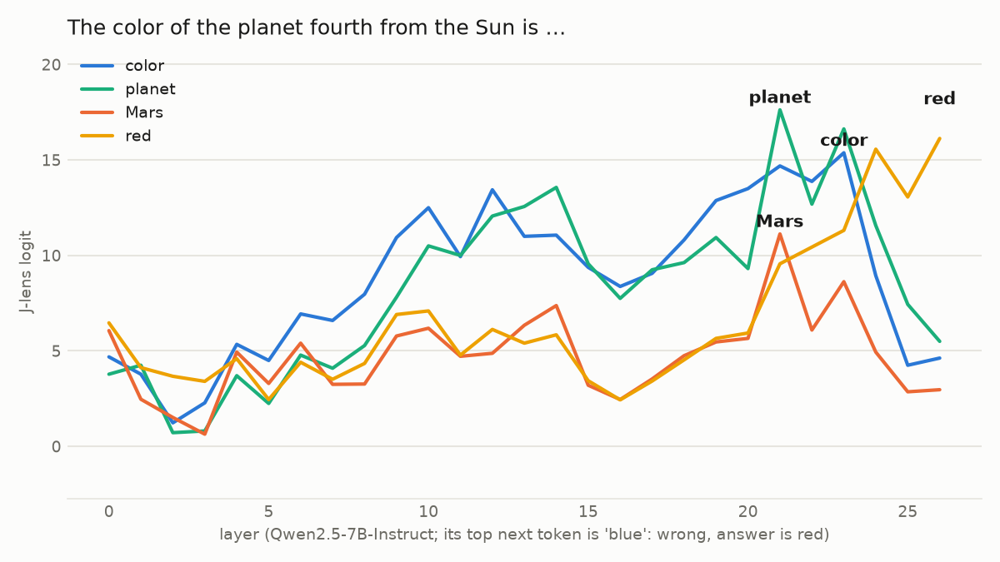

### Fact: The color of the planet fourth from the Sun is **red**

**Hidden reasoning:** Mars → red

**Qwen2.5-7B-Instruct (this graph):** ❌ predicts `blue`; top 5: `blue`, `red`, `green`, `brown`, `a`

No-CoT answers via OpenRouter

- ❌ qwen-2.5-7b-instruct: `Blue`
- ✅ qwen3.6-27b: `red`
- ✅ qwen3-32b: `red.`
- ✅ gemma-4-26b-a4b-it: `red`
- ✅ gemma-4-31b-it: `red`
- ✅ mistral-small-24b-instruct-2501: `Red`
- ✅ llama-3.3-70b-instruct: `red`

---

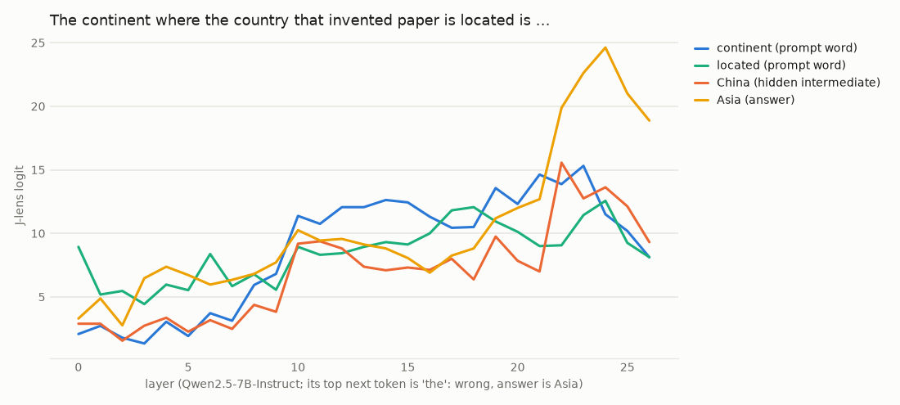

### Fact: The continent where the country that invented paper is located is **Asia**

**Hidden reasoning:** China → Asia

**Qwen2.5-7B-Instruct (this graph):** ❌ predicts `the`; top 5: `the`, `Asia`, `surrounded`, `also`, `Euras`

No-CoT answers via OpenRouter

- ✅ qwen-2.5-7b-instruct: `Asia`
- ✅ qwen3.6-27b: `Asia`
- ✅ qwen3-32b: `Asia.`
- ✅ gemma-4-26b-a4b-it: `Asia`
- ✅ gemma-4-31b-it: `Asia`
- ✅ mistral-small-24b-instruct-2501: `Asia`
- ✅ llama-3.3-70b-instruct: `Asia`

---

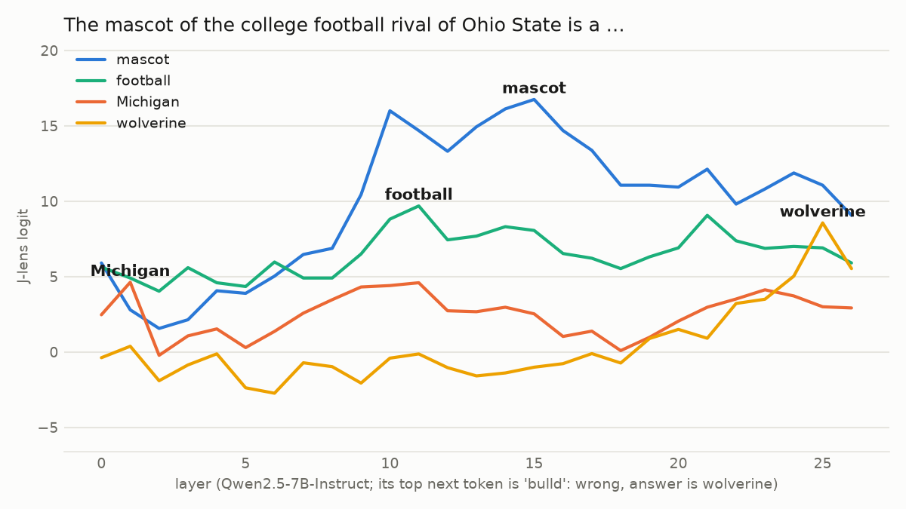

### Fact: The mascot of the college football rival of Ohio State is a **wolverine**

**Hidden reasoning:** Michigan → wolverine

**Qwen2.5-7B-Instruct (this graph):** ❌ predicts `bulld`; top 5: `bulld`, `golden`, `ram`, `b`, `fighting`

No-CoT answers via OpenRouter

- ❌ qwen-2.5-7b-instruct: `Buckeye`
- ❌ qwen3.6-27b: `Buckeye`
- ❌ qwen3-32b: ``
- ❌ gemma-4-26b-a4b-it: `Michigan`
- ✅ gemma-4-31b-it: `Wolverine`
- ❌ mistral-small-24b-instruct-2501: `Buckeye`
- ✅ llama-3.3-70b-instruct: `Wolverine`

---

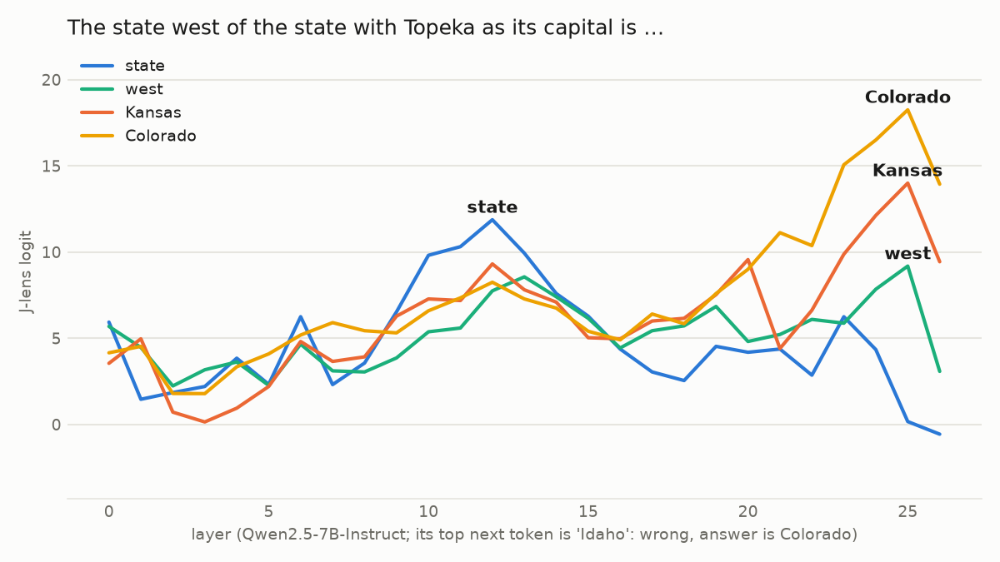

### Fact: The state west of the state with Topeka as its capital is **Colorado**

**Hidden reasoning:** Kansas → Colorado

**Qwen2.5-7B-Instruct (this graph):** ❌ predicts `Idaho`; top 5: `Idaho`, `Colorado`, `Nevada`, `Montana`, `Oregon`

No-CoT answers via OpenRouter

- ❌ qwen-2.5-7b-instruct: `Kansas`
- ❌ qwen3.6-27b: `Nebraska`
- ❌ qwen3-32b: ``
- ✅ gemma-4-26b-a4b-it: `Colorado`
- ✅ gemma-4-31b-it: `Colorado`
- ✅ mistral-small-24b-instruct-2501: `Colorado`
- ✅ llama-3.3-70b-instruct: `Colorado`

---

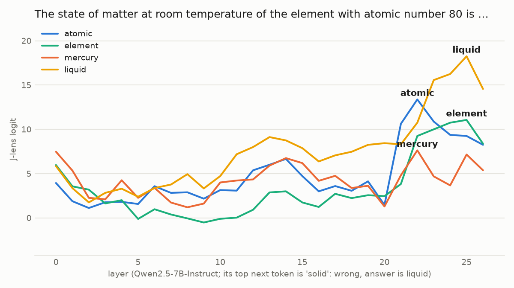

### Fact: The state of matter at room temperature of the element with atomic number 80 is **liquid**

**Hidden reasoning:** mercury → liquid

**Qwen2.5-7B-Instruct (this graph):** ❌ predicts `solid`; top 5: `solid`, `a`, `liquid`, `gas`, `Solid`

No-CoT answers via OpenRouter

- ❌ qwen-2.5-7b-instruct: `gas`
- ❌ qwen3.6-27b: `solid`
- ❌ qwen3-32b: ``
- ✅ gemma-4-26b-a4b-it: `liquid`
- ❌ gemma-4-31b-it: `solid`
- ❌ mistral-small-24b-instruct-2501: `Solid`
- ❌ llama-3.3-70b-instruct: `solid`

---

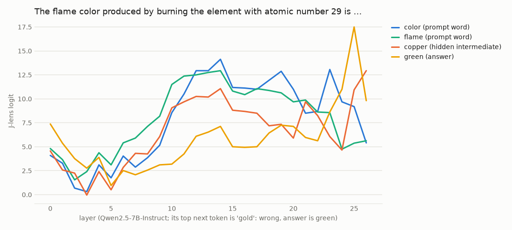

### Fact: The flame color produced by burning the element with atomic number 29 is **green**

**Hidden reasoning:** copper → green

**Qwen2.5-7B-Instruct (this graph):** ❌ predicts `gold`; top 5: `gold`, `silver`, `yellow`, `copper`, `blue`

No-CoT answers via OpenRouter

- ❌ qwen-2.5-7b-instruct: `Cu`
- ✅ qwen3.6-27b: `green`
- ❌ qwen3-32b: ``
- ❌ gemma-4-26b-a4b-it: `gold`
- ✅ gemma-4-31b-it: `green`
- ✅ mistral-small-24b-instruct-2501: `Green`
- ✅ llama-3.3-70b-instruct: `green`

---

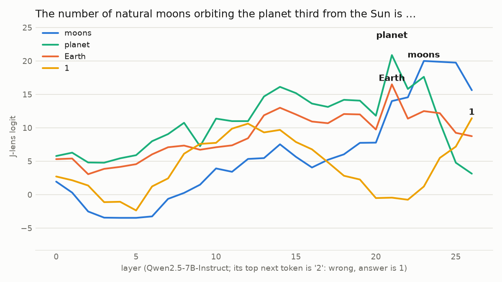

### Fact: The number of natural moons orbiting the planet third from the Sun is **1**

**Hidden reasoning:** Earth → 1

**Qwen2.5-7B-Instruct (this graph):** ❌ predicts `2`; top 5: `2`, `1`, `6`, `0`, `3`

No-CoT answers via OpenRouter

- ❌ qwen-2.5-7b-instruct: `4`
- ❌ qwen3.6-27b: `0`
- ❌ qwen3-32b: ``
- ❌ gemma-4-26b-a4b-it: `zero`
- ✅ gemma-4-31b-it: `1`
- ❌ mistral-small-24b-instruct-2501: `2`
- ❌ llama-3.3-70b-instruct: `one`

---

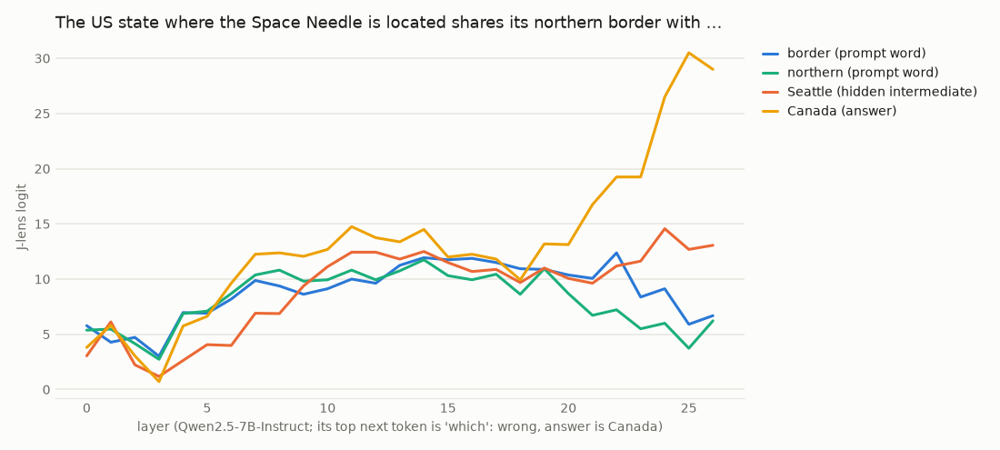

### Fact: The US state where the Space Needle is located shares its northern border with **Canada**

**Hidden reasoning:** Seattle → Canada

**Qwen2.5-7B-Instruct (this graph):** ❌ predicts `which`; top 5: `which`, `another`, `a`, `the`, `what`

No-CoT answers via OpenRouter

- ✅ qwen-2.5-7b-instruct: `Canada`
- ✅ qwen3.6-27b: `Canada`
- ❌ qwen3-32b: ``
- ✅ gemma-4-26b-a4b-it: `Canada`
- ✅ gemma-4-31b-it: `Canada`
- ✅ mistral-small-24b-instruct-2501: `Canada`
- ✅ llama-3.3-70b-instruct: `Canada`

---

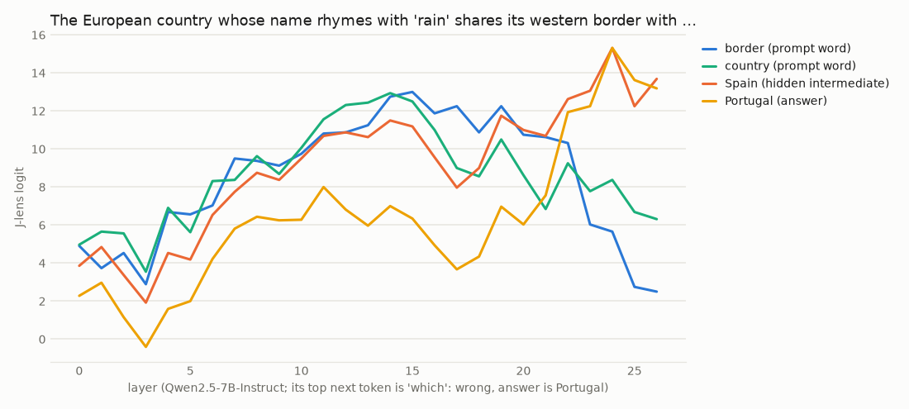

### Fact: The European country whose name rhymes with 'rain' shares its western border with **Portugal**

**Hidden reasoning:** Spain → Portugal

**Qwen2.5-7B-Instruct (this graph):** ❌ predicts `which`; top 5: `which`, `France`, `a`, `the`, `what`

No-CoT answers via OpenRouter

- ❌ qwen-2.5-7b-instruct: `France`
- ❌ qwen3.6-27b: `France`
- ❌ qwen3-32b: `Spain.`
- ❌ gemma-4-26b-a4b-it: `Spain`
- ❌ gemma-4-31b-it: `Spain`
- ❌ mistral-small-24b-instruct-2501: `France`
- ❌ llama-3.3-70b-instruct: `Spain`

---

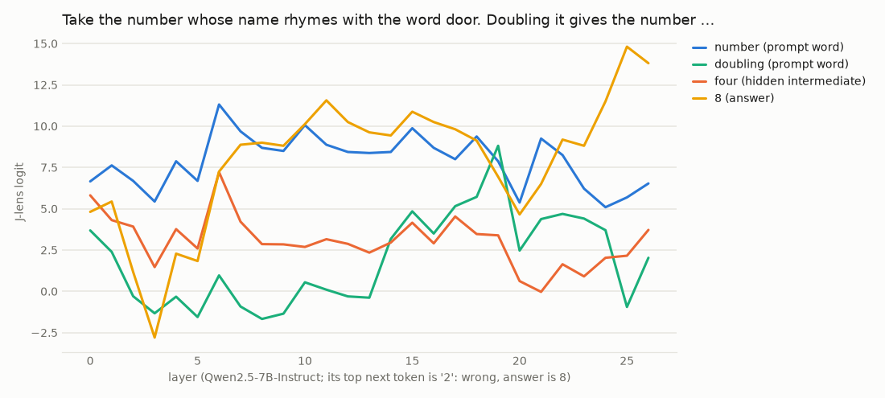

### Fact: Take the number whose name rhymes with the word door. Doubling it gives the number **8**

**Hidden reasoning:** four → 8

**Qwen2.5-7B-Instruct (this graph):** ❌ predicts `2`; top 5: `2`, `1`, `8`, `3`, `5`

No-CoT answers via OpenRouter

- ❌ qwen-2.5-7b-instruct: `2`
- ❌ qwen3.6-27b: `4`
- ❌ qwen3-32b: `eight`
- ❌ gemma-4-26b-a4b-it: `four`
- ✅ gemma-4-31b-it: `8`
- ❌ mistral-small-24b-instruct-2501: `Four`
- ❌ llama-3.3-70b-instruct: `four`

---

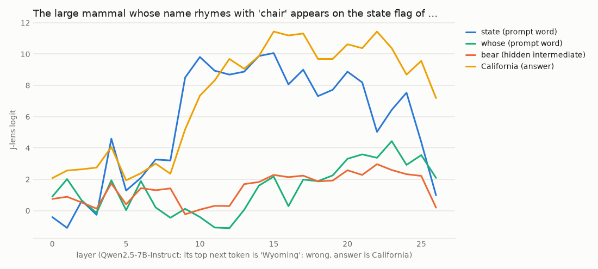

### Fact: The large mammal whose name rhymes with 'chair' appears on the state flag of **California**

**Hidden reasoning:** bear → California

**Qwen2.5-7B-Instruct (this graph):** ❌ predicts `Wyoming`; top 5: `Wyoming`, `Iowa`, `Texas`, `Oklahoma`, `Michigan`

No-CoT answers via OpenRouter

- ❌ qwen-2.5-7b-instruct: `Maine`
- ❌ qwen3.6-27b: `Texas`
- ❌ qwen3-32b: ``
- ✅ gemma-4-26b-a4b-it: `California`
- ❌ gemma-4-31b-it: `Wyoming`
- ✅ mistral-small-24b-instruct-2501: `California`
- ❌ llama-3.3-70b-instruct: `Alaska`

---

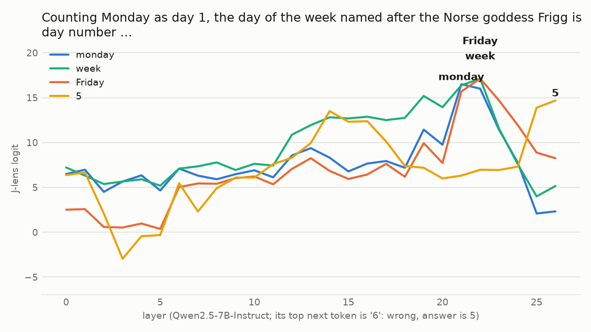

### Fact: Counting Monday as day 1, the day of the week named after the Norse goddess Frigg is day number **5**

**Hidden reasoning:** Friday → 5

**Qwen2.5-7B-Instruct (this graph):** ❌ predicts `6`; top 5: `6`, `5`, `4`, `7`, `3`

No-CoT answers via OpenRouter

- ❌ qwen-2.5-7b-instruct: `6`
- ❌ qwen3.6-27b: `2`
- ❌ qwen3-32b: ``
- ✅ gemma-4-26b-a4b-it: `5`
- ✅ gemma-4-31b-it: `5`
- ✅ mistral-small-24b-instruct-2501: `5`
- ✅ llama-3.3-70b-instruct: `5`

---

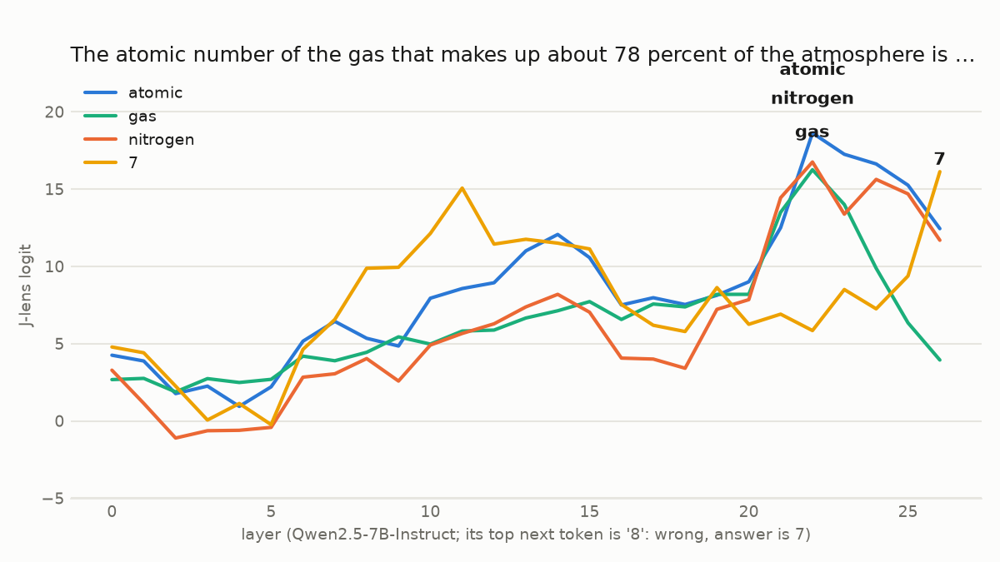

### Fact: The atomic number of the gas that makes up about 78 percent of the atmosphere is **7**

**Hidden reasoning:** nitrogen → 7

**Qwen2.5-7B-Instruct (this graph):** ❌ predicts `8`; top 5: `8`, `7`, `6`, `1`, `2`

No-CoT answers via OpenRouter

- ❌ qwen-2.5-7b-instruct: `10`
- ✅ qwen3.6-27b: `7`
- ❌ qwen3-32b: ``
- ✅ gemma-4-26b-a4b-it: `7`
- ✅ gemma-4-31b-it: `7`
- ✅ mistral-small-24b-instruct-2501: `7`
- ✅ llama-3.3-70b-instruct: `7`

---

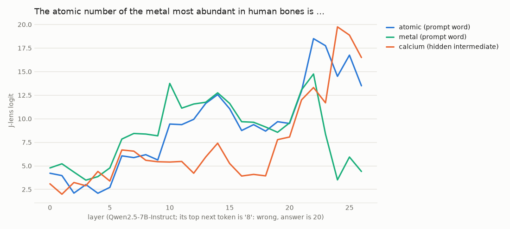

### Fact: The atomic number of the metal most abundant in human bones is **20**

**Hidden reasoning:** calcium → 20

**Qwen2.5-7B-Instruct (this graph):** ❌ predicts `8`; top 5: `8`, `1`, `2`, `6`, `5`

No-CoT answers via OpenRouter

- ❌ qwen-2.5-7b-instruct: `12`
- ✅ qwen3.6-27b: `20`
- ❌ qwen3-32b: ``
- ✅ gemma-4-26b-a4b-it: `20`
- ✅ gemma-4-31b-it: `20`
- ✅ mistral-small-24b-instruct-2501: `20`
- ✅ llama-3.3-70b-instruct: `20`

---

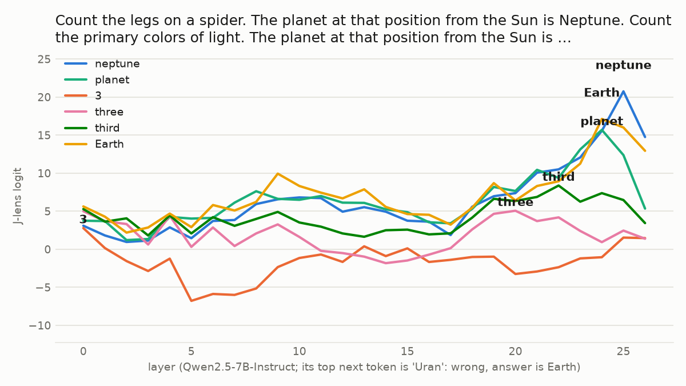

### Count the legs on a spider. The planet at that position from the Sun is Neptune. Count the primary colors of light. The planet at that position from the Sun is **Earth**

**Hidden reasoning:** 3 → three → third → Earth

**Qwen2.5-7B-Instruct (this graph):** ❌ predicts `Uran`; top 5: `Uran`, `Saturn`, `Mars`, `Earth`, `Pluto`

No-CoT answers via OpenRouter

- ❌ qwen-2.5-7b-instruct: `Jupiter`
- ❌ qwen3.6-27b: `Jupiter`
- ❌ qwen3-32b: ``
- ✅ gemma-4-26b-a4b-it: `Earth`
- ✅ gemma-4-31b-it: `Earth`
- ❌ mistral-small-24b-instruct-2501: `8`
- ❌ llama-3.3-70b-instruct: `Venus`

---

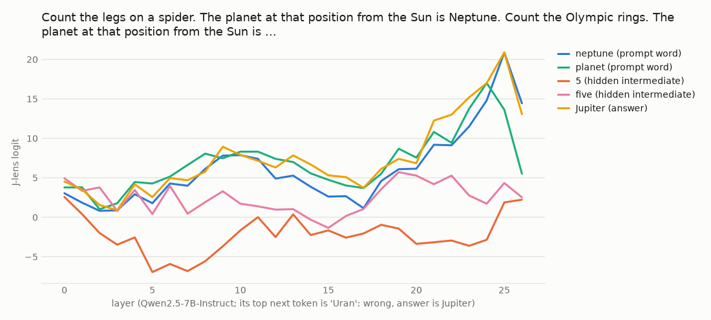

### Count the legs on a spider. The planet at that position from the Sun is Neptune. Count the Olympic rings. The planet at that position from the Sun is **Jupiter**

**Hidden reasoning:** 5 → five → Jupiter

**Qwen2.5-7B-Instruct (this graph):** ❌ predicts `Uran`; top 5: `Uran`, `Saturn`, `Earth`, `Mars`, `Pluto`

No-CoT answers via OpenRouter

- ❌ qwen-2.5-7b-instruct: `Eighth`
- ❌ qwen3.6-27b: `Mars`
- ❌ qwen3-32b: ``
- ✅ gemma-4-26b-a4b-it: `Jupiter`
- ✅ gemma-4-31b-it: `Jupiter`
- ❌ mistral-small-24b-instruct-2501: `8`
- ❌ llama-3.3-70b-instruct: `Mars`

---

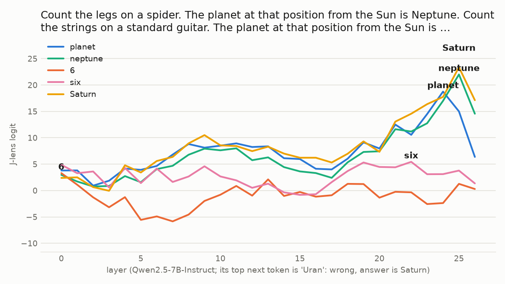

### Count the legs on a spider. The planet at that position from the Sun is Neptune. Count the strings on a standard guitar. The planet at that position from the Sun is **Saturn**

**Hidden reasoning:** 6 → six → Saturn

**Qwen2.5-7B-Instruct (this graph):** ❌ predicts `Uran`; top 5: `Uran`, `Saturn`, `Earth`, `Pluto`, `Mars`

No-CoT answers via OpenRouter

- ❌ qwen-2.5-7b-instruct: `Eighth`
- ✅ qwen3.6-27b: `Saturn`
- ✅ qwen3-32b: `Saturn.`
- ❌ gemma-4-26b-a4b-it: `Uranus`
- ❌ gemma-4-31b-it: `Uranus`
- ❌ mistral-small-24b-instruct-2501: `8`
- ❌ llama-3.3-70b-instruct: `Mars`

---

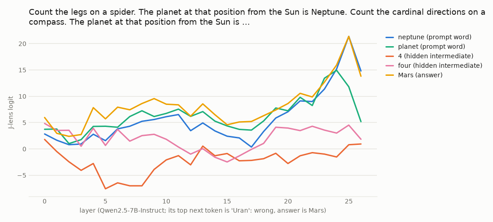

### Count the legs on a spider. The planet at that position from the Sun is Neptune. Count the cardinal directions on a compass. The planet at that position from the Sun is **Mars**

**Hidden reasoning:** 4 → four → Mars

**Qwen2.5-7B-Instruct (this graph):** ❌ predicts `Uran`; top 5: `Uran`, `Saturn`, `Earth`, `Mars`, `Pluto`

No-CoT answers via OpenRouter

- ❌ qwen-2.5-7b-instruct: `4`
- ❌ qwen3.6-27b: `Earth`
- ❌ qwen3-32b: ``
- ✅ gemma-4-26b-a4b-it: `Mars`
- ✅ gemma-4-31b-it: `Mars`
- ✅ mistral-small-24b-instruct-2501: `Mars`
- ✅ llama-3.3-70b-instruct: `Mars`

---

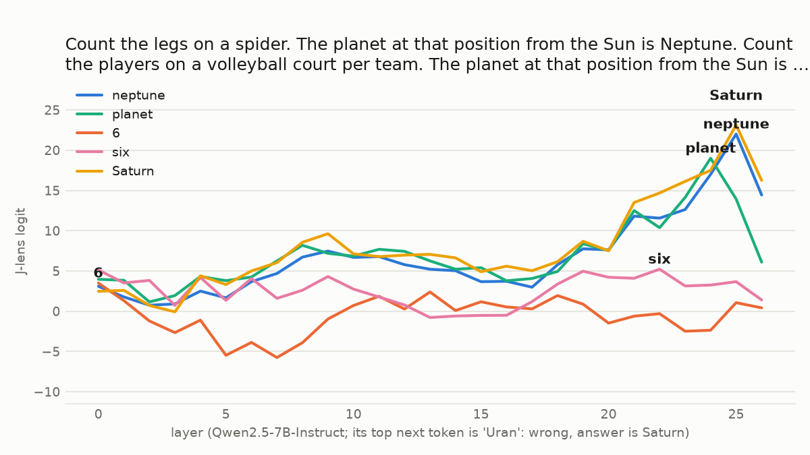

### Count the legs on a spider. The planet at that position from the Sun is Neptune. Count the players on a volleyball court per team. The planet at that position from the Sun is **Saturn**

**Hidden reasoning:** 6 → six → Saturn

**Qwen2.5-7B-Instruct (this graph):** ❌ predicts `Uran`; top 5: `Uran`, `Saturn`, `Earth`, `Pluto`, `Mars`

No-CoT answers via OpenRouter

- ❌ qwen-2.5-7b-instruct: `5`
- ✅ qwen3.6-27b: `Saturn`
- ❌ qwen3-32b: `Uranus.`
- ❌ gemma-4-26b-a4b-it: `Uranus`
- ❌ gemma-4-31b-it: `Uranus`
- ❌ mistral-small-24b-instruct-2501: `6`
- ❌ llama-3.3-70b-instruct: `Earth`

---

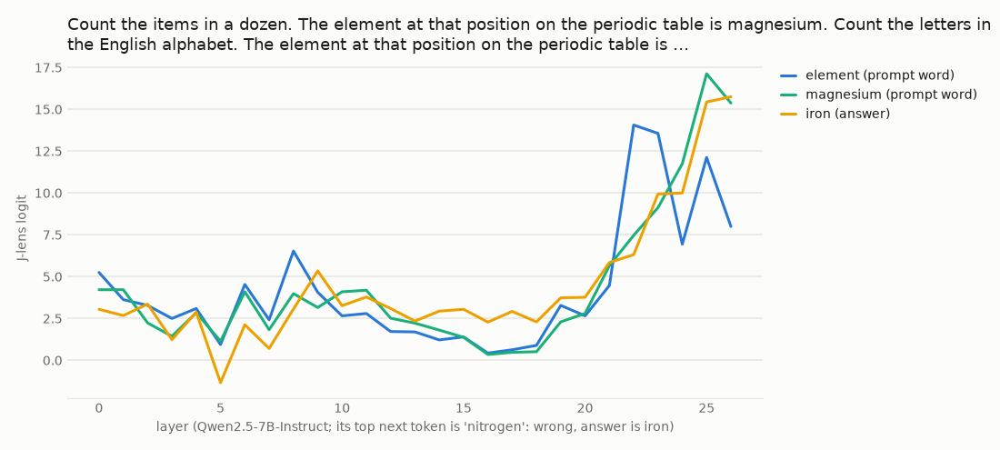

### Count the items in a dozen. The element at that position on the periodic table is magnesium. Count the letters in the English alphabet. The element at that position on the periodic table is **iron**

**Hidden reasoning:** 26 → iron

**Qwen2.5-7B-Instruct (this graph):** ❌ predicts `nitrogen`; top 5: `nitrogen`, `aluminum`, `silicon`, `neon`, `oxygen`

No-CoT answers via OpenRouter

- ✅ qwen-2.5-7b-instruct: `Iron`
- ❌ qwen3.6-27b: `nickel`
- ✅ qwen3-32b: `iron.`
- ❌ gemma-4-26b-a4b-it: `phosphorus`
- ❌ gemma-4-31b-it: `Gallium`
- ❌ mistral-small-24b-instruct-2501: `12`
- ❌ llama-3.3-70b-instruct: `oxygen`

---

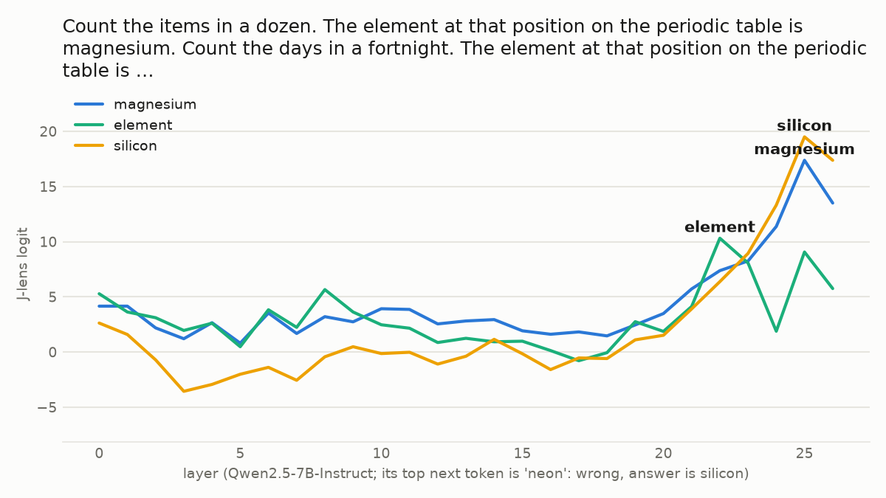

### Count the items in a dozen. The element at that position on the periodic table is magnesium. Count the days in a fortnight. The element at that position on the periodic table is **silicon**

**Hidden reasoning:** 14 → silicon

**Qwen2.5-7B-Instruct (this graph):** ❌ predicts `neon`; top 5: `neon`, `silicon`, `aluminum`, `iron`, `arg`

No-CoT answers via OpenRouter

- ❌ qwen-2.5-7b-instruct: `Iron`
- ❌ qwen3.6-27b: `nitrogen`
- ❌ qwen3-32b: ``
- ❌ gemma-4-26b-a4b-it: `phosphorus`
- ❌ gemma-4-31b-it: `Germanium`
- ❌ mistral-small-24b-instruct-2501: `14`
- ❌ llama-3.3-70b-instruct: `calcium`

---

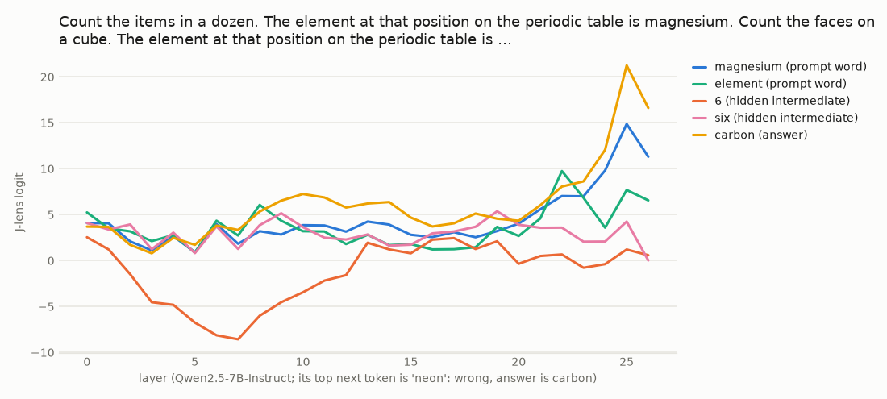

### Count the items in a dozen. The element at that position on the periodic table is magnesium. Count the faces on a cube. The element at that position on the periodic table is **carbon**

**Hidden reasoning:** 6 → six → carbon

**Qwen2.5-7B-Instruct (this graph):** ❌ predicts `neon`; top 5: `neon`, `carbon`, `iron`, `arg`, `oxygen`

No-CoT answers via OpenRouter

- ❌ qwen-2.5-7b-instruct: `12`
- ✅ qwen3.6-27b: `carbon`
- ✅ qwen3-32b: `Carbon.`
- ✅ gemma-4-26b-a4b-it: `carbon`
- ✅ gemma-4-31b-it: `carbon`
- ❌ mistral-small-24b-instruct-2501: `Oxygen`
- ✅ llama-3.3-70b-instruct: `carbon`

---

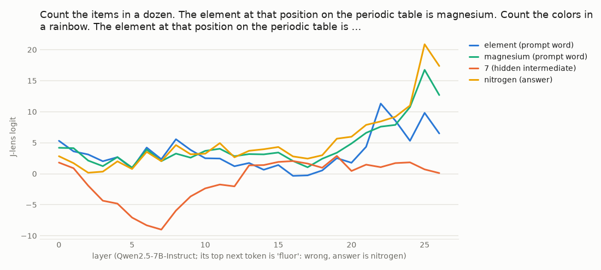

### Count the items in a dozen. The element at that position on the periodic table is magnesium. Count the colors in a rainbow. The element at that position on the periodic table is **nitrogen**

**Hidden reasoning:** 7 → nitrogen

**Qwen2.5-7B-Instruct (this graph):** ❌ predicts `fluor`; top 5: `fluor`, `aluminum`, `neon`, `silicon`, `sulfur`

No-CoT answers via OpenRouter

- ✅ qwen-2.5-7b-instruct: `Nitrogen`
- ✅ qwen3.6-27b: `nitrogen`
- ❌ qwen3-32b: ``
- ✅ gemma-4-26b-a4b-it: `nitrogen`
- ✅ gemma-4-31b-it: `Nitrogen`
- ❌ mistral-small-24b-instruct-2501: `12`
- ❌ llama-3.3-70b-instruct: `Phosphorus`

---

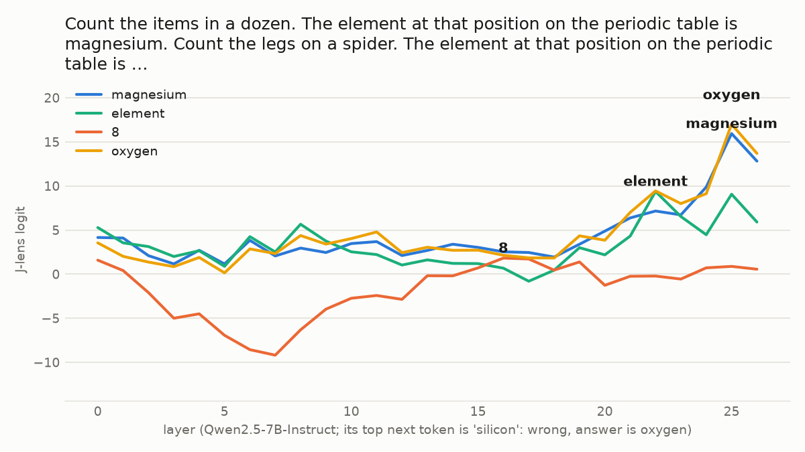

### Count the items in a dozen. The element at that position on the periodic table is magnesium. Count the legs on a spider. The element at that position on the periodic table is **oxygen**

**Hidden reasoning:** 8 → oxygen

**Qwen2.5-7B-Instruct (this graph):** ❌ predicts `silicon`; top 5: `silicon`, `aluminum`, `sulfur`, `neon`, `iron`

No-CoT answers via OpenRouter

- ❌ qwen-2.5-7b-instruct: `Silicon`
- ✅ qwen3.6-27b: `oxygen`
- ❌ qwen3-32b: ``
- ✅ gemma-4-26b-a4b-it: `oxygen`
- ✅ gemma-4-31b-it: `oxygen`
- ❌ mistral-small-24b-instruct-2501: `Selenium`
- ❌ llama-3.3-70b-instruct: `carbon`

---

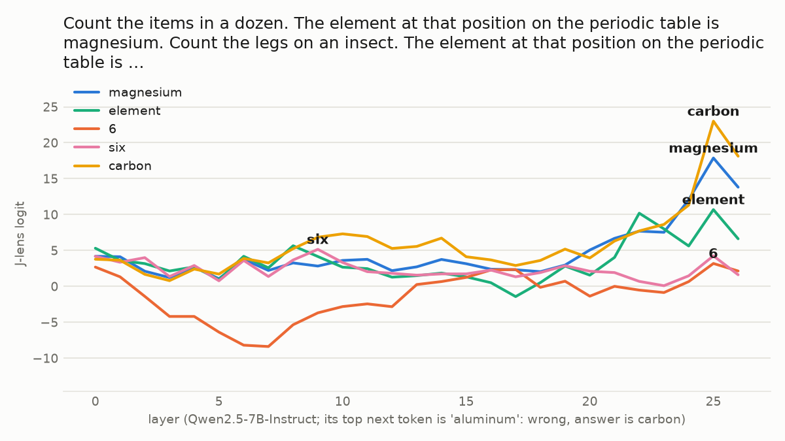

### Count the items in a dozen. The element at that position on the periodic table is magnesium. Count the legs on an insect. The element at that position on the periodic table is **carbon**

**Hidden reasoning:** 6 → six → carbon

**Qwen2.5-7B-Instruct (this graph):** ❌ predicts `aluminum`; top 5: `aluminum`, `neon`, `silicon`, `sulfur`, `carbon`

No-CoT answers via OpenRouter

- ❌ qwen-2.5-7b-instruct: `Silicon`
- ✅ qwen3.6-27b: `carbon`
- ❌ qwen3-32b: ``
- ✅ gemma-4-26b-a4b-it: `carbon`
- ✅ gemma-4-31b-it: `Carbon`
- ❌ mistral-small-24b-instruct-2501: `12`
- ✅ llama-3.3-70b-instruct: `carbon`

---

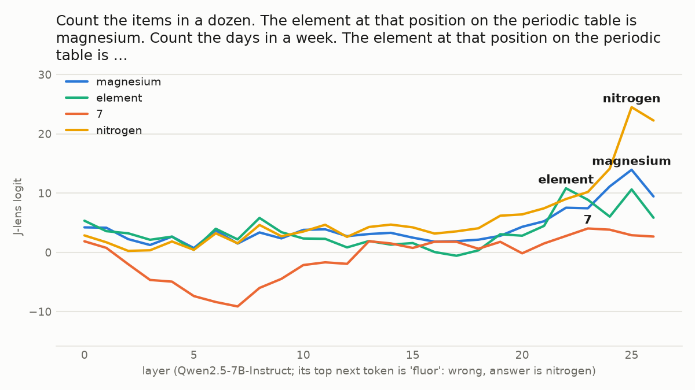

### Count the items in a dozen. The element at that position on the periodic table is magnesium. Count the days in a week. The element at that position on the periodic table is **nitrogen**

**Hidden reasoning:** 7 → nitrogen

**Qwen2.5-7B-Instruct (this graph):** ❌ predicts `fluor`; top 5: `fluor`, `nitrogen`, `neon`, `flour`, `oxygen`

No-CoT answers via OpenRouter

- ✅ qwen-2.5-7b-instruct: `Nitrogen`
- ✅ qwen3.6-27b: `nitrogen`
- ❌ qwen3-32b: ``
- ✅ gemma-4-26b-a4b-it: `nitrogen`
- ✅ gemma-4-31b-it: `Nitrogen`
- ❌ mistral-small-24b-instruct-2501: `7`
- ❌ llama-3.3-70b-instruct: `Carbon`

---

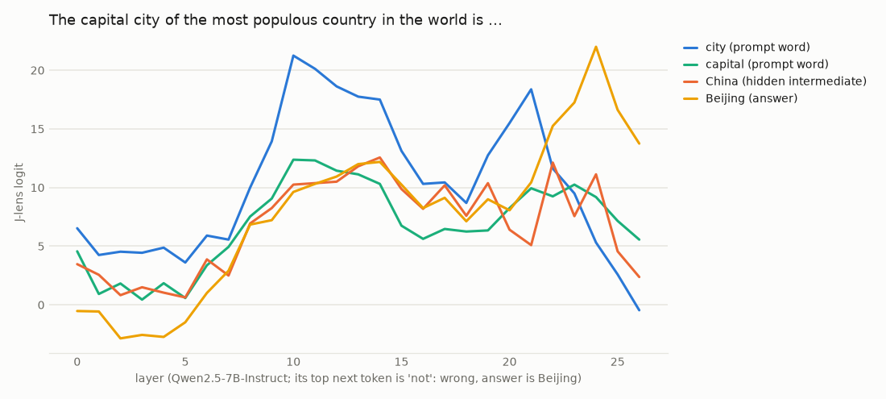

### Fact: The capital city of the most populous country in the world is **Beijing**

**Hidden reasoning:** China → Beijing

**Qwen2.5-7B-Instruct (this graph):** ❌ predicts `not`; top 5: `not`, `also`, `the`, `located`, `a`

No-CoT answers via OpenRouter

- ✅ qwen-2.5-7b-instruct: `Beijing`
- ✅ qwen3.6-27b: `Beijing`
- ✅ qwen3-32b: `Beijing.`
- ❌ gemma-4-26b-a4b-it: `New`
- ❌ gemma-4-31b-it: `New`
- ✅ mistral-small-24b-instruct-2501: `Beijing`
- ✅ llama-3.3-70b-instruct: `Beijing`

---

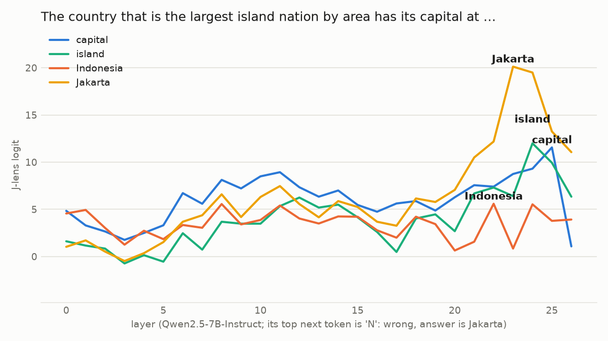

### Fact: The country that is the largest island nation by area has its capital at **Jakarta**

**Hidden reasoning:** Indonesia → Jakarta

**Qwen2.5-7B-Instruct (this graph):** ❌ predicts `N`; top 5: `N`, `Port`, `Rey`, `which`, `B`

No-CoT answers via OpenRouter

- ✅ qwen-2.5-7b-instruct: `Jakarta`
- ✅ qwen3.6-27b: `Jakarta`
- ❌ qwen3-32b: ``
- ✅ gemma-4-26b-a4b-it: `Jakarta`
- ❌ gemma-4-31b-it: `Canberra`
- ❌ mistral-small-24b-instruct-2501: `Wellington`
- ✅ llama-3.3-70b-instruct: `Jakarta`

---

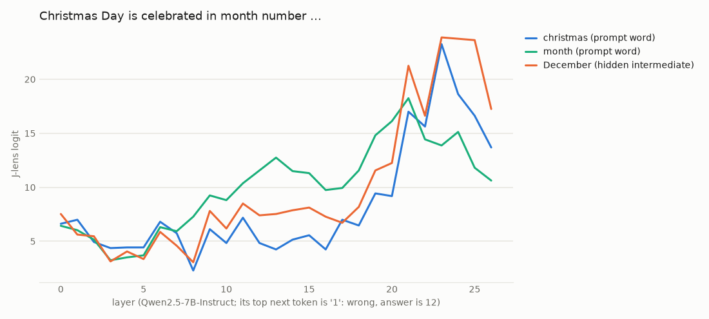

### Fact: Christmas Day is celebrated in month number **12**

**Hidden reasoning:** December → 12

**Qwen2.5-7B-Instruct (this graph):** ❌ predicts `1`; top 5: `1`, `2`, `9`, `6`, `3`

No-CoT answers via OpenRouter

- ❌ qwen-2.5-7b-instruct: `25`
- ✅ qwen3.6-27b: `12`
- ❌ qwen3-32b: ``
- ✅ gemma-4-26b-a4b-it: `12`
- ✅ gemma-4-31b-it: `12`
- ✅ mistral-small-24b-instruct-2501: `12`
- ✅ llama-3.3-70b-instruct: `12`

---

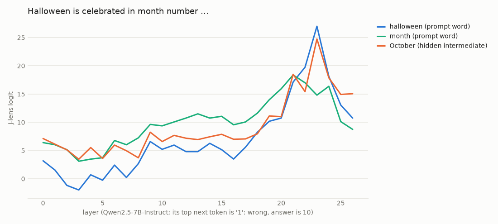

### Fact: Halloween is celebrated in month number **10**

**Hidden reasoning:** October → 10

**Qwen2.5-7B-Instruct (this graph):** ❌ predicts `1`; top 5: `1`, `9`, `7`, `8`, `October`

No-CoT answers via OpenRouter

- ✅ qwen-2.5-7b-instruct: `10`
- ✅ qwen3.6-27b: `10`
- ✅ qwen3-32b: `10`
- ✅ gemma-4-26b-a4b-it: `10`
- ✅ gemma-4-31b-it: `10`
- ✅ mistral-small-24b-instruct-2501: `10`
- ✅ llama-3.3-70b-instruct: `10`

---

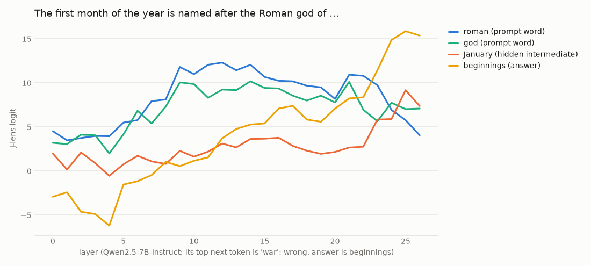

### Fact: The first month of the year is named after the Roman god of **beginnings**

**Hidden reasoning:** January → beginnings

**Qwen2.5-7B-Instruct (this graph):** ❌ predicts `war`; top 5: `war`, `beginnings`, `the`, `War`, `new`

No-CoT answers via OpenRouter

- ❌ qwen-2.5-7b-instruct: `January`
- ❌ qwen3.6-27b: `doors`
- ❌ qwen3-32b: ``
- ❌ gemma-4-26b-a4b-it: `war`
- ✅ gemma-4-31b-it: `beginnings`
- ❌ mistral-small-24b-instruct-2501: `January`
- ❌ llama-3.3-70b-instruct: `January`

---

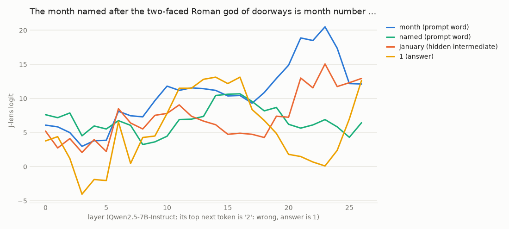

### Fact: The month named after the two-faced Roman god of doorways is month number **1**

**Hidden reasoning:** January → 1

**Qwen2.5-7B-Instruct (this graph):** ❌ predicts `2`; top 5: `2`, `7`, `6`, `1`, `5`

No-CoT answers via OpenRouter

- ❌ qwen-2.5-7b-instruct: `2`
- ✅ qwen3.6-27b: `1`
- ✅ qwen3-32b: `1`
- ❌ gemma-4-26b-a4b-it: `6`
- ✅ gemma-4-31b-it: `1`
- ❌ mistral-small-24b-instruct-2501: `2`
- ❌ llama-3.3-70b-instruct: `January`

---

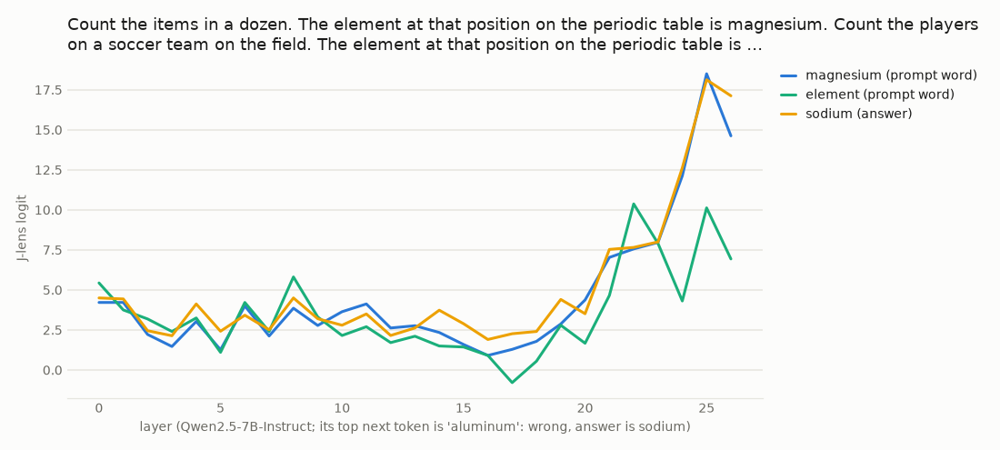

### Count the items in a dozen. The element at that position on the periodic table is magnesium. Count the players on a soccer team on the field. The element at that position on the periodic table is **sodium**

**Hidden reasoning:** 11 → sodium

**Qwen2.5-7B-Instruct (this graph):** ❌ predicts `aluminum`; top 5: `aluminum`, `silicon`, `neon`, `aluminium`, `sodium`

No-CoT answers via OpenRouter

- ❌ qwen-2.5-7b-instruct: `Iron`
- ✅ qwen3.6-27b: `sodium`
- ❌ qwen3-32b: ``
- ✅ gemma-4-26b-a4b-it: `sodium`
- ❌ gemma-4-31b-it: `Sulfur`
- ❌ mistral-small-24b-instruct-2501: `11`
- ❌ llama-3.3-70b-instruct: `carbon`

---

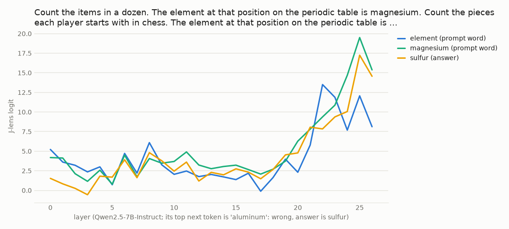

### Count the items in a dozen. The element at that position on the periodic table is magnesium. Count the pieces each player starts with in chess. The element at that position on the periodic table is **sulfur**

**Hidden reasoning:** 16 → sulfur

**Qwen2.5-7B-Instruct (this graph):** ❌ predicts `aluminum`; top 5: `aluminum`, `neon`, `sodium`, `fluor`, `iron`

No-CoT answers via OpenRouter

- ❌ qwen-2.5-7b-instruct: `12`
- ❌ qwen3.6-27b: `silicon`
- ❌ qwen3-32b: ``
- ❌ gemma-4-26b-a4b-it: `phosphorus`
- ❌ gemma-4-31b-it: `Promethium`
- ❌ mistral-small-24b-instruct-2501: `12`
- ❌ llama-3.3-70b-instruct: `carbon`

---

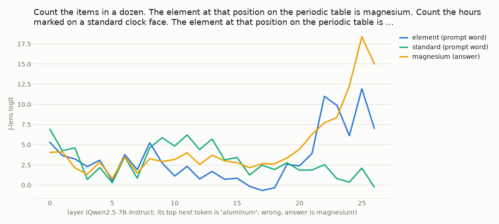

### Count the items in a dozen. The element at that position on the periodic table is magnesium. Count the hours marked on a standard clock face. The element at that position on the periodic table is **magnesium**

**Hidden reasoning:** 12 → magnesium

**Qwen2.5-7B-Instruct (this graph):** ❌ predicts `aluminum`; top 5: `aluminum`, `silicon`, `neon`, `sulfur`, `iron`

No-CoT answers via OpenRouter

- ❌ qwen-2.5-7b-instruct: `Iron`
- ❌ qwen3.6-27b: `carbon`
- ❌ qwen3-32b: `iron.`
- ✅ gemma-4-26b-a4b-it: `magnesium`
- ✅ gemma-4-31b-it: `magnesium`
- ❌ mistral-small-24b-instruct-2501: `12`
- ❌ llama-3.3-70b-instruct: `twelve`

---

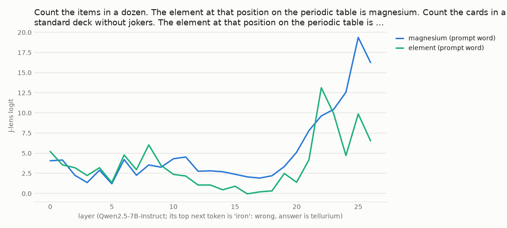

### Count the items in a dozen. The element at that position on the periodic table is magnesium. Count the cards in a standard deck without jokers. The element at that position on the periodic table is **tellurium**

**Hidden reasoning:** 52 → tellurium

**Qwen2.5-7B-Instruct (this graph):** ❌ predicts `iron`; top 5: `iron`, `aluminum`, `neon`, `titanium`, `sodium`

No-CoT answers via OpenRouter

- ❌ qwen-2.5-7b-instruct: `Iron`
- ❌ qwen3.6-27b: `xenon`
- ❌ qwen3-32b: `iron.`
- ❌ gemma-4-26b-a4b-it: `nickel`
- ❌ gemma-4-31b-it: `Europium`
- ❌ mistral-small-24b-instruct-2501: `20`
- ❌ llama-3.3-70b-instruct: `titanium`

---

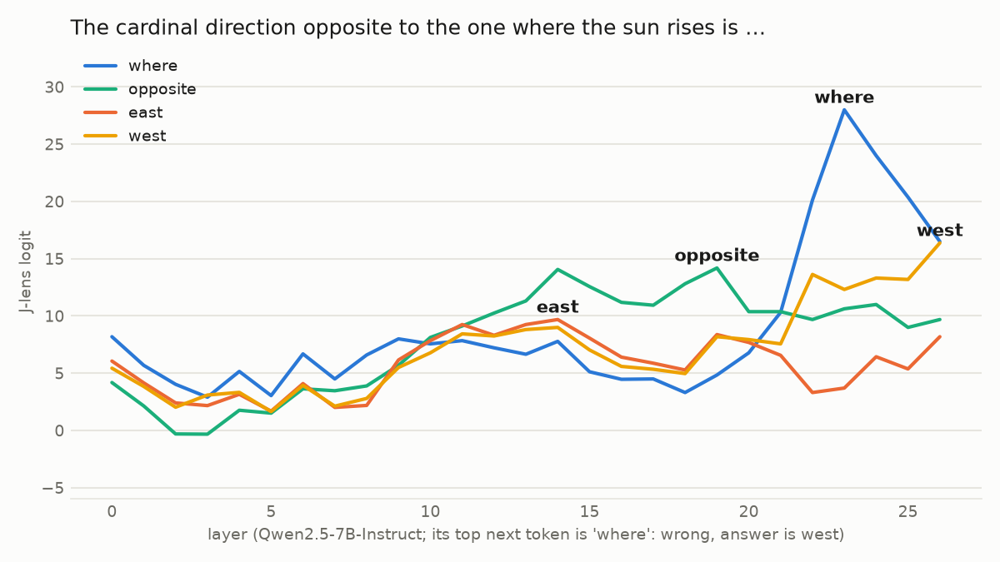

### Fact: The cardinal direction opposite to the one where the sun rises is **west**

**Hidden reasoning:** east → west

**Qwen2.5-7B-Instruct (this graph):** ❌ predicts `where`; top 5: `where`, `the`, `west`, `in`, `to`

No-CoT answers via OpenRouter

- ✅ qwen-2.5-7b-instruct: `west`
- ✅ qwen3.6-27b: `west`
- ❌ qwen3-32b: ``
- ✅ gemma-4-26b-a4b-it: `West`
- ✅ gemma-4-31b-it: `west`
- ✅ mistral-small-24b-instruct-2501: `West`
- ✅ llama-3.3-70b-instruct: `West`

---

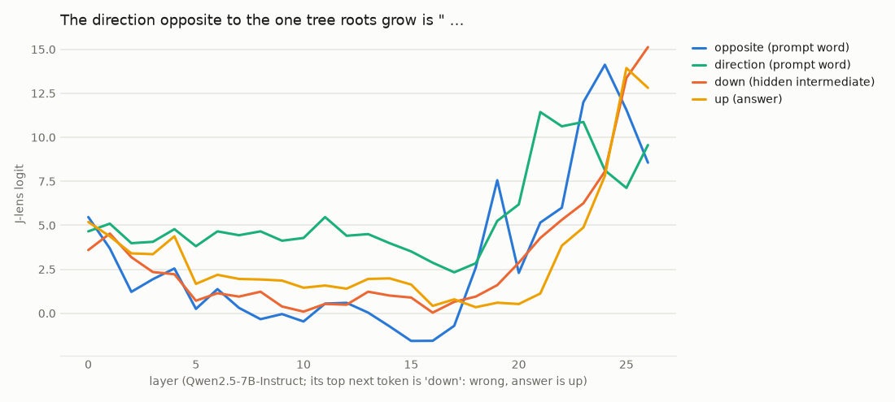

### Fact: The direction opposite to the one tree roots grow is " **up**

**Hidden reasoning:** down → up

**Qwen2.5-7B-Instruct (this graph):** ❌ predicts `down`; top 5: `down`, `up`, `south`, `north`, `Up`

No-CoT answers via OpenRouter

- ✅ qwen-2.5-7b-instruct: `up`
- ✅ qwen3.6-27b: `up`
- ✅ qwen3-32b: `upward.`
- ✅ gemma-4-26b-a4b-it: `up`
- ✅ gemma-4-31b-it: `up"`
- ✅ mistral-small-24b-instruct-2501: `up`
- ✅ llama-3.3-70b-instruct: `up`

---

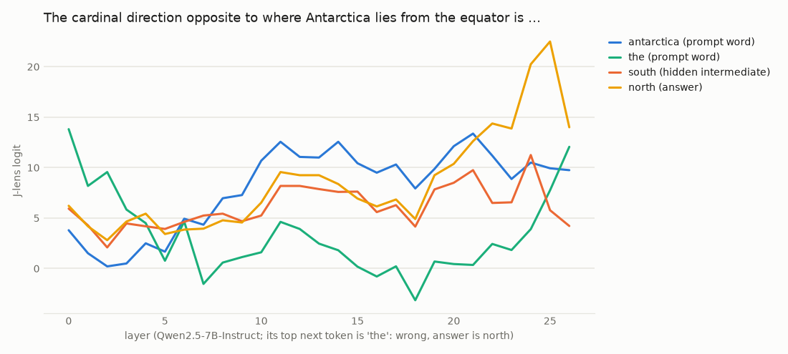

### Fact: The cardinal direction opposite to where Antarctica lies from the equator is **north**

**Hidden reasoning:** south → north

**Qwen2.5-7B-Instruct (this graph):** ❌ predicts `the`; top 5: `the`, `where`, `in`, `towards`, `north`

No-CoT answers via OpenRouter

- ✅ qwen-2.5-7b-instruct: `North`
- ✅ qwen3.6-27b: `North`
- ✅ qwen3-32b: `north.`
- ✅ gemma-4-26b-a4b-it: `North`
- ✅ gemma-4-31b-it: `North`
- ✅ mistral-small-24b-instruct-2501: `North`
- ✅ llama-3.3-70b-instruct: `north`

---

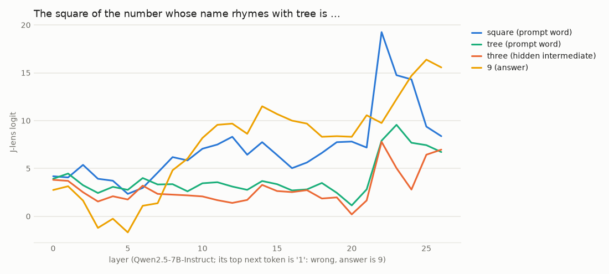

### Fact: The square of the number whose name rhymes with tree is **9**

**Hidden reasoning:** three → 9

**Qwen2.5-7B-Instruct (this graph):** ❌ predicts `1`; top 5: `1`, `2`, `9`, `4`, `3`

No-CoT answers via OpenRouter

- ✅ qwen-2.5-7b-instruct: `9`
- ✅ qwen3.6-27b: `9`
- ❌ qwen3-32b: ``
- ❌ gemma-4-26b-a4b-it: `nine`
- ✅ gemma-4-31b-it: `9`
- ❌ mistral-small-24b-instruct-2501: `Four`
- ❌ llama-3.3-70b-instruct: `three`

---

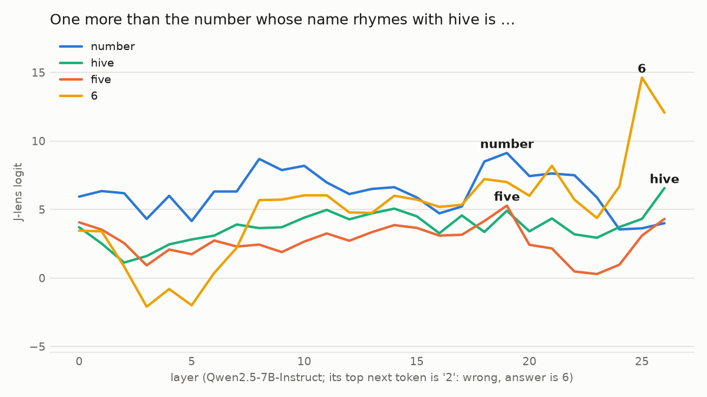

### Fact: One more than the number whose name rhymes with hive is **6**

**Hidden reasoning:** five → 6

**Qwen2.5-7B-Instruct (this graph):** ❌ predicts `2`; top 5: `2`, `1`, `3`, `6`, `4`

No-CoT answers via OpenRouter

- ❌ qwen-2.5-7b-instruct: `five`
- ❌ qwen3.6-27b: `8`
- ❌ qwen3-32b: `six.`
- ❌ gemma-4-26b-a4b-it: `six`
- ✅ gemma-4-31b-it: `6`
- ❌ mistral-small-24b-instruct-2501: `Five`
- ❌ llama-3.3-70b-instruct: `Six`

---

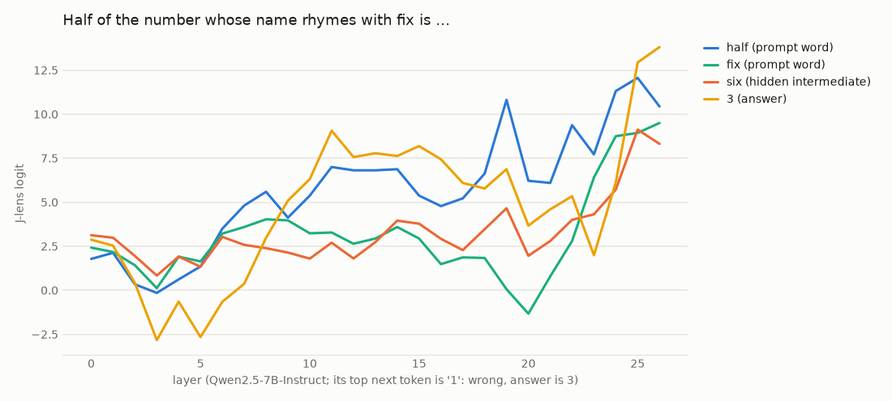

### Fact: Half of the number whose name rhymes with fix is **3**

**Hidden reasoning:** six → 3

**Qwen2.5-7B-Instruct (this graph):** ❌ predicts `1`; top 5: `1`, `4`, `2`, `8`, `6`

No-CoT answers via OpenRouter

- ❌ qwen-2.5-7b-instruct: `six`
- ❌ qwen3.6-27b: `three`
- ❌ qwen3-32b: `three.`
- ❌ gemma-4-26b-a4b-it: `six`
- ✅ gemma-4-31b-it: `3`
- ❌ mistral-small-24b-instruct-2501: `Four`
- ❌ llama-3.3-70b-instruct: `six`

---

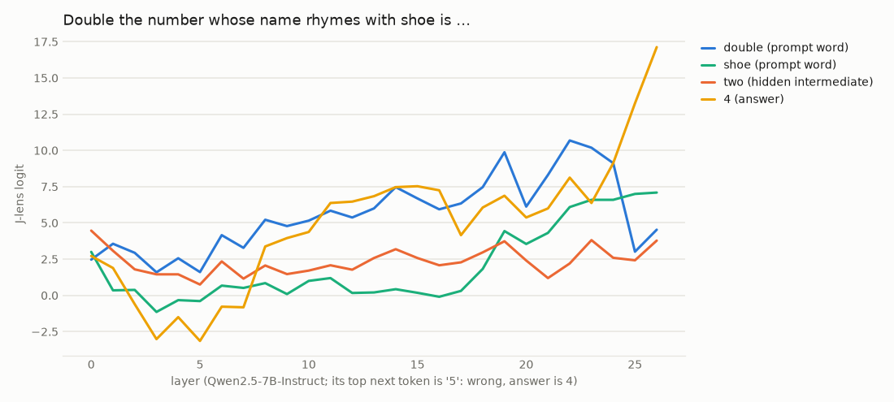

### Fact: Double the number whose name rhymes with shoe is **4**

**Hidden reasoning:** two → 4

**Qwen2.5-7B-Instruct (this graph):** ❌ predicts `5`; top 5: `5`, `4`, `3`, `7`, `1`

No-CoT answers via OpenRouter

- ❌ qwen-2.5-7b-instruct: `56`
- ❌ qwen3.6-27b: `10`
- ❌ qwen3-32b: `8`
- ✅ gemma-4-26b-a4b-it: `4`
- ✅ gemma-4-31b-it: `4`
- ❌ mistral-small-24b-instruct-2501: `14`
- ❌ llama-3.3-70b-instruct: `two`

---

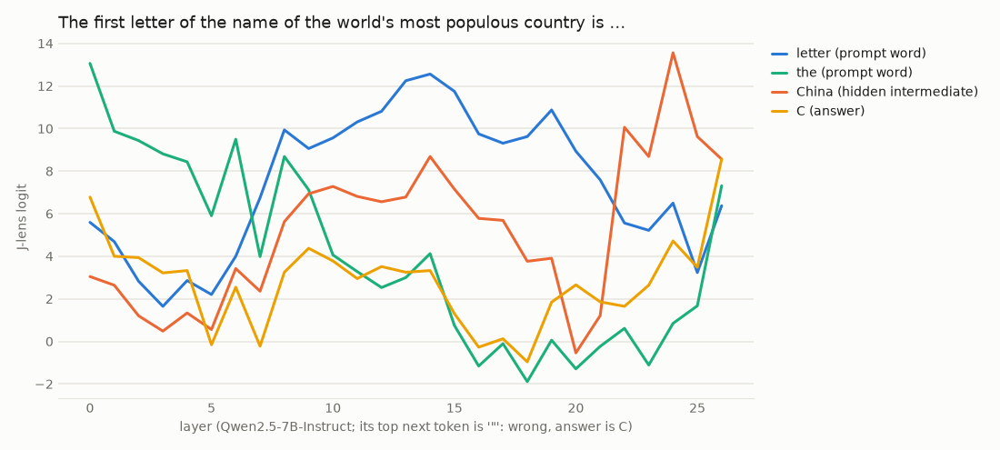

### Fact: The first letter of the name of the world's most populous country is **C**

**Hidden reasoning:** China → C

**Qwen2.5-7B-Instruct (this graph):** ❌ predicts `"`; top 5: `"`, `'`, `B`, `an`, `the`

No-CoT answers via OpenRouter

- ✅ qwen-2.5-7b-instruct: `C`
- ✅ qwen3.6-27b: `C`
- ❌ qwen3-32b: ``
- ❌ gemma-4-26b-a4b-it: `I`
- ❌ gemma-4-31b-it: `I`
- ✅ mistral-small-24b-instruct-2501: `C`
- ✅ llama-3.3-70b-instruct: `C`

---

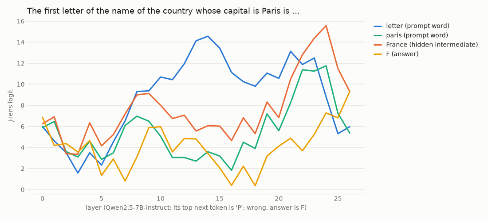

### Fact: The first letter of the name of the country whose capital is Paris is **F**

**Hidden reasoning:** France → F

**Qwen2.5-7B-Instruct (this graph):** ❌ predicts `P`; top 5: `P`, `a`, `an`, `the`, `"`

No-CoT answers via OpenRouter

- ✅ qwen-2.5-7b-instruct: `F`
- ✅ qwen3.6-27b: `F`
- ❌ qwen3-32b: ``
- ✅ gemma-4-26b-a4b-it: `F`
- ✅ gemma-4-31b-it: `F`
- ✅ mistral-small-24b-instruct-2501: `France`
- ✅ llama-3.3-70b-instruct: `France`

---

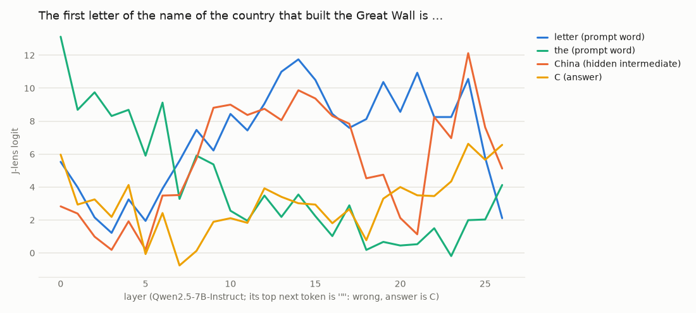

### Fact: The first letter of the name of the country that built the Great Wall is **C**

**Hidden reasoning:** China → C

**Qwen2.5-7B-Instruct (this graph):** ❌ predicts `"`; top 5: `"`, `'`, `G`, `an`, `a`

No-CoT answers via OpenRouter

- ✅ qwen-2.5-7b-instruct: `C`
- ✅ qwen3.6-27b: `C`
- ✅ qwen3-32b: `C`
- ✅ gemma-4-26b-a4b-it: `C`
- ✅ gemma-4-31b-it: `C`
- ✅ mistral-small-24b-instruct-2501: `C`
- ✅ llama-3.3-70b-instruct: `China`

---

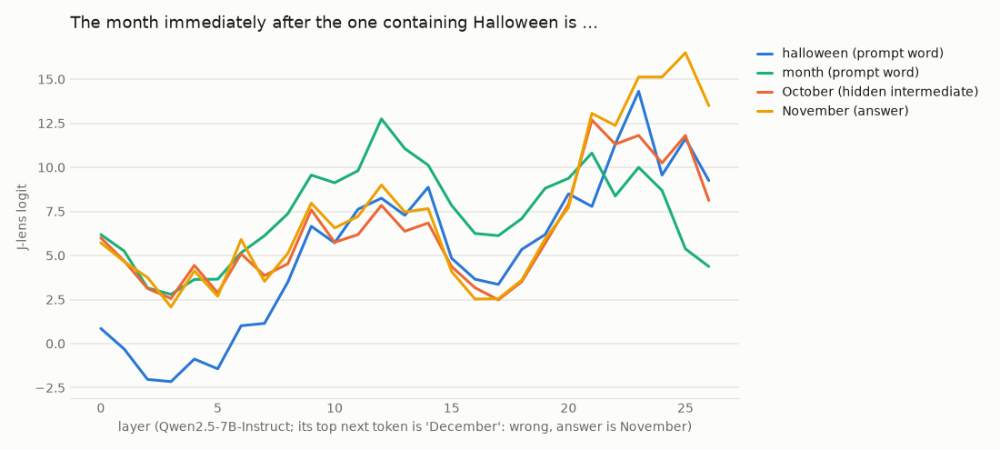

### Fact: The month immediately after the one containing Halloween is **November**

**Hidden reasoning:** October → November

**Qwen2.5-7B-Instruct (this graph):** ❌ predicts `December`; top 5: `December`, `the`, `Christmas`, `November`, `winter`

No-CoT answers via OpenRouter

- ✅ qwen-2.5-7b-instruct: `November`
- ✅ qwen3.6-27b: `November`
- ✅ qwen3-32b: `November.`
- ✅ gemma-4-26b-a4b-it: `November`
- ✅ gemma-4-31b-it: `November`
- ✅ mistral-small-24b-instruct-2501: `November`
- ✅ llama-3.3-70b-instruct: `November`

---

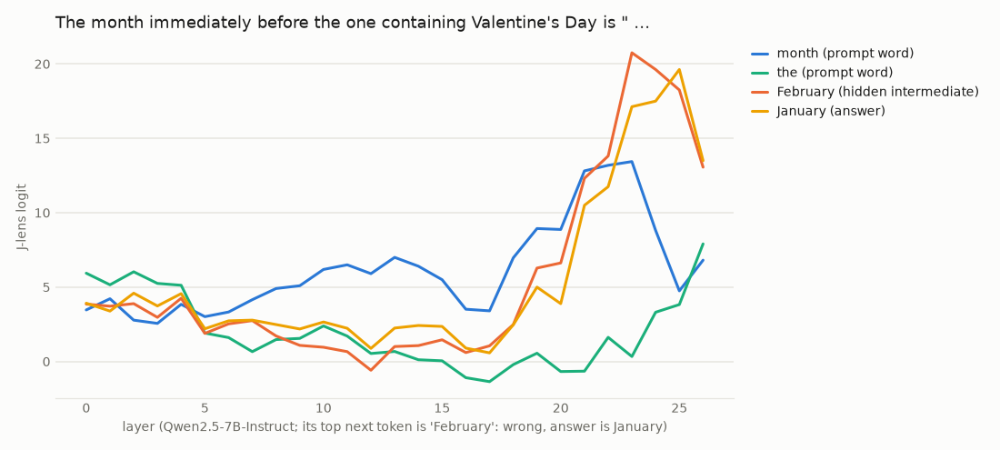

### Fact: The month immediately before the one containing Valentine's Day is " **January**

**Hidden reasoning:** February → January

**Qwen2.5-7B-Instruct (this graph):** ❌ predicts `February`; top 5: `February`, `January`, `the`, `The`, `Val`

No-CoT answers via OpenRouter

- ❌ qwen-2.5-7b-instruct: `February`
- ✅ qwen3.6-27b: `January`
- ✅ qwen3-32b: `January.`
- ✅ gemma-4-26b-a4b-it: `January`
- ✅ gemma-4-31b-it: `January"`
- ✅ mistral-small-24b-instruct-2501: `January`
- ✅ llama-3.3-70b-instruct: `January`

---

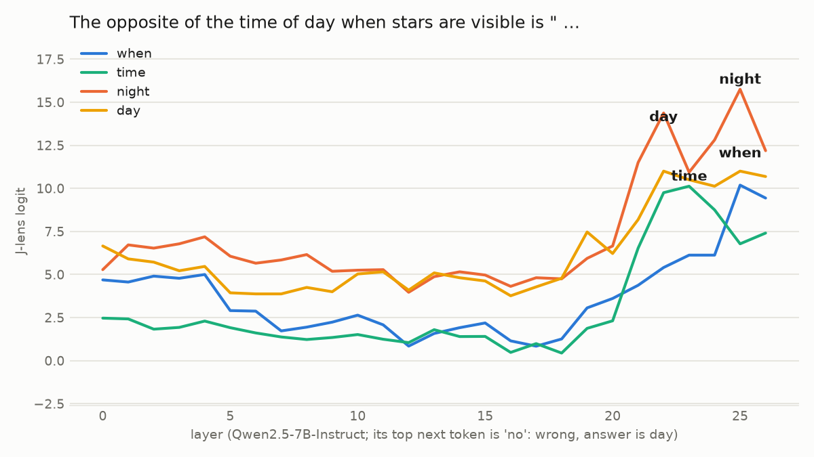

### Fact: The opposite of the time of day when stars are visible is " **day**

**Hidden reasoning:** night → day

**Qwen2.5-7B-Instruct (this graph):** ❌ predicts `no`; top 5: `no`, `night`, `mid`, `No`, `day`

No-CoT answers via OpenRouter

- ❌ qwen-2.5-7b-instruct: `noon`
- ✅ qwen3.6-27b: `day`
- ✅ qwen3-32b: `daytime.`
- ✅ gemma-4-26b-a4b-it: `daytime`
- ✅ gemma-4-31b-it: `day"`
- ✅ mistral-small-24b-instruct-2501: `Day`
- ❌ llama-3.3-70b-instruct: `noon`

---

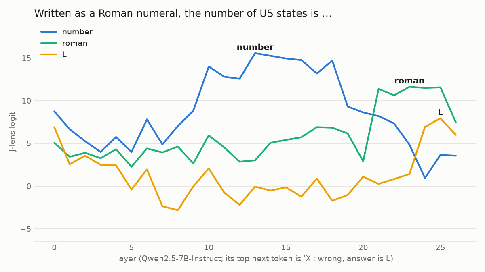

### Fact: Written as a Roman numeral, the number of US states is **L**

**Hidden reasoning:** 50 → L

**Qwen2.5-7B-Instruct (this graph):** ❌ predicts `X`; top 5: `X`, `XX`, `XIII`, `XII`, `XV`

No-CoT answers via OpenRouter

- ❌ qwen-2.5-7b-instruct: `XIII`
- ✅ qwen3.6-27b: `L`
- ❌ qwen3-32b: ``
- ❌ gemma-4-26b-a4b-it: `XLV`
- ✅ gemma-4-31b-it: `L`
- ✅ mistral-small-24b-instruct-2501: `LVIII`
- ❌ llama-3.3-70b-instruct: `Fifty`

---

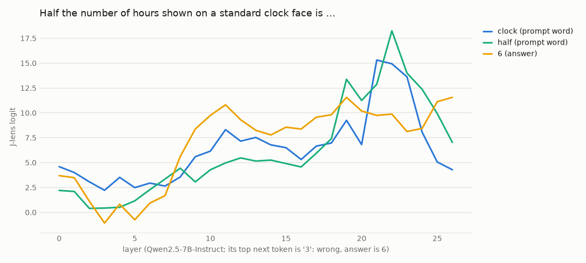

### Fact: Half the number of hours shown on a standard clock face is **6**

**Hidden reasoning:** 12 → 6

**Qwen2.5-7B-Instruct (this graph):** ❌ predicts `3`; top 5: `3`, `6`, `1`, `9`, `4`

No-CoT answers via OpenRouter

- ❌ qwen-2.5-7b-instruct: `12`
- ✅ qwen3.6-27b: `6`
- ❌ qwen3-32b: `12.`
- ✅ gemma-4-26b-a4b-it: `6`
- ✅ gemma-4-31b-it: `6`
- ❌ mistral-small-24b-instruct-2501: `12`
- ❌ llama-3.3-70b-instruct: `six`

---

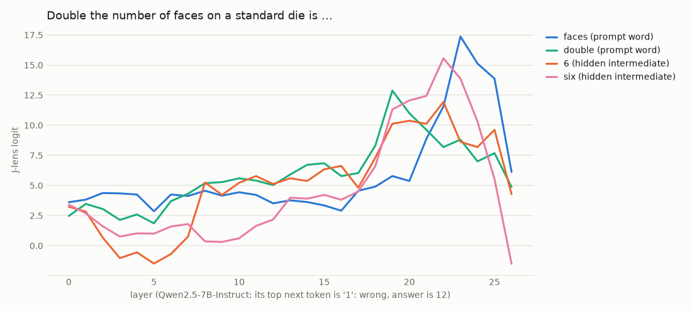

### Fact: Double the number of faces on a standard die is **12**

**Hidden reasoning:** 6 → six → 12

**Qwen2.5-7B-Instruct (this graph):** ❌ predicts `1`; top 5: `1`, `2`, `3`, `8`, `4`

No-CoT answers via OpenRouter

- ✅ qwen-2.5-7b-instruct: `12`
- ✅ qwen3.6-27b: `12`
- ✅ qwen3-32b: `12.`
- ✅ gemma-4-26b-a4b-it: `12`
- ✅ gemma-4-31b-it: `12`
- ❌ mistral-small-24b-instruct-2501: `8`
- ✅ llama-3.3-70b-instruct: `12`

---

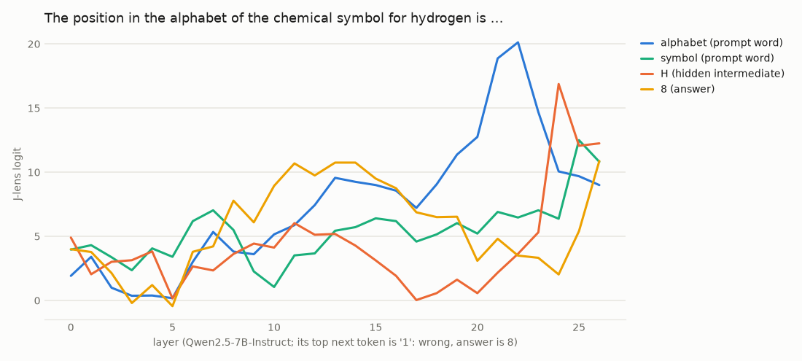

### Fact: The position in the alphabet of the chemical symbol for hydrogen is **8**

**Hidden reasoning:** H → 8

**Qwen2.5-7B-Instruct (this graph):** ❌ predicts `1`; top 5: `1`, `0`, `7`, `3`, `2`

No-CoT answers via OpenRouter

- ❌ qwen-2.5-7b-instruct: `1`
- ✅ qwen3.6-27b: `8`
- ❌ qwen3-32b: `1.`
- ✅ gemma-4-26b-a4b-it: `8`
- ✅ gemma-4-31b-it: `8`
- ❌ mistral-small-24b-instruct-2501: `1`
- ✅ llama-3.3-70b-instruct: `8`

---

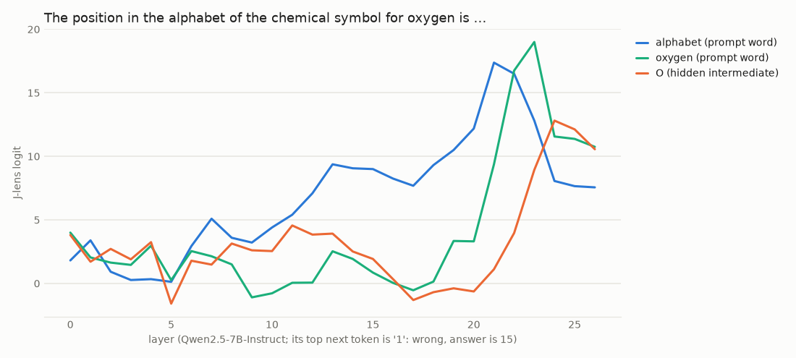

### Fact: The position in the alphabet of the chemical symbol for oxygen is **15**

**Hidden reasoning:** O → 15

**Qwen2.5-7B-Instruct (this graph):** ❌ predicts `1`; top 5: `1`, `8`, `3`, `7`, `2`

No-CoT answers via OpenRouter

- ❌ qwen-2.5-7b-instruct: `8`
- ✅ qwen3.6-27b: `15`
- ❌ qwen3-32b: ``
- ✅ gemma-4-26b-a4b-it: `15`
- ✅ gemma-4-31b-it: `15`
- ✅ mistral-small-24b-instruct-2501: `15`
- ✅ llama-3.3-70b-instruct: `15`

---

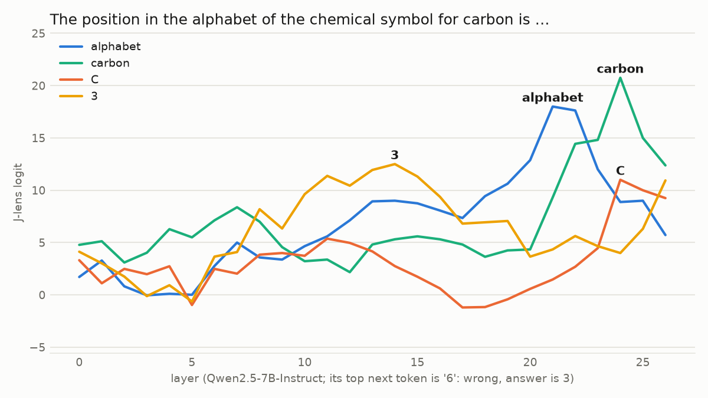

### Fact: The position in the alphabet of the chemical symbol for carbon is **3**

**Hidden reasoning:** C → 3

**Qwen2.5-7B-Instruct (this graph):** ❌ predicts `6`; top 5: `6`, `5`, `3`, `1`, `2`

No-CoT answers via OpenRouter

- ❌ qwen-2.5-7b-instruct: `6`
- ❌ qwen3.6-27b: `6`
- ❌ qwen3-32b: `6.`
- ✅ gemma-4-26b-a4b-it: `3`
- ✅ gemma-4-31b-it: `3`
- ❌ mistral-small-24b-instruct-2501: `13`
- ❌ llama-3.3-70b-instruct: `6`

---

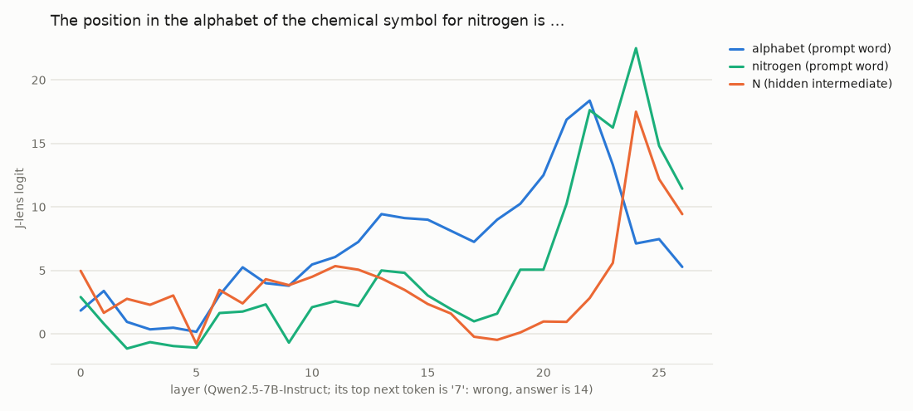

### Fact: The position in the alphabet of the chemical symbol for nitrogen is **14**

**Hidden reasoning:** N → 14

**Qwen2.5-7B-Instruct (this graph):** ❌ predicts `7`; top 5: `7`, `1`, `3`, `5`, `4`

No-CoT answers via OpenRouter

- ❌ qwen-2.5-7b-instruct: `7`
- ✅ qwen3.6-27b: `14`
- ❌ qwen3-32b: `7.`
- ❌ gemma-4-26b-a4b-it: `7`
- ✅ gemma-4-31b-it: `14`
- ✅ mistral-small-24b-instruct-2501: `14`
- ❌ llama-3.3-70b-instruct: `7`

---

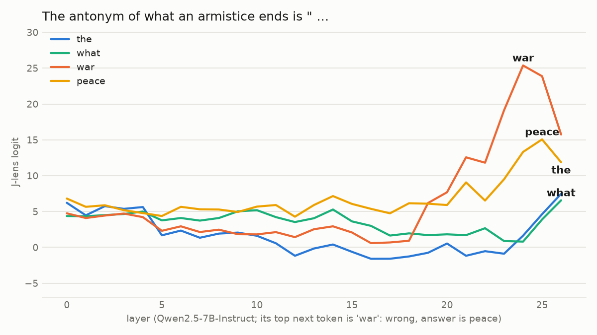

### Fact: The antonym of what an armistice ends is " **peace**

**Hidden reasoning:** war → peace

**Qwen2.5-7B-Instruct (this graph):** ❌ predicts `war`; top 5: `war`, `peace`, `conf`, `w`, `host`

No-CoT answers via OpenRouter

- ❌ qwen-2.5-7b-instruct: `war`
- ✅ qwen3.6-27b: `peace`
- ❌ qwen3-32b: ``
- ❌ gemma-4-26b-a4b-it: `war`
- ❌ gemma-4-31b-it: `war"`
- ❌ mistral-small-24b-instruct-2501: `war`
- ❌ llama-3.3-70b-instruct: `war`

---

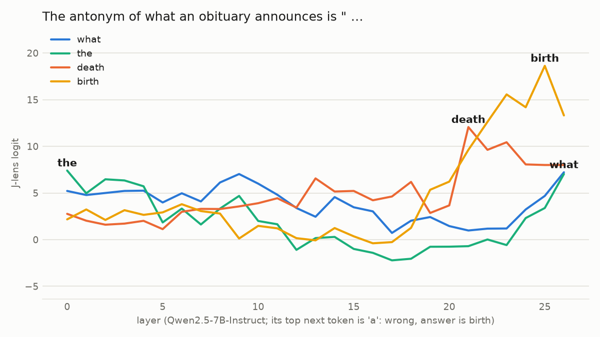

### Fact: The antonym of what an obituary announces is " **birth**

**Hidden reasoning:** death → birth

**Qwen2.5-7B-Instruct (this graph):** ❌ predicts `a`; top 5: `a`, `birth`, `cele`, `joy`, `new`

No-CoT answers via OpenRouter

- ❌ qwen-2.5-7b-instruct: `life`
- ✅ qwen3.6-27b: `birth`
- ✅ qwen3-32b: `birth.`
- ✅ gemma-4-26b-a4b-it: `birth`
- ✅ gemma-4-31b-it: `birth"`
- ✅ mistral-small-24b-instruct-2501: `Birth`
- ✅ llama-3.3-70b-instruct: `birth`

