# brew: J-lens by layer and token, Qwen3.6-27B

Lens: `neuronpedia/jacobian-lens/qwen3.6-27b/jlens/Salesforce-wikitext/Qwen3.6-27B_jacobian_lens_n1000.pt`. Each item's graph shows, on top, the J-lens rank of every tracked word at the
token before the answer (log scale, rank 1 at the top; thin = raw, thick = EWMA with a 2-layer
halflife). Below it, one heatmap per word: rank at every layer (y) and each of the last prompt tokens (x),
darker = closer to the lens's top token. Correct items first.

| depth | correct |
| --- | --- |
| 1 | 20/20 |
| 2 | 4/20 |
| 3 | 0/20 |

## Summary: median rank over correct items

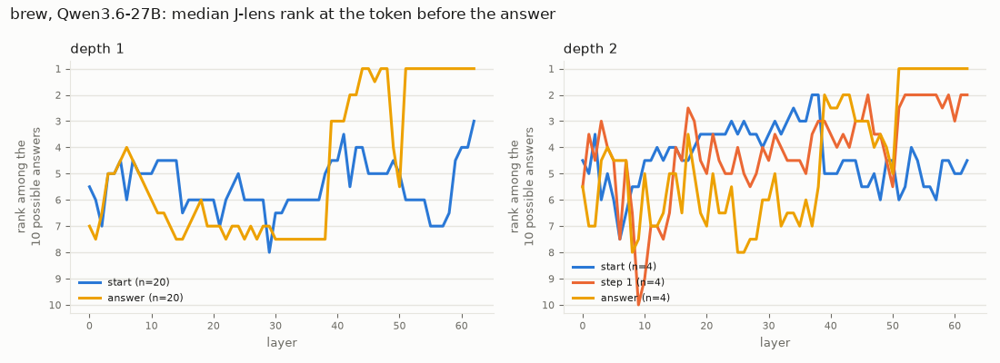

## Answered correctly (24)

---

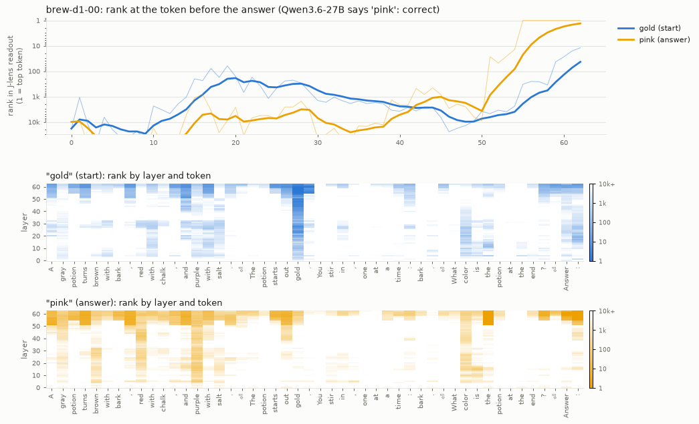

A potion changes color each time an ingredient is stirred in. The rules:  
A red potion turns black with bark, brown with chalk, and gold with salt.  
A brown potion turns green with bark, blue with chalk, and gold with salt.  
A blue potion turns pink with bark, red with chalk, and gold with salt.  
A pink potion turns black with bark, green with chalk, and white with salt.  
A black potion turns purple with bark, gray with chalk, and gray with salt.  
A white potion turns gold with bark, pink with chalk, and red with salt.  
A gold potion turns pink with bark, red with chalk, and gray with salt.  
A green potion turns blue with bark, red with chalk, and black with salt.  
A purple potion turns green with bark, gray with chalk, and gray with salt.  
A gray potion turns brown with bark, red with chalk, and purple with salt.  
The potion starts out gold. You stir in, one at a time: bark.  
What color is the potion at the end?

**Answer:** **pink** · **Hidden trajectory:** gold → pink

**Qwen3.6-27B:** ✅ top 5: `pink`, ``, `Answer`, `purple`, `Answer`
---

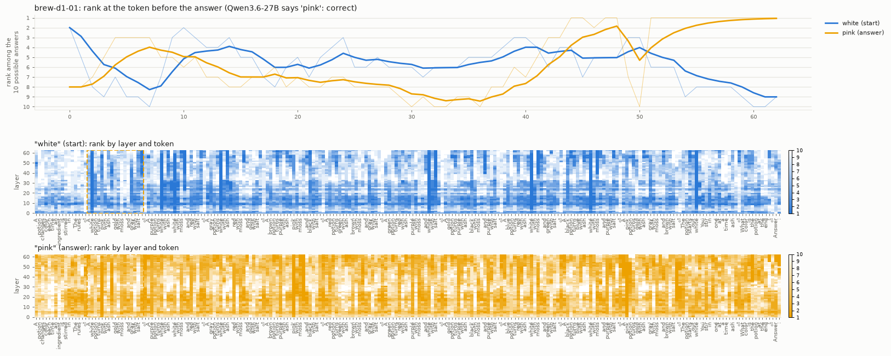

A potion changes color each time an ingredient is stirred in. The rules:  
A white potion turns pink with ash, gold with moss, and gray with salt.  
A purple potion turns white with ash, white with moss, and red with salt.  
A gray potion turns white with ash, red with moss, and gold with salt.  
A brown potion turns purple with ash, pink with moss, and black with salt.  
A red potion turns green with ash, brown with moss, and gray with salt.  
A green potion turns red with ash, purple with moss, and white with salt.  
A gold potion turns purple with ash, black with moss, and purple with salt.  
A blue potion turns red with ash, white with moss, and green with salt.  
A black potion turns blue with ash, white with moss, and purple with salt.  
A pink potion turns gold with ash, gray with moss, and brown with salt.  
The potion starts out white. You stir in, one at a time: ash.  
What color is the potion at the end?

**Answer:** **pink** · **Hidden trajectory:** white → pink

**Qwen3.6-27B:** ✅ top 5: `pink`, ``, `Answer`, `gold`, `[`
---

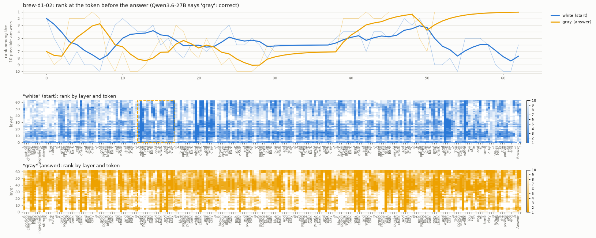

A potion changes color each time an ingredient is stirred in. The rules:  
A gray potion turns red with bark, red with chalk, and pink with clay.  
A gold potion turns brown with bark, red with chalk, and blue with clay.  
A white potion turns red with bark, gold with chalk, and gray with clay.  
A blue potion turns purple with bark, white with chalk, and white with clay.  
A brown potion turns black with bark, pink with chalk, and purple with clay.  
A purple potion turns blue with bark, blue with chalk, and red with clay.  
A red potion turns blue with bark, purple with chalk, and gray with clay.  
A black potion turns green with bark, gray with chalk, and green with clay.  
A green potion turns gray with bark, purple with chalk, and gray with clay.  
A pink potion turns blue with bark, gray with chalk, and white with clay.  
The potion starts out white. You stir in, one at a time: clay.  
What color is the potion at the end?

**Answer:** **gray** · **Hidden trajectory:** white → gray

**Qwen3.6-27B:** ✅ top 5: `gray`, ``, `black`, `Answer`, `gold`
---

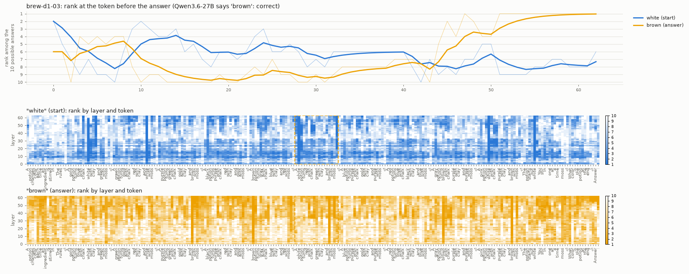

A potion changes color each time an ingredient is stirred in. The rules:  
A gold potion turns blue with chalk, white with clay, and green with moss.  
A green potion turns gold with chalk, red with clay, and white with moss.  
A purple potion turns green with chalk, gold with clay, and brown with moss.  
A black potion turns purple with chalk, red with clay, and gold with moss.  
A brown potion turns gray with chalk, blue with clay, and red with moss.  
A white potion turns red with chalk, green with clay, and brown with moss.  
A blue potion turns purple with chalk, gold with clay, and purple with moss.  
A red potion turns blue with chalk, black with clay, and blue with moss.  
A gray potion turns brown with chalk, purple with clay, and purple with moss.  
A pink potion turns white with chalk, purple with clay, and brown with moss.  
The potion starts out white. You stir in, one at a time: moss.  
What color is the potion at the end?

**Answer:** **brown** · **Hidden trajectory:** white → brown

**Qwen3.6-27B:** ✅ top 5: `brown`, ``, `black`, `Answer`, `green`
---

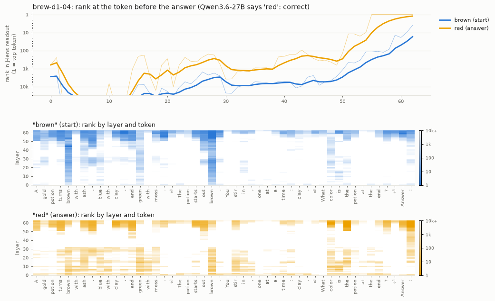

A potion changes color each time an ingredient is stirred in. The rules:  
A green potion turns blue with ash, gold with clay, and red with moss.  
A blue potion turns pink with ash, brown with clay, and gold with moss.  
A white potion turns gray with ash, purple with clay, and gold with moss.  
A red potion turns green with ash, gray with clay, and pink with moss.  
A purple potion turns white with ash, gray with clay, and white with moss.  
A black potion turns gold with ash, red with clay, and red with moss.  
A gray potion turns brown with ash, brown with clay, and gold with moss.  
A pink potion turns gold with ash, gray with clay, and green with moss.  
A brown potion turns purple with ash, red with clay, and white with moss.  
A gold potion turns brown with ash, blue with clay, and green with moss.  
The potion starts out brown. You stir in, one at a time: clay.  
What color is the potion at the end?

**Answer:** **red** · **Hidden trajectory:** brown → red

**Qwen3.6-27B:** ✅ top 5: `red`, ``, `Answer`, `black`, `gold`
---

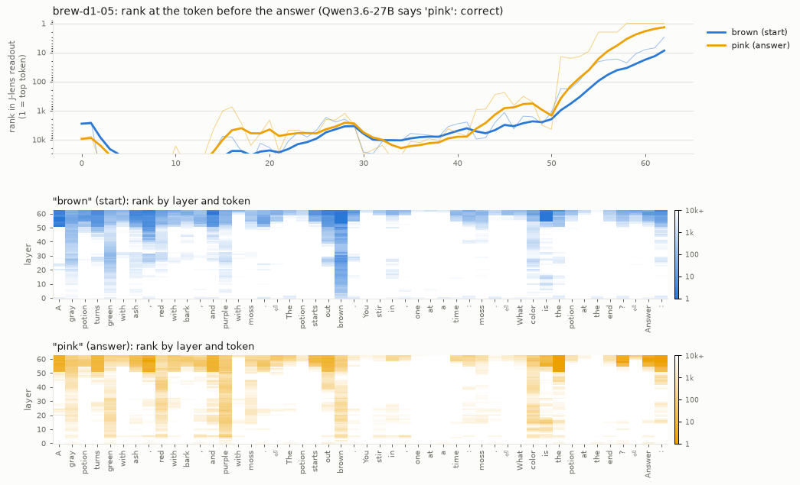

A potion changes color each time an ingredient is stirred in. The rules:  
A white potion turns blue with ash, black with bark, and gray with moss.  
A green potion turns red with ash, black with bark, and white with moss.  
A pink potion turns green with ash, green with bark, and green with moss.  
A black potion turns red with ash, white with bark, and purple with moss.  
A brown potion turns white with ash, black with bark, and pink with moss.  
A purple potion turns brown with ash, white with bark, and brown with moss.  
A red potion turns white with ash, black with bark, and gray with moss.  
A blue potion turns gold with ash, purple with bark, and red with moss.  
A gold potion turns white with ash, red with bark, and gray with moss.  
A gray potion turns green with ash, red with bark, and purple with moss.  
The potion starts out brown. You stir in, one at a time: moss.  
What color is the potion at the end?

**Answer:** **pink** · **Hidden trajectory:** brown → pink

**Qwen3.6-27B:** ✅ top 5: `pink`, ``, `black`, `brown`, `Answer`
---

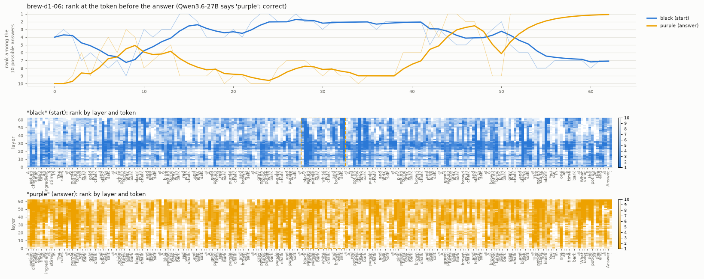

A potion changes color each time an ingredient is stirred in. The rules:  
A purple potion turns red with bark, gold with chalk, and black with salt.  
A white potion turns gray with bark, black with chalk, and gold with salt.  
A blue potion turns gray with bark, red with chalk, and gray with salt.  
A gold potion turns red with bark, purple with chalk, and brown with salt.  
A gray potion turns purple with bark, purple with chalk, and purple with salt.  
A black potion turns purple with bark, white with chalk, and brown with salt.  
A red potion turns black with bark, purple with chalk, and gray with salt.  
A pink potion turns gray with bark, brown with chalk, and blue with salt.  
A green potion turns gray with bark, brown with chalk, and black with salt.  
A brown potion turns pink with bark, gray with chalk, and black with salt.  
The potion starts out black. You stir in, one at a time: bark.  
What color is the potion at the end?

**Answer:** **purple** · **Hidden trajectory:** black → purple

**Qwen3.6-27B:** ✅ top 5: `purple`, ``, `black`, `white`, `Answer`
---

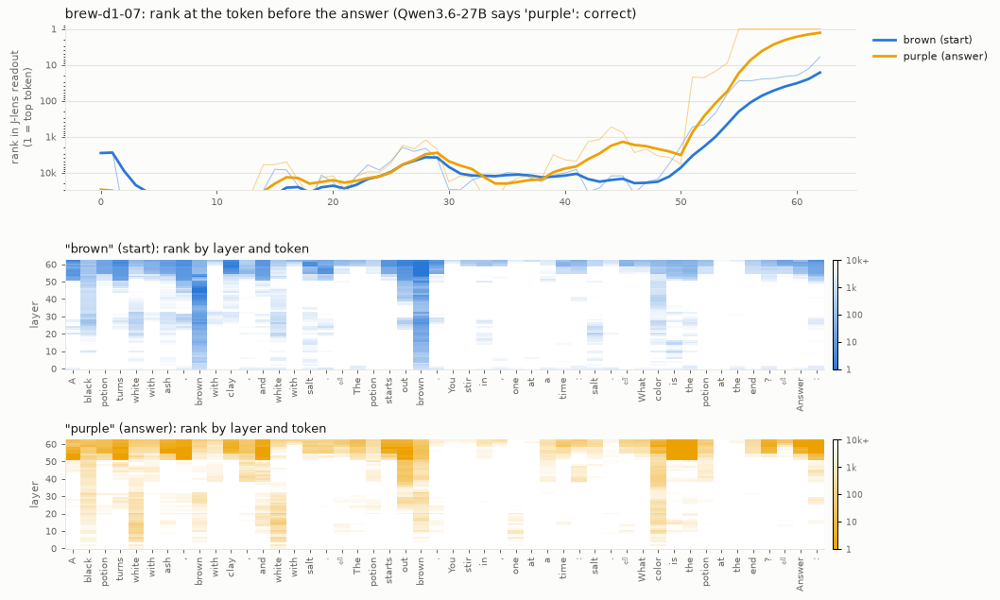

A potion changes color each time an ingredient is stirred in. The rules:  
A pink potion turns red with ash, black with clay, and purple with salt.  
A white potion turns pink with ash, black with clay, and purple with salt.  
A blue potion turns white with ash, purple with clay, and pink with salt.  
A brown potion turns red with ash, pink with clay, and purple with salt.  
A purple potion turns gold with ash, blue with clay, and black with salt.  
A gray potion turns black with ash, pink with clay, and red with salt.  
A gold potion turns pink with ash, purple with clay, and pink with salt.  
A red potion turns purple with ash, gray with clay, and gray with salt.  
A green potion turns brown with ash, white with clay, and white with salt.  
A black potion turns white with ash, brown with clay, and white with salt.  
The potion starts out brown. You stir in, one at a time: salt.  
What color is the potion at the end?

**Answer:** **purple** · **Hidden trajectory:** brown → purple

**Qwen3.6-27B:** ✅ top 5: `purple`, ``, `black`, `Answer`, `pink`
---

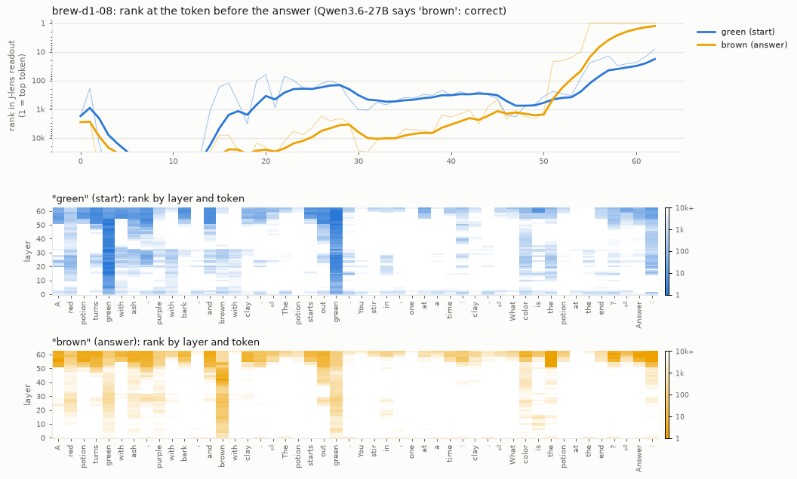

A potion changes color each time an ingredient is stirred in. The rules:  
A gold potion turns red with ash, blue with bark, and green with clay.  
A purple potion turns brown with ash, green with bark, and pink with clay.  
A brown potion turns gray with ash, purple with bark, and purple with clay.  
A gray potion turns white with ash, gold with bark, and pink with clay.  
A white potion turns gray with ash, blue with bark, and red with clay.  
A green potion turns gray with ash, blue with bark, and brown with clay.  
A black potion turns brown with ash, white with bark, and gray with clay.  
A pink potion turns gray with ash, black with bark, and green with clay.  
A blue potion turns gray with ash, purple with bark, and purple with clay.  
A red potion turns green with ash, purple with bark, and brown with clay.  
The potion starts out green. You stir in, one at a time: clay.  
What color is the potion at the end?

**Answer:** **brown** · **Hidden trajectory:** green → brown

**Qwen3.6-27B:** ✅ top 5: `brown`, ``, `black`, `Answer`, `blue`
---

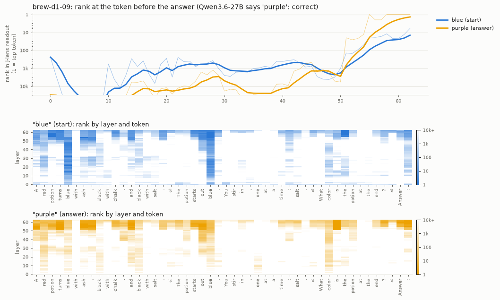

A potion changes color each time an ingredient is stirred in. The rules:  
A gray potion turns pink with ash, blue with chalk, and white with salt.  
A brown potion turns black with ash, purple with chalk, and green with salt.  
A pink potion turns brown with ash, gold with chalk, and green with salt.  
A green potion turns purple with ash, black with chalk, and gray with salt.  
A white potion turns brown with ash, pink with chalk, and blue with salt.  
A blue potion turns black with ash, brown with chalk, and purple with salt.  
A black potion turns white with ash, blue with chalk, and brown with salt.  
A purple potion turns white with ash, green with chalk, and gray with salt.  
A gold potion turns red with ash, white with chalk, and blue with salt.  
A red potion turns blue with ash, black with chalk, and black with salt.  
The potion starts out blue. You stir in, one at a time: salt.  
What color is the potion at the end?

**Answer:** **purple** · **Hidden trajectory:** blue → purple

**Qwen3.6-27B:** ✅ top 5: `purple`, ``, `black`, `blue`, `Answer`
---

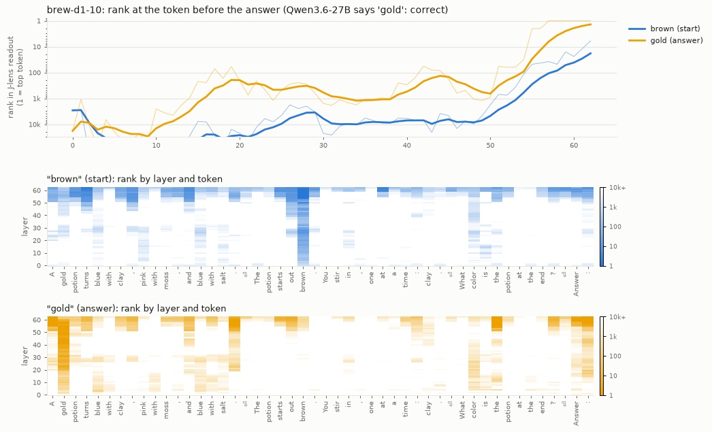

A potion changes color each time an ingredient is stirred in. The rules:  
A purple potion turns brown with clay, white with moss, and gray with salt.  
A blue potion turns purple with clay, black with moss, and gray with salt.  
A gray potion turns black with clay, white with moss, and green with salt.  
A white potion turns gold with clay, green with moss, and purple with salt.  
A green potion turns purple with clay, white with moss, and pink with salt.  
A pink potion turns gold with clay, red with moss, and gold with salt.  
A brown potion turns gold with clay, white with moss, and gray with salt.  
A red potion turns blue with clay, gold with moss, and gold with salt.  
A black potion turns pink with clay, purple with moss, and gold with salt.  
A gold potion turns blue with clay, pink with moss, and blue with salt.  
The potion starts out brown. You stir in, one at a time: clay.  
What color is the potion at the end?

**Answer:** **gold** · **Hidden trajectory:** brown → gold

**Qwen3.6-27B:** ✅ top 5: `gold`, ``, `Answer`, `brown`, `blue`
---

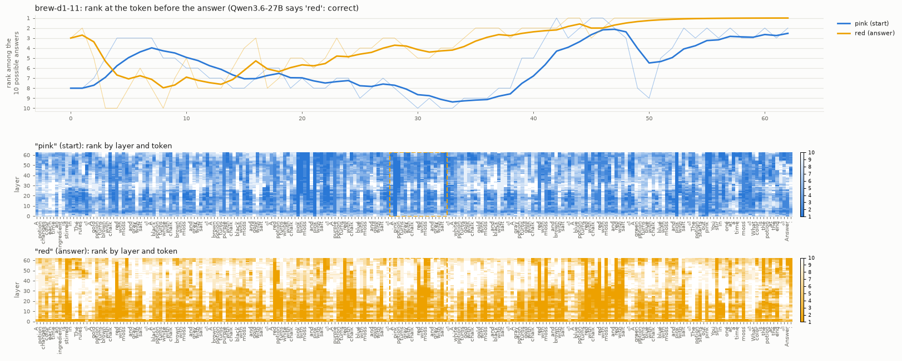

A potion changes color each time an ingredient is stirred in. The rules:  
A gold potion turns brown with chalk, red with moss, and gray with salt.  
A black potion turns white with chalk, brown with moss, and gray with salt.  
A brown potion turns purple with chalk, black with moss, and gold with salt.  
A red potion turns white with chalk, pink with moss, and pink with salt.  
A purple potion turns red with chalk, blue with moss, and gold with salt.  
A pink potion turns gray with chalk, red with moss, and gray with salt.  
A white potion turns gold with chalk, gold with moss, and black with salt.  
A gray potion turns gold with chalk, red with moss, and brown with salt.  
A blue potion turns red with chalk, red with moss, and red with salt.  
A green potion turns blue with chalk, blue with moss, and pink with salt.  
The potion starts out pink. You stir in, one at a time: moss.  
What color is the potion at the end?

**Answer:** **red** · **Hidden trajectory:** pink → red

**Qwen3.6-27B:** ✅ top 5: `red`, ``, `Answer`, `black`, `pink`
---

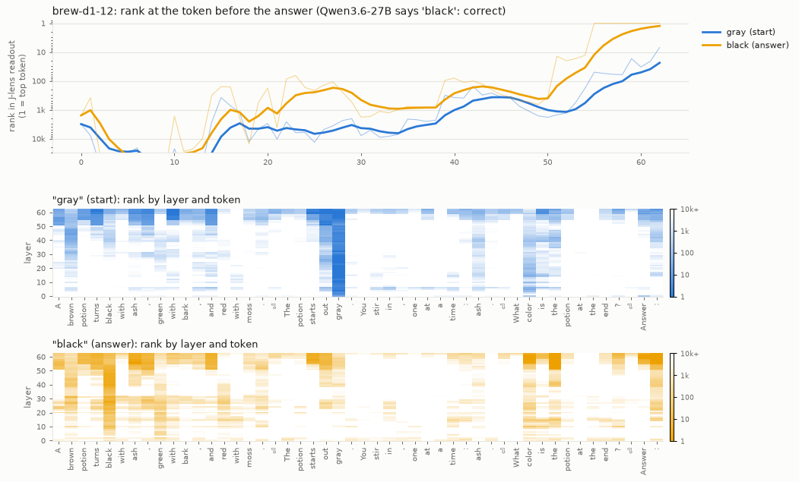

A potion changes color each time an ingredient is stirred in. The rules:  
A black potion turns green with ash, white with bark, and green with moss.  
A gray potion turns black with ash, brown with bark, and brown with moss.  
A blue potion turns black with ash, black with bark, and gray with moss.  
A red potion turns purple with ash, white with bark, and gray with moss.  
A white potion turns gray with ash, black with bark, and red with moss.  
A purple potion turns gold with ash, black with bark, and white with moss.  
A gold potion turns brown with ash, white with bark, and white with moss.  
A pink potion turns brown with ash, purple with bark, and red with moss.  
A green potion turns pink with ash, purple with bark, and pink with moss.  
A brown potion turns black with ash, green with bark, and red with moss.  
The potion starts out gray. You stir in, one at a time: ash.  
What color is the potion at the end?

**Answer:** **black** · **Hidden trajectory:** gray → black

**Qwen3.6-27B:** ✅ top 5: `black`, ``, `Answer`, `brown`, `gray`
---

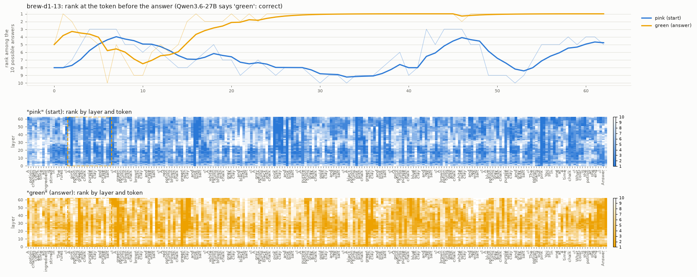

A potion changes color each time an ingredient is stirred in. The rules:  
A pink potion turns green with chalk, purple with clay, and purple with salt.  
A green potion turns brown with chalk, brown with clay, and purple with salt.  
A red potion turns brown with chalk, green with clay, and pink with salt.  
A white potion turns brown with chalk, gray with clay, and black with salt.  
A gray potion turns black with chalk, pink with clay, and pink with salt.  
A purple potion turns gray with chalk, gold with clay, and red with salt.  
A black potion turns pink with chalk, green with clay, and pink with salt.  
A gold potion turns purple with chalk, blue with clay, and red with salt.  
A brown potion turns gold with chalk, white with clay, and red with salt.  
A blue potion turns gray with chalk, purple with clay, and gray with salt.  
The potion starts out pink. You stir in, one at a time: chalk.  
What color is the potion at the end?

**Answer:** **green** · **Hidden trajectory:** pink → green

**Qwen3.6-27B:** ✅ top 5: `green`, ``, `Answer`, `purple`, `black`
---

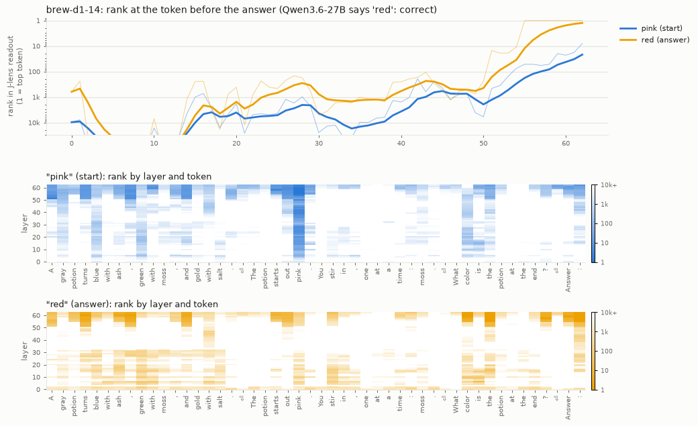

A potion changes color each time an ingredient is stirred in. The rules:  
A purple potion turns red with ash, red with moss, and black with salt.  
A gold potion turns gray with ash, white with moss, and black with salt.  
A blue potion turns green with ash, red with moss, and white with salt.  
A green potion turns red with ash, white with moss, and brown with salt.  
A white potion turns brown with ash, gray with moss, and brown with salt.  
A black potion turns green with ash, gold with moss, and purple with salt.  
A red potion turns brown with ash, gray with moss, and brown with salt.  
A pink potion turns brown with ash, red with moss, and white with salt.  
A brown potion turns green with ash, gold with moss, and black with salt.  
A gray potion turns blue with ash, green with moss, and gold with salt.  
The potion starts out pink. You stir in, one at a time: moss.  
What color is the potion at the end?

**Answer:** **red** · **Hidden trajectory:** pink → red

**Qwen3.6-27B:** ✅ top 5: `red`, ``, `Answer`, `black`, `brown`
---

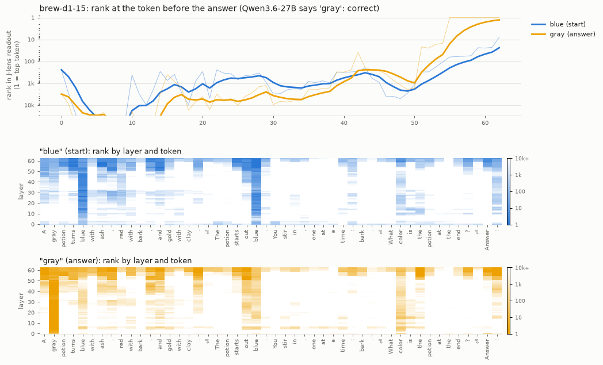

A potion changes color each time an ingredient is stirred in. The rules:  
A pink potion turns purple with ash, blue with bark, and purple with clay.  
A brown potion turns red with ash, black with bark, and white with clay.  
A blue potion turns green with ash, gray with bark, and gray with clay.  
A green potion turns black with ash, blue with bark, and blue with clay.  
A gold potion turns white with ash, green with bark, and blue with clay.  
A black potion turns green with ash, gray with bark, and brown with clay.  
A red potion turns blue with ash, pink with bark, and gold with clay.  
A white potion turns gold with ash, gray with bark, and brown with clay.  
A purple potion turns green with ash, pink with bark, and brown with clay.  
A gray potion turns blue with ash, red with bark, and gold with clay.  
The potion starts out blue. You stir in, one at a time: bark.  
What color is the potion at the end?

**Answer:** **gray** · **Hidden trajectory:** blue → gray

**Qwen3.6-27B:** ✅ top 5: `gray`, ``, `Answer`, `blue`, `black`
---

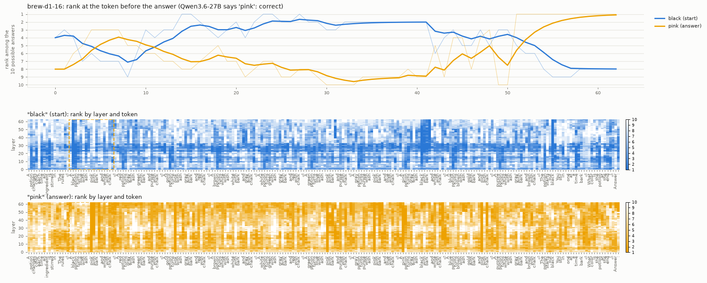

A potion changes color each time an ingredient is stirred in. The rules:  
A black potion turns blue with ash, pink with bark, and white with chalk.  
A red potion turns gray with ash, green with bark, and purple with chalk.  
A gold potion turns pink with ash, gray with bark, and red with chalk.  
A brown potion turns white with ash, white with bark, and gray with chalk.  
A white potion turns green with ash, gray with bark, and red with chalk.  
A green potion turns blue with ash, pink with bark, and purple with chalk.  
A gray potion turns purple with ash, pink with bark, and blue with chalk.  
A pink potion turns gray with ash, black with bark, and white with chalk.  
A blue potion turns brown with ash, gold with bark, and pink with chalk.  
A purple potion turns white with ash, gray with bark, and brown with chalk.  
The potion starts out black. You stir in, one at a time: bark.  
What color is the potion at the end?

**Answer:** **pink** · **Hidden trajectory:** black → pink

**Qwen3.6-27B:** ✅ top 5: `pink`, ``, `Answer`, `white`, `black`
---

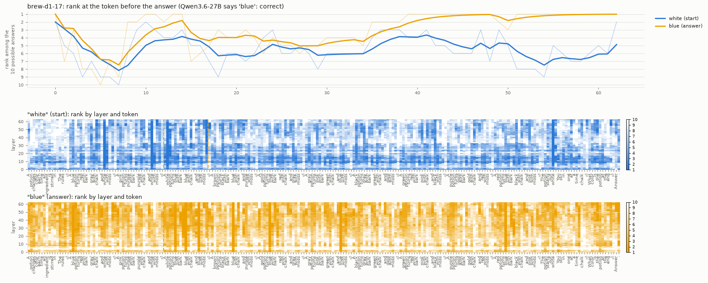

A potion changes color each time an ingredient is stirred in. The rules:  
A blue potion turns red with bark, gray with chalk, and white with moss.  
A pink potion turns purple with bark, purple with chalk, and white with moss.  
A white potion turns blue with bark, blue with chalk, and blue with moss.  
A brown potion turns black with bark, blue with chalk, and purple with moss.  
A gold potion turns blue with bark, red with chalk, and gray with moss.  
A gray potion turns pink with bark, green with chalk, and blue with moss.  
A black potion turns gray with bark, green with chalk, and gold with moss.  
A green potion turns red with bark, pink with chalk, and black with moss.  
A purple potion turns gold with bark, gold with chalk, and red with moss.  
A red potion turns blue with bark, black with chalk, and pink with moss.  
The potion starts out white. You stir in, one at a time: chalk.  
What color is the potion at the end?

**Answer:** **blue** · **Hidden trajectory:** white → blue

**Qwen3.6-27B:** ✅ top 5: `blue`, ``, `Answer`, `black`, `white`
---

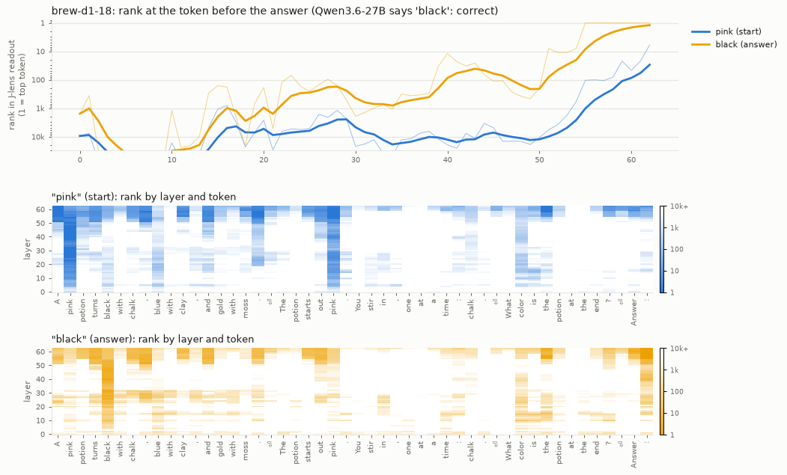

A potion changes color each time an ingredient is stirred in. The rules:  
A white potion turns red with chalk, black with clay, and gold with moss.  
A purple potion turns brown with chalk, brown with clay, and green with moss.  
A brown potion turns purple with chalk, white with clay, and green with moss.  
A blue potion turns green with chalk, brown with clay, and pink with moss.  
A red potion turns brown with chalk, blue with clay, and green with moss.  
A gray potion turns red with chalk, white with clay, and brown with moss.  
A gold potion turns brown with chalk, white with clay, and purple with moss.  
A green potion turns black with chalk, gold with clay, and blue with moss.  
A black potion turns purple with chalk, brown with clay, and purple with moss.  
A pink potion turns black with chalk, blue with clay, and gold with moss.  
The potion starts out pink. You stir in, one at a time: chalk.  
What color is the potion at the end?

**Answer:** **black** · **Hidden trajectory:** pink → black

**Qwen3.6-27B:** ✅ top 5: `black`, ``, `Answer`, `blue`, `pink`
---

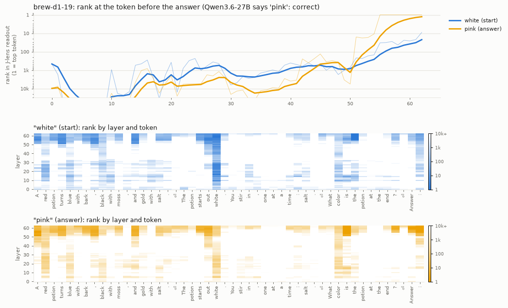

A potion changes color each time an ingredient is stirred in. The rules:  
A blue potion turns gray with bark, green with moss, and gold with salt.  
A pink potion turns green with bark, blue with moss, and blue with salt.  
A black potion turns green with bark, purple with moss, and brown with salt.  
A gold potion turns green with bark, pink with moss, and gray with salt.  
A brown potion turns black with bark, gray with moss, and black with salt.  
A white potion turns gray with bark, black with moss, and pink with salt.  
A gray potion turns pink with bark, white with moss, and brown with salt.  
A purple potion turns white with bark, brown with moss, and brown with salt.  
A green potion turns brown with bark, blue with moss, and white with salt.  
A red potion turns blue with bark, black with moss, and gold with salt.  
The potion starts out white. You stir in, one at a time: salt.  
What color is the potion at the end?

**Answer:** **pink** · **Hidden trajectory:** white → pink

**Qwen3.6-27B:** ✅ top 5: `pink`, ``, `black`, `blue`, `brown`
---

A potion changes color each time an ingredient is stirred in. The rules:  
A brown potion turns green with bark, green with chalk, and black with salt.  
A black potion turns brown with bark, white with chalk, and pink with salt.  
A gray potion turns blue with bark, white with chalk, and pink with salt.  
A green potion turns pink with bark, brown with chalk, and black with salt.  
A gold potion turns purple with bark, black with chalk, and purple with salt.  
A white potion turns purple with bark, gold with chalk, and blue with salt.  
A purple potion turns gray with bark, white with chalk, and white with salt.  
A blue potion turns black with bark, white with chalk, and green with salt.  
A pink potion turns purple with bark, purple with chalk, and white with salt.  
A red potion turns purple with bark, gold with chalk, and blue with salt.  
The potion starts out green. You stir in, one at a time: chalk, then salt.  
What color is the potion at the end?

**Answer:** **black** · **Hidden trajectory:** green → brown → black

**Qwen3.6-27B:** ✅ top 5: `black`, ``, `brown`, `green`, `pink`
---

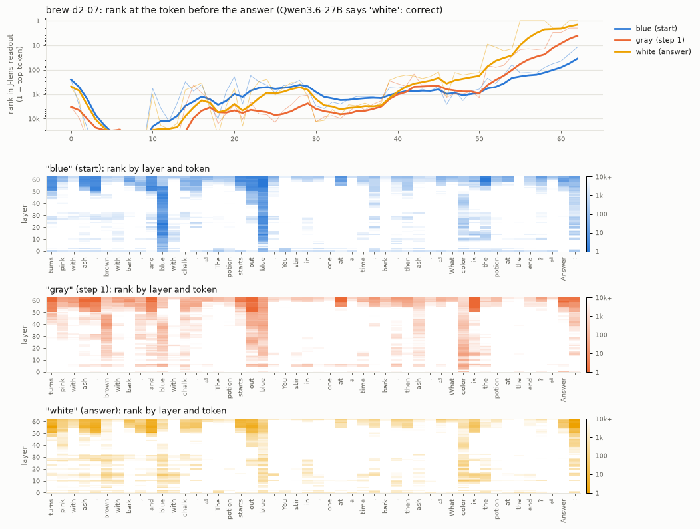

A potion changes color each time an ingredient is stirred in. The rules:  
A brown potion turns white with ash, pink with bark, and purple with chalk.  
A purple potion turns black with ash, green with bark, and black with chalk.  
A pink potion turns red with ash, gold with bark, and brown with chalk.  
A blue potion turns white with ash, gray with bark, and brown with chalk.  
A green potion turns gold with ash, black with bark, and white with chalk.  
A gray potion turns white with ash, gold with bark, and pink with chalk.  
A red potion turns pink with ash, gray with bark, and purple with chalk.  
A gold potion turns gray with ash, red with bark, and blue with chalk.  
A white potion turns gold with ash, pink with bark, and gold with chalk.  
A black potion turns pink with ash, brown with bark, and blue with chalk.  
The potion starts out blue. You stir in, one at a time: bark, then ash.  
What color is the potion at the end?

**Answer:** **white** · **Hidden trajectory:** blue → gray → white

**Qwen3.6-27B:** ✅ top 5: `white`, ``, `gray`, `gold`, `pink`
---

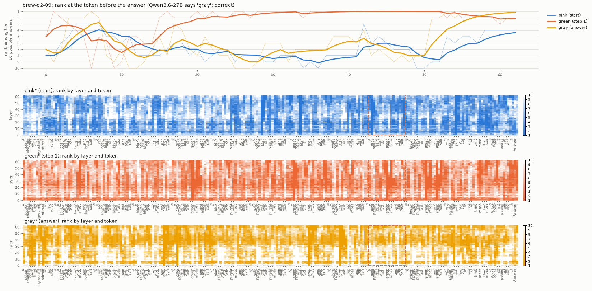

A potion changes color each time an ingredient is stirred in. The rules:  
A purple potion turns black with ash, brown with moss, and brown with salt.  
A red potion turns black with ash, black with moss, and gold with salt.  
A black potion turns brown with ash, red with moss, and gray with salt.  
A gray potion turns blue with ash, green with moss, and black with salt.  
A blue potion turns black with ash, purple with moss, and gold with salt.  
A gold potion turns pink with ash, purple with moss, and blue with salt.  
A green potion turns pink with ash, gray with moss, and gold with salt.  
A white potion turns gray with ash, red with moss, and red with salt.  
A pink potion turns blue with ash, green with moss, and red with salt.  
A brown potion turns purple with ash, green with moss, and green with salt.  
The potion starts out pink. You stir in, one at a time: moss, then moss.  
What color is the potion at the end?

**Answer:** **gray** · **Hidden trajectory:** pink → green → gray

**Qwen3.6-27B:** ✅ top 5: `gray`, `green`, `gold`, ``, `black`
---

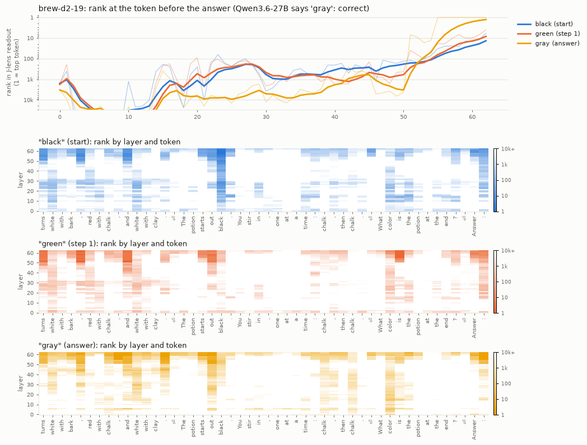

A potion changes color each time an ingredient is stirred in. The rules:  
A pink potion turns gray with bark, brown with chalk, and blue with clay.  
A red potion turns blue with bark, black with chalk, and purple with clay.  
A brown potion turns gray with bark, red with chalk, and gold with clay.  
A blue potion turns white with bark, red with chalk, and purple with clay.  
A white potion turns gray with bark, pink with chalk, and gold with clay.  
A gold potion turns green with bark, brown with chalk, and pink with clay.  
A black potion turns white with bark, green with chalk, and gold with clay.  
A green potion turns gold with bark, gray with chalk, and black with clay.  
A purple potion turns red with bark, gray with chalk, and gray with clay.  
A gray potion turns white with bark, red with chalk, and white with clay.  
The potion starts out black. You stir in, one at a time: chalk, then chalk.  
What color is the potion at the end?

**Answer:** **gray** · **Hidden trajectory:** black → green → gray

**Qwen3.6-27B:** ✅ top 5: `gray`, ``, `black`, `gold`, `red`

## Answered wrong (36)

---

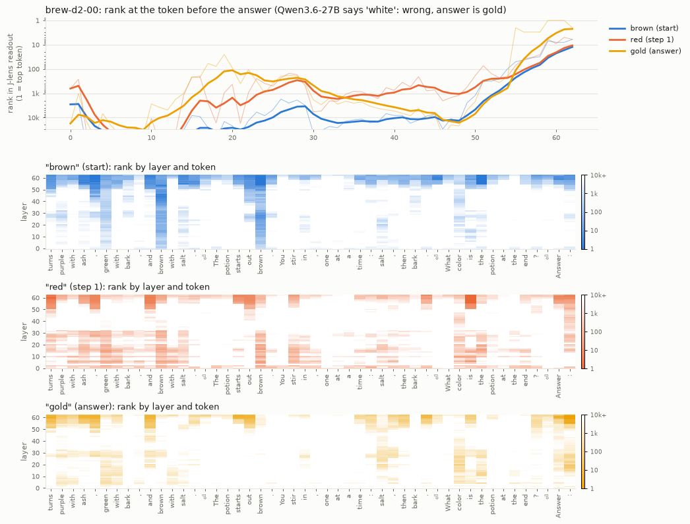

A potion changes color each time an ingredient is stirred in. The rules:  
A purple potion turns gold with ash, white with bark, and green with salt.  
A gold potion turns gray with ash, brown with bark, and red with salt.  
A black potion turns brown with ash, purple with bark, and purple with salt.  
A pink potion turns white with ash, gold with bark, and green with salt.  
A red potion turns gold with ash, gold with bark, and green with salt.  
A blue potion turns gray with ash, gold with bark, and brown with salt.  
A white potion turns blue with ash, gray with bark, and gray with salt.  
A green potion turns pink with ash, purple with bark, and white with salt.  
A brown potion turns white with ash, white with bark, and red with salt.  
A gray potion turns purple with ash, green with bark, and brown with salt.  
The potion starts out brown. You stir in, one at a time: salt, then bark.  
What color is the potion at the end?

**Answer:** **gold** · **Hidden trajectory:** brown → red → gold

**Qwen3.6-27B:** ❌ top 5: `white`, `gold`, ``, `red`, `gray`
---

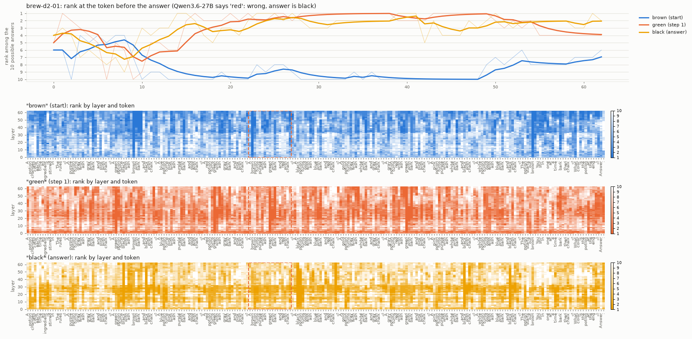

A potion changes color each time an ingredient is stirred in. The rules:  
A purple potion turns gray with ash, gray with bark, and pink with chalk.  
A green potion turns black with ash, brown with bark, and black with chalk.  
A blue potion turns pink with ash, purple with bark, and gold with chalk.  
A red potion turns green with ash, gray with bark, and pink with chalk.  
A brown potion turns purple with ash, green with bark, and red with chalk.  
A black potion turns gold with ash, blue with bark, and red with chalk.  
A gold potion turns gray with ash, white with bark, and gray with chalk.  
A gray potion turns red with ash, green with bark, and pink with chalk.  
A pink potion turns purple with ash, white with bark, and black with chalk.  
A white potion turns gold with ash, blue with bark, and black with chalk.  
The potion starts out brown. You stir in, one at a time: bark, then chalk.  
What color is the potion at the end?

**Answer:** **black** · **Hidden trajectory:** brown → green → black

**Qwen3.6-27B:** ❌ top 5: `red`, `black`, ``, `pink`, `green`
---

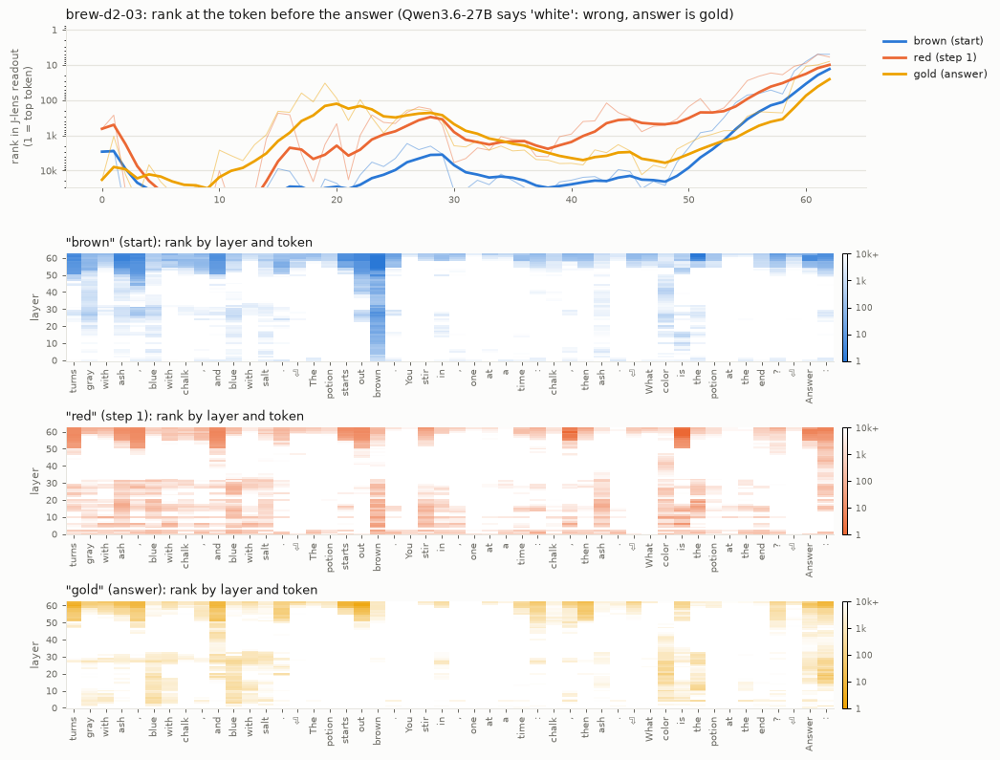

A potion changes color each time an ingredient is stirred in. The rules:  
A purple potion turns black with ash, black with chalk, and black with salt.  
A brown potion turns pink with ash, red with chalk, and white with salt.  
A blue potion turns black with ash, white with chalk, and white with salt.  
A black potion turns pink with ash, white with chalk, and brown with salt.  
A gold potion turns pink with ash, brown with chalk, and black with salt.  
A white potion turns brown with ash, pink with chalk, and green with salt.  
A gray potion turns purple with ash, white with chalk, and black with salt.  
A pink potion turns white with ash, gray with chalk, and white with salt.  
A red potion turns gold with ash, pink with chalk, and gray with salt.  
A green potion turns gray with ash, blue with chalk, and blue with salt.  
The potion starts out brown. You stir in, one at a time: chalk, then ash.  
What color is the potion at the end?

**Answer:** **gold** · **Hidden trajectory:** brown → red → gold

**Qwen3.6-27B:** ❌ top 5: `white`, `pink`, ``, `black`, `red`
---

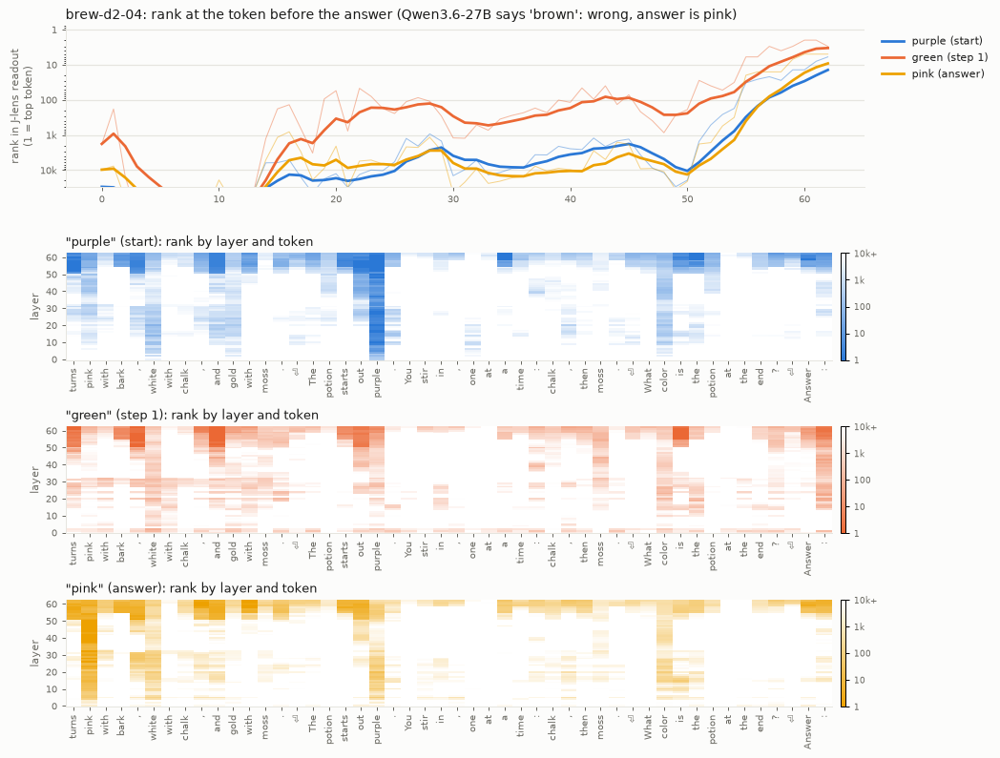

A potion changes color each time an ingredient is stirred in. The rules:  
A blue potion turns brown with bark, black with chalk, and pink with moss.  
A pink potion turns black with bark, blue with chalk, and brown with moss.  
A white potion turns purple with bark, purple with chalk, and gold with moss.  
A black potion turns gray with bark, pink with chalk, and green with moss.  
A green potion turns purple with bark, black with chalk, and pink with moss.  
A brown potion turns green with bark, red with chalk, and blue with moss.  
A purple potion turns white with bark, green with chalk, and brown with moss.  
A red potion turns black with bark, gold with chalk, and pink with moss.  
A gold potion turns black with bark, purple with chalk, and blue with moss.  
A gray potion turns pink with bark, white with chalk, and gold with moss.  
The potion starts out purple. You stir in, one at a time: chalk, then moss.  
What color is the potion at the end?

**Answer:** **pink** · **Hidden trajectory:** purple → green → pink

**Qwen3.6-27B:** ❌ top 5: `brown`, ``, `blue`, `green`, `pink`
---

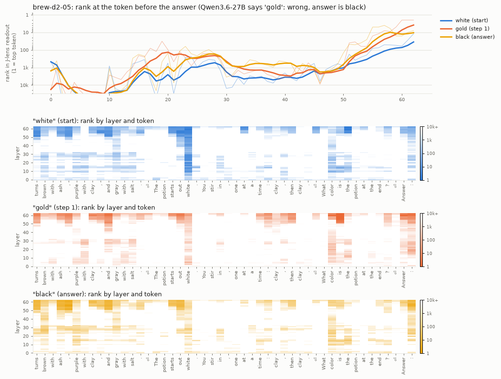

A potion changes color each time an ingredient is stirred in. The rules:  
A blue potion turns gray with ash, red with clay, and black with salt.  
A white potion turns purple with ash, gold with clay, and red with salt.  
A brown potion turns pink with ash, blue with clay, and gold with salt.  
A green potion turns blue with ash, gray with clay, and gray with salt.  
A gray potion turns black with ash, brown with clay, and purple with salt.  
A gold potion turns green with ash, black with clay, and purple with salt.  
A pink potion turns gold with ash, gray with clay, and white with salt.  
A black potion turns green with ash, gray with clay, and purple with salt.  
A purple potion turns red with ash, brown with clay, and brown with salt.  
A red potion turns brown with ash, purple with clay, and gray with salt.  
The potion starts out white. You stir in, one at a time: clay, then clay.  
What color is the potion at the end?

**Answer:** **black** · **Hidden trajectory:** white → gold → black

**Qwen3.6-27B:** ❌ top 5: `gold`, ``, `brown`, `purple`, `red`
---

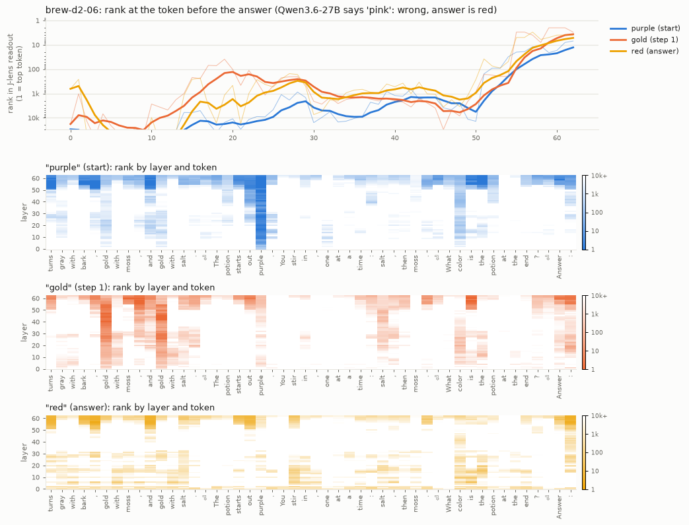

A potion changes color each time an ingredient is stirred in. The rules:  
A white potion turns pink with bark, green with moss, and purple with salt.  
A black potion turns blue with bark, red with moss, and gold with salt.  
A pink potion turns gold with bark, red with moss, and gold with salt.  
A purple potion turns blue with bark, pink with moss, and gold with salt.  
A brown potion turns white with bark, pink with moss, and red with salt.  
A gray potion turns brown with bark, blue with moss, and brown with salt.  
A blue potion turns gray with bark, pink with moss, and black with salt.  
A red potion turns purple with bark, brown with moss, and green with salt.  
A gold potion turns purple with bark, red with moss, and pink with salt.  
A green potion turns gray with bark, gold with moss, and gold with salt.  
The potion starts out purple. You stir in, one at a time: salt, then moss.  
What color is the potion at the end?

**Answer:** **red** · **Hidden trajectory:** purple → gold → red

**Qwen3.6-27B:** ❌ top 5: `pink`, ``, `gold`, `red`, `blue`
---

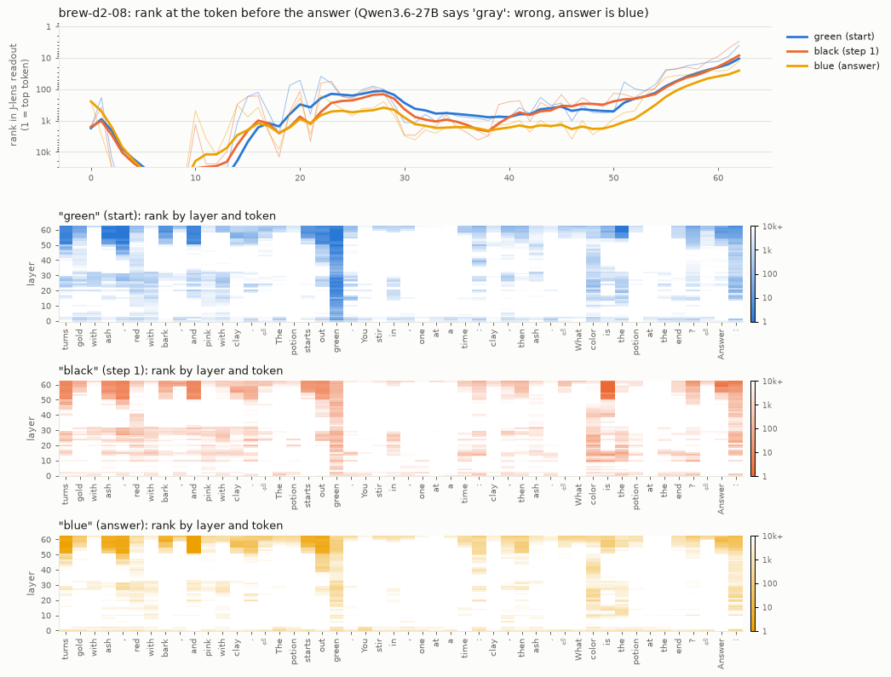

A potion changes color each time an ingredient is stirred in. The rules:  
A brown potion turns gray with ash, green with bark, and green with clay.  
A red potion turns gray with ash, blue with bark, and blue with clay.  
A pink potion turns black with ash, red with bark, and white with clay.  
A blue potion turns gold with ash, green with bark, and red with clay.  
A black potion turns blue with ash, brown with bark, and red with clay.  
A white potion turns green with ash, red with bark, and pink with clay.  
A gray potion turns white with ash, pink with bark, and gold with clay.  
A green potion turns gray with ash, black with bark, and black with clay.  
A gold potion turns brown with ash, gray with bark, and brown with clay.  
A purple potion turns gold with ash, red with bark, and pink with clay.  
The potion starts out green. You stir in, one at a time: clay, then ash.  
What color is the potion at the end?

**Answer:** **blue** · **Hidden trajectory:** green → black → blue

**Qwen3.6-27B:** ❌ top 5: `gray`, `black`, ``, `green`, `white`
---

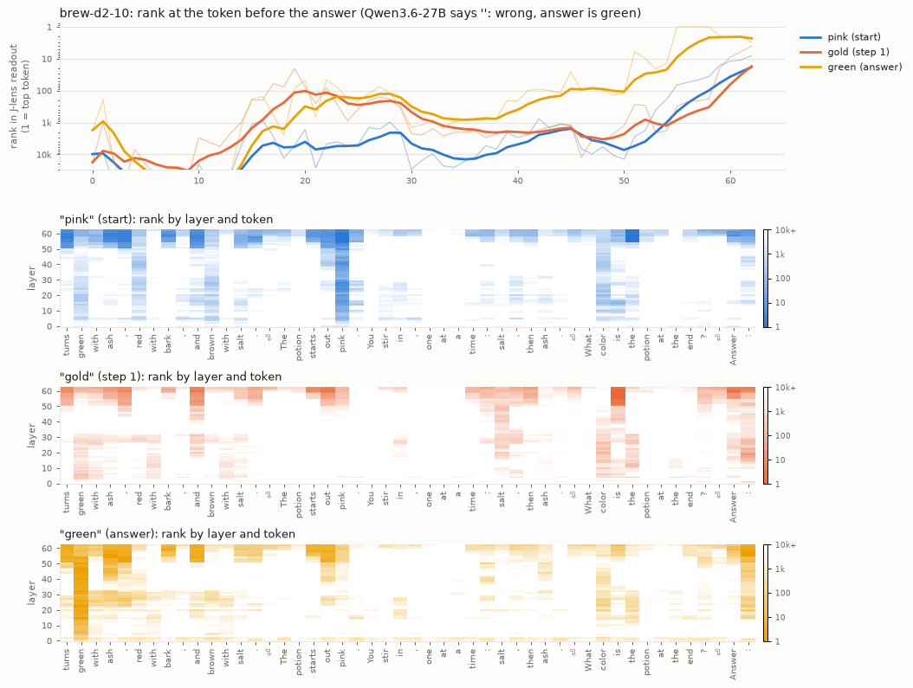

A potion changes color each time an ingredient is stirred in. The rules:  
A blue potion turns pink with ash, gold with bark, and purple with salt.  
A brown potion turns red with ash, pink with bark, and purple with salt.  
A gray potion turns white with ash, green with bark, and white with salt.  
A purple potion turns white with ash, pink with bark, and green with salt.  
A gold potion turns green with ash, red with bark, and purple with salt.  
A white potion turns brown with ash, purple with bark, and purple with salt.  
A red potion turns gold with ash, brown with bark, and pink with salt.  
A green potion turns gray with ash, gray with bark, and black with salt.  
A pink potion turns green with ash, red with bark, and gold with salt.  
A black potion turns green with ash, red with bark, and brown with salt.  
The potion starts out pink. You stir in, one at a time: salt, then ash.  
What color is the potion at the end?

**Answer:** **green** · **Hidden trajectory:** pink → gold → green

**Qwen3.6-27B:** ❌ top 5: ``, `gray`, `green`, `red`, `black`
---

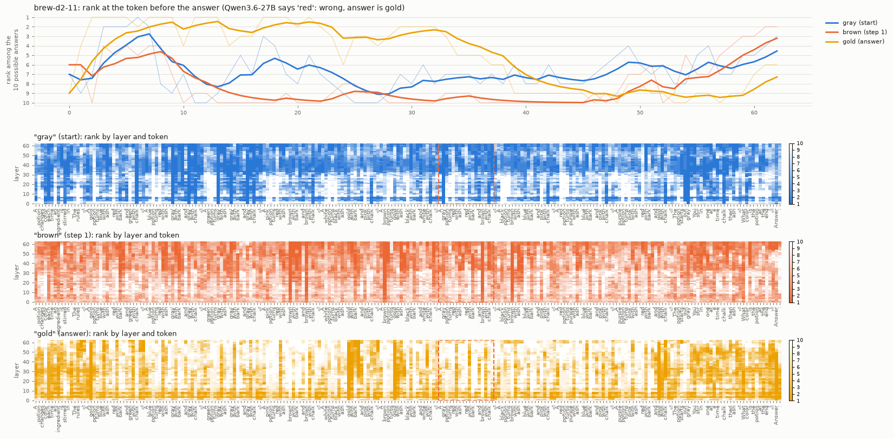

A potion changes color each time an ingredient is stirred in. The rules:  
A gold potion turns blue with ash, red with bark, and green with chalk.  
A blue potion turns red with ash, gray with bark, and gray with chalk.  
A green potion turns gray with ash, gray with bark, and gray with chalk.  
A pink potion turns red with ash, brown with bark, and brown with chalk.  
A white potion turns black with ash, gold with bark, and pink with chalk.  
A brown potion turns gold with ash, black with bark, and white with chalk.  
A gray potion turns red with ash, red with bark, and brown with chalk.  
A black potion turns brown with ash, blue with bark, and pink with chalk.  
A red potion turns purple with ash, blue with bark, and pink with chalk.  
A purple potion turns pink with ash, red with bark, and gold with chalk.  
The potion starts out gray. You stir in, one at a time: chalk, then ash.  
What color is the potion at the end?

**Answer:** **gold** · **Hidden trajectory:** gray → brown → gold

**Qwen3.6-27B:** ❌ top 5: `red`, ``, `black`, `brown`, `green`
---

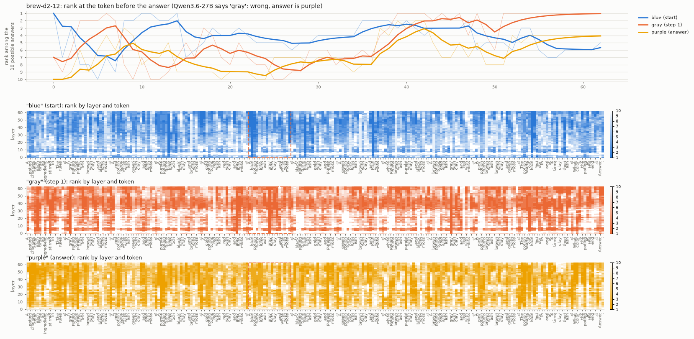

A potion changes color each time an ingredient is stirred in. The rules:  
A gray potion turns purple with ash, brown with clay, and black with moss.  
A red potion turns white with ash, green with clay, and gold with moss.  
A purple potion turns blue with ash, black with clay, and brown with moss.  
A gold potion turns red with ash, red with clay, and gray with moss.  
A blue potion turns pink with ash, gray with clay, and white with moss.  
A black potion turns blue with ash, gold with clay, and purple with moss.  
A green potion turns pink with ash, brown with clay, and blue with moss.  
A white potion turns brown with ash, purple with clay, and black with moss.  
A brown potion turns gold with ash, gray with clay, and red with moss.  
A pink potion turns brown with ash, brown with clay, and green with moss.  
The potion starts out blue. You stir in, one at a time: clay, then ash.  
What color is the potion at the end?

**Answer:** **purple** · **Hidden trajectory:** blue → gray → purple

**Qwen3.6-27B:** ❌ top 5: `gray`, `pink`, ``, `brown`, `blue`
---

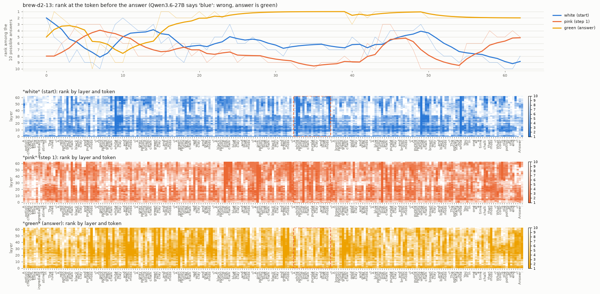

A potion changes color each time an ingredient is stirred in. The rules:  
A red potion turns black with chalk, black with clay, and purple with moss.  
A gold potion turns green with chalk, white with clay, and green with moss.  
A gray potion turns brown with chalk, green with clay, and black with moss.  
A green potion turns gray with chalk, red with clay, and gray with moss.  
A black potion turns pink with chalk, blue with clay, and blue with moss.  
A pink potion turns blue with chalk, black with clay, and green with moss.  
A white potion turns pink with chalk, purple with clay, and blue with moss.  
A brown potion turns green with chalk, gold with clay, and gray with moss.  
A blue potion turns pink with chalk, purple with clay, and brown with moss.  
A purple potion turns white with chalk, brown with clay, and black with moss.  
The potion starts out white. You stir in, one at a time: chalk, then moss.  
What color is the potion at the end?

**Answer:** **green** · **Hidden trajectory:** white → pink → green

**Qwen3.6-27B:** ❌ top 5: `blue`, ``, `green`, `black`, `pink`
---

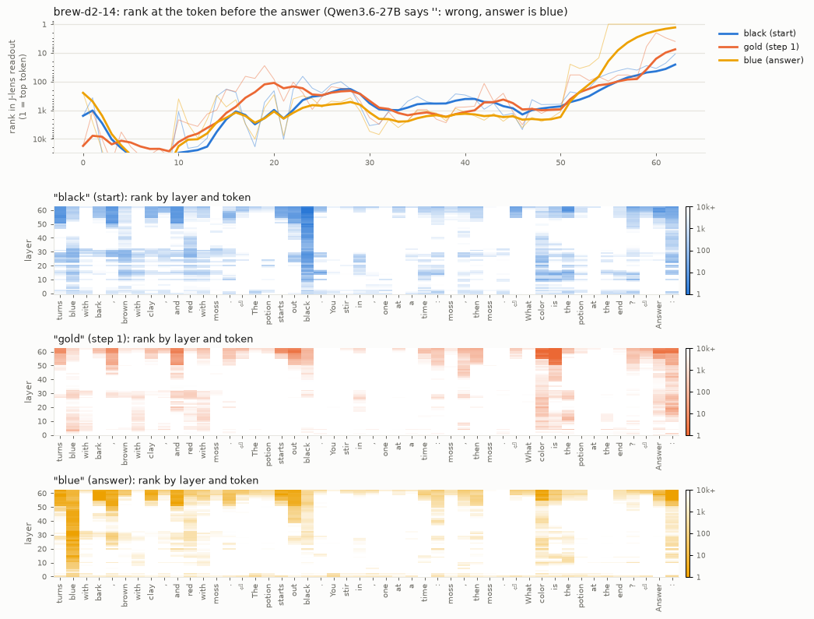

A potion changes color each time an ingredient is stirred in. The rules:  
A red potion turns brown with bark, brown with clay, and black with moss.  
A white potion turns gray with bark, brown with clay, and blue with moss.  
A purple potion turns white with bark, blue with clay, and brown with moss.  
A blue potion turns gold with bark, red with clay, and gray with moss.  
A green potion turns pink with bark, red with clay, and gray with moss.  
A brown potion turns pink with bark, blue with clay, and black with moss.  
A gold potion turns white with bark, blue with clay, and blue with moss.  
A pink potion turns blue with bark, blue with clay, and red with moss.  
A black potion turns gray with bark, green with clay, and gold with moss.  
A gray potion turns blue with bark, brown with clay, and red with moss.  
The potion starts out black. You stir in, one at a time: moss, then moss.  
What color is the potion at the end?

**Answer:** **blue** · **Hidden trajectory:** black → gold → blue

**Qwen3.6-27B:** ❌ top 5: ``, `blue`, `white`, `gold`, `green`
---

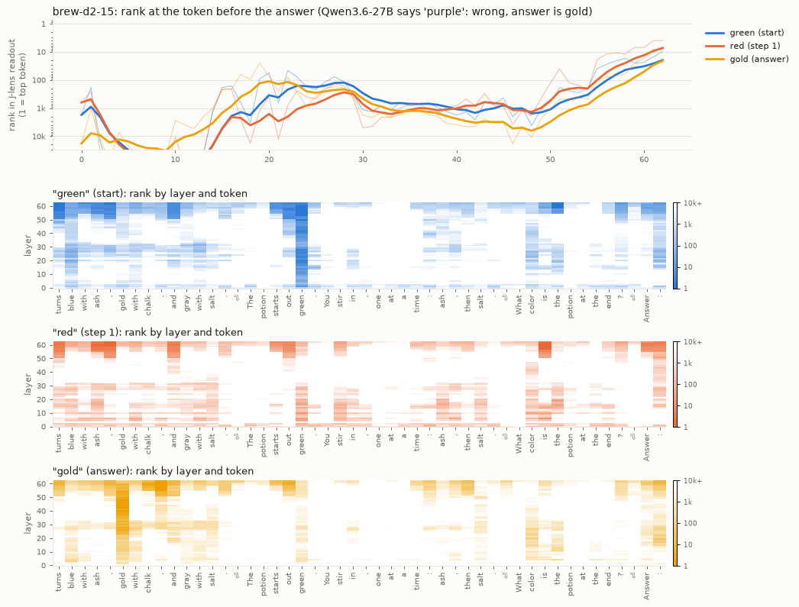

A potion changes color each time an ingredient is stirred in. The rules:  
A white potion turns purple with ash, pink with chalk, and purple with salt.  
A green potion turns red with ash, white with chalk, and purple with salt.  
A blue potion turns brown with ash, black with chalk, and purple with salt.  
A pink potion turns green with ash, blue with chalk, and black with salt.  
A gray potion turns green with ash, black with chalk, and blue with salt.  
A brown potion turns red with ash, red with chalk, and white with salt.  
A red potion turns gold with ash, blue with chalk, and gold with salt.  
A gold potion turns purple with ash, red with chalk, and white with salt.  
A purple potion turns red with ash, red with chalk, and pink with salt.  
A black potion turns blue with ash, gold with chalk, and gray with salt.  
The potion starts out green. You stir in, one at a time: ash, then salt.  
What color is the potion at the end?

**Answer:** **gold** · **Hidden trajectory:** green → red → gold

**Qwen3.6-27B:** ❌ top 5: `purple`, ``, `pink`, `red`, `black`
---

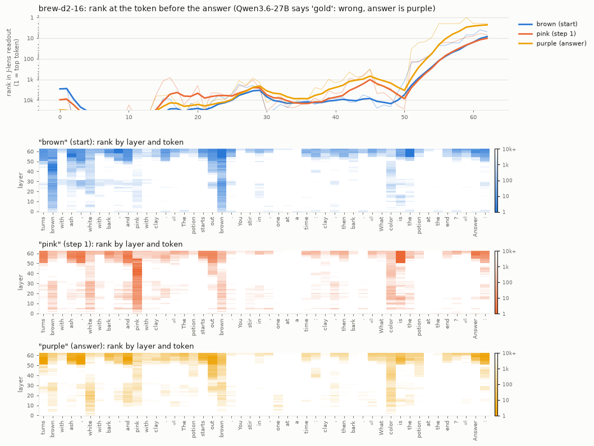

A potion changes color each time an ingredient is stirred in. The rules:  
A white potion turns gray with ash, black with bark, and pink with clay.  
A black potion turns pink with ash, brown with bark, and gold with clay.  
A gold potion turns blue with ash, red with bark, and green with clay.  
A gray potion turns blue with ash, red with bark, and brown with clay.  
A green potion turns white with ash, white with bark, and purple with clay.  
A blue potion turns black with ash, pink with bark, and brown with clay.  
A brown potion turns green with ash, gold with bark, and pink with clay.  
A pink potion turns gold with ash, purple with bark, and blue with clay.  
A purple potion turns green with ash, gray with bark, and gold with clay.  
A red potion turns brown with ash, white with bark, and pink with clay.  
The potion starts out brown. You stir in, one at a time: clay, then bark.  
What color is the potion at the end?

**Answer:** **purple** · **Hidden trajectory:** brown → pink → purple

**Qwen3.6-27B:** ❌ top 5: `gold`, `purple`, ``, `blue`, `red`
---

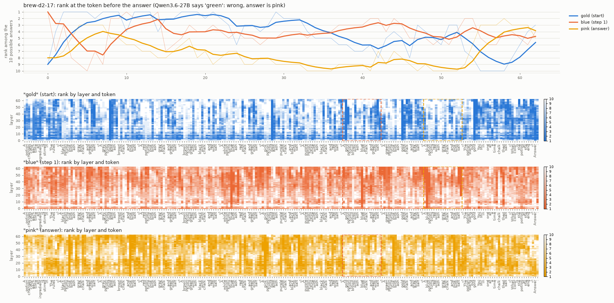

A potion changes color each time an ingredient is stirred in. The rules:  
A black potion turns pink with ash, gray with chalk, and green with salt.  
A gray potion turns gold with ash, brown with chalk, and pink with salt.  
A red potion turns pink with ash, gray with chalk, and green with salt.  
A brown potion turns green with ash, black with chalk, and red with salt.  
A white potion turns blue with ash, red with chalk, and green with salt.  
A pink potion turns gold with ash, purple with chalk, and black with salt.  
A purple potion turns white with ash, black with chalk, and red with salt.  
A gold potion turns brown with ash, blue with chalk, and green with salt.  
A green potion turns pink with ash, gold with chalk, and gray with salt.  
A blue potion turns red with ash, gray with chalk, and pink with salt.  
The potion starts out gold. You stir in, one at a time: chalk, then salt.  
What color is the potion at the end?

**Answer:** **pink** · **Hidden trajectory:** gold → blue → pink

**Qwen3.6-27B:** ❌ top 5: `green`, `black`, ``, `gray`, `gold`
---

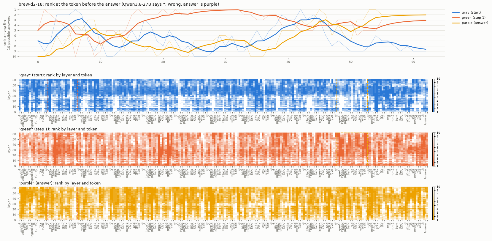

A potion changes color each time an ingredient is stirred in. The rules:  
A gray potion turns green with bark, gold with clay, and red with salt.  
A white potion turns red with bark, gray with clay, and blue with salt.  
A pink potion turns brown with bark, purple with clay, and gold with salt.  
A brown potion turns purple with bark, green with clay, and green with salt.  
A red potion turns purple with bark, pink with clay, and brown with salt.  
A purple potion turns brown with bark, black with clay, and white with salt.  
A blue potion turns brown with bark, gray with clay, and red with salt.  
A gold potion turns brown with bark, white with clay, and purple with salt.  
A black potion turns pink with bark, brown with clay, and purple with salt.  
A green potion turns purple with bark, red with clay, and white with salt.  
The potion starts out gray. You stir in, one at a time: bark, then bark.  
What color is the potion at the end?

**Answer:** **purple** · **Hidden trajectory:** gray → green → purple

**Qwen3.6-27B:** ❌ top 5: ``, `brown`, `purple`, `green`, `black`
---

A potion changes color each time an ingredient is stirred in. The rules:  
A purple potion turns black with ash, red with bark, and pink with clay.  
A blue potion turns gold with ash, pink with bark, and gold with clay.  
A white potion turns brown with ash, gold with bark, and gray with clay.  
A pink potion turns black with ash, gray with bark, and white with clay.  
A gray potion turns green with ash, gold with bark, and gold with clay.  
A brown potion turns green with ash, gray with bark, and pink with clay.  
A green potion turns purple with ash, blue with bark, and white with clay.  
A gold potion turns red with ash, gray with bark, and pink with clay.  
A red potion turns white with ash, green with bark, and purple with clay.  
A black potion turns gray with ash, white with bark, and brown with clay.  
The potion starts out green. You stir in, one at a time: bark, then ash, then clay.  
What color is the potion at the end?

**Answer:** **pink** · **Hidden trajectory:** green → blue → gold → pink

**Qwen3.6-27B:** ❌ top 5: ``, `white`, `gray`, `black`, `purple`
---

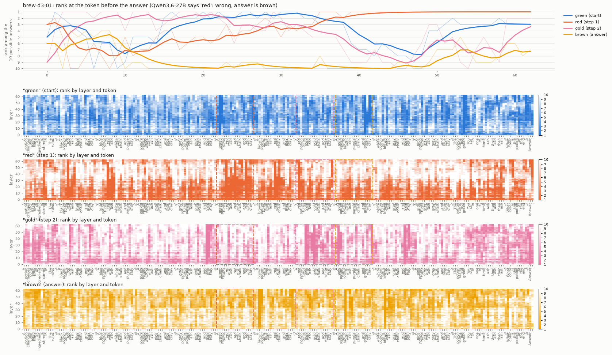

A potion changes color each time an ingredient is stirred in. The rules:  
A black potion turns red with ash, blue with chalk, and gray with clay.  
A blue potion turns red with ash, white with chalk, and purple with clay.  
A purple potion turns white with ash, pink with chalk, and pink with clay.  
A gray potion turns purple with ash, pink with chalk, and gold with clay.  
A green potion turns red with ash, red with chalk, and red with clay.  
A brown potion turns blue with ash, red with chalk, and gray with clay.  
A red potion turns gold with ash, gold with chalk, and white with clay.  
A gold potion turns brown with ash, purple with chalk, and green with clay.  
A white potion turns brown with ash, gray with chalk, and gold with clay.  
A pink potion turns gray with ash, gray with chalk, and blue with clay.  
The potion starts out green. You stir in, one at a time: ash, then ash, then ash.  
What color is the potion at the end?

**Answer:** **brown** · **Hidden trajectory:** green → red → gold → brown

**Qwen3.6-27B:** ❌ top 5: `red`, ``, `gold`, `black`, `green`
---

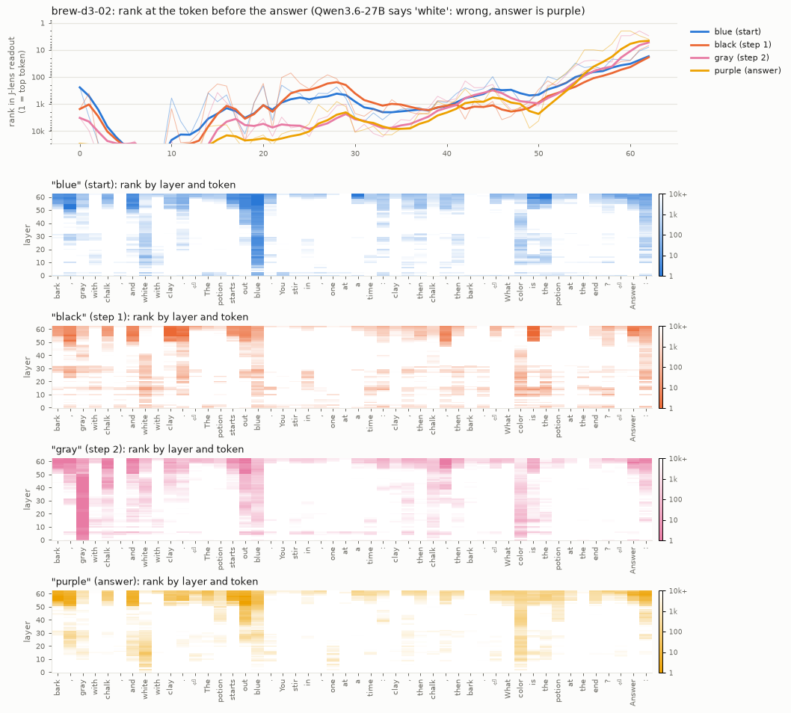

A potion changes color each time an ingredient is stirred in. The rules:  
A green potion turns gray with bark, white with chalk, and gray with clay.  
A white potion turns purple with bark, red with chalk, and gray with clay.  
A gold potion turns blue with bark, blue with chalk, and white with clay.  
A red potion turns brown with bark, purple with chalk, and white with clay.  
A blue potion turns white with bark, gray with chalk, and black with clay.  
A pink potion turns green with bark, white with chalk, and red with clay.  
A gray potion turns purple with bark, blue with chalk, and green with clay.  
A brown potion turns white with bark, gold with chalk, and gray with clay.  
A purple potion turns brown with bark, brown with chalk, and white with clay.  
A black potion turns purple with bark, gray with chalk, and white with clay.  
The potion starts out blue. You stir in, one at a time: clay, then chalk, then bark.  
What color is the potion at the end?

**Answer:** **purple** · **Hidden trajectory:** blue → black → gray → purple

**Qwen3.6-27B:** ❌ top 5: `white`, ``, `purple`, `black`, `gray`
---

A potion changes color each time an ingredient is stirred in. The rules:  
A gray potion turns red with ash, green with bark, and purple with clay.  
A green potion turns red with ash, pink with bark, and brown with clay.  
A purple potion turns blue with ash, blue with bark, and black with clay.  
A white potion turns gray with ash, brown with bark, and gold with clay.  
A black potion turns blue with ash, white with bark, and brown with clay.  
A brown potion turns red with ash, purple with bark, and blue with clay.  
A blue potion turns black with ash, white with bark, and white with clay.  
A gold potion turns purple with ash, purple with bark, and red with clay.  
A red potion turns blue with ash, gold with bark, and gold with clay.  
A pink potion turns purple with ash, brown with bark, and blue with clay.  
The potion starts out green. You stir in, one at a time: ash, then bark, then ash.  
What color is the potion at the end?

**Answer:** **purple** · **Hidden trajectory:** green → red → gold → purple

**Qwen3.6-27B:** ❌ top 5: `blue`, ``, `purple`, `gold`, `black`
---

A potion changes color each time an ingredient is stirred in. The rules:  
A white potion turns green with ash, green with clay, and green with salt.  
A red potion turns blue with ash, gray with clay, and brown with salt.  
A green potion turns blue with ash, white with clay, and purple with salt.  
A gray potion turns blue with ash, blue with clay, and brown with salt.  
A purple potion turns brown with ash, brown with clay, and white with salt.  
A blue potion turns pink with ash, brown with clay, and purple with salt.  
A black potion turns red with ash, pink with clay, and blue with salt.  
A gold potion turns black with ash, gray with clay, and purple with salt.  
A pink potion turns red with ash, purple with clay, and green with salt.  
A brown potion turns white with ash, pink with clay, and pink with salt.  
The potion starts out gold. You stir in, one at a time: salt, then salt, then clay.  
What color is the potion at the end?

**Answer:** **green** · **Hidden trajectory:** gold → purple → white → green

**Qwen3.6-27B:** ❌ top 5: `purple`, ``, `white`, `brown`, `green`
---

A potion changes color each time an ingredient is stirred in. The rules:  
A white potion turns gray with bark, green with clay, and gold with salt.  
A blue potion turns gray with bark, gold with clay, and brown with salt.  
A pink potion turns brown with bark, red with clay, and green with salt.  
A gold potion turns pink with bark, purple with clay, and black with salt.  
A black potion turns pink with bark, gray with clay, and green with salt.  
A red potion turns purple with bark, pink with clay, and purple with salt.  
A green potion turns purple with bark, red with clay, and purple with salt.  
A brown potion turns red with bark, black with clay, and red with salt.  
A purple potion turns red with bark, gold with clay, and blue with salt.  
A gray potion turns red with bark, black with clay, and brown with salt.  
The potion starts out black. You stir in, one at a time: bark, then salt, then clay.  
What color is the potion at the end?

**Answer:** **red** · **Hidden trajectory:** black → pink → green → red

**Qwen3.6-27B:** ❌ top 5: ``, `red`, `gray`, `purple`, `green`
---

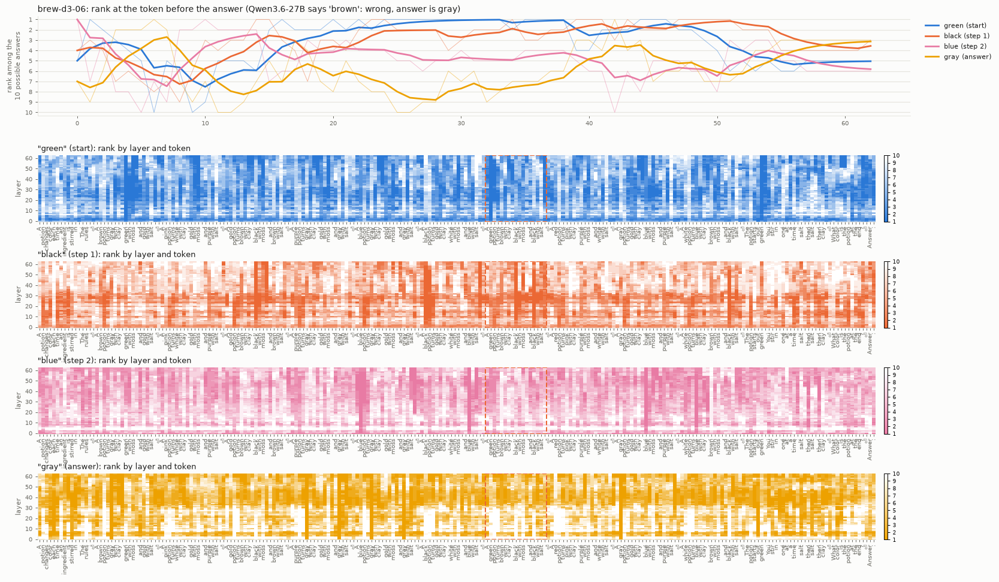

A potion changes color each time an ingredient is stirred in. The rules:  
A brown potion turns gray with clay, green with moss, and gold with salt.  
A pink potion turns white with clay, gold with moss, and purple with salt.  
A gold potion turns brown with clay, black with moss, and brown with salt.  
A purple potion turns gray with clay, gold with moss, and gray with salt.  
A blue potion turns gray with clay, gold with moss, and gray with salt.  
A black potion turns gold with clay, white with moss, and blue with salt.  
A green potion turns brown with clay, black with moss, and black with salt.  
A red potion turns pink with clay, purple with moss, and white with salt.  
A gray potion turns gold with clay, blue with moss, and purple with salt.  
A white potion turns blue with clay, brown with moss, and black with salt.  
The potion starts out green. You stir in, one at a time: salt, then salt, then clay.  
What color is the potion at the end?

**Answer:** **gray** · **Hidden trajectory:** green → black → blue → gray

**Qwen3.6-27B:** ❌ top 5: `brown`, `gold`, `black`, ``, `gray`
---

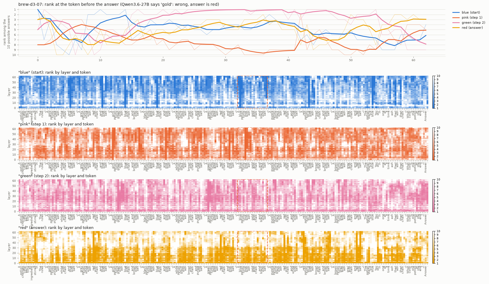

A potion changes color each time an ingredient is stirred in. The rules:  
A gold potion turns purple with ash, white with chalk, and blue with salt.  
A gray potion turns white with ash, red with chalk, and blue with salt.  
A pink potion turns green with ash, blue with chalk, and brown with salt.  
A black potion turns gold with ash, blue with chalk, and pink with salt.  
A white potion turns black with ash, brown with chalk, and purple with salt.  
A green potion turns gold with ash, red with chalk, and pink with salt.  
A blue potion turns pink with ash, gold with chalk, and black with salt.  
A purple potion turns black with ash, red with chalk, and white with salt.  
A red potion turns blue with ash, brown with chalk, and brown with salt.  
A brown potion turns gray with ash, gray with chalk, and red with salt.  
The potion starts out blue. You stir in, one at a time: ash, then ash, then chalk.  
What color is the potion at the end?

**Answer:** **red** · **Hidden trajectory:** blue → pink → green → red

**Qwen3.6-27B:** ❌ top 5: `gold`, ``, `red`, `gray`, `black`
---

A potion changes color each time an ingredient is stirred in. The rules:  
A white potion turns blue with ash, purple with chalk, and blue with clay.  
A gold potion turns red with ash, pink with chalk, and red with clay.  
A gray potion turns red with ash, pink with chalk, and black with clay.  
A black potion turns brown with ash, gray with chalk, and white with clay.  
A blue potion turns gray with ash, gray with chalk, and gray with clay.  
A green potion turns white with ash, purple with chalk, and pink with clay.  
A pink potion turns purple with ash, black with chalk, and gold with clay.  
A purple potion turns gold with ash, gray with chalk, and gold with clay.  
A brown potion turns gold with ash, white with chalk, and red with clay.  
A red potion turns blue with ash, black with chalk, and green with clay.  
The potion starts out gray. You stir in, one at a time: clay, then clay, then clay.  
What color is the potion at the end?

**Answer:** **blue** · **Hidden trajectory:** gray → black → white → blue

**Qwen3.6-27B:** ❌ top 5: `black`, `white`, ``, `gray`, `red`
---

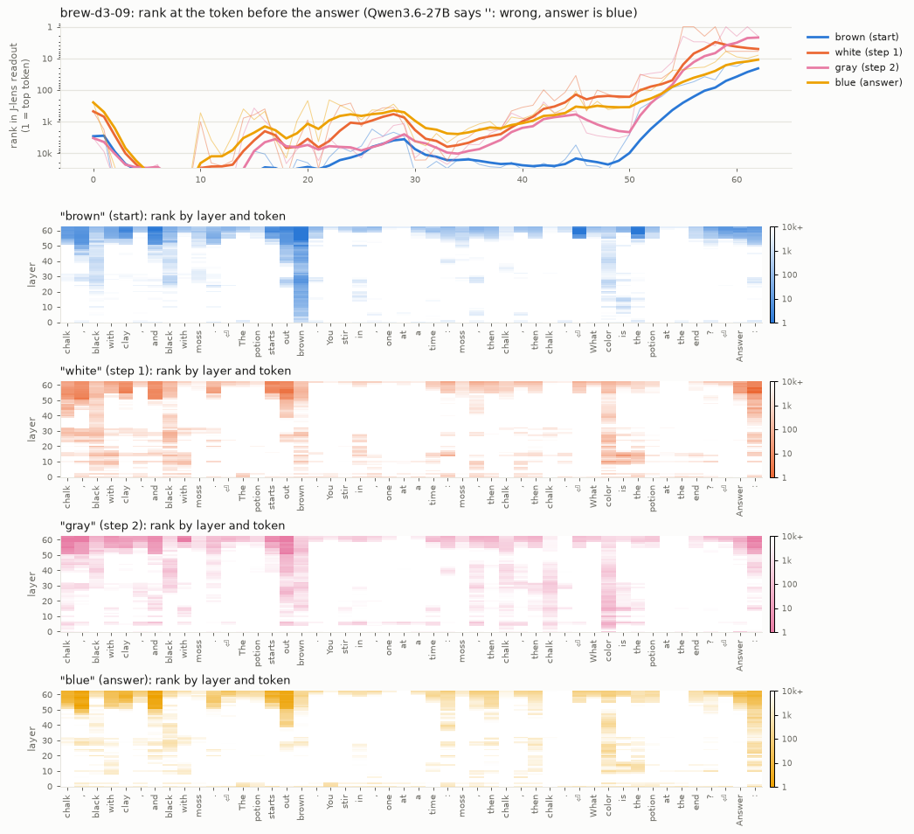

A potion changes color each time an ingredient is stirred in. The rules:  
A gold potion turns black with chalk, black with clay, and white with moss.  
A brown potion turns pink with chalk, purple with clay, and white with moss.  
A red potion turns gold with chalk, gray with clay, and green with moss.  
A white potion turns gray with chalk, red with clay, and purple with moss.  
A gray potion turns blue with chalk, white with clay, and purple with moss.  
A pink potion turns green with chalk, black with clay, and blue with moss.  
A black potion turns purple with chalk, white with clay, and red with moss.  
A purple potion turns white with chalk, gold with clay, and blue with moss.  
A blue potion turns red with chalk, green with clay, and brown with moss.  
A green potion turns white with chalk, black with clay, and black with moss.  
The potion starts out brown. You stir in, one at a time: moss, then chalk, then chalk.  
What color is the potion at the end?

**Answer:** **blue** · **Hidden trajectory:** brown → white → gray → blue

**Qwen3.6-27B:** ❌ top 5: ``, `gray`, `gold`, `white`, `black`
---

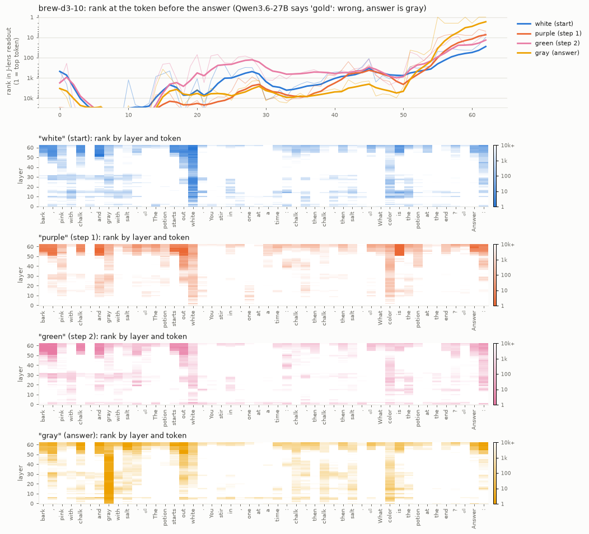

A potion changes color each time an ingredient is stirred in. The rules:  
A pink potion turns white with bark, red with chalk, and gold with salt.  
A green potion turns pink with bark, gold with chalk, and gray with salt.  
A blue potion turns black with bark, pink with chalk, and purple with salt.  
A gray potion turns pink with bark, brown with chalk, and purple with salt.  
A white potion turns pink with bark, purple with chalk, and gold with salt.  
A black potion turns green with bark, green with chalk, and pink with salt.  
A brown potion turns red with bark, black with chalk, and pink with salt.  
A red potion turns green with bark, white with chalk, and pink with salt.  
A purple potion turns brown with bark, green with chalk, and red with salt.  
A gold potion turns gray with bark, pink with chalk, and gray with salt.  
The potion starts out white. You stir in, one at a time: chalk, then chalk, then salt.  
What color is the potion at the end?

**Answer:** **gray** · **Hidden trajectory:** white → purple → green → gray

**Qwen3.6-27B:** ❌ top 5: `gold`, `gray`, ``, `pink`, `purple`
---

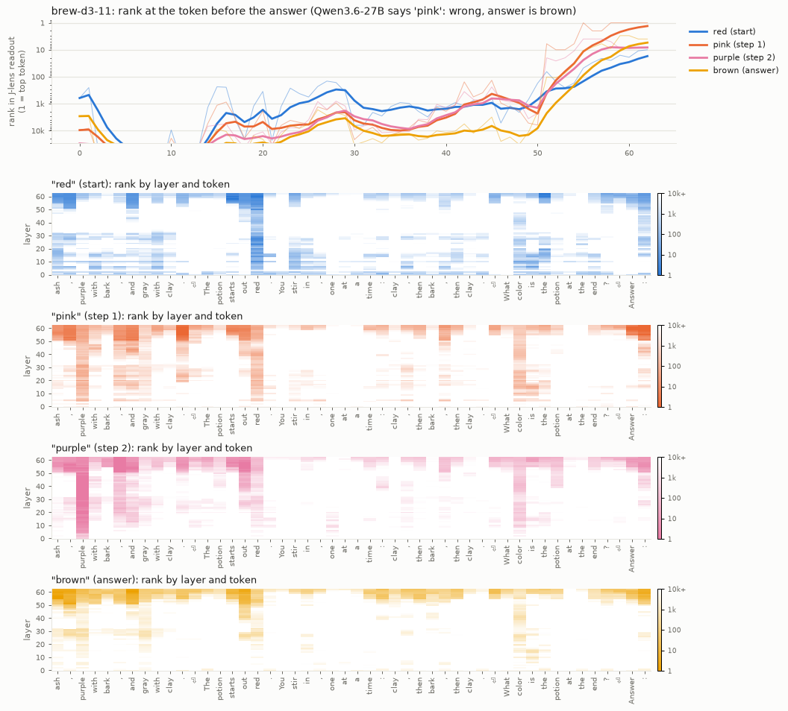

A potion changes color each time an ingredient is stirred in. The rules:  
A red potion turns pink with ash, gold with bark, and pink with clay.  
A gray potion turns white with ash, brown with bark, and green with clay.  
A gold potion turns white with ash, blue with bark, and white with clay.  
A black potion turns gray with ash, gold with bark, and gold with clay.  
A white potion turns gold with ash, brown with bark, and brown with clay.  
A brown potion turns red with ash, blue with bark, and pink with clay.  
A green potion turns blue with ash, white with bark, and pink with clay.  
A purple potion turns gold with ash, blue with bark, and brown with clay.  
A blue potion turns green with ash, red with bark, and pink with clay.  
A pink potion turns gray with ash, purple with bark, and gray with clay.  
The potion starts out red. You stir in, one at a time: clay, then bark, then clay.  
What color is the potion at the end?

**Answer:** **brown** · **Hidden trajectory:** red → pink → purple → brown

**Qwen3.6-27B:** ❌ top 5: `pink`, ``, `blue`, `gold`, `white`
---

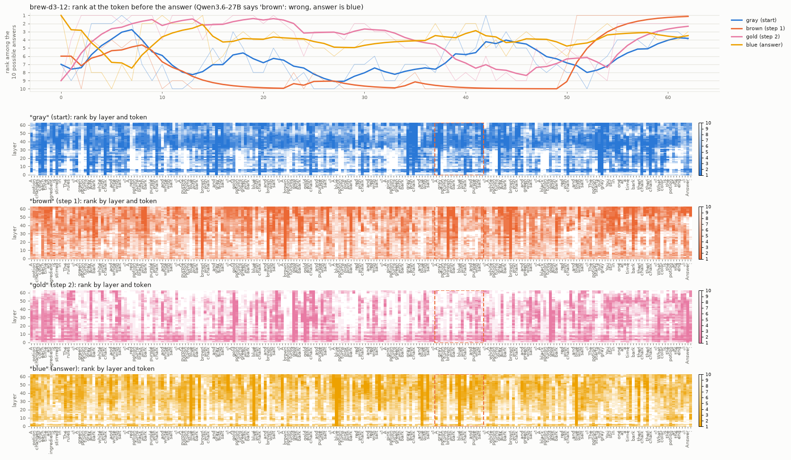

A potion changes color each time an ingredient is stirred in. The rules:  
A green potion turns gray with bark, white with chalk, and white with salt.  
A red potion turns black with bark, purple with chalk, and white with salt.  
A purple potion turns blue with bark, brown with chalk, and gray with salt.  
A gold potion turns green with bark, blue with chalk, and brown with salt.  
A brown potion turns gold with bark, gold with chalk, and purple with salt.  
A blue potion turns pink with bark, red with chalk, and red with salt.  
A pink potion turns green with bark, gray with chalk, and blue with salt.  
A gray potion turns brown with bark, blue with chalk, and purple with salt.  
A white potion turns gray with bark, brown with chalk, and green with salt.  
A black potion turns gold with bark, red with chalk, and blue with salt.  
The potion starts out gray. You stir in, one at a time: bark, then chalk, then chalk.  
What color is the potion at the end?

**Answer:** **blue** · **Hidden trajectory:** gray → brown → gold → blue

**Qwen3.6-27B:** ❌ top 5: `brown`, ``, `gold`, `blue`, `gray`
---

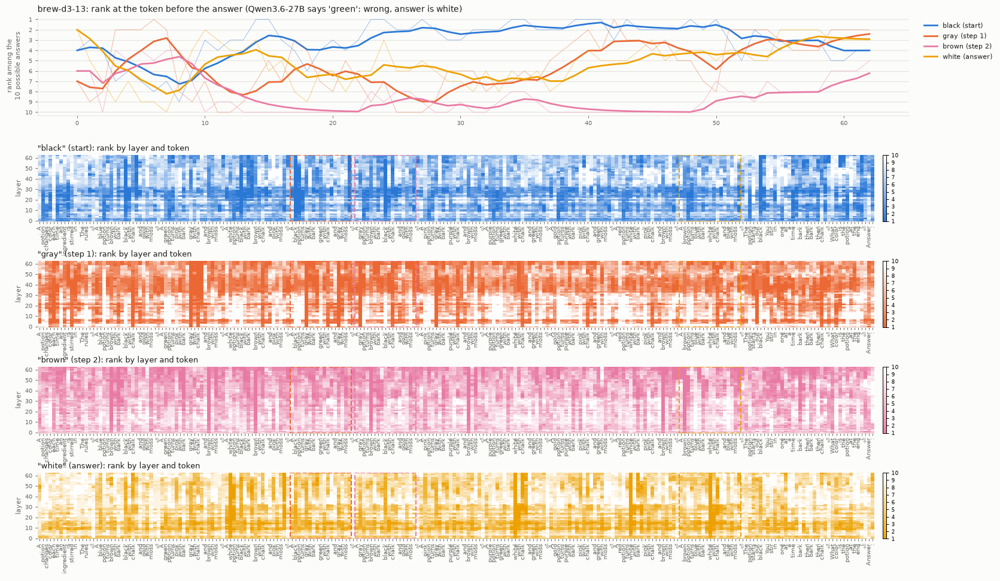

A potion changes color each time an ingredient is stirred in. The rules:  
A blue potion turns brown with bark, black with chalk, and gold with moss.  
A green potion turns pink with bark, gray with chalk, and brown with moss.  
A white potion turns black with bark, brown with chalk, and pink with moss.  
A black potion turns gray with bark, green with chalk, and gray with moss.  
A gray potion turns brown with bark, black with chalk, and gold with moss.  
A pink potion turns gray with bark, purple with chalk, and brown with moss.  
A purple potion turns green with bark, white with chalk, and green with moss.  
A gold potion turns purple with bark, pink with chalk, and green with moss.  
A red potion turns white with bark, pink with chalk, and brown with moss.  
A brown potion turns blue with bark, white with chalk, and blue with moss.  
The potion starts out black. You stir in, one at a time: bark, then bark, then chalk.  
What color is the potion at the end?

**Answer:** **white** · **Hidden trajectory:** black → gray → brown → white

**Qwen3.6-27B:** ❌ top 5: `green`, `gray`, ``, `white`, `black`
---

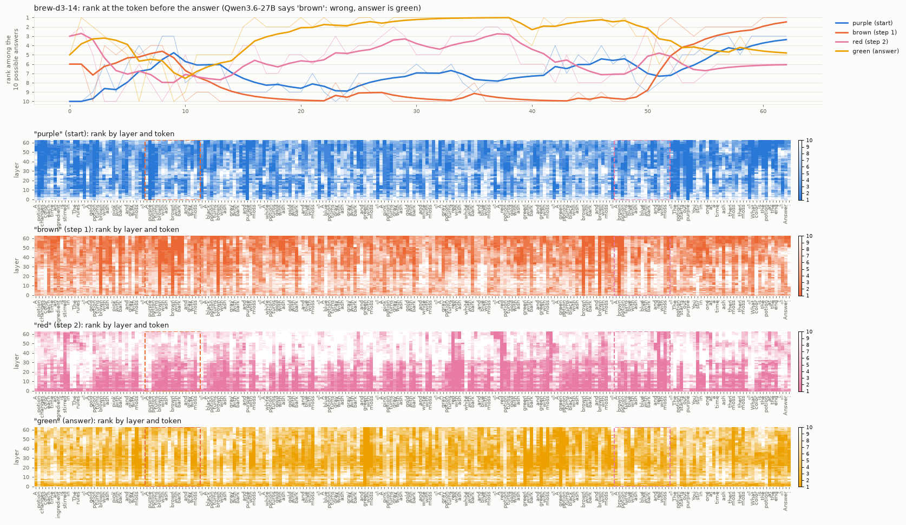

A potion changes color each time an ingredient is stirred in. The rules:  
A gold potion turns brown with ash, pink with bark, and gray with moss.  
A purple potion turns brown with ash, brown with bark, and gray with moss.  
A black potion turns brown with ash, gray with bark, and purple with moss.  
A white potion turns gold with ash, gold with bark, and blue with moss.  
A blue potion turns gray with ash, gray with bark, and green with moss.  
A pink potion turns gray with ash, gold with bark, and white with moss.  
A gray potion turns red with ash, white with bark, and blue with moss.  
A red potion turns gold with ash, green with bark, and green with moss.  
A green potion turns black with ash, brown with bark, and brown with moss.  
A brown potion turns blue with ash, blue with bark, and red with moss.  
The potion starts out purple. You stir in, one at a time: ash, then moss, then moss.  
What color is the potion at the end?

**Answer:** **green** · **Hidden trajectory:** purple → brown → red → green

**Qwen3.6-27B:** ❌ top 5: `brown`, `gray`, ``, `purple`, `blue`
---

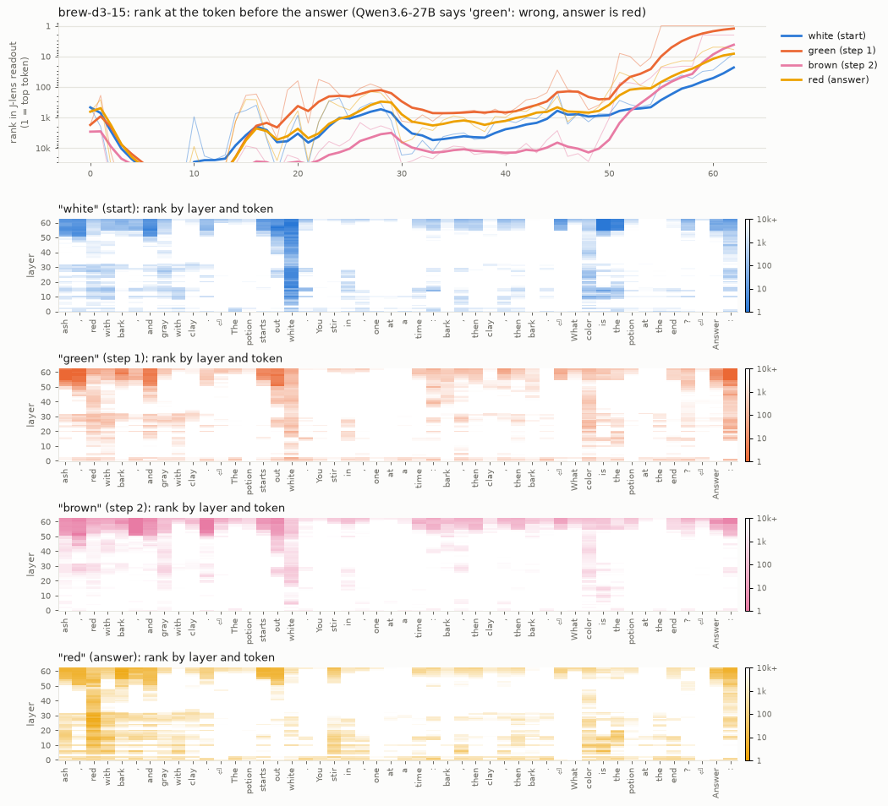

A potion changes color each time an ingredient is stirred in. The rules:  
A purple potion turns blue with ash, gray with bark, and red with clay.  
A gold potion turns blue with ash, green with bark, and red with clay.  
A green potion turns gold with ash, blue with bark, and brown with clay.  
A red potion turns black with ash, purple with bark, and blue with clay.  
A blue potion turns white with ash, black with bark, and red with clay.  
A black potion turns pink with ash, brown with bark, and gray with clay.  
A white potion turns pink with ash, green with bark, and green with clay.  
A gray potion turns brown with ash, blue with bark, and white with clay.  
A pink potion turns gold with ash, brown with bark, and gray with clay.  
A brown potion turns gray with ash, red with bark, and gray with clay.  
The potion starts out white. You stir in, one at a time: bark, then clay, then bark.  
What color is the potion at the end?

**Answer:** **red** · **Hidden trajectory:** white → green → brown → red

**Qwen3.6-27B:** ❌ top 5: `green`, `blue`, ``, `red`, `brown`
---

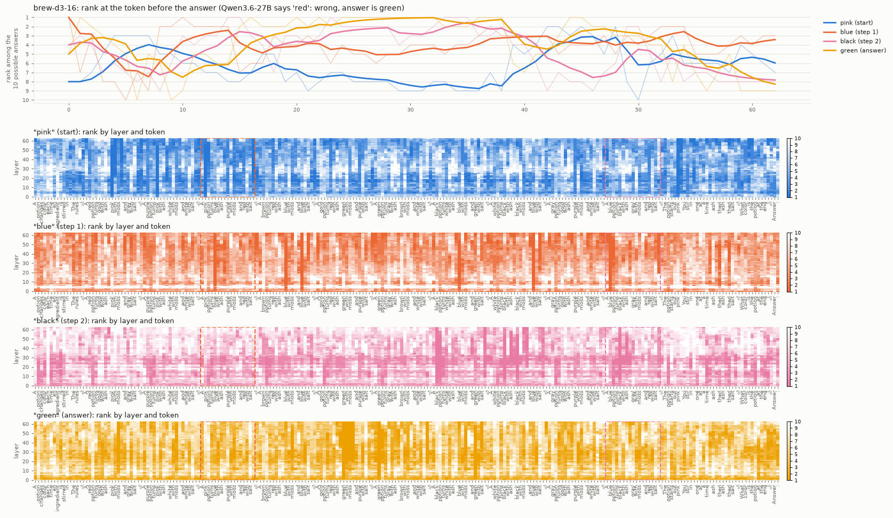

A potion changes color each time an ingredient is stirred in. The rules:  
A red potion turns gold with ash, pink with moss, and gray with salt.  
A purple potion turns pink with ash, white with moss, and white with salt.  
A pink potion turns blue with ash, purple with moss, and red with salt.  
A brown potion turns red with ash, blue with moss, and blue with salt.  
A gold potion turns red with ash, green with moss, and purple with salt.  
A green potion turns gray with ash, brown with moss, and white with salt.  
A black potion turns white with ash, blue with moss, and green with salt.  
A white potion turns black with ash, black with moss, and blue with salt.  
A gray potion turns gold with ash, purple with moss, and white with salt.  
A blue potion turns black with ash, gray with moss, and red with salt.  
The potion starts out pink. You stir in, one at a time: ash, then ash, then salt.  
What color is the potion at the end?

**Answer:** **green** · **Hidden trajectory:** pink → blue → black → green

**Qwen3.6-27B:** ❌ top 5: `red`, ``, `blue`, `gray`, `white`
---

A potion changes color each time an ingredient is stirred in. The rules:  
A red potion turns gold with ash, green with bark, and pink with moss.  
A black potion turns green with ash, purple with bark, and pink with moss.  
A white potion turns gray with ash, red with bark, and pink with moss.  
A pink potion turns purple with ash, red with bark, and white with moss.  
A green potion turns blue with ash, pink with bark, and brown with moss.  
A blue potion turns green with ash, white with bark, and pink with moss.  
A gray potion turns brown with ash, pink with bark, and green with moss.  
A brown potion turns white with ash, purple with bark, and purple with moss.  
A purple potion turns white with ash, black with bark, and pink with moss.  
A gold potion turns pink with ash, white with bark, and purple with moss.  
The potion starts out gold. You stir in, one at a time: bark, then ash, then moss.  
What color is the potion at the end?

**Answer:** **green** · **Hidden trajectory:** gold → white → gray → green

**Qwen3.6-27B:** ❌ top 5: `purple`, `pink`, ``, `white`, `green`
---

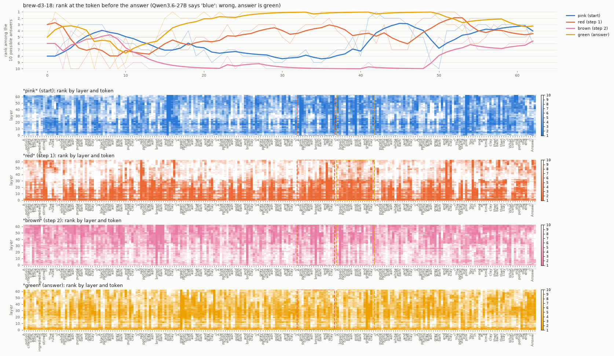

A potion changes color each time an ingredient is stirred in. The rules:  
A white potion turns gray with ash, purple with bark, and gold with clay.  
A black potion turns gold with ash, gray with bark, and purple with clay.  
A red potion turns gray with ash, brown with bark, and pink with clay.  
A green potion turns blue with ash, blue with bark, and gray with clay.  
A blue potion turns white with ash, gold with bark, and brown with clay.  
A gray potion turns white with ash, gold with bark, and blue with clay.  
A pink potion turns gold with ash, brown with bark, and red with clay.  
A brown potion turns pink with ash, pink with bark, and green with clay.  
A purple potion turns blue with ash, white with bark, and blue with clay.  
A gold potion turns gray with ash, gray with bark, and red with clay.  
The potion starts out pink. You stir in, one at a time: clay, then bark, then clay.  
What color is the potion at the end?

**Answer:** **green** · **Hidden trajectory:** pink → red → brown → green

**Qwen3.6-27B:** ❌ top 5: `blue`, `red`, `pink`, `gray`, ``
---

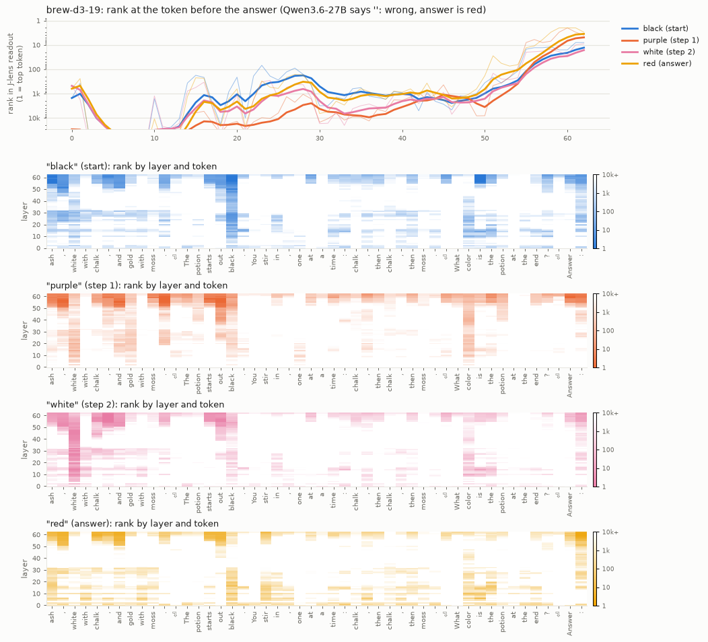

A potion changes color each time an ingredient is stirred in. The rules:  
A gray potion turns gold with ash, brown with chalk, and brown with moss.  
A brown potion turns purple with ash, purple with chalk, and gray with moss.  
A green potion turns red with ash, red with chalk, and brown with moss.  
A white potion turns brown with ash, red with chalk, and red with moss.  
A blue potion turns brown with ash, gray with chalk, and red with moss.  
A gold potion turns purple with ash, black with chalk, and red with moss.  
A black potion turns gold with ash, purple with chalk, and gold with moss.  
A pink potion turns brown with ash, blue with chalk, and green with moss.  
A red potion turns white with ash, green with chalk, and brown with moss.  
A purple potion turns black with ash, white with chalk, and gold with moss.  
The potion starts out black. You stir in, one at a time: chalk, then chalk, then moss.  
What color is the potion at the end?

**Answer:** **red** · **Hidden trajectory:** black → purple → white → red

**Qwen3.6-27B:** ❌ top 5: ``, `gold`, `red`, `purple`, `black`
